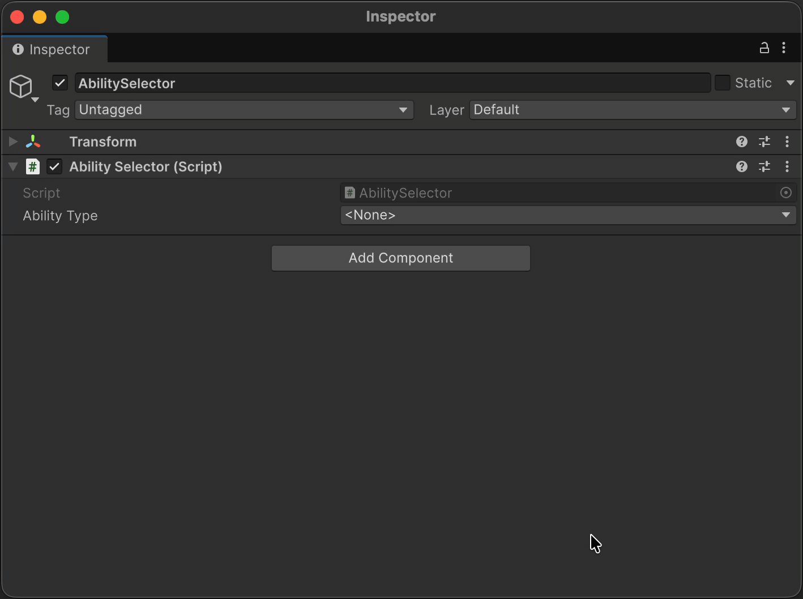
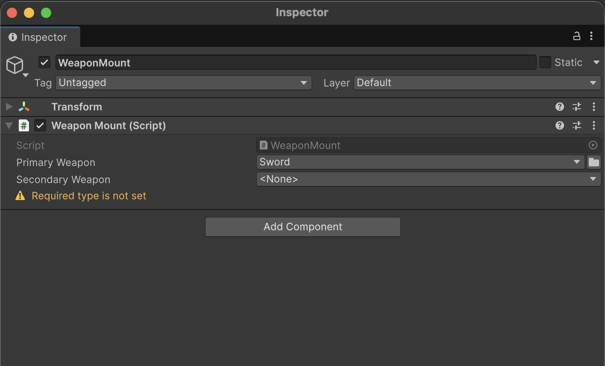
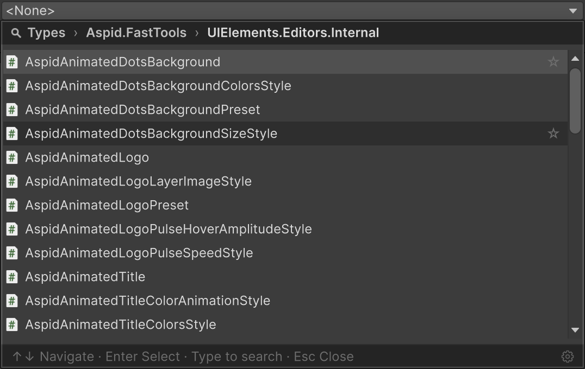

# Serializable Type System

Unity cannot serialize `System.Type` out of the box — the Serializable Type System closes that gap: the type is picked in the Inspector through a hierarchical, searchable window, stored as an assembly-qualified name, and lazily resolved to a `System.Type` on first access.

**Reference sections:**

* [`SerializableType`](#serializabletype) — a serializable field wrapper over `System.Type`;
* [`SerializableMonoScript`](#serializablemonoscript) — the same wrapper referenced through the
  script asset, so a class rename does not break the field;
* [`TypeSelectorAttribute`](#typeselectorattribute) — a type-picker button on `string`,
  `SerializableType` and `[SerializeReference]` fields, including
  [dynamic base types via member references](#dynamic-base-types-via-member-references);
* [`TypeSelectorDisplay`](#typeselectordisplay) — a candidate type's name, group, tooltip and icon
  in the picker;
* [`TypeSelectorWindow`](#typeselectorwindow) — the same picker window as a public API for
  your own editor code;
* [`ComponentTypeSelector`](#componenttypeselector) — an Inspector dropdown that switches
  a component or ScriptableObject to a subtype.

## SerializableType

A serializable wrapper over `System.Type`: it stores the selected type as an assembly-qualified name and lazily resolves it to a `System.Type` on first access. Two variants are available:

- **`SerializableType`** — stores any type;
- **`SerializableType<T>`** — stores a type constrained to `T` or its subclasses.

Both support implicit conversion to `System.Type`, can be created from code with a `Type`-taking constructor
(`new SerializableType<Ability>(typeof(Dash))` — the constrained one throws for a type not assignable to `T`),
and expose the stored name through `AssemblyQualifiedName`. `SerializableType<T>` derives from `SerializableType`;
both build on the abstract `SerializableTypeBase`. Keep in mind that Unity serializes a field by its declared type:
a `SerializableType<T>` assigned from code to a plain `SerializableType` field reloads as the unconstrained wrapper.

```csharp
using UnityEngine;
using Aspid.FastTools.Types;

public abstract class Ability : MonoBehaviour
{
    public abstract void Activate();
}

public sealed class AbilitySelector : MonoBehaviour
{
    [SerializeField] private SerializableType<Ability> _abilityType;

    private void Start()
    {
        var ability = (Ability)gameObject.AddComponent(_abilityType.Type);
        ability.Activate();
    }
}
```



## SerializableMonoScript

The same field, referenced through the script asset instead of the type name. `SerializableMonoScript` and
`SerializableMonoScript<T>` keep an editor-only `MonoScript` reference next to the assembly-qualified name; in the
editor the script is the source of truth, so **renaming or moving the class keeps the field intact** — the stored name
is re-read from the script whenever the object is serialized. The reference exists only under `UNITY_EDITOR`: a player
build serializes just the name, and at runtime the wrapper resolves from it exactly like `SerializableType`.

The trade-off is Unity's own: only a type that maps to a script asset qualifies — a top-level, non-generic class
declared in a file of the same name (what `MonoScript.GetClass()` reports). The picker lists only such types, and a
`MonoScript` can be dragged from the Project window onto the field. Nested and generic types need `SerializableType`.

```csharp
public sealed class EnemySpawner : MonoBehaviour
{
    // Survives renaming Grunt to Soldier; the picker offers Enemy subtypes backed by a script file.
    [SerializeField] private SerializableMonoScript<Enemy> _enemyType;

    private void Spawn() =>
        gameObject.AddComponent(_enemyType.Type);
}
```

A wrapper constructed from code (`new SerializableMonoScript(typeof(Dash))`) carries the type name only and becomes
rename-safe once a type is picked in the Inspector.

`[TypeSelector]` (including `Required = true`) applies to these fields the same way it does to `SerializableType`.
`SerializableMonoScript<T>` derives from `SerializableMonoScript`, which shares the abstract `SerializableTypeBase` with
`SerializableType` but is not one (its serialized layout differs). The referenced asset is exposed through the
editor-only `Script` property.

## TypeSelectorAttribute

Adds a type-picker button to a field in the Inspector: it opens a hierarchical, searchable window listing only the types assignable to the given base types (when several are given, to all of them at once; with no arguments, any type qualifies). What happens on selection depends on the field's shape:

- `string` — the assembly-qualified name of the selected type is written into the field;
- `SerializableType` / `SerializableType<T>` and `SerializableMonoScript` / `SerializableMonoScript<T>` — narrows the built-in selector; the attribute's base types intersect with the generic argument `T`;
- `[SerializeReference]` managed reference — the selected type is instantiated into the field immediately (see [SerializeReference Selector](03-serialize-reference-selector.md)).

The attribute is editor-only (`[Conditional("UNITY_EDITOR")]`) and carries no runtime cost.

```csharp
using UnityEngine;
using Aspid.FastTools.Types;

public interface IStackable { }

public abstract class AbilityModifier
{
    public abstract void Apply();
}

public sealed class AbilitySelector : MonoBehaviour
{
    // string — the assembly-qualified name of the selected type is stored.
    // Each array element is its own picker, constrained to AbilityModifier.
    [TypeSelector(typeof(AbilityModifier))]
    [SerializeField] private string[] _modifierTypes;

    // SerializableType — narrows the picker the field already has.
    [TypeSelector(typeof(AbilityModifier))]
    [SerializeField] private SerializableType _modifierType;

    // SerializableType<T> — T already narrows the picker on its own; the base
    // types of the attribute intersect with it: only AbilityModifier
    // implementations that are also IStackable qualify.
    [TypeSelector(typeof(IStackable))]
    [SerializeField] private SerializableType<AbilityModifier> _stackableModifierType;

    // For a [SerializeReference] field picking a type immediately creates
    // an instance and assigns it to the field. With no arguments the attribute
    // offers subtypes of the field's own type (here — AbilityModifier).
    // Required = true flags an unset field: an inspector warning
    // plus a violation for the build/CI gate.
    [TypeSelector(Required = true)]
    [SerializeReference] private AbilityModifier _modifier;
}
```

### Constructors and properties

```csharp
[Conditional("UNITY_EDITOR")]
public sealed class TypeSelectorAttribute : PropertyAttribute
{
    public TypeSelectorAttribute() // base type: object
    public TypeSelectorAttribute(Type type)
    public TypeSelectorAttribute(params Type[] types)
    public TypeSelectorAttribute(string assemblyQualifiedName)
    public TypeSelectorAttribute(params string[] assemblyQualifiedNames)

    public TypeAllow Allow { get; set; }  // default: TypeAllow.All
    public bool Required { get; set; }    // default: false
}

[Flags]
public enum TypeAllow
{
    None      = 0,
    Abstract  = 1,
    Interface = 2,
    All       = Abstract | Interface
}
```

| Property | Description |
|----------|-------------|
| `Allow` | Which special type categories (abstract classes, interfaces) the picker includes in addition to plain concrete classes. Default: `TypeAllow.All` (a type-name field lists abstract classes and interfaces too; set `TypeAllow.None` to restrict it to concrete types). Ignored on a `[SerializeReference]` managed reference |
| `Required` | Flags an unset field: a `[SerializeReference]` managed reference left `null`, or a `string` field left empty, shows an inline "required" warning in the Inspector and counts as a violation for the build/CI gate. Also covers a `SerializableType` / `SerializableMonoScript` field (its stored type name left empty). Default: `false` |

#### The Required notice

An empty field with `Required = true` looks like this in the Inspector:



To find and fix such violations project-wide from the FastTools window instead of chasing them
one Inspector at a time, see [Bulk repair tabs](04-serialize-reference-tooling.md#bulk-repair-tabs).

## Dynamic base types via member references

The string constructors resolve **member-first**: when the string is a valid C# identifier that matches an instance field or property on the same object, that member's *current value* supplies the base type(s) — so one field can constrain another's picker, live in the Inspector. Any other string is treated as an assembly-qualified type name (`Type.GetType`), which is what you need for a type the call site cannot reference with `typeof` (across an editor or asmdef boundary).

```csharp
public sealed class Loadout : MonoBehaviour
{
    // The category chosen here drives the picker of _weaponType below.
    [SerializeField] private SerializableType<Weapon> _category;

    // Constrained live to whatever _category currently holds.
    [TypeSelector(nameof(_category))]
    [SerializeField] private string _weaponType;
}
```

The referenced member must be an instance field or property of type `Type`, `string`, or `SerializableType` / `SerializableType<T>` — or an array of any of these. Prefer `nameof(...)` so a rename keeps the link. An unknown member name, or a member of an unsuitable shape, is a **compile error** (analyzer rules `AFT0006`–`AFT0008`); for cases the analyzer cannot see (precompiled assemblies, a rename without recompilation) the drawer shows an inline warning below the field instead.

## TypeSelectorDisplay

Decorate a candidate type with `[TypeSelectorDisplay]` to tune how it appears in the picker — an editor-only attribute (`[Conditional("UNITY_EDITOR")]`) in `Aspid.FastTools.Types` that carries no runtime cost. The compiler evaluates that condition where the attribute is *written*, so declare it from inside the Unity project: a type compiled outside Unity — a plugin `.dll` built by `dotnet build` — carries none of these settings, `Hidden` included.

```csharp
using Aspid.FastTools.Types;

// Rename the type in the picker, place it under an explicit group, give it a tooltip and an icon:
[TypeSelectorDisplay(
    Name = "Damage ×",
    Group = "Combat/Modifiers",
    Tooltip = "Scales incoming damage",
    Icon = "d_ScriptableObject Icon")]
public sealed class DamageModifier { }
```

| Member | Description |
|--------|-------------|
| `Name` | Display name shown instead of the type's short name — in the picker rows and in the closed dropdown's caption. Search still matches the real type name too, and the hover tooltip keeps revealing the full `Namespace.Class, Assembly` identity. `null` or whitespace means no override. |
| `Group` | Explicit picker path with `/` separating levels (e.g. `"Combat/Melee"`). **Replaces** the type's namespace placement — the type appears only under this path, and path segments are shared between types. `null` or whitespace keeps the namespace placement. |
| `Tooltip` | Tooltip shown when hovering the type's row. `null` means no tooltip override. |
| `Icon` | Editor icon shown left of the label — an `EditorGUIUtility.IconContent` name, a project-relative asset path with extension (loaded via `AssetDatabase`), or a `Resources` texture path without extension. `null` means no icon. |
| `Hidden` | When `true`, the picker never offers the type. Not inherited, so hiding a base type leaves the subclasses meant to replace it offered as usual. Assigning the type from code is unaffected, and a value already stored in a field keeps rendering. |

Use `Hidden` for a type that is assignable but not meant to be authored in the Inspector — a delegate-backed adapter, a test double, a base implementation kept only for code:

```csharp
[TypeSelectorDisplay(Hidden = true)]
public sealed class DelegateModifier : IModifier { }
```

`Hidden` governs authoring, not recovery. A **repair** picker — the missing-reference **Fix** and the References window's bulk fix — still offers hidden types, because a reference already stored as one has to stay re-pointable. **Smart Fix**, which proposes a type rather than letting you choose, never suggests one.

In the picker, the `DamageModifier` from the example above appears under `Combat/Modifiers` as "Damage ×" with its icon — next to siblings that keep their default look:


## TypeSelectorWindow

A searchable, namespace-hierarchical type-picker popup — the same picker opened by `[TypeSelector]` and `SerializableType`, also available as a public API. The window offers:

- Hierarchical namespace organization
- Text search with filtering
- Keyboard navigation (Arrow keys, Enter, Escape; Space toggles a favorite)
- Breadcrumb trail with back navigation (Left arrow or a click on a crumb)
- Assembly disambiguation for types with identical names
- **Favorites** (★ on hover) and **Recent** (last picks) sections on the root page — stored locally per project (`EditorPrefs`, never committed), hidden while searching
- A `<None>` option pinned at the top and a ✓ mark on the current value — its row is pre-selected on open
- Type counters on namespace/group rows and section headers
- Generic type support — picking an open generic walks through its type parameters and emits the constructed type
- Favorites/Recent tuning (on/off, Recent capacity) in the Settings tab of the SerializeReference window



Picking an open generic walks through its argument page and returns the constructed type:


> The argument page only lists types Unity can serialize as a field value: primitives, `enum`, `string`, `UnityEngine.Object`-derived references, and `[Serializable]` classes/structs. Abstract types, interfaces, open generics, and delegates never appear as candidates. Give a candidate type the `[Serializable]` attribute to make it selectable.

The window is available as a public API — open it from any editor code (custom inspectors, `EditorWindow`, menu items) when you need a type picker outside the standard `SerializableType` / `[TypeSelector]` flow.

```csharp
namespace Aspid.FastTools.Types.Editors
{
    public sealed class TypeSelectorWindow : EditorWindow
    {
        public static void Show(
            Rect screenRect,
            TypeSelectorFilter filter = default,
            string currentAqn = "",
            Action<string> onSelected = null);
    }
}
```

| Parameter | Description |
|-----------|-------------|
| `screenRect` | Screen-space rectangle the dropdown is anchored to. |
| `filter` | Bundles which types the selector offers: base types (`Types`, only types assignable to **all** entries are listed; defaults to `typeof(object)`), the included kinds (`Allow`), an optional per-type `Predicate`, verbatim `AdditionalTypes`, the open-generic `ArgumentFilter` (which types an argument page offers) and `InferredArgumentFilter` (whether an argument the field itself determines is admissible for that particular parameter), and `HideNoneOption` (leave the `<None>` row out when the target must always hold a type). |
| `currentAqn` | Assembly-qualified name of the currently selected type, used to pre-navigate to its location. Pass `null` or empty to start at the root. |
| `onSelected` | Callback invoked with the assembly-qualified name of the selected type, or `null` if the user chose `<None>`. |

## ComponentTypeSelector

A serializable struct that adds a type-switch dropdown to the Inspector. Add it as a field on a base class — picking a subtype rewrites `m_Script` on the `SerializedObject`, effectively turning the component or ScriptableObject into the selected subtype.

The list is automatically restricted to subtypes of the class declaring the field. No extra configuration is required.

```csharp
using UnityEngine;
using Aspid.FastTools.Types;

public abstract class EnemyBase : MonoBehaviour
{
    [SerializeField] private ComponentTypeSelector _enemyType;
    [SerializeField] [Min(0)] private float _health = 100f;

    public abstract void Attack();
}

public sealed class FastEnemy : EnemyBase
{
    [SerializeField] [Min(0)] private float _speed = 25f;

    public override void Attack() =>
        Debug.Log($"Fast enemy strikes! (speed: {_speed})");
}
```


Notes on the type-switching dropdown's behavior:

- Because the dropdown owns type-switching, the Inspector's built-in **Script** row is hidden while the selector is present — you change the type only through the dropdown (UIToolkit inspectors only; the legacy IMGUI inspector draws that row itself).
