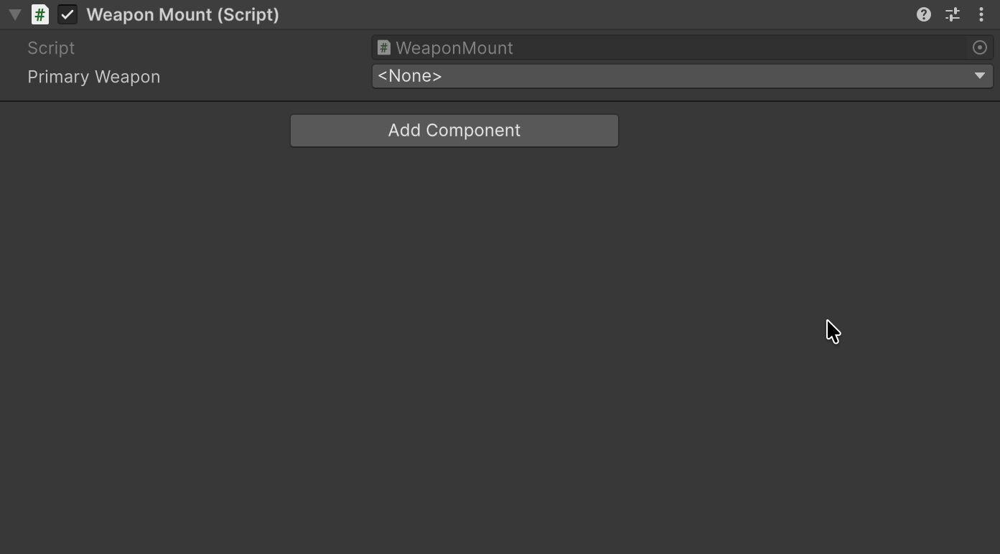
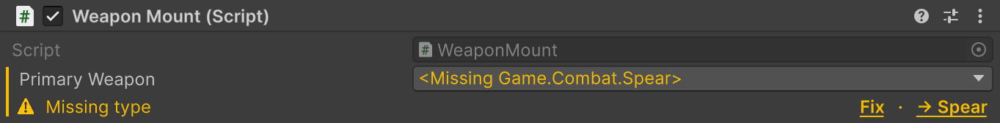
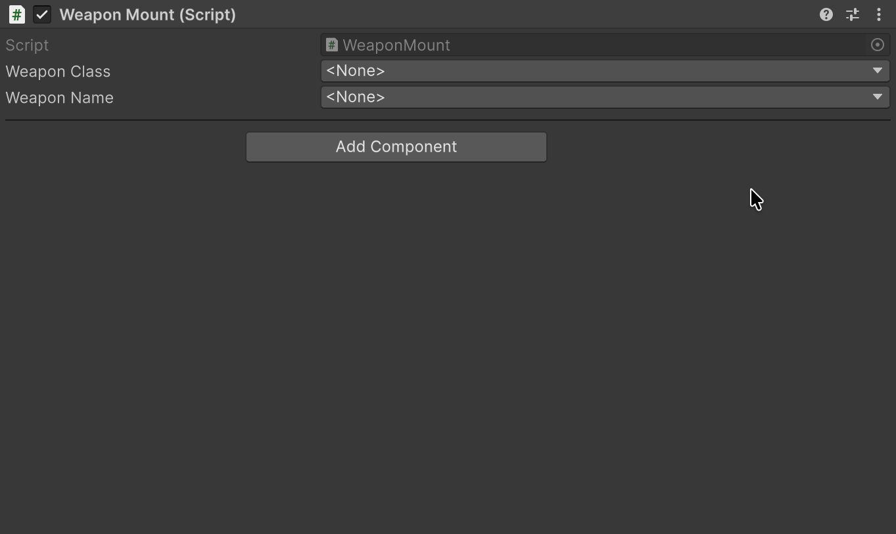
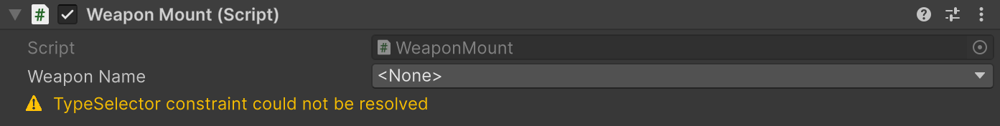
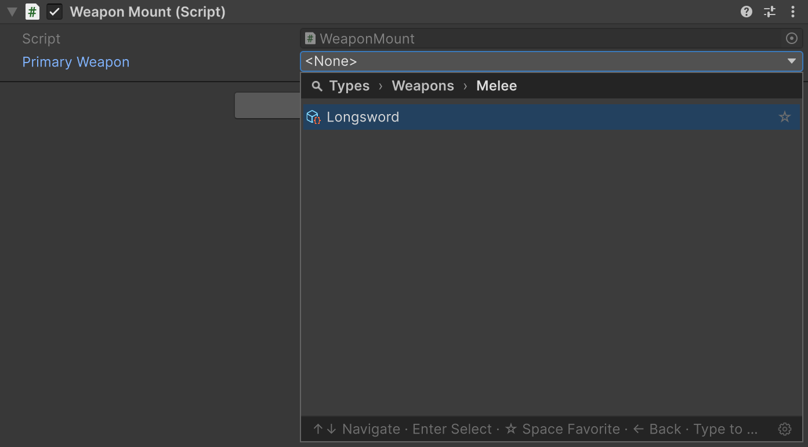
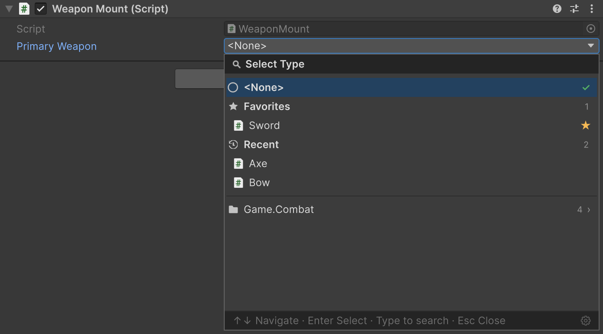

# Serializable Type System

A class type as an ordinary field: Unity saves it, and the Inspector picks it from a list.

## Quick start

| Before — Unity API | After — FastTools |
|---|---|
| <pre lang="csharp"><code>[SerializeField]&#10;private string _primaryWeaponName;&#10;&#10;public System.Type PrimaryWeapon =&gt;&#10;    string.IsNullOrEmpty(&#10;        _primaryWeaponName)&#10;        ? null&#10;        : System.Type.GetType(&#10;            _primaryWeaponName, false);</code></pre> | <pre lang="csharp"><code>[TypeSelector(Allow = TypeAllow.None)]&#10;[SerializeField]&#10;private SerializableType&lt;Weapon&gt;&#10;    _primaryWeapon;&#10;&#10;public System.Type PrimaryWeapon =&gt;&#10;    _primaryWeapon;</code></pre> |



## SerializableType

<code lang="class-name">SerializableType</code> stores an assembly-qualified name: the type name together with its assembly.

| Variant | Selection constraint |
|---|---|
| <code lang="class-name">SerializableType</code> | No base-type constraint |
| <code lang="class-name">SerializableType&lt;T&gt;</code> | Types assignable to <code lang="class-name">T</code> |

In code, the constructor creates a wrapper; a type incompatible with <code lang="class-name">T</code> throws <code lang="class-name">ArgumentException</code>:

```csharp
var primary = new SerializableType<Weapon>(typeof(Sword));
System.Type type = primary;

var empty = new SerializableType<Weapon>(null);
```

For a resolved type, <code lang="csharp">ToString()</code> returns <code lang="csharp">Type.Name</code>, so a generic type reads <code lang="string">Amplify`1</code>, not the picker's caption.

### Missing type

A stored name that no longer resolves after a class, namespace, or assembly rename. The Inspector shows it as `<Missing …>`.



- <code lang="csharp">Type</code> returns <code lang="csharp">null</code>.
- <code lang="csharp">AssemblyQualifiedName</code> and <code lang="csharp">ToString()</code> return the stored name, from which the type can be restored.

> [!WARNING]
> In a player, <code lang="class-name">SerializableType</code> and <code lang="class-name">SerializableMonoScript</code> find the type by its name, a string in the scene, prefab or asset data. Managed code stripping does not read such strings, so from **Managed Stripping Level** Low up a class chosen only in the Inspector may be dropped from the build, and <code lang="csharp">.Type</code> then returns <code lang="csharp">null</code> while the editor resolves it. Mark such classes <code lang="csharp">[Preserve]</code> (<code lang="csharp">UnityEngine.Scripting</code>) or list them in `link.xml`. The same applies to <code lang="csharp">[TypeSelector]</code> on a <code lang="csharp">string</code>.

## SerializableMonoScript

The same field, but the selection survives a class rename: the field remembers the script asset itself. Pick the type in the Inspector or drag a `.cs` file from **Project** onto the field.

| After renaming `Sword.cs` → `Blade.cs` | <code lang="class-name">SerializableType</code> | <code lang="class-name">SerializableMonoScript</code> |
|---|---|---|
| <code lang="csharp">.Type</code> | <code lang="csharp">null</code>, a [missing type](#missing-type) | <code lang="class-name">Blade</code>, in Play Mode too |
| Stored name | <code lang="class-name">Sword</code> | <code lang="class-name">Blade</code> once the asset is saved again |

Limitations:

- only classes with their own `.cs` are listed: top-level, non-generic, named after the file;
- generic types, nested classes and types from DLLs cannot be picked;
- there is no public constructor, so the field cannot be created in code;
- renaming the class without its file, or the file outside Unity without its `.meta`, breaks the link and the field shows a missing type.

## TypeSelector

| Field | Selection result |
|---|---|
| <code lang="csharp">string</code> | Stores the assembly-qualified name |
| <code lang="class-name">SerializableType</code> / <code lang="class-name">SerializableMonoScript</code> | Configures the wrapper's selection |
| <code lang="csharp">[SerializeReference]</code> | Creates an instance of the selected implementation — see [SerializeReference Selector](03-serialize-reference-selector.md) |

### Which types are offered

```csharp
public interface ITwoHanded { }

public abstract class Weapon { }
public abstract class MeleeWeapon : Weapon { }
public abstract class RangedWeapon : Weapon { }

public sealed class Sword : MeleeWeapon { }
public sealed class Axe : MeleeWeapon, ITwoHanded { }
public sealed class Bow : RangedWeapon, ITwoHanded { }
```

| Field | <code lang="csharp">[TypeSelector(…, Allow = TypeAllow.None)]</code> | Types offered |
|---|---|---|
| <code lang="csharp">string</code> | <code lang="csharp">typeof(Weapon)</code> | Axe, Bow, Sword |
| <code lang="class-name">SerializableType&lt;MeleeWeapon&gt;</code> | <code lang="csharp">typeof(ITwoHanded)</code> | Axe, the only <code lang="class-name">MeleeWeapon</code> with <code lang="class-name">ITwoHanded</code> |
| <code lang="class-name">SerializableType&lt;Weapon&gt;</code> | <code lang="csharp">"MeleeWeapon, Assembly-CSharp"</code> | Axe, Sword |
| <code lang="class-name">SerializableType&lt;Weapon&gt;</code> | <code lang="csharp">typeof(Sword), typeof(Axe)</code> | Empty, `AFT0009` warns: no class inherits both |
| <code lang="class-name">SerializableType&lt;Weapon&gt;[]</code> | no argument | Axe, Bow, Sword for each entry |

To allow a set of classes, give them a common interface or base class and pass it.

### Properties

| Property | Default | Behaviour |
|---|---|---|
| <code lang="csharp">Allow</code> | <code lang="csharp">TypeAllow.All</code> | Lets abstract classes (<code lang="csharp">Abstract</code>), interfaces (<code lang="csharp">Interface</code>), both or neither into the list. Ignored on <code lang="csharp">[SerializeReference]</code> |
| <code lang="csharp">Required</code> | <code lang="csharp">false</code> | Warns about an empty type name or a <code lang="csharp">null</code> managed reference |

In the Inspector of a runtime object, the picker leaves out types from editor-only assemblies (`UnityEditor`, Editor-only asmdefs and `Editor` folders): a player build cannot resolve them. The rule follows the object's class, so a runtime object's field declared under <code lang="csharp">#if UNITY_EDITOR</code> leaves them out too.

### Required field

```csharp
[TypeSelector(typeof(Weapon), Required = true)]
[SerializeField] private string _secondaryWeapon;
```


With <code lang="csharp">Required = true</code>, `<None>` remains selectable. For strings and wrappers, the check tests for an empty stored name; a missing type with a nonempty name passes this check.

For project-wide and CI validation, see [required-field checks](04-serialize-reference-tooling.md#where-required-fields-are-checked).

### Constraint from another field

Pass <code lang="csharp">nameof(...)</code> to let a field or property's current value control the candidate list:

```csharp
[SerializeField] private SerializableType<Weapon> _weaponClass;

[TypeSelector(nameof(_weaponClass), Allow = TypeAllow.None)]
[SerializeField] private string _weaponName;
```

Choose <code lang="class-name">MeleeWeapon</code> in **Weapon Class**, and **Weapon Name** offers <code lang="class-name">Sword</code> and <code lang="class-name">Axe</code>. Changing a constraint does not clear an earlier selection.



| Constraint source | Constrains to |
|---|---|
| <code lang="class-name">System.Type</code> | One type |
| <code lang="csharp">string</code> | A type name resolved through <code lang="csharp">Type.GetType()</code> |
| <code lang="class-name">SerializableType</code> / <code lang="class-name">SerializableMonoScript</code> | The resolved <code lang="csharp">.Type</code> value |
| An array of these values | Multiple simultaneous constraints; <code lang="class-name">List&lt;T&gt;</code> is not supported |

- A string is first looked up among the instance fields and readable properties of the class that declares the field, inherited ones included, then as a type name.
- For a field inside a <code lang="csharp">[Serializable]</code> class or a list element, the source is read from that same instance.
- While the source is empty or unresolved it adds no constraint: the string **Weapon Name** then offers every concrete class in the project. A wrapper keeps its own <code lang="class-name">T</code>.

### Errors in string arguments

```csharp
[TypeSelector("Spear, Assembly-CSharp")]
[SerializeField] private string _weaponName;
```

Analyzers catch mistakes in the strings:

- `AFT0006` — a one-word string that names no member of the class;
- `AFT0007` — the member cannot supply base types;
- `AFT0008` — the string is not a valid type name.

If a well-formed type name refers to a type that is not loaded, like <code lang="class-name">Spear</code> above, the Inspector shows a warning:



## TypeSelectorDisplay

<code lang="csharp">[TypeSelectorDisplay]</code> on a class changes only its row in the picker:

| Parameter on <code lang="class-name">Sword</code> | In the picker |
|---|---|
| <code lang="csharp">Name = "Longsword"</code> | Longsword in the list and the closed field; search still finds Sword |
| <code lang="csharp">Group = "Weapons/Melee"</code> | Weapons → Melee → Longsword instead of the namespace |
| <code lang="csharp">Tooltip = "A balanced blade"</code> | Tooltip on hover |
| <code lang="csharp">Icon = "d_ScriptableObject Icon"</code> | Icon: a built-in one by name, an asset by path with extension, or one from `Resources` without extension |
| <code lang="csharp">Hidden = true</code> | Not listed; code assignment and an already stored value still work |

Subclasses do not inherit these settings.



> [!NOTE]
> <code lang="csharp">[TypeSelector]</code> and <code lang="csharp">[TypeSelectorDisplay]</code> are marked <code lang="csharp">[Conditional("UNITY_EDITOR")]</code>. Classes compiled into an external DLL without that symbol carry none of their settings, including <code lang="csharp">Hidden</code>.

## The picker

The picker groups types by namespace or <code lang="csharp">Group</code> and distinguishes identical names by assembly.



The picker's root page keeps the types you need most often:

- **Favorites**: your picks. To add a type, click the star at the right of its row, or press Space while the row is selected.
- **Recent**: the types chosen last.

Whether Favorites is shown and how long Recent is (0 hides it) are set in the FastTools window's **Settings** tab. The gear at the bottom right of the picker opens it, and both lists are cleared there too.

### Generic types

Picking an open generic type opens its argument pages and returns a constructed closed type:

```csharp
public abstract class Enchantment { }
public sealed class Fire : Enchantment { }
public sealed class Frost : Enchantment { }

public sealed class Enchanted<T> : MeleeWeapon
    where T : Enchantment { }
```

Choose <code lang="class-name">Enchanted&lt;T&gt;</code> in the <code lang="csharp">_primaryWeapon</code> field: the window offers the subclasses of <code lang="class-name">Enchantment</code>, and choosing <code lang="class-name">Fire</code> stores <code lang="class-name">Enchanted&lt;Fire&gt;</code>.


- A generic argument can itself be generic: the window asks for its arguments first.
- When every argument can be inferred from the field type, the closed type is returned immediately.
- Interfaces, abstract classes, and hidden types are not offered as arguments.

## TypeSelectorWindow

<code lang="class-name">TypeSelectorWindow</code> opens the same picker from a custom inspector or editor window, for example from an IMGUI button:

```csharp
using Aspid.FastTools.Types;
using Aspid.FastTools.Types.Editors;

if (GUI.Button(buttonRect, "Select weapon"))
{
    TypeSelectorWindow.Show(
        GUIUtility.GUIToScreenRect(buttonRect),
        new TypeSelectorFilter
        {
            Types = new[] { typeof(Weapon) },
            Allow = TypeAllow.None
        },
        currentAqn: selectedTypeName,
        onSelected: aqn => selectedTypeName = aqn);
}
```

The callback receives an assembly-qualified name, or <code lang="csharp">null</code> for `<None>`; dismissing the window without a choice does not invoke it.

| <code lang="csharp">currentAqn</code> | Marked on opening |
|---|---|
| <code lang="csharp">""</code> (the default) | `<None>` |
| <code lang="csharp">null</code> | Nothing |
| A name missing from the list | Nothing: Enter right after opening cannot erase the stored name |

### Window filters

| Property | Default | Purpose |
|---|---|---|
| <code lang="csharp">Types</code> | empty: any type | Base types every candidate must satisfy |
| <code lang="csharp">Allow</code> | <code lang="csharp">None</code>; <code lang="csharp">All</code> on <code lang="csharp">[TypeSelector]</code> | Allowed categories: abstract classes and interfaces |
| <code lang="csharp">Predicate</code> | <code lang="csharp">null</code> | An additional condition after type and category checks |
| <code lang="csharp">AdditionalTypes</code> | <code lang="csharp">null</code> | Candidates that bypass <code lang="csharp">Types</code>, <code lang="csharp">Allow</code>, and <code lang="csharp">Predicate</code>; <code lang="csharp">Hidden</code> filtering remains |
| <code lang="csharp">ArgumentFilter</code> | <code lang="csharp">null</code> | An additional filter for manually selected arguments |
| <code lang="csharp">InferredArgumentFilter</code> | <code lang="csharp">null</code> | A filter for arguments inferred from the field type |
| <code lang="csharp">IncludeHidden</code> | <code lang="csharp">false</code> | Offer types marked <code lang="csharp">Hidden = true</code>, as generic arguments too |
| <code lang="csharp">HideNoneOption</code> | <code lang="csharp">false</code> | Hide `<None>` on the root page |

## Package sample

For Inspector selection of enemy types and spawn patterns, see [Types](../Samples~/Types/Documentation/README.md); for a picker opened from editor code, see [EditorTools](../Samples~/EditorTools/Documentation/README.md).


