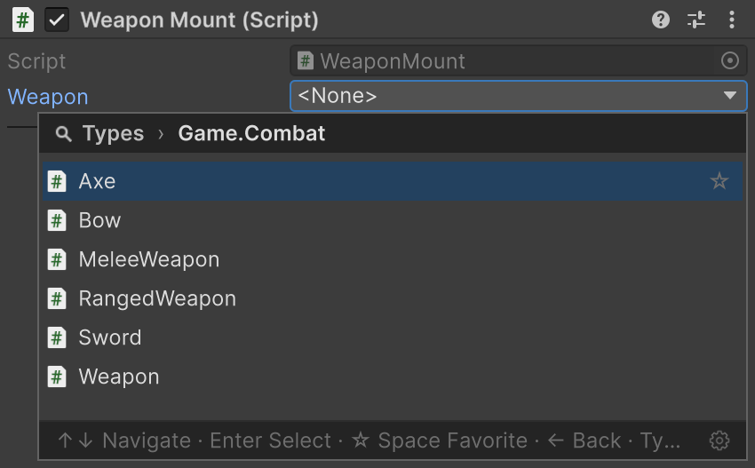
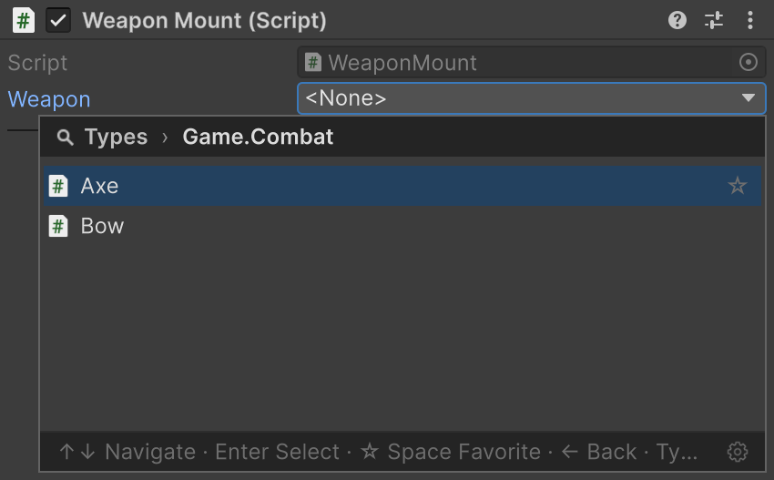

# TypeSelector

A type picker you tailor to every field.

## Quick start

```csharp
[TypeSelector(typeof(ITwoHanded), Allow = TypeAllow.None)]
[SerializeField] private SerializableType<Weapon> _weapon;
```

The field offers only concrete two-handed weapons: classes derived from <code lang="class-name">Weapon</code> that implement <code lang="class-name">ITwoHanded</code>.

| Without the attribute | With <code lang="csharp">[TypeSelector]</code> |
|---|---|
|  |  |

## Supported fields

| Field | Selection result |
|---|---|
| <code lang="csharp">string</code> | Stores the assembly-qualified name |
| [Serializable Types](02-serializable-types.md) | Configures the wrapper's selection |
| <code lang="csharp">[SerializeReference]</code> | Creates an instance of the selected implementation — see [SerializeReference Selector](04-serialize-reference-selector.md) |

> [!WARNING]
> In a player, a string field is resolved by name, like [Serializable Types](02-serializable-types.md#types-in-a-player-build): a class used only through this selection may be stripped at **Managed Stripping Level** Low or higher.

## Which types are offered

```csharp
public interface ITwoHanded { }

public abstract class Weapon { }
public abstract class MeleeWeapon : Weapon { }
public abstract class RangedWeapon : Weapon { }

public sealed class Sword : MeleeWeapon { }
public sealed class Axe : MeleeWeapon, ITwoHanded { }
public sealed class Bow : RangedWeapon, ITwoHanded { }
```

The types in the attribute narrow the list: only classes compatible with all of them stay.

| <code lang="csharp">[TypeSelector]</code> arguments on a <code lang="csharp">string</code> field | Offered |
|---|---|
| <code lang="csharp">typeof(Weapon)</code> | <code lang="class-name">Weapon</code>, <code lang="class-name">MeleeWeapon</code>, <code lang="class-name">RangedWeapon</code>, <code lang="class-name">Sword</code>, <code lang="class-name">Axe</code>, <code lang="class-name">Bow</code> |
| <code lang="csharp">typeof(Weapon), typeof(ITwoHanded)</code> | <code lang="class-name">Axe</code>, <code lang="class-name">Bow</code> |
| <code lang="csharp">typeof(Sword), typeof(Axe)</code> | Nothing |
| <code lang="csharp">typeof(MeleeWeapon), Allow = TypeAllow.None</code> | <code lang="class-name">Sword</code>, <code lang="class-name">Axe</code> |

A wrapper's <code lang="class-name">T</code> and a <code lang="csharp">[SerializeReference]</code> field's type count as one more type in the attribute:

```csharp
// Axe, Bow
[TypeSelector(typeof(ITwoHanded))]
[SerializeField] private SerializableType<Weapon> _twoHandedType;

// Axe, Bow
[TypeSelector(typeof(ITwoHanded))]
[SerializeReference] private Weapon _twoHandedWeapon;
```

> [!NOTE]
> In the Inspector of a runtime object, the picker leaves out types from editor-only assemblies (`UnityEditor`, Editor-only asmdefs and `Editor` folders): a player build cannot resolve them.

## Properties

| Property | Default | Behaviour |
|---|---|---|
| <code lang="csharp">Allow</code> | <code lang="csharp">TypeAllow.All</code> | Lets abstract classes (<code lang="csharp">Abstract</code>), interfaces (<code lang="csharp">Interface</code>), both or neither into the list. Ignored on <code lang="csharp">[SerializeReference]</code> |
| <code lang="csharp">Required</code> | <code lang="csharp">false</code> | Warns about an empty type name or a <code lang="csharp">null</code> managed reference |

## Required field

```csharp
[TypeSelector(typeof(Weapon), Required = true)]
[SerializeField] private string _secondaryWeapon;
```


With <code lang="csharp">Required = true</code>, `<None>` stays selectable. A missing type with a stored name passes the check.

For project-wide and CI validation, see [required-field checks](07-serialize-reference-validation.md#what-each-run-checks).

## Constraint from another field

Pass <code lang="csharp">nameof(...)</code> to let a field or property's current value control the candidate list:

```csharp
[SerializeField] private SerializableType<Weapon> _weaponClass;

[TypeSelector(nameof(_weaponClass), Allow = TypeAllow.None)]
[SerializeField] private string _weaponName;
```

Choose <code lang="class-name">MeleeWeapon</code> in **Weapon Class**, and **Weapon Name** offers its concrete subclasses. Changing a constraint does not clear an earlier selection.


| Constraint source | Base type |
|---|---|
| <code lang="class-name">System.Type</code> | The member's value |
| <code lang="csharp">string</code> | The type named, through <code lang="csharp">Type.GetType()</code> |
| <code lang="class-name">SerializableType</code> / <code lang="class-name">SerializableMonoScript</code> | The <code lang="csharp">.Type</code> value |
| An array of these values | Each element; <code lang="class-name">List&lt;T&gt;</code> is not supported |

- For a field inside a <code lang="csharp">[Serializable]</code> class or a list element, the source is read from that same instance.
- While the source is empty or unresolved it adds no constraint: the string **Weapon Name** then offers every concrete type. A wrapper keeps its own <code lang="class-name">T</code>.

## Errors in string arguments

If a well-formed type name refers to a type that is not loaded, the Inspector shows a warning:

```csharp
[TypeSelector("Spear, Assembly-CSharp")]
[SerializeField] private string _weaponName;
```


## TypeSelectorDisplay

<code lang="csharp">[TypeSelectorDisplay]</code> on a class changes only its row in the picker:

| Parameter on <code lang="class-name">Sword</code> | In the picker |
|---|---|
| <code lang="csharp">Name = "Longsword"</code> | Longsword in the list and the closed field; search still finds Sword |
| <code lang="csharp">Group = "Weapons/Melee"</code> | Weapons → Melee → Longsword instead of the namespace |
| <code lang="csharp">Tooltip = "A balanced blade"</code> | Tooltip on hover |
| <code lang="csharp">Icon = "d_ScriptableObject Icon"</code> | Icon: a built-in one by name, an asset by path with extension, or one from `Resources` without extension |
| <code lang="csharp">Hidden = true</code> | Not listed; code assignment and an already stored value still work |

Subclasses do not inherit these settings.


> [!NOTE]
> <code lang="csharp">[TypeSelector]</code> and <code lang="csharp">[TypeSelectorDisplay]</code> are marked <code lang="csharp">[Conditional("UNITY_EDITOR")]</code>. Classes compiled into an external DLL without that symbol carry none of their settings, including <code lang="csharp">Hidden</code>.

## The picker

The picker groups types by namespace or <code lang="csharp">Group</code> and distinguishes identical names by assembly.


The picker's root page keeps the types you need most often:

- **Favorites**: your picks. To add a type, click the star at the right of its row, or press Space while the row is selected.
- **Recent**: the types chosen last.

Whether Favorites is shown and how long Recent is (0 hides it) are set in the FastTools window's **Settings** tab. The gear at the bottom right of the picker opens it, and both lists are cleared there too.

### Generic types

Picking an open generic type opens its argument pages and returns a constructed closed type:

```csharp
public abstract class Enchantment { }
public sealed class Fire : Enchantment { }
public sealed class Frost : Enchantment { }

public sealed class Enchanted<T> : Weapon
    where T : Enchantment { }
```

Choose <code lang="class-name">Enchanted&lt;T&gt;</code> in the <code lang="class-name">SerializableType&lt;Weapon&gt;</code> field: the window offers the subclasses of <code lang="class-name">Enchantment</code>, and choosing <code lang="class-name">Fire</code> stores <code lang="class-name">Enchanted&lt;Fire&gt;</code>.


- A generic argument can itself be generic: the window asks for its arguments first.
- When every argument can be inferred from the field type, the closed type is returned immediately.
- Interfaces, abstract classes, and hidden types are not offered as arguments.

## TypeSelectorWindow

<code lang="class-name">TypeSelectorWindow</code> opens the same picker from a custom inspector or editor window, for example from a UI Toolkit button:

```csharp
using Aspid.FastTools.Types.Editors;

var button = new Button { text = "Select weapon" };
button.clicked += () => TypeSelectorWindow.Show(
    screenRect: GUIUtility.GUIToScreenRect(button.worldBound),
    filter: new TypeSelectorFilter
    {
        Types = new[] { typeof(Weapon) }
    },
    currentAqn: selectedTypeName,
    onSelected: aqn => selectedTypeName = aqn);
```

The callback receives an assembly-qualified name, or <code lang="csharp">null</code> for `<None>`.

> [!NOTE]
> <code lang="class-name">TypeSelectorFilter</code> defaults <code lang="csharp">Allow</code> to <code lang="csharp">TypeAllow.None</code>, while <code lang="csharp">[TypeSelector]</code> defaults to <code lang="csharp">TypeAllow.All</code>: the window above offers only concrete weapons.

For filter properties and window parameters, see the API reference: [TypeSelectorFilter](https://vpdpersonal.github.io/Aspid.FastTools/api/Aspid.FastTools.Types.Editors.TypeSelectorFilter), [TypeSelectorWindow](https://vpdpersonal.github.io/Aspid.FastTools/api/Aspid.FastTools.Types.Editors.TypeSelectorWindow).

## Package sample

The [Types](../Samples~/Types/Documentation/README.md) sample shows a dependent picker, <code lang="csharp">[TypeSelectorDisplay]</code> names and a required field; [EditorTools](../Samples~/EditorTools/Documentation/README.md) opens the picker from editor code.


