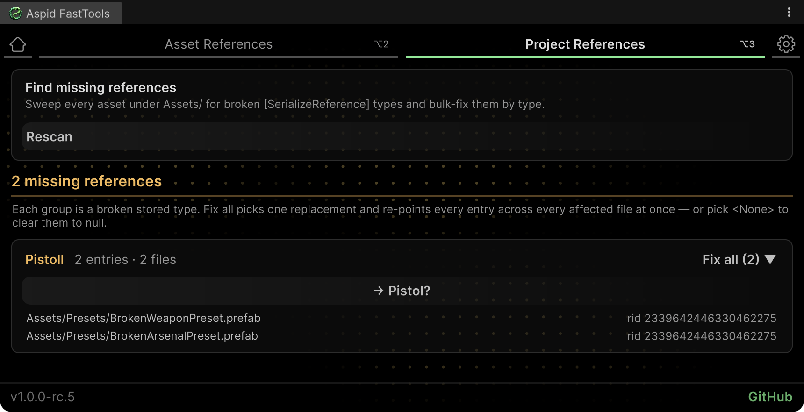
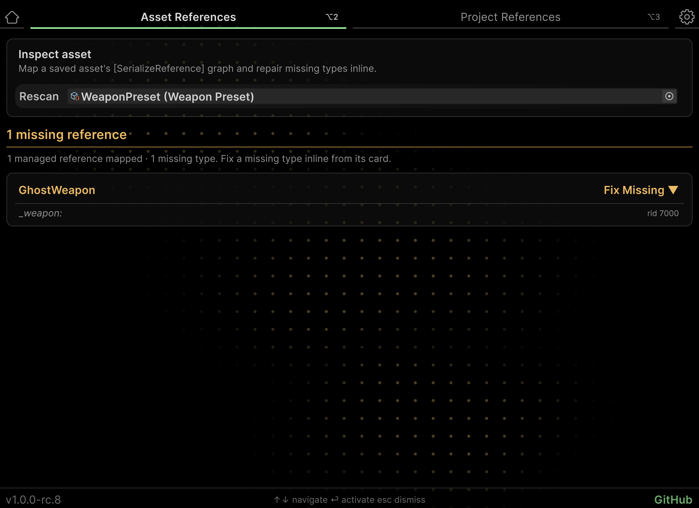

# SerializeReference Tooling

Find missing `[SerializeReference]` types in prefabs, assets, and scenes, repair them in groups, and check the project before building. FastTools reads stored references from YAML, including entries the ordinary Inspector no longer shows.

<a id="check-the-project"></a>

## Quick start

After renaming or deleting a class, check which assets still store its old name:

1. Save modified scenes and assets — scanning reads files on disk.
2. Open **Tools → Aspid 🐍 → FastTools → Project References**.
3. Click **Scan Project**. Missing references are grouped by stored type.
4. Click **Fix all** in the relevant group, choose a replacement, and review the changes in the **Rewrite** dialog.
5. Review the summary and the affected assets' values. If needed, use **Undo** in the operation summary; then click **Rescan** to check again.

File rewrites skip references in open scenes, Prefab Mode and assets with unsaved changes: the rewrite reimports the asset and would discard those changes. **Asset References** offers to save such an asset first. Save and close those scenes, prefabs and assets before repair, or repair a visible field using [Fix in the Inspector](03-serialize-reference-selector.md#repairing-missing-types).

> [!NOTE]
> Analysis requires text YAML assets. In Unity's editor settings, select **Asset Serialization → Mode → Force Text**. Existing binary assets need to be saved again; changing the mode alone does not make them scannable.

<a id="bulk-repair-tabs"></a>

## Audit and repair windows

| Task | Tool |
|---|---|
| Repair one visible field | [Inspector selector](03-serialize-reference-selector.md#repairing-missing-types) |
| Inspect connections within one saved asset | **Asset References** |
| Find a missing type throughout the project | **Project References** |
| Write the new type name after `[MovedFrom]` | **Migrate all** in Project References |
| Validate data before building | **Build / CI gate** in project settings |

Both tabs open through **Tools → Aspid 🐍 → FastTools**. Project scanning processes `.prefab`, `.asset`, and `.unity` files under `Assets/`, respecting **Excluded scan folders**. It covers eligible project files, not just scenes included in the build.

## Project References: repair a group

Each group card shows the stored type and reference and file counts. Asset paths and reference IDs (`rid`) appear below. Click a row to open its asset in **Asset References**:



A missing-reference group with Fix all and Smart Fix actions

### Choosing an action

| Action | Behaviour |
|---|---|
| **Fix all** | Opens the type picker and applies the replacement to all writable references in the group |
| **Smart Fix** | Uses the suggested type and opens replacement confirmation |
| **Migrate all** | Rewrites the old name to the type uniquely identified through `[MovedFrom]` |
| **Reassign all** | Lets you choose a different replacement for a group recognized as a migration |

**Smart Fix** appears when type information, name similarity, and fields identify a suitable candidate. Review the suggestion; scanning alone does not repair anything.

### What repair preserves

Replacing a missing type changes its `class`, `ns`, and `asm` entry in YAML while retaining the data block and `rid`. Unity then reimports the file and reads the data as the new type.

Choose a type compatible with both the declared field type and the stored data. Renaming does not automatically transform the field layout. If a group spans different field types, the dialog warns you: the chosen class may not fit every entry, and incompatible references become `null` on import.

Bulk replacement produces a summary with an **Undo** button. It restores the old type name on references that still contain the applied replacement. This summary action does not restore every previous asset value. Review the result before scanning again: **Rescan** clears earlier operation summaries.

### Choosing None

`<None>` clears references and deletes their stored data. If several fields share a `rid`, all pointers to that instance are cleared. The tool asks for confirmation; this operation cannot be undone.

Bulk clearing may null references in open scenes, Prefab Mode or assets with unsaved changes in memory. Save those objects: file-based scans continue to show the old entries until they are saved.

## Asset References: inspect one asset

Open **Asset References** and assign a saved prefab, ScriptableObject, or scene file to the object field beside **Rescan**. You can also arrive here from a **Project References** result row.

The graph groups references by host object and field path:

| Label | Meaning |
|---|---|
| **MISSING** | The reference's stored type cannot be found |
| **SHARED** | Several fields use the same managed-reference instance |
| **Orphaned** | A YAML entry remains with no field pointing to it |
| `rid` | A managed-reference identifier within its host object |

`SHARED` does not inherently mean an error: sharing can be intentional. Matching colours help locate connected fields; the colour is derived from the ID and has no separate setting.

Open **Fix** on a missing-reference card and choose a replacement. In this example, `GhostWeapon` becomes `Pistol`:



Repairing GhostWeapon as Pistol while preserving reference data

The scene or prefab must be closed for a YAML rewrite. If a regular field cannot be edited from this window — for example, it is in a scene or beneath a missing parent reference — repair the parent or open the field in the Inspector.

Orphaned entries offer **Clear**. This deletes the file entry after confirmation and does not support Undo.

## Migrations with MovedFrom

For an intentional rename or move, `[MovedFrom]` connects the old identity to the new type. For example, renaming `GhostWeapon` to `Pistol` within the same assembly and namespace:

| Before — GhostWeapon | After — Pistol |
|---|---|
| <pre lang="csharp"><code>[Serializable]&#10;public sealed class GhostWeapon&#10;&#123;&#10;    public int Damage = 10;&#10;&#125;</code></pre> | <pre lang="csharp"><code>[Serializable]&#10;[MovedFrom(true,&#10;    sourceClassName: "GhostWeapon")]&#10;public sealed class Pistol&#10;&#123;&#10;    public int Damage = 10;&#10;&#125;</code></pre> |

The attributes require `using System;` and `using UnityEngine.Scripting.APIUpdating;`. For moves, also supply the old `sourceNamespace` and `sourceAssembly`.

After compilation:

1. Click **Scan Project** or **Rescan**.
2. If the old identity uniquely maps to a suitable type, the group appears as a pending migration.
3. Click **Migrate all** to write the new name to the files. Until then, Unity uses the attribute when loading the old name.

A pending migration does not count as a missing type for build checks. If multiple types claim one old identity, the tool does not automatically choose a winner. Stored closed generic types are not recognized as unambiguous migrations by this mechanism either.

Remove `[MovedFrom]` only after migrating all data that must remain loadable, including assets outside the current project and folders excluded from scanning.

<a id="project-settings--the-buildci-gate"></a>

## Pre-build checks

Open **Project Settings → Aspid FastTools → SerializeReference** and set **Build / CI gate**:

| Mode | Player build | Standalone CI run |
|---|---|---|
| `Off` | Skips validation | Skips scanning and report writing; exit code `0` |
| `Warn` | Warns and continues building | Logs violations; exit code `0` |
| `Fail` | Missing types stop the build | Exit code `1` when violations are found |

The default is `Warn`. This setting controls validation; it does not repair references.

### Where required fields are checked

| Run | Missing types | Empty fields with `TypeSelector(Required = true)` |
|---|---|---|
| **Project References → Scan Project** | Yes, including pending-migration groups | Yes in `Warn` or `Fail`; a separate **Required violations** group |
| Player build | Yes in `Warn` or `Fail` | No |
| CI without `-srGateRequired` | Yes, when enabled | No |
| CI with `-srGateRequired` | Yes, when enabled | Yes |

Required checks follow the traversal limits in [Running in CI](#running-in-ci). Project scanning for missing types is available even in `Off`; only the additional Required check is disabled.

### Shared and personal settings

| Setting | Storage | Purpose |
|---|---|---|
| **Build / CI gate** | Project | Validation severity |
| **Excluded scan folders** | Project | Folders skipped by project scans |
| **Auto de-alias duplicated list elements** | Project | Creates an independent copy when duplicating a list entry |
| **Breakage detection** | Local `EditorPrefs` | A notification and Console warning for newly missing references after import or recompilation |

Shared settings are saved in `ProjectSettings/SerializeReferenceSharedSettings.asset`. Commit this file so the team and CI use the same rules.

<details>
<summary>Other window and selector settings</summary>

The same options are available in the FastTools window's **Settings** tab and **Preferences → Aspid FastTools**. Personal settings are nearby:

- **Favorites** — shows or hides favourites.
- **Recent items** — history capacity from 0 to 20. Setting 0 hides the section and pauses recording while retaining history.
- **Saved lists** — clears Favorites and Recent.
- **Welcome** — shows the welcome screen automatically.

A green stripe marks project settings; blue marks personal settings. **Reset to defaults** resets each group separately and preserves Favorites and Recent. Changes immediately appear in all settings views.

</details>

<a id="headless-ci"></a>

## Running in CI

Run the Unity Editor from the Unity project root. `Unity` stands for the editor executable; supply its full path if it is not on `PATH`.

```bash
Unity -batchmode -quit -projectPath . \
  -executeMethod Aspid.FastTools.SerializeReferences.Editors.SerializeReferenceCiGate.RunCheck \
  -srGateReport SerializeReferenceGateReport.txt \
  -srGateRequired -srGateFail
```

This checks missing types and unset required fields, writes a report, and exits with code `1` on violations. `-srGateFail` explicitly enables strict mode even if the project uses `Off`. Running the check does not repair assets.

### Command-line flags

| Flag | Behaviour |
|---|---|
| `-srGateReport <path>` | Report path; defaults to `SerializeReferenceGateReport.txt` |
| `-srGateRequired` | Also checks unset fields with `Required = true` |
| `-srGateFail` | Uses `Fail` instead of the project setting |
| `-srGateWarnOnly` | Uses `Warn`; takes precedence over `-srGateFail` if both are passed |

Without a severity flag, the project setting applies. For a trial run, replace `-srGateFail` with `-srGateWarnOnly`.

In `Warn`, violations are logged as errors, but the process returns `0`. Check the exit code in CI. In `Off`, no fresh report is written; a report from an earlier run may remain on disk.

### Required check boundaries

For prefabs and ScriptableObjects, validation traverses serialized properties, including accessible nested fields. Scenes are read from YAML: top-level fields and fields within by-value containers are checked. Scene traversal does not descend into collection entries or managed references.

This limitation applies to unset required fields. Missing-type detection separately reads stored managed-reference entries.

### Report and exit codes

After the header, each violation occupies one line. Fields are tab-separated:

```text
KIND    assetPath    fileId    rid    className    fieldPath
```

| Field | Contents |
|---|---|
| `KIND` | `MissingType` or `RequiredUnset` |
| `assetPath` | File path, such as `Assets/Weapons/Pistol.prefab` |
| `fileId` | Host object ID within the file |
| `rid` | Managed-reference ID; `0` for a required string field |
| `className` | Stored class name for `MissingType`, without separate namespace or assembly fields |
| `fieldPath` | Required field path; empty for `MissingType` |

Save the report as a CI artifact. The asset path, `fileId`, and `rid` together help locate the entry in Asset References.

| Code | Meaning |
|---|---|
| `0` | No violations, `Warn` selected, or validation disabled |
| `1` | Violations found in `Fail` mode |
| `2` | An internal check error, such as failure to write the report |

## Next steps

- [SerializeReference Selector](03-serialize-reference-selector.md) — type selection, shared references, and individual field repair in the Inspector.
- [Serializable Types](02-serializable-types.md) — `TypeSelector` and required-field configuration.
- [SerializeReferences sample](../Samples~/SerializeReferences/Documentation/README.md) — polymorphic weapon and effect data in a working scene.
