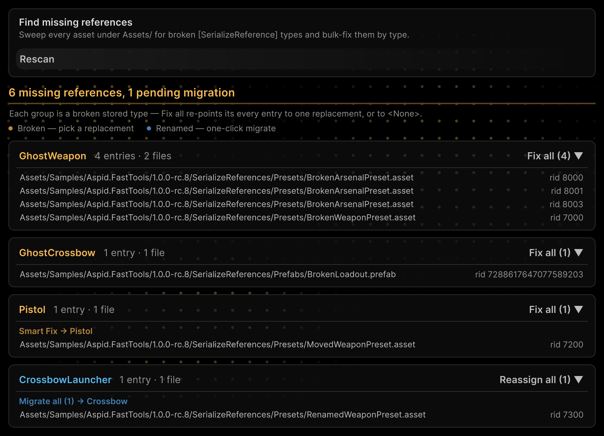
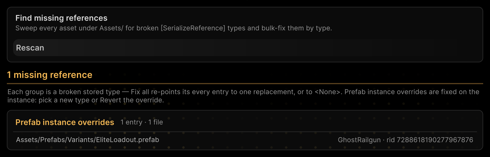
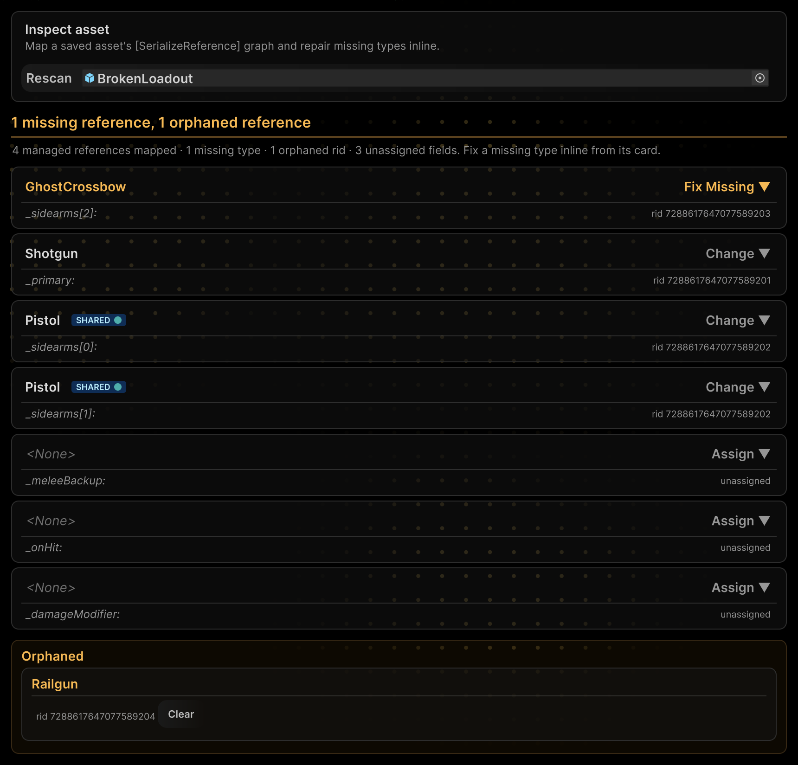
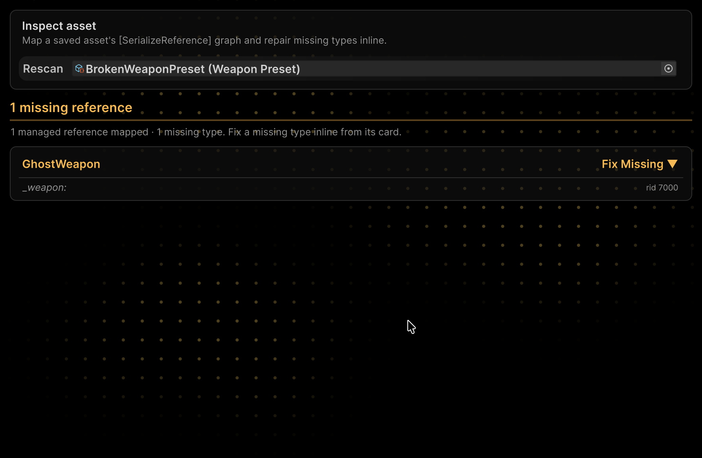
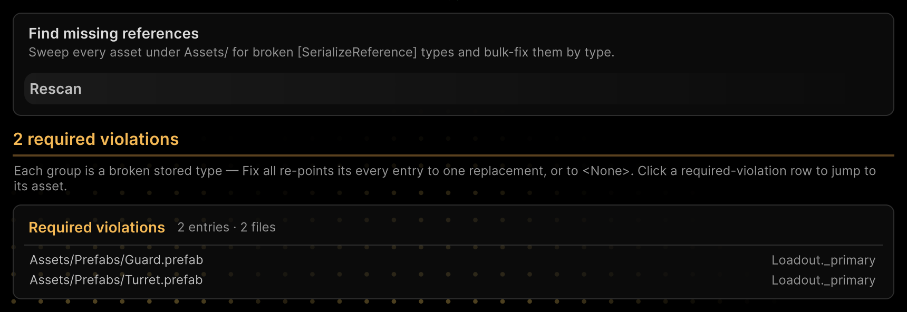

# SerializeReference Tooling

References to renamed and deleted classes are found across the project and repaired in one go — before they turn into null in a build.

<a id="check-the-project"></a>

## Quick start

1. Open **Tools → Aspid 🐍 → FastTools → Project References**.
2. Click **Scan Project**: missing references are grouped by stored class.
3. Click **Fix all** in a group, pick a class and confirm with **Rewrite**.

> [!NOTE]
> Binary assets and Git LFS files that were not fetched are skipped silently: keep **Asset Serialization → Mode** on **Force Text** (the default) and fetch LFS files before the check.

<a id="bulk-repair-tabs"></a>

## Project References: repair a group

Project References and Asset References are tabs of one window. **Scan Project** reads the `.prefab`, `.asset` and `.unity` files under `Assets/`, apart from [**Excluded scan folders**](#settings).



### Group actions

| Group | Header button | Row under the header |
|---|---|---|
| Missing type | **Fix all ▼** — pick a class for every entry | **Smart Fix → Pistol** — apply a class with the same or a similar name; the tooltip gives the reason |
| Renamed with <code lang="csharp">[MovedFrom]</code> | **Reassign all ▼** — pick a different class instead of the new name | **Migrate all → Crossbow** — write the new name, see [Migrations](#migrations-with-movedfrom) |

Every action asks for **Rewrite**. `<None>` in the class picker clears the group's references and deletes their data, fields sharing the same `rid` included; it asks for **Clear** and has no Undo.

### What repair preserves

A repair rewrites only the entry's class, namespace and assembly; its data and `rid` stay. When the group's fields have different types, the pick may not fit every entry: incompatible ones become <code lang="csharp">null</code> on reimport.

The summary after a rewrite has **Undo**: it restores the old class on entries that still hold the new one. It is gone after **Rescan**, closing the window or a domain reload; **Edit → Undo** does not revert a rewrite.

### Prefab instance overrides

A missing class set through a prefab instance override — in a variant, a nested prefab or an instance in a scene — is listed in a separate **Prefab instance overrides** card.



**Fix all**, **Smart Fix**, **Migrate all** and `<None>` do not rewrite these entries: pick a new class on the instance in the Inspector, or revert the override. Asset References does not show references that exist only in overrides.

## Asset References: inspect one asset

Assign a saved prefab, ScriptableObject or scene to the field next to **Rescan**, or click an entry row in Project References.



| Label | Meaning |
|---|---|
| Band with **Fix Missing ▼** | The stored class is not found; the button opens the class picker |
| **Smart Fix → Pistol** row | A class picked as by **Smart Fix** in Project References |
| **Migrate → Crossbow** row under a **Fix ▼** band | The class was renamed with <code lang="csharp">[MovedFrom]</code>: the row writes the new name, **Fix ▼** picks a different class |
| Band with **Change ▼**, **Assign ▼** or **Assign Required ▼** | Changes the class of a healthy reference, fills an empty or required field; the asset is saved at once |
| **SHARED** | Several fields point at one instance; matching colours mark the connected fields |
| **Orphaned** | An entry no field points at; **Clear** deletes it from the file, without Undo |

**Fix Missing**, **Smart Fix** and **Migrate** write the class to the file at once, without confirmation, and **Edit → Undo** does not revert it.



## Migrations with MovedFrom

When <code lang="class-name">CrossbowLauncher</code> is renamed to <code lang="class-name">Crossbow</code> with <code lang="csharp">[MovedFrom]</code>, Unity loads the old references itself. **Migrate all** writes the new name into the files so the attribute can be removed:

| In the file — before Migrate all | After |
|---|---|
| `type: {class: CrossbowLauncher, …}` | `type: {class: Crossbow, …}` |

A group becomes a pending migration only when exactly one class that fits the field lists the old name in <code lang="csharp">[MovedFrom]</code> and the stored class is not a closed generic; the build checks do not count such a group as missing.

Remove <code lang="csharp">[MovedFrom]</code> only when no file stores the old name any more. **Migrate all** does not rewrite it:

- in prefab instance overrides;
- in open, unsaved and locked files, see [limitations](#limitations);
- in **Excluded scan folders**;
- in binary assets and Git LFS files that were not fetched;
- in files outside `Assets/`.

<a id="project-settings--the-buildci-gate"></a>

## Pre-build checks

The [**Build / CI gate**](#settings) setting picks how strict the check is:

| Mode | Player build | Standalone CI run |
|---|---|---|
| `Off` | Skips the check | No scan and no report, an older report stays; exit code `0` |
| `Warn` | Warns and keeps building | Report and violations in the log; exit code `0` |
| `Fail` | Missing types stop the build | Report; exit code `1` on violations |

The build checks every asset under `Assets/`, not only what goes into it: in `Fail` mode an unused prefab stops it too — exclude such folders with **Excluded scan folders**.

### What each run checks

| Run | Missing types | Empty fields with <code lang="csharp">Required = true</code> |
|---|---|---|
| **Project References → Scan Project** | Yes, with pending migrations | Unless the mode is `Off`, as a **Required violations** group |
| **Asset References** | Yes | Yes, in any mode |
| Player build | Unless the mode is `Off` | No |
| CI without `-srGateRequired` | Unless the mode is `Off` | No |
| CI with `-srGateRequired` | Unless the mode is `Off` | Unless the mode is `Off` |



A field is made required with <code lang="csharp">[TypeSelector(Required = true)]</code>; see [Required field](02-serializable-types.md#required-field). In scenes the Required check has [limitations](#limitations).

<a id="headless-ci"></a>

## Running in CI

```bash
Unity -batchmode -projectPath . \
  -executeMethod \
  Aspid.FastTools.SerializeReferences.Editors.SerializeReferenceCiGate.RunCheck \
  -srGateReport SerializeReferenceGateReport.txt \
  -srGateRequired -srGateFail
```

Exit code `2` means the check itself failed.

### Command-line flags

| Flag | Behaviour |
|---|---|
| `-srGateReport <path>` | Report path from the project root, `SerializeReferenceGateReport.txt` by default; the folder must exist, the file is overwritten |
| `-srGateRequired` | Also checks unset fields with <code lang="csharp">Required = true</code> |
| `-srGateFail` | Uses `Fail` instead of the project's mode, even `Off` |
| `-srGateWarnOnly` | Uses `Warn` instead of the project's mode, even `Off`; takes precedence over `-srGateFail` if both are passed |

<a id="report-and-exit-codes"></a>

### Report

The report starts with a header:

```text
# SerializeReference Gate Report
# Violations: 2
# Not scanned (not text YAML): 2
#   Binary	Assets/Legacy/OldLoadout.prefab
#   LfsPointer	Assets/Levels/Arena.unity
```

Skipped files do not change the exit code.

Then one line per violation, tab-separated:

```text
KIND    assetPath    fileId    rid    className    fieldPath    origin
```

| Field | Contents |
|---|---|
| `KIND` | `MissingType` or `RequiredUnset` |
| `assetPath` | File path |
| `fileId` | Host object ID within the file; for a prefab instance override, the ID of the prefab instance |
| `rid` | Managed-reference ID; in `RequiredUnset` rows, `-2` for an empty <code lang="csharp">[SerializeReference]</code> and `0` for a <code lang="csharp">string</code> or <code lang="class-name">SerializableType</code> |
| `className` | Stored class name for `MissingType` |
| `fieldPath` | Required field path; for a `MissingType` override, the overridden field; otherwise empty |
| `origin` | `override` for a type set by a prefab instance override; otherwise empty |

In Asset References, find an entry by its `rid`, and a `RequiredUnset` row with `rid` `0` by its `fieldPath`; an `override` row is in the **Prefab instance overrides** card of Project References instead.

## Settings

Every setting is in **Tools → Aspid 🐍 → FastTools → Settings**; the shared ones are also in **Project Settings → Aspid.FastTools → SerializeReference**, the personal one in **Preferences → Aspid.FastTools → SerializeReference**.


| Setting | Default | What it does |
|---|---|---|
| **Build / CI gate** | `Warn` | Sets how strict the [pre-build check](#pre-build-checks) and CI are |
| **Excluded scan folders** | No folders | Folders inside `Assets/` that Project References, the build and CI checks and breakage detection skip |
| **Auto de-alias duplicated list elements** | On | Gives a duplicated list element its own instance instead of a shared `rid` |
| **Breakage detection** | On | After scripts or assets change, reports newly missing references with a notification and in the Console |

Breakage detection is kept locally in `EditorPrefs`; the other settings live in `ProjectSettings/SerializeReferenceSharedSettings.asset`, shared by the team and CI.

## Limitations

- **Open and locked files.** Rewrites skip open scenes, Prefab Mode, assets with unsaved changes and read-only files version control could not check out. Asset References offers to save an unsaved asset; save and close the scene or Prefab Mode, or repair the field with [Fix in the Inspector](03-serialize-reference-selector.md#repairing-missing-types). In Project References, `<None>` clears references of open copies in memory; save the copies to write the change to the files.
- **Scenes and missing parents.** In a scene or under a missing parent reference, Asset References repairs only missing types; change other fields in the Inspector.
- **Required in scenes.** Fields of components and by-value containers are checked, <code lang="csharp">[SerializeReference]</code> fields themselves included; fields inside managed references, collections and prefab instance overrides are not. A field absent from the scene file is not a violation.

## Package sample

Missing types, a <code lang="csharp">[MovedFrom]</code> rename and a shared reference for both tabs are in the assets of the [SerializeReferences](../Samples~/SerializeReferences/Documentation/README.md) sample.
