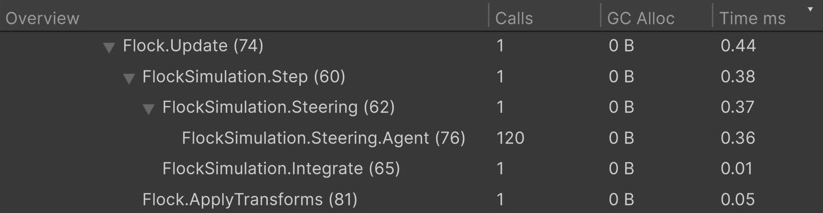

# ProfilerMarkers

`this.Marker()` creates a Unity Profiler marker named `Type.Method (line)` — no static `ProfilerMarker` field and no hand-typed name.

## Quick start

The examples on this page work with the `FlockSimulation` class from the [ProfilerMarkers sample](../Samples~/ProfilerMarkers/Documentation/README.md):

| Before — Unity API | After — FastTools |
|---|---|
| <pre lang="csharp"><code>private static readonly&#10;    ProfilerMarker StepMarker =&#10;    new("FlockSimulation.Step");&#10;&#10;public void Step()&#10;&#123;&#10;    using var _ = StepMarker.Auto();&#10;    Integrate();&#10;&#125;</code></pre> | <pre lang="csharp"><code>public void Step()&#10;&#123;&#10;    using var _ = this.Marker();&#10;    Integrate();&#10;&#125;</code></pre> |

Works in `MonoBehaviour` and ordinary C# classes. The generator ships with the package; the extension is in the global namespace — no extra `using`, attributes, or `partial` declaration needed.

## Scope and names

`Marker()` returns a `ProfilerMarker.AutoScope`. `.WithName("Steering")` replaces the method part of the name; the type and line number remain.

```csharp
public void Step()
{
    using var _ = this.Marker();

    using (this.Marker().WithName("Steering"))
    {
        foreach (var agent in _agents)
        {
            using var agentScope = this.Marker().WithName("Steering.Agent");
            ComputeSteering(agent);
        }
    }

    using (this.Marker().WithName("Integrate"))
    {
        Integrate();
    }
}
```

<details>
<summary>Generated code</summary>

Abridged: without `global::` and the repeated attribute. Line numbers count from the top of the block above; in a real file they are source-file lines.

```csharp
// <auto-generated>
[GeneratedCode("Aspid.FastTools.Generators.ProfilerMarkersGenerator", "1.0.0")]
internal static class __FlockSimulationProfilerMarkerExtensions
{
    private static readonly ProfilerMarker Step   = new("FlockSimulation.Step (3)");
    private static readonly ProfilerMarker Step_2 = new("FlockSimulation.Steering (5)");
    private static readonly ProfilerMarker Step_3 = new("FlockSimulation.Steering.Agent (9)");
    private static readonly ProfilerMarker Step_4 = new("FlockSimulation.Integrate (14)");

    public static ProfilerMarker.AutoScope Marker(this FlockSimulation _, [CallerLineNumber] int line = -1)
    {
#if ENABLE_PROFILER
        if (line is 3) return Step.Auto();
        if (line is 5) return Step_2.Auto();
        if (line is 9) return Step_3.Auto();
        if (line is 14) return Step_4.Auto();
#endif
        return default;
    }
}
```

</details>

The tree in **CPU Usage → Hierarchy** mirrors the `using` nesting, and a marker inside a loop stays a single row with a `Calls` count. Deep Profile is not needed.



FlockSimulation markers in CPU Usage: Steering and Integrate nested under Step, Steering.Agent with 120 calls

`WithName` accepts only a string literal: `"Steering"`, `@"Steering"`, or `$"Steering"` without substitutions. Variables, `const`, `nameof`, concatenation, and `$"Agent {index}"` keep the original method name — the generator reads the source text and does not evaluate expressions. The argument is still evaluated at runtime.

> [!IMPORTANT]
> Do not call `this.Marker()` without `using`: the measurement will not end automatically. A scope must not cross `await` or `yield`; measure synchronous sections separately ([Unity limitation](https://docs.unity3d.com/6000.0/Documentation/Manual/profiler-add-markers-code.html)).

## Generation details

- **Line number.** Every call in a type needs its own line, including across `partial` files. Moving a call changes the name suffix.
- **Member name.** A method contributes its own name, a constructor `Ctor`, a property accessor the property name. Lambdas and local functions use the member they are declared in.
- **Generic types** get separate markers per closed type: `Worker<int>.Run()` → `Worker<Int32>.Run (line)`.
- **Without `ENABLE_PROFILER`** nothing is measured, but the code inside `using` and the `WithName` arguments still run.

## Package sample

A flock scene with 120 agents where `FlockSimulation` carries the markers shown above: [ProfilerMarkers](../Samples~/ProfilerMarkers/Documentation/README.md).
