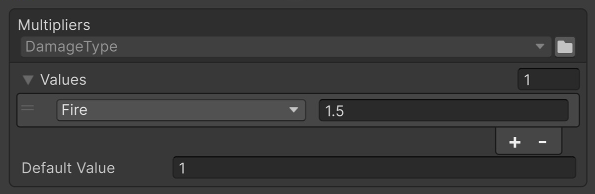
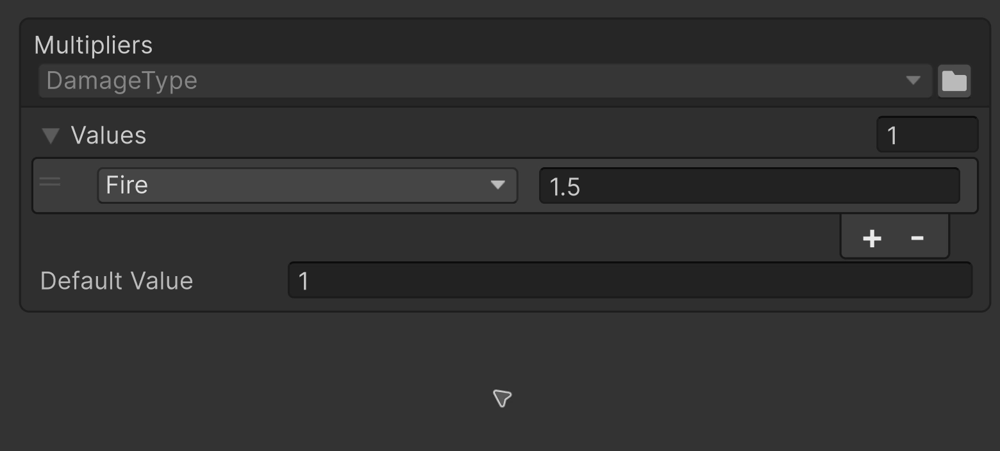
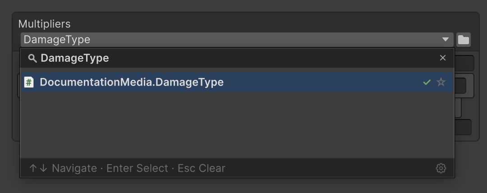
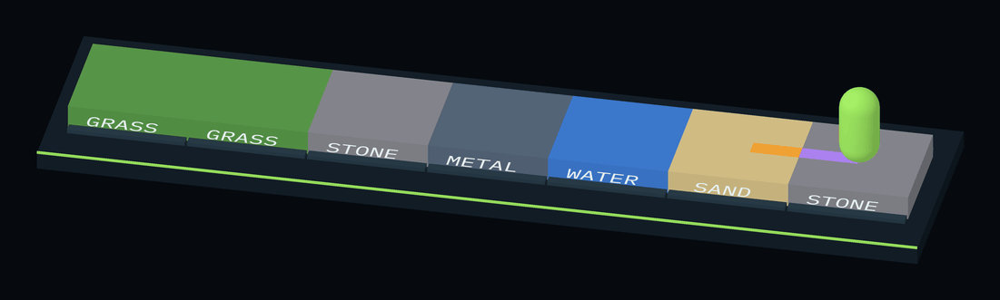

# EnumValues

An enum-keyed table configured in the Inspector: damage multipliers, colours, sounds, asset references. `GetValue` returns the matching row's value, or `Default Value` when no row matches.

## Quick start

The examples use this enum:

```csharp
public enum DamageType
{
    Physical, Fire, Ice, Poison
}
```

Add `using Aspid.FastTools.Enums;` to a script that imports `UnityEngine`. One table replaces a set of serialized fields and a `switch`:

| Before — separate fields and switch | After — EnumValues |
|---|---|
| <pre lang="csharp"><code>[SerializeField]&#10;private float _defaultMultiplier = 1f;&#10;[SerializeField]&#10;private float _fireMultiplier = 1.5f;&#10;&#10;public float GetMultiplier(&#10;    DamageType type) =&gt; type switch&#10;&#123;&#10;    DamageType.Fire =&gt; _fireMultiplier,&#10;    _ =&gt; _defaultMultiplier&#10;&#125;;</code></pre> | <pre lang="csharp"><code>[SerializeField]&#10;private EnumValues&lt;DamageType, float&gt;&#10;    _multipliers;&#10;&#10;public float GetMultiplier(&#10;    DamageType type) =&gt;&#10;    _multipliers.GetValue(type);</code></pre> |



Fire uses a multiplier of 1.5; other damage types use Default Value 1

| Call | Result |
|---|---|
| `_multipliers.GetValue(DamageType.Fire)` | `1.5` — the `Fire` row's value |
| `_multipliers.GetValue(DamageType.Ice)` | `1` — no `Ice` row, so `Default Value` is returned |

## Inspector setup

1. Expand the table and set **Default Value** — keys without a row of their own receive it.
2. Add rows by hand, or right-click the property and choose **Populate Missing Enum Members**.
3. Configure the values of the added rows.

Only keys whose value differs from `Default Value` need a row.

### Populate Missing Enum Members

Appends the missing enum members to the table with the current `Default Value` as their value.



Populate Missing Enum Members adds rows with a value of 1, preserving Fire = 1.5; Undo reverts the operation

For `[Flags]` it adds only declared members, including named combinations. It does not generate every possible bit combination.

## Choosing a variant

| Task | Field type | Enum choice in the Inspector | Key in `GetValue` |
|---|---|---|---|
| The enum is known in code | `EnumValues<TEnum, TValue>` | Fixed by the `TEnum` argument; the type field is read-only | `TEnum`: checked by the compiler, no boxing to `object` |
| The asset author picks the enum | `EnumValues<TValue>` | Available in the table header | `System.Enum`: the key is boxed, and a foreign enum compiles and returns `Default Value` |

Both variants support `Default Value`, `[Flags]` and row enumeration. `TValue` is any type Unity serializes: `float`, `Color`, `AudioClip`, your own `[Serializable]` class.

### EnumValues\<TEnum, TValue\>

```csharp
[SerializeField] private EnumValues<DamageType, float> _multipliers;
```

The enum is fixed in code and the compiler checks the key type. The full example is in the [quick start](#quick-start).

### EnumValues\<TValue\>

The same field without `DamageType` in the declaration; the enum is chosen in the Inspector:

```csharp
[SerializeField] private EnumValues<float> _multipliers;

public float GetMultiplier(DamageType type) => _multipliers.GetValue(type);
```

For this example, select **DamageType** in the table header. A key from another enum returns `Default Value` even when the numeric value happens to match.



Open the type selector in the Multipliers header and search for DamageType

> [!IMPORTANT]
> When no enum is selected, the table returns `Default Value` and logs a warning to the Console on the first access. When the stored type is no longer found in the project, for example after a rename, it logs an error instead.

## Lookup rules

The table is scanned top to bottom. For a regular enum the first row with the same numeric key wins, otherwise the result is `Default Value`:

| Situation | Result |
|---|---|
| Key found | The row's value, including `0`, `false` or `null` |
| Key missing or table empty | `Default Value` |
| Several rows with the same numeric key | The first of them |
| Different enum names with the same numeric value | One key for lookup purposes |

### Flags

For `[Flags]`, lookup checks for an exact match before checking flag containment.

Zero matches only zero; it is not an "empty mask" that matches the other flags. Example:

```csharp
[Flags]
public enum StatusEffect
{
    None = 0,
    Burning = 1,
    Slowed = 2,
    Frozen = 4
}

[SerializeField] private EnumValues<StatusEffect, float> _speedMultipliers;
```

`Default Value` is `1` and the rows are in this order:

| Key | Value |
|---|---|
| `Burning` | `0.9` |
| `Slowed` | `0.5` |
| `Burning \| Slowed` | `0.3` |
| `None` | `1` |

<ol className="enum-lookup-flow">
  <li>
    <strong>Exact match</strong>
    <span>Look for the entire requested set of flags.</span>
    <code>Burning | Slowed → 0.3</code>
    <small>The exact row wins, even when it is farther down.</small>
    <em>No exact row →</em>
  </li>
  <li>
    <strong>First matching row</strong>
    <span>All of its flags must be present in the request.</span>
    <code>Burning | Frozen → 0.9</code>
    <small>Burning wins; row order matters.</small>
    <em>No matching row →</em>
  </li>
  <li>
    <strong>Default Value</strong>
    <span>Return the configured fallback.</span>
    <code>Frozen → 1</code>
    <small>There is no exact or matching row.</small>
  </li>
</ol>

> [!NOTE]
> The second pass takes the first matching row, not the most complete one. For `Burning | Slowed | Frozen` both `Burning` and `Burning | Slowed` match, but `Burning` wins because it sits higher: the result is `0.9`. To let a combination win, place combined rows above single flags.

## Checking keys with Equals

`Equals(first, second)` compares keys by the same rules without reading row values. For a regular enum this is numeric equality. For `[Flags]` it checks whether the **first argument contains all bits of the second**; zero equals only zero:

```csharp
var combined = StatusEffect.Burning | StatusEffect.Slowed;

_speedMultipliers.Equals(combined, StatusEffect.Burning);        // true
_speedMultipliers.Equals(StatusEffect.Burning, combined);        // false
_speedMultipliers.Equals(combined, StatusEffect.None);           // false
_speedMultipliers.Equals(StatusEffect.None, StatusEffect.None);  // true
```

Use `==` for strict enum equality. In `EnumValues<TValue>` both arguments must belong to the selected enum, otherwise the result is `false`.

## Enumerating rows

`foreach` yields the configured rows in list order. `Default Value` and rows with an unresolved key are not included:

```csharp
foreach (var (type, multiplier) in _multipliers)
{
    Debug.Log($"{type}: {multiplier}");
}
```

The typed table yields `TEnum` keys, the generic one `System.Enum`. A direct `foreach` uses a struct enumerator and does not allocate; enumerating through the `IEnumerable` interface, for example in LINQ, boxes it.

## Changing the table and enum

The public API only reads the table: there is no `Add`, `Remove` or writable indexer, and values are set through Unity serialization.

Keys are stored by member **name**:

| Enum change | Result |
|---|---|
| Members reordered or their numeric values changed | The table works as before |
| Member added | Returns `Default Value` until a row is added; **Populate Missing Enum Members** fills the gap |
| Member renamed or deleted | Its row is no longer recognised: initialization logs an error to the Console, and lookup and enumeration skip it |

> [!NOTE]
> The Inspector shows such a row as `<Missing Name>` and keeps its key until you pick a member, so renaming the member back restores the row. The same applies when `EnumValues<TValue>` is switched to another enum: switching back restores every key. A row added to an empty table has no key and shows `<None>` until you pick a member.

## Package sample

Tiles and footprints take their colour from `EnumValues<SurfaceType, Color>`, and the speed multiplier from an `EnumValues<float>` with a `[Flags]` enum selected in the Inspector: [EnumValues](../Samples~/EnumValues/Documentation/README.md).



The character walks across different surfaces and leaves a continuous coloured trail.
