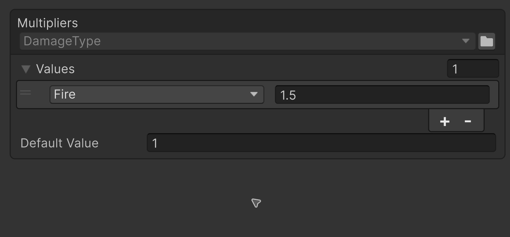
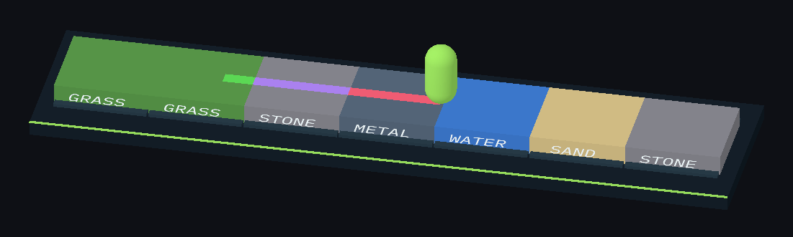

# EnumValues

A table of values per enum member, filled in the Inspector instead of code.

## Quick start

| Before — fields and switch | After — FastTools |
|---|---|
| <pre lang="csharp"><code>[SerializeField]&#10;private float _defaultMultiplier = 1f;&#10;[SerializeField]&#10;private float _fireMultiplier = 1.5f;&#10;&#10;public float GetMultiplier(&#10;    DamageType type) =&gt; type switch&#10;&#123;&#10;    DamageType.Fire =&gt; _fireMultiplier,&#10;    _ =&gt; _defaultMultiplier&#10;&#125;;</code></pre> | <pre lang="csharp"><code>[SerializeField]&#10;private EnumValues&lt;DamageType, float&gt;&#10;    _multipliers;&#10;&#10;public float GetMultiplier(&#10;    DamageType type) =&gt;&#10;    _multipliers.GetValue(type);</code></pre> |

For a key without a row of its own, <code lang="function">GetValue</code> returns **Default Value**.


## Filling in the Inspector

Only a key whose value differs from **Default Value** needs a row. **Populate Missing Enum Members** in the table header's context menu appends the missing enum members with **Default Value**; for <code lang="csharp">[Flags]</code>, the declared members including named combinations.



A row added to an empty table shows `<None>` and is skipped with a Console error until you pick a member.

## Choosing a variant

| Difference | <code lang="class-name">EnumValues&lt;TEnum, TValue&gt;</code> | <code lang="class-name">EnumValues&lt;TValue&gt;</code> |
|---|---|---|
| Where the enum is picked | The <code lang="class-name">TEnum</code> argument | The table header in the Inspector |
| Key in <code lang="function">GetValue</code> and <code lang="csharp">foreach</code> | <code lang="class-name">TEnum</code> | <code lang="class-name">System.Enum</code> |
| Boxing in <code lang="function">GetValue</code> | None | The key is boxed |
| A key of another enum | Does not compile | Returns **Default Value** |

Code only reads the table. <code lang="class-name">TValue</code> is any type Unity serializes.

### EnumValues\<TValue\>

The same field, with the enum picked in the table header:

```csharp
[SerializeField] private EnumValues<float> _multipliers;

public float GetMultiplier(DamageType type) => _multipliers.GetValue(type);
```


- The enum field is required: the Inspector flags an empty one, and the [required field check](04-serialize-reference-tooling.md#where-required-fields-are-checked) reports it.
- Until an enum is picked, the table returns **Default Value** and logs a warning to the Console on first access.

## Lookup rules

| Situation | Result |
|---|---|
| Several rows with the same key | The topmost one |
| <code lang="csharp">Ice</code> and an alias <code lang="csharp">Frost = Ice</code> | One key: the <code lang="csharp">Ice</code> row answers <code lang="csharp">Frost</code> too |

### Flags

```csharp
[Flags]
public enum StatusEffect
{
    None = 0,
    Burning = 1,
    Slowed = 2,
    Frozen = 4
}

[SerializeField] private EnumValues<StatusEffect, float> _speedMultipliers;
```

**Default Value** is <code lang="csharp">0</code> and the rows are in this order:

| Key | Value |
|---|---|
| <code lang="csharp">Burning</code> | <code lang="csharp">0.9</code> |
| <code lang="csharp">Slowed</code> | <code lang="csharp">0.5</code> |
| <code lang="csharp">Burning &#124; Slowed</code> | <code lang="csharp">0.3</code> |
| <code lang="csharp">None</code> | <code lang="csharp">1</code> |

| Request | Result |
|---|---|
| <code lang="csharp">Burning &#124; Slowed</code> | <code lang="csharp">0.3</code> — the exact row wins, even below <code lang="csharp">Burning</code> |
| <code lang="csharp">Burning &#124; Slowed &#124; Frozen</code> | <code lang="csharp">0.9</code> — no exact row; the first row whose flags are all in the request is <code lang="csharp">Burning</code> |
| <code lang="csharp">Frozen</code> | <code lang="csharp">0</code> — **Default Value**: <code lang="csharp">None</code> matches only <code lang="csharp">None</code> |

> [!NOTE]
> The topmost matching row wins, not the most complete one: to let a combination win, place it above single flags.

## Equals()

<code lang="csharp">Equals(request, key)</code> tells whether a row with that key would match the request, by the lookup rules and without reading values:

| Call | Result |
|---|---|
| <code lang="csharp">Equals(Burning &#124; Slowed, Burning)</code> | <code lang="csharp">true</code> |
| <code lang="csharp">Equals(Burning, Burning &#124; Slowed)</code> | <code lang="csharp">false</code> |
| <code lang="csharp">Equals(Burning &#124; Slowed, None)</code> | <code lang="csharp">false</code> |
| <code lang="csharp">Equals(None, None)</code> | <code lang="csharp">true</code> |

In <code lang="class-name">EnumValues&lt;TValue&gt;</code>, a key of another enum gives <code lang="csharp">false</code>.

## Enumerating rows

```csharp
foreach (var (type, multiplier) in _multipliers)
{
    Debug.Log($"{type}: {multiplier}");
}
```

**Default Value** is not yielded, and <code lang="csharp">foreach</code> does not allocate.

## When the enum changes

Keys are stored by member name:

| Change | Result |
|---|---|
| Members reordered or their numeric values changed | The table works as before |
| A member renamed or deleted | Its row shows `<Missing Ice>` and is skipped with a Console error; restore the name and the row works again |
| The enum renamed or moved to another namespace or assembly | <code lang="class-name">EnumValues&lt;TEnum, TValue&gt;</code> works as before; <code lang="class-name">EnumValues&lt;TValue&gt;</code> returns **Default Value** and logs an error until the enum is picked again |
| Another enum picked in <code lang="class-name">EnumValues&lt;TValue&gt;</code> | The keys are kept: pick the previous enum back and the rows work again |

## Package sample

Tiles and footprints take their colour from <code lang="class-name">EnumValues&lt;SurfaceType, Color&gt;</code>, and the speed multiplier from an <code lang="class-name">EnumValues&lt;float&gt;</code> with a <code lang="csharp">[Flags]</code> enum picked in the Inspector: [EnumValues](../Samples~/EnumValues/Documentation/README.md).


