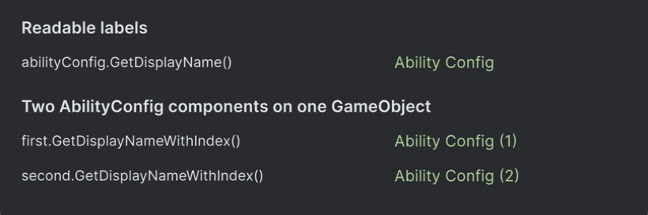

# Editor Helpers

`GetDisplayName()` turns an object’s type name into a readable label: `FireAbility` → “Fire Ability”. `GetDisplayNameWithIndex()` adds a number when a GameObject holds several components of that type: “Fire Ability (2)”.



Method results in a custom Unity window. These methods do not change the standard Inspector headers.

## Quick start

Two components carry the examples: one names itself through `[AddComponentMenu]`, the other does not.

```csharp
using UnityEngine;

[AddComponentMenu("Gameplay/Fire Ability")]
public sealed class FireAbility : MonoBehaviour { }

public sealed class AbilityConfig : MonoBehaviour { }
```

```csharp
using Aspid.FastTools.Editors;

fireAbility.GetDisplayName();       // "Fire Ability"
abilityConfig.GetDisplayName();     // "Ability Config"

// The second AbilityConfig on the same GameObject
abilityConfig.GetDisplayNameWithIndex(); // "Ability Config (2)"
```

> [!NOTE]
> These methods are editor-only. Place calling code in an `Editor` folder or an assembly restricted to the Editor platform.

## GetDisplayName()

`GetDisplayName()` extends `UnityEngine.Object`. When the type has an `[AddComponentMenu]` attribute, it uses `ObjectNames.GetInspectorTitle`. Otherwise, it formats the type name with `ObjectNames.NicifyVariableName`. A null or destroyed object returns `string.Empty`.

| Component | `GetDisplayName()` | `ObjectNames.GetInspectorTitle()` |
|---|---|---|
| `FireAbility`, with the attribute | `Fire Ability` | `Fire Ability` |
| `AbilityConfig`, without it | `Ability Config` | `Ability Config (Script)` |

## GetDisplayNameWithIndex()

`GetDisplayNameWithIndex()` extends `Component` and counts components of the **exact same type** on the same GameObject. The suffix follows component order, starting at one. A null or destroyed component returns `string.Empty`.

| Components on the GameObject | Labels |
|---|---|
| `AbilityConfig` | `Ability Config` |
| `AbilityConfig`, `AbilityConfig` | `Ability Config (1)`, `Ability Config (2)` |

## Package sample

In [EditorTools](../Samples~/EditorTools/Documentation/README.md), `GetDisplayName()` supplies the selected ability's pane title.
