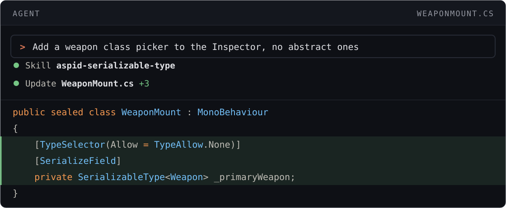
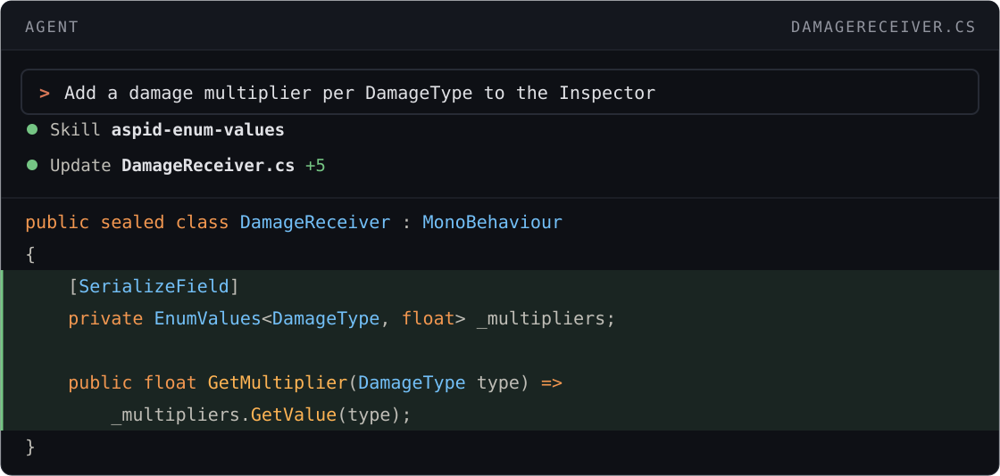

# Agent Skills

Skills that make a coding agent write code with Aspid.FastTools instead of the raw Unity API.

## Quick start

[Install Aspid.FastTools](README.md#installation) in your Unity project, then ask your agent:

```text prompt
Install the skills from VPDPersonal/Aspid.FastTools in the current project.
```

Or run in the project root:

```bash
npx skills add VPDPersonal/Aspid.FastTools
```

To update the skills, repeat the installation.

```text prompt
Profile Simulate and the neighbor search
```

| Without skills | With skills |
|---|---|
| <pre lang="csharp"><code>private static readonly&#10;    ProfilerMarker _simulate =&#10;    new("Flock.Simulate");&#10;private static readonly&#10;    ProfilerMarker _neighbors =&#10;    new("Flock.FindNeighbors");&#10;&#10;public void Simulate()&#10;&#123;&#10;    using var _ = _simulate.Auto();&#10;    using (_neighbors.Auto())&#10;        FindNeighbors();&#10;    Integrate();&#10;&#125;</code></pre> | <pre lang="csharp"><code>public void Simulate()&#10;&#123;&#10;    using var _ = this.Marker();&#10;    using (this.Marker()&#10;        .WithName("Neighbors"))&#10;        FindNeighbors();&#10;    Integrate();&#10;&#125;</code></pre> |

## Skills

Skills activate automatically for matching requests.

### aspid-profiler-marker

Profile a method or a section with <code lang="csharp">this.Marker()</code>. Guide: [ProfilerMarkers](05-profiler-markers.md).


### aspid-visual-element-fluent

Build and style UI Toolkit elements in C#. Guide: [VisualElement Extensions](07-visual-element-extensions.md).


### aspid-serializable-type

Store a <code lang="class-name">System.Type</code> and pick types in the Inspector. Guides: [Serializable Type System](02-serializable-types.md), [SerializeReference Selector](03-serialize-reference-selector.md), [ComponentTypeSelector](11-component-type-selector.md).



### aspid-enum-values

Map enum members to values. Guide: [EnumValues](06-enum-values.md).


