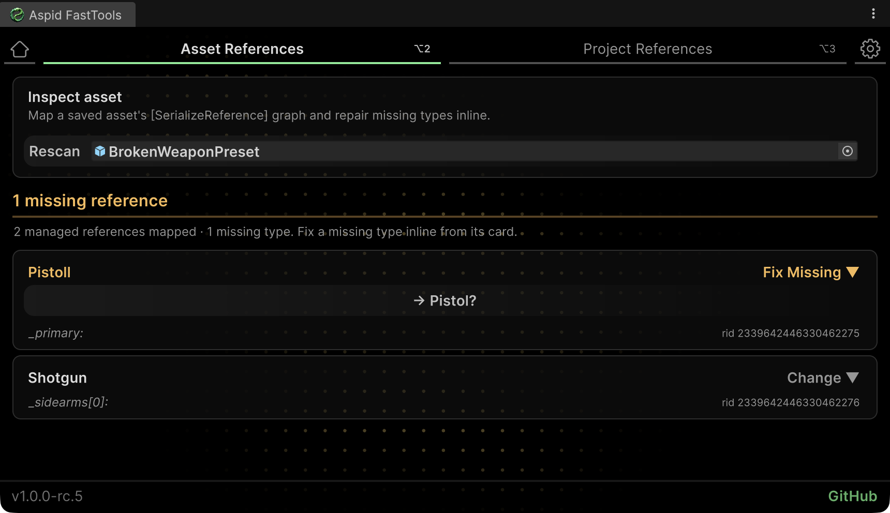
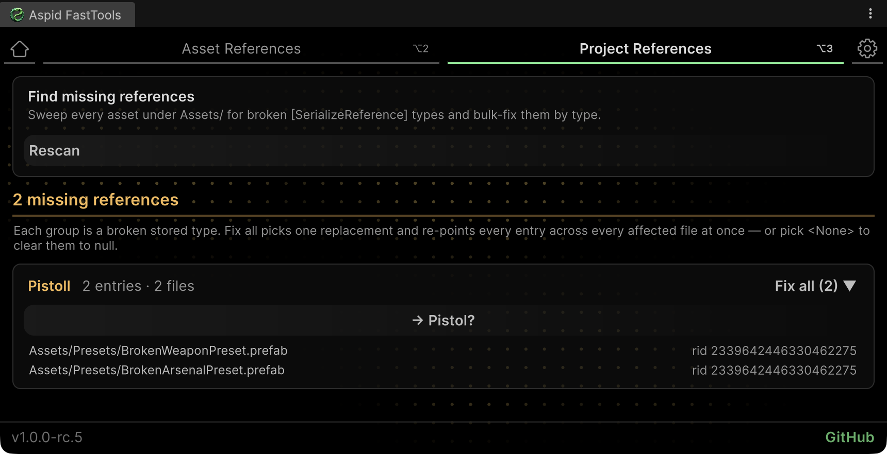

# SerializeReference Tooling

The [Inspector-side selector](SerializeReferences.md) repairs references one field at a
time; this document covers the project-wide side: the FastTools window tabs that audit
and mass-repair managed references, the Project Settings page with the player-build gate,
and the same check running headless in CI. The gate also covers unset
`[TypeSelector(Required = true)]` fields — see the `Required` property on
[TypeSelectorAttribute](Types.md#typeselectorattribute).

**Reference sections:**

* [`Bulk repair tabs`](#bulk-repair-tabs) — the **Asset References** and
  **Project References** tabs for auditing and mass repair across the project;
* [`Project settings & the build/CI gate`](#project-settings--the-buildci-gate) —
  the Project Settings page, setting scopes and the player-build gate;
* [`Headless CI`](#headless-ci) — `SerializeReferenceCiGate.RunCheck` for batchmode pipelines.

**A shorter version with the same examples lives in the** [README](README.md#serializereference-selector).

## Bulk repair tabs

There is no need to [fix references one by one](SerializeReferences.md#repairing-broken-references):
auditing and mass repair live in two dedicated tabs of the FastTools window.

| Tab | Purpose |
|---|---|
| **Asset References** (`Tools → Aspid 🐍 → FastTools → Asset References`) | Maps an asset's whole managed-reference graph from its YAML — a per-component tree with field paths, shared and orphaned references, `MISSING` / `SHARED` badges, and an inline type dropdown on every card. Surfaces the missing references the Inspector cannot show. |
| **Project References** (`Tools → Aspid 🐍 → FastTools → Project References`) | `Scan Project` sweeps every `.prefab` / `.asset` / `.unity` under `Assets/`, groups broken references by stored type, and rewrites a whole group with a single `Fix all` (plus Smart Fix). A group whose stored type matches a declared `[MovedFrom]` rename reads as a pending migration instead of a breakage — one **Migrate all** click bakes the rename into the files, after which the attribute can be removed from code. |

The **Asset References** tab lays out one asset's managed-reference graph as cards with
`MISSING` / `SHARED` badges and inline repair:



The **Project References** tab groups the whole project's findings by stored type — one
group is repaired at once with a single `Fix all`:



## Project settings & the build/CI gate

**`Project Settings → Aspid FastTools → SerializeReference`** exposes:

| Setting | Scope | What it does |
|---|---|---|
| **Breakage detection** | per-user | The proactive toast + console warning when references newly become missing after a recompile / import. |
| **Auto de-alias duplicated list elements** | committed | A duplicated list element gets its own instance instead of sharing the original's reference id. |
| **Build / CI gate** | committed | `Off` / `Warn` / `Fail`: at player-build time, log or abort on missing (and, for CI, unset-required) managed references. |
| **Excluded scan folders** | committed | Paths skipped by every project scan. |

- Committed values live in `ProjectSettings/SerializeReferenceSharedSettings.asset` — commit it so teammates and CI behave identically; breakage detection stays per-machine (`EditorPrefs`).
- Rid colours are not a setting — a shared reference is always colour-coded by id, so matching colours reveal shared instances at a glance.

The same options are mirrored in the window's **Settings** tab (`Tools → Aspid 🐍 → FastTools → Settings`) and at **`Preferences → Aspid FastTools`**, alongside the picker's per-user preferences:

- **Favorites** — section on/off toggle.
- **Recent items** — capacity slider (0–20; 0 hides the section and pauses recording without wiping history).
- **Saved lists** — clears the stored Favorites / Recent.
- **Welcome** — auto-show toggle.

Every row carries a scope stripe (green — committed, blue — per-user); a pinned footer offers **Reset to defaults** per scope (saved Favorites / Recent lists survive a reset). All surfaces stay in live sync.

## Headless CI

For headless CI, the same check runs via `SerializeReferenceCiGate.RunCheck`: it scans
the project, writes a report, logs every violation, and honours the committed gate
severity — `Off` skips the check, `Warn` logs but exits 0, `Fail` exits 1 when
violations exist (exit code 2 marks an internal failure of the check itself).

```bash
Unity -batchmode -quit -projectPath . \
  -executeMethod Aspid.FastTools.SerializeReferences.Editors.SerializeReferenceCiGate.RunCheck \
  -srGateReport SerializeReferenceGateReport.txt -srGateRequired
```

| Flag | Description |
|---|---|
| `-srGateReport <path>` | Report file path; defaults to `SerializeReferenceGateReport.txt` in the project root. Each violation is a machine-readable line with the violation kind, asset path and field path. |
| `-srGateRequired` | Also flags unset `[TypeSelector(Required = true)]` fields across prefabs, ScriptableObjects and scenes (top-level fields, pure-YAML pass). |
| `-srGateWarnOnly` | Overrides the committed severity to `Warn` for this run: violations are logged but the exit code is 0. Wins over `-srGateFail` if both are passed. |
| `-srGateFail` | Overrides the committed severity to `Fail` for this run: exit code 1 when violations exist. |
