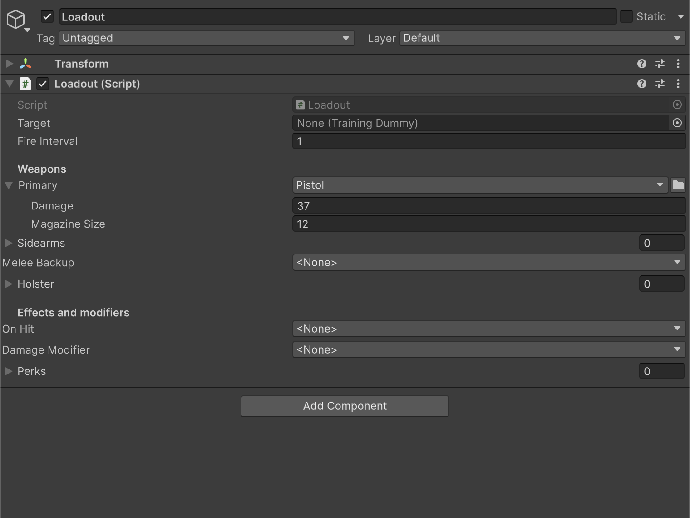
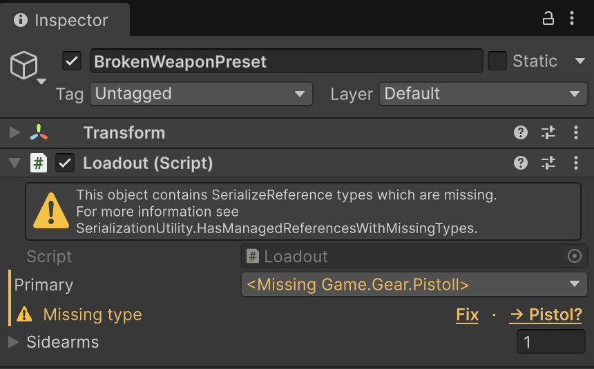
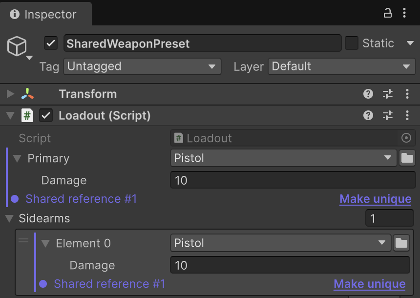

# SerializeReference Selector

The stock Inspector cannot populate `[SerializeReference]` fields: a managed reference
cannot be created from the UI, and when a type is renamed or deleted Unity silently clears
the data. SerializeReference Selector closes both gaps: a dropdown implementation picker
right in the Inspector, plus per-field repair actions for broken references. Project-wide
auditing, mass repair and the build/CI gate live in
[SerializeReference Tooling](SerializeReferenceTooling.md).

**Reference sections:**

* [`Inspector type dropdown`](#inspector-type-dropdown) — the `[TypeSelector]` dropdown
  on `[SerializeReference]` fields: implementation picking, nested inspector, generics,
  copy/paste;
* [`Repairing broken references`](#repairing-broken-references) — a yellow notice instead
  of a silent clear, **Fix** / **Smart Fix** / **Make unique**.

**A shorter version with the same examples lives in the** [README](README.md#serializereference-selector).

## Inspector type dropdown

Add `[TypeSelector]` next to `[SerializeReference]` — the Inspector replaces the stock
managed-reference UI with the hierarchical [type-selection window](Types.md#typeselectorwindow)
with search. You pick which concrete implementation of the field's type gets created right
in the Inspector; `<None>` clears the reference.

```csharp
using System;
using UnityEngine;
using System.Collections.Generic;
using Aspid.FastTools.Types;

public interface IWeapon
{
    void Fire();
}

[Serializable]
public sealed class Pistol : IWeapon
{
    [SerializeField] [Min(0)] private int _damage = 10;

    public void Fire() => Debug.Log($"Pistol: {_damage} dmg");
}

public sealed class Loadout : MonoBehaviour
{
    [TypeSelector]
    [SerializeReference] private IWeapon _primary;

    [TypeSelector]
    [SerializeReference] private List<IWeapon> _sidearms;
}
```

The attribute is editor-only (`[Conditional("UNITY_EDITOR")]`) and carries no runtime
cost. It works with single fields, arrays and `List<T>`, in both IMGUI and UIToolkit
inspectors. The same attribute also works on `string` and `SerializableType` fields —
see [TypeSelectorAttribute](Types.md#typeselectorattribute).



| Feature | What it does |
|---|---|
| **Implementation picking** | The list shows concrete non-`UnityEngine.Object` classes compatible with the field type. `[TypeSelector(typeof(IMelee))]` narrows it to `IMelee` implementations, and `[TypeSelectorDisplay(Hidden = true)]` keeps an individual type out of the picker. |
| **Open generics** | `Modifier<T>` and friends: arguments are inferred from the field — including through the interfaces it implements, so an `IConverter<string, string>` field closes a `Sequence<T> : IConverter<T, T>` candidate directly — or picked on the selector's second page when the field leaves a parameter undetermined. |
| **Nested references** | A `[SerializeReference]` field (or array/list) *inside* the assigned instance gets the same dropdown, so a graph can be authored all the way down without annotating every level — 8 levels deep, past which Unity's own drawing resumes. A child Unity already has a drawer for (its own `[TypeSelector]`, or a `[CustomPropertyDrawer]` registered for its type) keeps that drawer. |
| **Data preservation** | On a type switch, fields matching by name and serialized shape carry over instead of resetting to defaults. |
| **Copy / Paste** | Right-clicking the header copies the value and pastes it as an independent instance into any compatible field. |
| **Multi-selection** | A mixed selection shows a mixed dropdown state; a pick or paste applies to every object in a single Undo group. |
| **Compiler validation** | Roslyn analyzer: `AFT0004` (error) — the type inherits `UnityEngine.Object`; `AFT0005` (warning) — the selector would be empty. |

An empty field with `[TypeSelector(Required = true)]` shows a "required" notice in the
Inspector and counts as a violation for the
[build/CI gate](SerializeReferenceTooling.md#project-settings--the-buildci-gate) —
see the `Required` property on [TypeSelectorAttribute](Types.md#typeselectorattribute).

## Repairing broken references

When an asset's stored type stops resolving, or two fields silently share one instance,
the selector does not stay quiet — every problem gets an Inspector notice with a repair
button next to it:

| Case | Fix |
|---|---|
| **Missing type** (renamed or deleted) | A yellow notice instead of a silent clear. The underlined **Fix** opens the picker and re-points the type while keeping its data — at any depth, in saved assets and live in Prefab Mode. |
| **Smart Fix** | Next to **Fix**, suggests the most likely replacement (`[MovedFrom]`, a different namespace/assembly, casing, a near-miss name) and applies it in one click — never automatically. |
| **Shared reference** (two fields share one instance) | Flagged with a notice; **Make unique** splits it into an independent copy. Duplicating a list element (Ctrl+D, `+`) no longer aliases the reference. |





For auditing and mass repair across the whole project, see
[Bulk repair tabs](SerializeReferenceTooling.md#bulk-repair-tabs).

