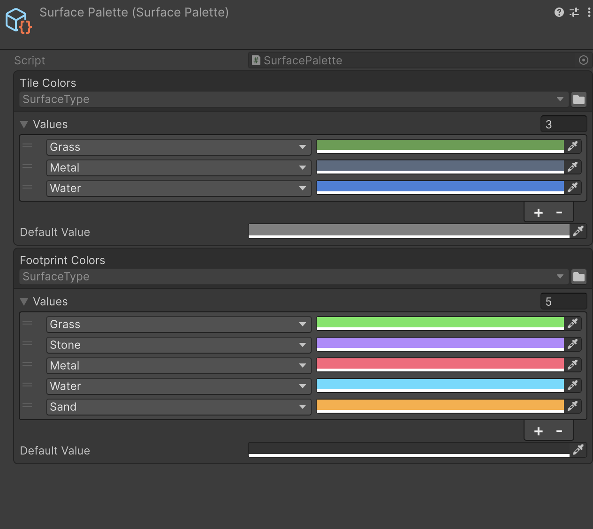

[](https://assetstore.unity.com/packages/slug/365584)
[](https://github.com/VPDPersonal/Aspid.FastTools/releases)
[](https://github.com/VPDPersonal/Aspid.FastTools/blob/main/LICENSE)

Aspid.FastTools is a Unity package that fills the gaps Unity leaves in serialization and editor tooling. Serialized types and polymorphic references stay valid through renames, or get repaired without data loss when they break. The Inspector shows what a `SerializeReference` field holds and lets you swap it. Editor and profiling helpers take a line where Unity needs a class.

[Documentation](https://vpdpersonal.github.io/Aspid.FastTools/docs) · [Source code](https://github.com/VPDPersonal/Aspid.FastTools) · [Releases](https://github.com/VPDPersonal/Aspid.FastTools/releases)

## Features

### [Serializable Type System](02-serializable-types.md)

Store and pick a `System.Type` in the Inspector.


### [SerializeReference Selector](03-serialize-reference-selector.md)

Pick which class a `SerializeReference` field holds, straight from the Inspector.


### [SerializeReference Tooling](04-serialize-reference-tooling.md)

Audit and repair references across the whole project, before builds and in CI.


### [EnumValues](06-enum-values.md)

Edit enum → value tables in the Inspector, including flags.



### [ProfilerMarkers](05-profiler-markers.md)

Generate a unique profiler marker per call site with `this.Marker()`.

```csharp
using (this.Marker())
{
    Simulate();
}
```

### [VisualElement Extensions](07-visual-element-extensions.md)

Build UI Toolkit trees with fluent chains.

```csharp
new VisualElement()
  .SetPadding(8)
  .AddChild(
    new Label("Stats"));
```

### [SerializedProperty Extensions](08-serialized-property-extensions.md)

Set values, resize arrays, and inspect the field type and owning object.

```csharp
property
  .Update()
  .SetIntAndApply(42);
```

### [Editor Helpers](09-editor-helpers.md)

Get readable object and component display names for custom editors.

```csharp
audio.GetDisplayName();
// "Audio Source"

secondAudio
  .GetDisplayNameWithIndex();
// "Audio Source (2)"
```

## Installation

In **Window → Package Manager**, choose **+ → Install package from git URL…** and paste:

```text
https://github.com/VPDPersonal/Aspid.FastTools.git#upm-preview/1.0.0-rc.8
```

This installs the preview version covered by this documentation. Git must be installed for UPM Git URLs.

<details>
<summary>Other installation options</summary>

- **Latest preview:** updating the package can bring in a newer preview.

  ```text
  https://github.com/VPDPersonal/Aspid.FastTools.git#upm-preview
  ```

- **Another version:** copy its UPM tag from [Releases](https://github.com/VPDPersonal/Aspid.FastTools/releases), for example:

  ```text
  https://github.com/VPDPersonal/Aspid.FastTools.git#upm-preview/1.0.0-rc.7
  ```

- **Unity Asset Store:** the package is not yet available in the store. For now, install it using the Git URL above.

> [!WARNING]
> The `upm` branch currently contains the older `com.aspid.fasttools` package (`1.0.0-rc.2`). Use the URL above for `tech.aspid.fasttools` and the features described here.

</details>

## Quick start

1. After installation the **Welcome** window opens on its own. Reopen it any time from **Tools → Aspid 🐍 → FastTools → Welcome**.
2. Press **Import** on a sample; it lands in `Assets/Samples`.
3. Open its scene and read the sample's README.

## Documentation and samples

- [Samples overview](../Samples~/README.md) — scenes and editor tools for serialization, enum tables, profiling and editor UI.
- [API reference](https://vpdpersonal.github.io/Aspid.FastTools/api/Aspid.FastTools) — public types and members. The feature links above explain how to use them.
- [Claude Code plugin](10-claude-code-plugin.md) — optional skills for working with this package in Claude Code.
- [Changelog](https://github.com/VPDPersonal/Aspid.FastTools/blob/main/CHANGELOG.md) — release history.

## Help and support

Report bugs or ask questions in [GitHub Issues](https://github.com/VPDPersonal/Aspid.FastTools/issues). Include your Unity version, package version and steps to reproduce a problem.

Once the package is available on the [Unity Asset Store](https://assetstore.unity.com/packages/slug/365584), you can support development by purchasing it.

Distributed under the [MIT License](https://github.com/VPDPersonal/Aspid.FastTools/blob/main/LICENSE).
