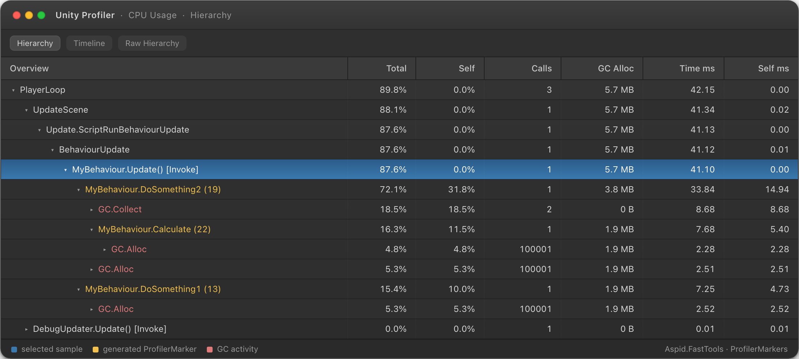

# ProfilerMarkers

Регистрация `ProfilerMarker` через source generation. Генератор создаёт статический маркер для каждого места вызова, идентифицируемый по вызывающему методу и номеру строки.

```csharp
using UnityEngine;

public class MyBehaviour : MonoBehaviour
{
    private void DoSomething1()
    {
        using var _ = this.Marker();
        // Некоторый код
    }

    private void DoSomething2()
    {
        using (this.Marker())
        {
            // Некоторый код
            using var _ = this.Marker().WithName("Calculate");
            // Некоторый код
        }
    }
}
```

## Сгенерированный код

```csharp
using Unity.Profiling;
using System.Runtime.CompilerServices;

internal static class __MyBehaviourProfilerMarkerExtensions
{
    private static readonly ProfilerMarker DoSomething1_Marker_Line_7 = new("MyBehaviour.DoSomething1 (7)");
    private static readonly ProfilerMarker DoSomething2_Marker_Line_13 = new("MyBehaviour.DoSomething2 (13)");
    private static readonly ProfilerMarker DoSomething2_Marker_Line_16 = new("MyBehaviour.Calculate (16)");

    public static ProfilerMarker.AutoScope Marker(this MyBehaviour _, [CallerLineNumberAttribute] int line = -1)
    {
#if ENABLE_PROFILER
        if (line is 7) return DoSomething1_Marker_Line_7.Auto();
        if (line is 13) return DoSomething2_Marker_Line_13.Auto();
        if (line is 16) return DoSomething2_Marker_Line_16.Auto();
#endif
        return default;
    }
}
```

Тело диспетчера обёрнуто в `#if ENABLE_PROFILER`: в сборке без профайлера каждый вызов возвращает `default` и ничего не стоит.

- **Имя маркера** — `"{TypeName}.{method} ({line})"`; `.WithName("…")` заменяет часть с именем члена. Для generic-типов имя строится через `typeof(T).Name`, так что у каждого закрытого типа свой маркер.
- **Вызовы внутри лямбд и локальных функций** относятся к ближайшему объявленному методу, полю или свойству.

## Результат


