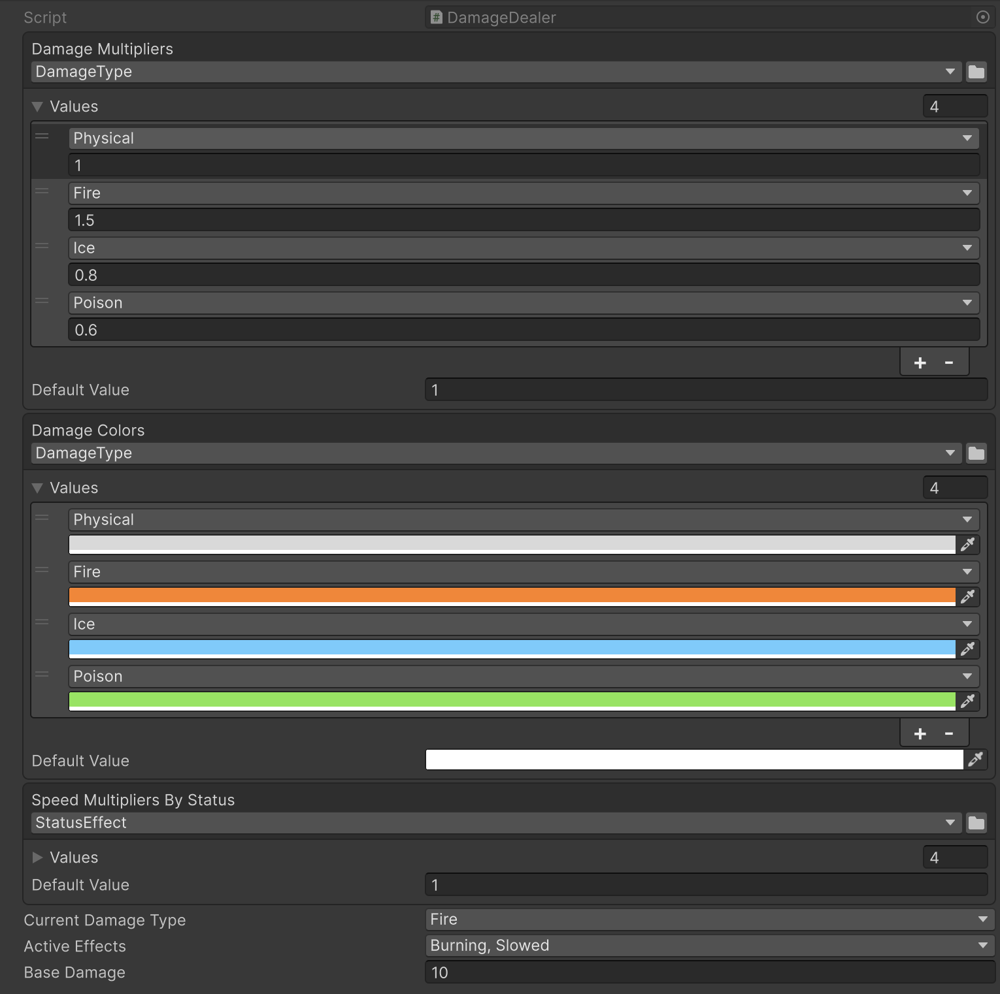

# EnumValues

Сериализуемые отображения enum → значение, настраиваемые через Inspector.

## EnumValues\<TValue\>

Сериализуемая коллекция записей `EnumValue<TValue>` с настраиваемым значением по умолчанию. Реализует `IEnumerable<KeyValuePair<Enum, TValue>>`.

`GetValue` возвращает сопоставленное значение, а при отсутствии ключа — настроенное значение по умолчанию. `[Flags]`-перечисления поддерживаются: сопоставление использует `HasFlag` и корректно обрабатывает члены со значением `0`.

```csharp
using System;
using UnityEngine;
using Aspid.FastTools.Enums;

public enum DamageType { Physical, Fire, Ice, Poison }

[Flags]
public enum StatusEffect { None = 0, Burning = 1, Frozen = 2, Slowed = 4, Stunned = 8 }

public sealed class DamageDealer : MonoBehaviour
{
    [SerializeField] private EnumValues<float> _damageMultipliers;

    // Комбинации флагов (например Burning | Slowed) сопоставляются через HasFlag, побеждает первое
    // совпадение — поэтому составные записи ставьте ПЕРЕД их отдельными флагами.
    [SerializeField] private EnumValues<float> _speedMultipliersByStatus;

    public float GetMultiplier(DamageType type) => _damageMultipliers.GetValue(type);

    public float GetSpeedModifier(StatusEffect effects) => _speedMultipliersByStatus.GetValue(effects);
}
```



В Inspector выберите тип перечисления в заголовке `EnumValues`, затем назначьте значение для каждого члена перечисления. Нажмите правой кнопкой мыши по свойству, чтобы открыть контекстное меню с пунктом **Populate Missing Enum Members** — он добавит записи для всех отсутствующих членов перечисления, используя текущее Default Value как начальное значение.

## EnumValues\<TEnum, TValue\>

Типизированный вариант `EnumValues<TValue>` для частого случая, когда тип перечисления уже известен в коде. Тип фиксируется generic-аргументом, поэтому выбор типа в Inspector заблокирован, а обращения проверяются на этапе компиляции. Поиск не использует boxing — ключи сравниваются как закэшированные числовые значения, — а `foreach` по обоим вариантам использует struct-энумератор и не аллоцирует. Реализует `IEnumerable<KeyValuePair<TEnum, TValue>>`.

```csharp
public sealed class HitEffect : MonoBehaviour
{
    // Выбор типа в Inspector заблокирован — перечисление зафиксировано как DamageType.
    [SerializeField] private EnumValues<DamageType, Color> _damageColors;

    public Color GetColor(DamageType type) => _damageColors.GetValue(type);
}
```

Семантика поиска (включая обработку `[Flags]`) идентична `EnumValues<TValue>`.
