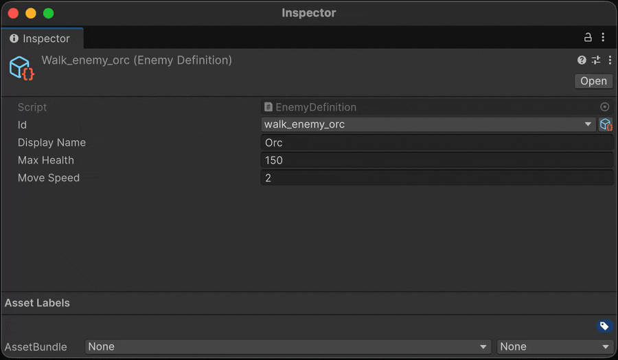

# ID System

> [!WARNING]
> **Бета:** Система ID находится в бета-версии. Публичный API, структура генерируемого кода и редакторский UX могут измениться в будущих релизах.

Сопоставляет назначаемые в ассетах имена стабильным целочисленным ID, хранящимся в ScriptableObject `IdRegistry`, с полными `int ↔ string` поисками в рантайме. Получившийся `int` подходит для `switch` и ключей `Dictionary` без затрат на сравнение строк.

## Настройка

**1.** Объявите `partial struct`, реализующий `IId`. Генератор исходников автоматически добавит необходимые поля и свойство:

```csharp
using Aspid.FastTools.Ids;

public partial struct EnemyId : IId { }
```

Сгенерированный код:

```csharp
public partial struct EnemyId
{
    [SerializeField] private string __stringId; // editor-only поле, вырезается из player-сборок
    [SerializeField] private int _id;

    public int Id => _id;
}
```

**2.** Создайте ассет реестра и привяжите его к вашему типу структуры в Inspector:
- `Assets → Create → Aspid → Id Registry`

**3.** Используйте структуру как сериализуемое поле. В Inspector отображается выпадающий список зарегистрированных имён; окно селектора также позволяет создавать новые записи на лету:

```csharp
using UnityEngine;
using Aspid.FastTools.Ids;

[CreateAssetMenu]
public class EnemyDefinition : ScriptableObject
{
    [UniqueId] [SerializeField] private EnemyId _id;
}

public class EnemySpawner : MonoBehaviour
{
    [SerializeField] private EnemyId _targetEnemy;

    private void Spawn()
    {
        int id = _targetEnemy.Id; // стабильный integer, безопасен для switch / Dictionary
    }
}
```


## Диагностики генератора

Генератор сообщает `AFID001`, если у структуры отсутствует `partial`, и `AFID002`, если вы сами объявили `_id`, `Id` или `__stringId` (генерация пропускается — вы получаете явную ошибку с указанием на структуру вместо CS-ошибки внутри сгенерированного кода). Поддерживаются generic-структуры (`EnemyId<T>`) и generic-контейнеры.

## UniqueIdAttribute

Помечает поле как требующее уникального значения среди всех ассетов объявляющего типа. Inspector показывает предупреждение, если два ассета используют одинаковый ID.

```csharp
[Conditional("UNITY_EDITOR")]
public sealed class UniqueIdAttribute : PropertyAttribute { }
```



## IdRegistry

`ScriptableObject` из `Aspid.FastTools.Ids`, хранящий записи `(int, string)` и поддерживающий таблицы поиска доступными во рантайме. Каждому имени назначается стабильный, автоинкрементный ID, который не изменяется даже при добавлении или удалении других записей.


| Член | Описание |
|------|----------|
| `bool TryGetId(string name, out int id)` | Возвращает `true` и найденный ID; иначе `false` |
| `bool TryGetName(int id, out string name)` | Возвращает `true` и найденное имя; иначе `false` и `string.Empty` |
| `bool Contains(int id)` | Зарегистрирован ли ID |
| `bool Contains(string name)` | Зарегистрировано ли имя |
| `int Count` | Количество записей |
| `IReadOnlyList<int> Ids` · `IReadOnlyList<string> IdNames` | Зарегистрированные ID / имена в порядке регистрации |
| `IEnumerator<KeyValuePair<int, string>> GetEnumerator()` | Итерация по парам `(id, name)` |

Реестр наследуется напрямую от `ScriptableObject` и предоставляет генерик-аналог `IdRegistry<T>` (с `T : struct, IId`), добавляющий типизированные перегрузки `Contains(T)` и `TryGetName(T, out string)`. Редактирование — добавление, переименование, удаление записей — выполняется через инспектор реестра, а не через публичный runtime API.
