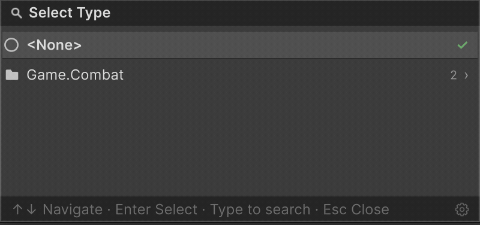

[English](../EN/README.md) | [Русский](README.md)

**Aspid.FastTools** — набор инструментов для Unity, избавляющий от рутинного бойлерплейта. Внутри — удобная работа с `SerializeReference` (выбор типа в инспекторе и окно аудита ссылок по всему проекту), Roslyn-генераторы и анализаторы, а также runtime- и editor-утилиты: от сериализуемого `System.Type` до fluent-расширений UI Toolkit.

[Исходный код](https://github.com/VPDPersonal/Aspid.FastTools) · [Unity Asset Store](https://assetstore.unity.com/packages/slug/365584) · [Releases](https://github.com/VPDPersonal/Aspid.FastTools/releases)

## Содержание

- **Начало работы**
  - [Установка](#установка) — UPM git URL, `.unitypackage`, Asset Store
- **Возможности**
  - [Serializable Type System](#serializable-type-system) — `System.Type` как сериализуемое поле и окно выбора типа с поиском
  - [SerializeReference Selector](#serializereference-selector) — выпадающий выбор типа для полей `[SerializeReference]`, а также инструменты поиска и починки битых ссылок
  - [ProfilerMarker](#profilermarker) — source-generated маркеры профайлера, уникальные для каждого места вызова
  - [Enum System](#enum-system) — сериализуемые отображения enum → значение с поддержкой `[Flags]`
  - [ID System (Beta)](#id-system-beta) — назначаемые в ассетах имена со стабильными целочисленными ID
  - [VisualElement Extensions](#visualelement-extensions) — fluent-построение UI Toolkit-деревьев в коде
  - [SerializedProperty Extensions](#serializedproperty-extensions) — типизированные сеттеры с fluent-цепочками и рефлексионные хелперы
  - [IMGUI Layout Scopes](#imgui-layout-scopes) — disposable-обёртки `Begin*`/`End*` с доступом к `Rect`
  - [Editor Helper Extensions](#editor-helper-extensions) — получение отображаемых имён скриптов для кастомных редакторов
- **Дополнительно**
  - [Claude Code Plugin](#claude-code-plugin) — скиллы, обучающие Claude Code этому пакету
  - [Поддержать проект](#поддержать-проект)
  - [Лицензия](#лицензия)

---

## Установка

Установите Aspid.FastTools через UPM: в Package Manager нажмите **+ → Install package from git URL…** и вставьте один из URL ниже.

### Stable

Ветка `upm` всегда указывает на последний **стабильный** релиз:

```
https://github.com/VPDPersonal/Aspid.FastTools.git#upm
```

Чтобы установить конкретную версию, укажите неизменяемый per-release тег (список доступных версий — на странице [Releases](https://github.com/VPDPersonal/Aspid.FastTools/releases)):

```
https://github.com/VPDPersonal/Aspid.FastTools.git#upm/1.0.0
```

Предпочитаете установку вручную? Скачайте `.unitypackage` со страницы [Releases](https://github.com/VPDPersonal/Aspid.FastTools/releases) или возьмите пакет в [Unity Asset Store](https://assetstore.unity.com/packages/slug/365584).

<details>
<summary><strong>Preview</strong></summary>

<br>

Ветка `upm-preview` всегда указывает на последний **preview** релиз (rc, beta, alpha, …):

```
https://github.com/VPDPersonal/Aspid.FastTools.git#upm-preview
```

Конкретные preview-версии используют ту же схему per-release тегов:

```
https://github.com/VPDPersonal/Aspid.FastTools.git#upm-preview/1.0.0-rc.5
```

</details>

---

## Serializable Type System

Позволяет сериализовать ссылку на `System.Type` в Unity Inspector. Выбранный тип хранится как assembly-qualified name и разрешается лениво при первом обращении.

### SerializableType

Доступны два варианта:

- **`SerializableType`** — хранит любой тип
- **`SerializableType<T>`** — хранит тип, ограниченный `T` или его подклассами

Оба поддерживают неявное преобразование в `System.Type`.

```csharp
using UnityEngine;
using Aspid.FastTools.Types;

public abstract class Ability : MonoBehaviour
{
    public abstract void Activate();
}

public sealed class AbilitySelector : MonoBehaviour
{
    [SerializeField] private SerializableType<Ability> _abilityType;

    private void Start()
    {
        var ability = (Ability)gameObject.AddComponent(_abilityType.Type);
        ability.Activate();
    }
}
```


### TypeSelectorAttribute

Добавляет к полю в Инспекторе кнопку выбора типа: она открывает иерархическое окно с поиском, в котором перечислены только типы, совместимые с указанными базовыми (при нескольких — со всеми сразу; без аргументов подходит любой тип). Что происходит при выборе, зависит от формы поля:

- `string` — в поле записывается assembly-qualified имя выбранного типа;
- `SerializableType` / `SerializableType<T>` — сужает встроенный селектор; базовые типы атрибута пересекаются с generic-аргументом `T`;
- managed-ссылка `[SerializeReference]` — выбранный тип сразу инстанцируется в поле (см. [SerializeReference Selector](#serializereference-selector)).

Атрибут editor-only (`[Conditional("UNITY_EDITOR")]`) и не несёт стоимости в рантайме.

```csharp
using UnityEngine;
using Aspid.FastTools.Types;

public interface IStackable { }

public abstract class AbilityModifier
{
    public abstract void Apply();
}

public sealed class AbilitySelector : MonoBehaviour
{
    // string — сохраняется assembly-qualified имя выбранного типа.
    // Каждый элемент массива — отдельный picker, ограниченный AbilityModifier.
    [TypeSelector(typeof(AbilityModifier))]
    [SerializeField] private string[] _modifierTypes;

    // SerializableType — сужает picker, который у поля уже есть.
    [TypeSelector(typeof(AbilityModifier))]
    [SerializeField] private SerializableType _modifierType;

    // SerializableType<T> — T сам сужает picker; базовые типы атрибута
    // пересекаются с ним: подойдут только реализации AbilityModifier,
    // которые заодно являются IStackable.
    [TypeSelector(typeof(IStackable))]
    [SerializeField] private SerializableType<AbilityModifier> _stackableModifierType;

    // Для [SerializeReference]-поля выбор типа сразу создаёт его экземпляр
    // и записывает в поле. Атрибут без аргументов предлагает наследников
    // типа поля (здесь — AbilityModifier). Required = true помечает
    // незаполненное поле: предупреждение в инспекторе + нарушение CI-гейта.
    [TypeSelector(Required = true)]
    [SerializeReference] private AbilityModifier _modifier;
}
```

Помимо базовых типов, у атрибута есть `Allow` (показывать ли абстрактные классы и интерфейсы) и `Required` (незаполненное поле — inline-предупреждение и нарушение для build/CI-гейта). Отдельно в справочнике: [динамический базовый тип из поля или свойства](Types.md#dynamic-base-types-via-member-references) и настройка вида типа в пикере через [`[TypeSelectorDisplay]`](Types.md#typeselectordisplay).

### TypeSelectorWindow

Всплывающее окно выбора типа с поиском и иерархией по пространствам имён — тот же пикер, что открывают `[TypeSelector]` и `SerializableType`, доступный и как публичный API. Окно включает:

- Иерархическую организацию по пространствам имён
- Текстовый поиск с фильтрацией
- Навигацию с клавиатуры (стрелки, Enter, Escape; Space — в избранное)
- Хлебные крошки и возврат назад (стрелка ← или клик по крошке)
- Разрешение неоднозначности для типов с одинаковыми именами из разных сборок
- Секции **Favorites** (★ при наведении) и **Recent** (последние выборы) на корневой странице — хранятся локально для каждого проекта (`EditorPrefs`, не попадают в репозиторий), скрыты во время поиска
- Пункт `<None>` вверху списка и галочку ✓ у текущего значения — его строка выбирается при открытии
- Счётчики типов у групп и заголовков секций
- Поддержку generic-типов — выбор открытого generic ведёт через выбор его аргументов и возвращает сконструированный тип
- Настройку Favorites/Recent (вкл/выкл, ёмкость Recent) во вкладке Settings окна SerializeReference


Выбор открытого generic проходит через страницу его аргументов и возвращает сконструированный тип:



Окно доступно как публичный API (`TypeSelectorWindow.Show`) — открывайте его из любого editor-кода (кастомных инспекторов, `EditorWindow`, пунктов меню), когда нужно вывести выбор типа за пределы стандартного потока `SerializableType` / `[TypeSelector]`. Сигнатура и параметры: [Types.md](Types.md#typeselectorwindow).

### ComponentTypeSelector

Сериализуемая структура, добавляющая в Inspector выпадающий список для смены типа объекта. Добавьте её как поле в базовый класс — при выборе подтипа редактор перезаписывает `m_Script` на `SerializedObject`, фактически превращая компонент или ScriptableObject в выбранный подтип.

Список автоматически ограничивается подтипами класса, в котором объявлено поле. Дополнительная настройка не требуется.

```csharp
using UnityEngine;
using Aspid.FastTools.Types;

public abstract class EnemyBase : MonoBehaviour
{
    [SerializeField] private ComponentTypeSelector _enemyType;
    [SerializeField] [Min(0)] private float _health = 100f;

    public abstract void Attack();
}

public sealed class FastEnemy : EnemyBase
{
    [SerializeField] [Min(0)] private float _speed = 25f;

    public override void Attack() =>
        Debug.Log($"Fast enemy strikes! (speed: {_speed})");
}
```


Заметки о поведении дропдауна смены типа:

- Так как сменой типа управляет сам список, встроенная строка **Script** в Inspector скрывается, пока присутствует селектор — тип меняется только через выпадающий список (только UIToolkit-инспекторы; устаревший IMGUI-инспектор рисует эту строку сам).

> Полный справочник: [Types.md](Types.md)

---

## SerializeReference Selector

Готовый выпадающий список выбора типа для полей `[SerializeReference]`. Добавьте `[TypeSelector]` рядом с `[SerializeReference]` — Inspector заменит стандартный UI managed-ссылки иерархическим [окном выбора типа](#typeselectorwindow) с поиском. Вы прямо в инспекторе выбираете, какая конкретная реализация типа поля будет создана; `<None>` очищает ссылку.

```csharp
using System;
using UnityEngine;
using System.Collections.Generic;
using Aspid.FastTools.Types;

public interface IWeapon
{
    void Fire();
}

[Serializable]
public sealed class Pistol : IWeapon
{
    [SerializeField] [Min(0)] private int _damage = 10;

    public void Fire() => Debug.Log($"Pistol: {_damage} dmg");
}

public sealed class Loadout : MonoBehaviour
{
    [SerializeReference] [TypeSelector]
    private IWeapon _primary;

    [SerializeReference] [TypeSelector]
    private List<IWeapon> _sidearms;
}
```

Атрибут существует только в редакторе (`[Conditional("UNITY_EDITOR")]`) и не несёт стоимости в рантайме. Работает с одиночными полями, массивами и `List<T>`, в инспекторах IMGUI и UIToolkit. Тот же атрибут работает и с полями `string` и `SerializableType` — см. [TypeSelectorAttribute](#typeselectorattribute).

### Возможности

| Возможность | Что делает |
|---|---|
| **Выбор реализации** | В списке — конкретные не-`UnityEngine.Object` классы, совместимые с типом поля. `[TypeSelector(typeof(IMelee))]` сужает его до реализаций `IMelee`. |
| **Вложенный inspector** | Сериализуемые поля выбранного экземпляра рисуются под foldout. |
| **Open generics** | `Modifier<T>` и подобные: аргументы выводятся из закрытого generic-поля либо выбираются на второй странице селектора. |
| **Сохранение данных** | При смене типа поля, совпадающие по имени и сериализуемой форме, переносятся, а не сбрасываются в значения по умолчанию. |
| **Copy / Paste** | Правый клик по заголовку копирует значение и вставляет его независимым экземпляром в любое совместимое поле. |
| **Мультивыделение** | Смешанное выделение показывает смешанное состояние dropdown; выбор или вставка применяется к каждому объекту в одной группе Undo. |
| **Проверка компилятором** | Анализатор Roslyn: `AFT0004` (ошибка) — тип наследует `UnityEngine.Object`; `AFT0005` (предупреждение) — селектор оказался бы пустым. |

### Починка сломанных ссылок

Потерянный тип (переименован или удалён) показывает жёлтое предупреждение вместо молчаливой очистки: **Fix** переназначает тип с сохранением данных, а **Smart Fix** предлагает наиболее вероятную замену (`[MovedFrom]`, другой namespace, близкое имя) — применяется в один клик и никогда автоматически. Общая ссылка (два поля делят один экземпляр) помечается лейблом и расщепляется через **Make unique**. Массовая починка вынесена во вкладки **Asset References** и **Project References** (`Tools → Aspid 🐍 → FastTools`): первая строит весь граф managed-ссылок ассета прямо из YAML, вторая сканирует каждый `.prefab` / `.asset` / `.unity` в проекте, чинит сломанные ссылки группами и запекает переименования `[MovedFrom]` в файлы.

### Настройки проекта и build/CI gate

**`Project Settings → Aspid FastTools → SerializeReference`** управляет breakage detection, авто-расщеплением дублированных элементов списков, исключёнными из сканов папками и build/CI-гейтом (`Off` / `Warn` / `Fail`) — коммитимые значения хранятся в `ProjectSettings/SerializeReferenceSharedSettings.asset`, так что команда и CI ведут себя одинаково. Те же опции продублированы во вкладке **Settings** окна и на странице **`Preferences → Aspid FastTools`**; в headless-CI ту же проверку запускает `SerializeReferenceCiGate.RunCheck`.

> Полный справочник: [SerializeReferences.md](SerializeReferences.md)

---

## ProfilerMarker

Предоставляет регистрацию `ProfilerMarker` через source generation. Генератор создаёт статический маркер для каждого места вызова, идентифицируемый по вызывающему методу и номеру строки.

```csharp
using UnityEngine;

public class MyBehaviour : MonoBehaviour
{
    private void DoSomething1()
    {
        using var _ = this.Marker();
        // Некоторый код
    }

    private void DoSomething2()
    {
        using (this.Marker())
        {
            // Некоторый код
            using var _ = this.Marker().WithName("Calculate");
            // Некоторый код
        }
    }
}
```

<details>
<summary><b>Сгенерированный код</b></summary>
<br/>

```csharp
using Unity.Profiling;
using System.Runtime.CompilerServices;

internal static class __MyBehaviourProfilerMarkerExtensions
{
    private static readonly ProfilerMarker DoSomething1_Marker_Line_7 = new("MyBehaviour.DoSomething1 (7)");
    private static readonly ProfilerMarker DoSomething2_Marker_Line_13 = new("MyBehaviour.DoSomething2 (13)");
    private static readonly ProfilerMarker DoSomething2_Marker_Line_16 = new("MyBehaviour.Calculate (16)");

    public static ProfilerMarker.AutoScope Marker(this MyBehaviour _, [CallerLineNumberAttribute] int line = -1)
    {
#if ENABLE_PROFILER
        if (line is 7) return DoSomething1_Marker_Line_7.Auto();
        if (line is 13) return DoSomething2_Marker_Line_13.Auto();
        if (line is 16) return DoSomething2_Marker_Line_16.Auto();
#endif
        return default;
    }
}
```

</details>

### Результат


---

## Enum System

Предоставляет сериализуемые отображения enum → значение, настраиваемые через Inspector.

### EnumValues\<TValue\>

Сериализуемая коллекция записей `EnumValue<TValue>` с настраиваемым значением по умолчанию. Реализует `IEnumerable<KeyValuePair<Enum, TValue>>`.

`GetValue` возвращает сопоставленное значение, а при отсутствии ключа — настроенное значение по умолчанию. `[Flags]`-перечисления поддерживаются: сопоставление использует `HasFlag` и корректно обрабатывает члены со значением `0`.

```csharp
using System;
using UnityEngine;
using Aspid.FastTools.Enums;

public enum DamageType { Physical, Fire, Ice, Poison }

[Flags]
public enum StatusEffect { None = 0, Burning = 1, Frozen = 2, Slowed = 4, Stunned = 8 }

public sealed class DamageDealer : MonoBehaviour
{
    [SerializeField] private EnumValues<float> _damageMultipliers;

    // Flag combinations (e.g. Burning | Slowed) match via HasFlag and first-hit wins,
    // so list composite entries BEFORE their constituent flags.
    [SerializeField] private EnumValues<float> _speedMultipliersByStatus;

    public float GetMultiplier(DamageType type) => _damageMultipliers.GetValue(type);

    public float GetSpeedModifier(StatusEffect effects) => _speedMultipliersByStatus.GetValue(effects);
}
```


В Inspector выберите тип перечисления в заголовке `EnumValues`, затем назначьте значение для каждого члена перечисления. Нажмите правой кнопкой мыши по свойству, чтобы открыть контекстное меню с пунктом **Populate Missing Enum Members** — он добавит записи для всех отсутствующих членов перечисления, используя текущее Default Value как начальное значение.

### EnumValues\<TEnum, TValue\>

Типизированный вариант `EnumValues<TValue>` для частого случая, когда тип перечисления уже известен в коде. Тип фиксируется generic-аргументом, поэтому выбор типа в Inspector заблокирован, а обращения проверяются на этапе компиляции. Поиск при этом не использует boxing — ключи сравниваются как закэшированные числовые значения, — а `foreach` по обоим вариантам использует struct-энумератор и не аллоцирует. Реализует `IEnumerable<KeyValuePair<TEnum, TValue>>`.

```csharp
public sealed class HitEffect : MonoBehaviour
{
    // Выбор типа в Inspector заблокирован — перечисление зафиксировано как DamageType.
    [SerializeField] private EnumValues<DamageType, Color> _damageColors;

    public Color GetColor(DamageType type) => _damageColors.GetValue(type);
}
```

Семантика поиска (включая обработку `[Flags]`) идентична `EnumValues<TValue>`.

---

## ID System (Beta)

> **Бета:** Система ID находится в бета-версии. Публичный API, структура генерируемого кода и редакторский UX могут измениться в будущих релизах.

Сопоставляет назначаемые в ассетах имена стабильным целочисленным ID, хранящимся в ScriptableObject `IdRegistry`, с полными `int ↔ string` поисками в рантайме. Получившийся `int` подходит для `switch` и ключей `Dictionary` без затрат на сравнение строк.

### Настройка

**1.** Объявите `partial struct`, реализующий `IId`. Генератор исходников автоматически добавит необходимые поля и свойство:

```csharp
using Aspid.FastTools.Ids;

public partial struct EnemyId : IId { }
```

<details>
<summary><b>Сгенерированный код</b></summary>
<br/>

```csharp
public partial struct EnemyId
{
    [SerializeField] private string __stringId; // editor-only поле, вырезается из player-сборок
    [SerializeField] private int _id;

    public int Id => _id;
}
```

</details>

Ошибки использования ловятся на этапе компиляции диагностиками генератора (`AFID001` — отсутствует `partial`, `AFID002` — конфликтующий член); generic-структуры и контейнеры поддерживаются.

**2.** Создайте ассет реестра и привяжите его к вашему типу структуры в Inspector:
- `Assets → Create → Aspid → Id Registry`

**3.** Используйте структуру как сериализуемое поле. В Inspector отображается выпадающий список зарегистрированных имён; окно селектора также позволяет создавать новые записи на лету:

```csharp
using UnityEngine;
using Aspid.FastTools.Ids;

[CreateAssetMenu]
public class EnemyDefinition : ScriptableObject
{
    [UniqueId] [SerializeField] private EnemyId _id;
}

public class EnemySpawner : MonoBehaviour
{
    [SerializeField] private EnemyId _targetEnemy;

    private void Spawn()
    {
        int id = _targetEnemy.Id; // стабильный integer, безопасен для switch / Dictionary
    }
}
```


### UniqueIdAttribute

Помечает поле как требующее уникального значения среди всех ассетов объявляющего типа. Inspector показывает предупреждение, если два ассета используют одинаковый ID.

```csharp
[Conditional("UNITY_EDITOR")]
public sealed class UniqueIdAttribute : PropertyAttribute { }
```


### IdRegistry

`ScriptableObject` из `Aspid.FastTools.Ids`, хранящий записи `(int, string)` и поддерживающий таблицы поиска доступными во рантайме. Каждому имени назначается стабильный, автоинкрементный ID, который не изменяется даже при добавлении или удалении других записей.

Поиски в рантайме работают в обе стороны — `TryGetId` / `TryGetName`, `Contains`, итерация по парам `(id, name)`, — а генерик-аналог `IdRegistry<T>` добавляет типизированные перегрузки. Записи добавляются, переименовываются и удаляются только через инспектор реестра, а не через публичный runtime API.


> Полный справочник: [Ids.md](Ids.md)

---

## VisualElement Extensions

Fluent-методы расширения для построения UIToolkit-деревьев в коде. Все методы возвращают `T` (сам элемент) для цепочки вызовов.

### Пример

Реактивный редактор для `ScriptableObject` `AbilityConfig` — заголовок и статус-пилла в шапке и Warning `HelpBox`, который переключается в зависимости от `ManaCost`.

```csharp
[CustomEditor(typeof(AbilityConfig))]
internal sealed class AbilityConfigEditor : Editor
{
    public override VisualElement CreateInspectorGUI()
    {
        var config = (AbilityConfig)target;

        var badge = new Label()
            .SetFontSize(10).SetUnityFontStyleAndWeight(FontStyle.Bold)
            .SetPaddingX(10).SetPaddingY(3).SetBorderRadius(10).SetBorderWidth(1);

        var helpBox = new HelpBox("This ability costs no mana — is that intentional?", HelpBoxMessageType.Warning)
            .SetMarginTop(8).SetBorderRadius(6);

        Refresh();
        return new VisualElement()
            .SetBorderRadius(10).SetBorderWidth(1).SetPaddingX(14).SetPaddingY(12)
            .AddChild(new VisualElement()
                .SetFlexDirection(FlexDirection.Row).SetAlignItems(Align.Center)
                .AddChild(new Label(target.GetScriptName()).SetFlexGrow(1).SetFontSize(15))
                .AddChild(badge))
            .AddChild(new PropertyField(serializedObject.FindProperty("_manaCost")).AddValueChanged(_ => Refresh()))
            .AddChild(helpBox);

        void Refresh()
        {
            var isFree = config.ManaCost is 0;
            badge.SetText(isFree ? "FREE" : $"{config.ManaCost} MP");
            helpBox.SetDisplay(isFree ? DisplayStyle.Flex : DisplayStyle.None);
        }
    }
}
```

### Результат


> Полный справочник: [VisualElementExtensions.md](VisualElementExtensions.md)

---

## SerializedProperty Extensions

Цепочные расширения над `SerializedProperty` для синхронизации владеющего `SerializedObject`, записи типизированных значений и рефлексии над полем-источником.

```csharp
property
    .Update()
    .SetVector3(Vector3.up)
    .SetBool(true)
    .ApplyModifiedProperties();
```

Пакет покрывает:

- **Update / Apply** — `Update`, `UpdateIfRequiredOrScript`, `ApplyModifiedProperties`.
- **Типизированные сеттеры** — `SetValue` (обобщённый диспетчер) и `SetXxx` для всех распространённых Unity-сериализуемых типов, от примитивов до `Gradient` и `AnimationCurve` — к каждому идёт парный вариант `SetXxxAndApply`.
- **Enum-сеттеры** — `SetEnumFlag` и `SetEnumIndex` (каждый + `AndApply`).
- **Массивы** — `SetArraySize`, `AddArraySize`, `RemoveArraySize` (каждый + `AndApply`).
- **Ссылки** — `SetManagedReference`, `SetObjectReference`, `SetExposedReference`, а также `SetBoxed` (Unity 6+).
- **Рефлексионные хелперы** — `GetPropertyType`, `GetFieldInfo`, `GetDeclaringInstance` для разрешения C#-члена и runtime-экземпляра, стоящих за property.

> Полный справочник: [SerializedPropertyExtensions.md](SerializedPropertyExtensions.md)

---

## IMGUI Layout Scopes

Три `ref struct`-области — `VerticalScope`, `HorizontalScope`, `ScrollViewScope` — оборачивают `EditorGUILayout.Begin*` / `End*`. Каждая предоставляет свойство `Rect` и вызывает соответствующий метод `End*` в `Dispose`:

```csharp
using (VerticalScope.Begin())
{
    EditorGUILayout.LabelField("Item 1");
    EditorGUILayout.LabelField("Item 2");
}

var scrollPos = Vector2.zero;
using (ScrollViewScope.Begin(ref scrollPos))
{
    EditorGUILayout.LabelField("Scrollable content");
}
```

Все перегрузки `Begin` соответствуют сигнатурам `EditorGUILayout.Begin*` (опциональные `GUIStyle`, `GUILayoutOption[]`, параметры scroll view), плюс `out Rect`-вариант для отрисовки в rect области.

---

## Editor Helper Extensions

Хелперы отображаемых имён объектов Unity для кастомных редакторов:

| Метод | Возвращает |
|---|---|
| `GetScriptName()` | Отображаемое имя объекта — `ObjectNames.GetInspectorTitle`, если у типа есть `[AddComponentMenu]`, иначе «очеловеченное» имя типа |
| `GetScriptNameWithIndex()` | То же имя с числовым суффиксом, когда на GameObject несколько компонентов одного типа — например `"Audio Source (2)"` |

```csharp
[CustomEditor(typeof(MyBehaviour))]
public class MyBehaviourEditor : Editor
{
    public override VisualElement CreateInspectorGUI()
    {
        // "My Behaviour" — или "Custom Name", если присутствует [AddComponentMenu("Custom Name")]
        var name = target.GetScriptName();

        // "My Behaviour (2)" при наличии второго компонента того же типа
        var nameWithIndex = ((Component)target).GetScriptNameWithIndex();

        return new Label(name);
    }
}
```

---

## Claude Code Plugin

Если вы используете [Claude Code](https://docs.claude.com/en/docs/claude-code), сопутствующий маркетплейс [Aspid.Claude.Plugins](https://github.com/VPDPersonal/Aspid.Claude.Plugins) поставляет плагин `aspid-fasttools` — набор скиллов, которые обучают Claude Code конвенциям и API этого пакета.

> [!WARNING]
> Плагин всё ещё находится в бета-версии — его скиллы и команды могут меняться между релизами.

Добавьте маркетплейс и установите плагин:

```sh
/plugin marketplace add VPDPersonal/Aspid.Claude.Plugins
```

```sh
/plugin install aspid-fasttools@aspid-claude-plugins
```

Включённые скиллы:

- **`aspid-id-struct`** — создаёт новую `IId`-структуру и `[UniqueId]`-поля для [ID System](#id-system-beta).
- **`aspid-profiler-marker`** — вставляет вызовы `this.Marker()` с правильной формой `using`/scope.
- **`aspid-visual-element-fluent`** — собирает editor- или runtime-UI через fluent-расширения `VisualElement`.

---

## Поддержать проект

Этот проект разрабатывается на добровольной основе. Если он оказался для вас полезным, поддержать его развитие можно покупкой пакета в [Unity Asset Store](https://assetstore.unity.com/packages/slug/365584) — это помогает уделять больше времени улучшению и сопровождению **Aspid.FastTools**.

---

## Лицензия

**Aspid.FastTools** распространяется по [лицензии MIT](https://github.com/VPDPersonal/Aspid.FastTools/blob/main/LICENSE). История релизов — в [CHANGELOG](https://github.com/VPDPersonal/Aspid.FastTools/blob/main/CHANGELOG.md).
