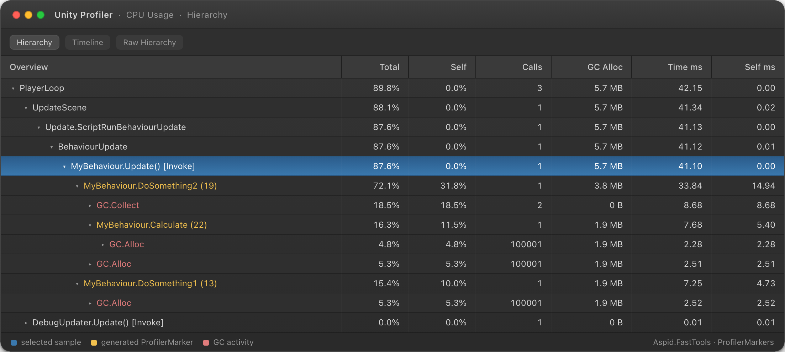
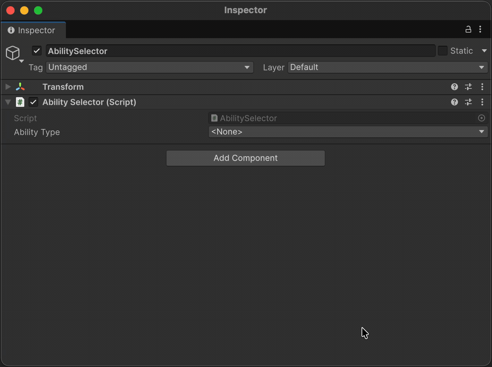
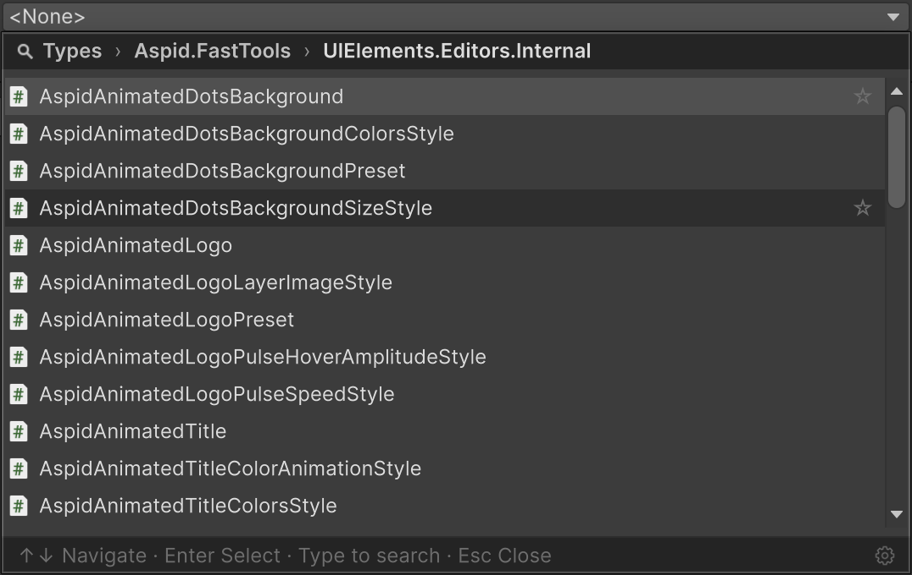
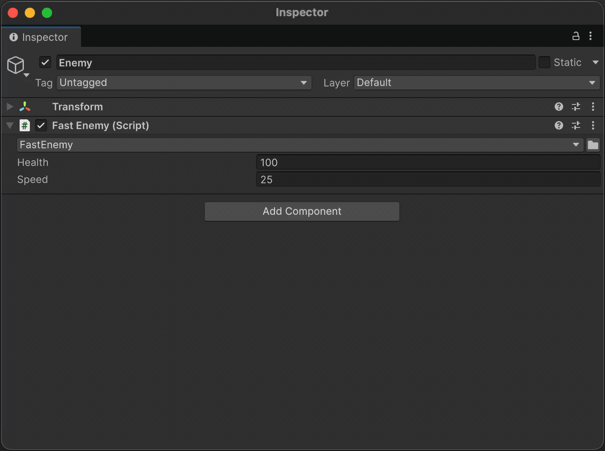
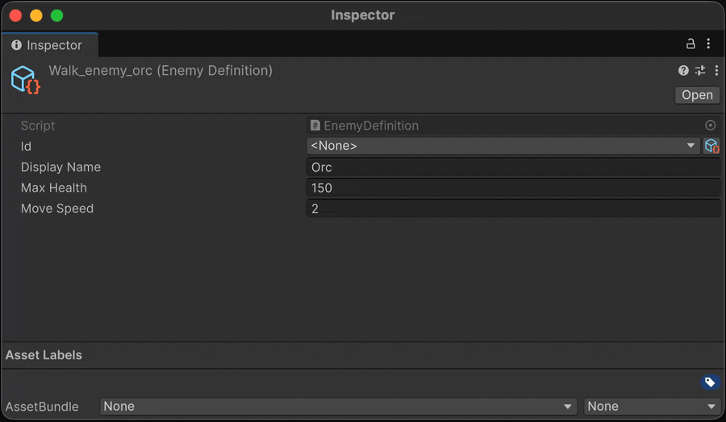
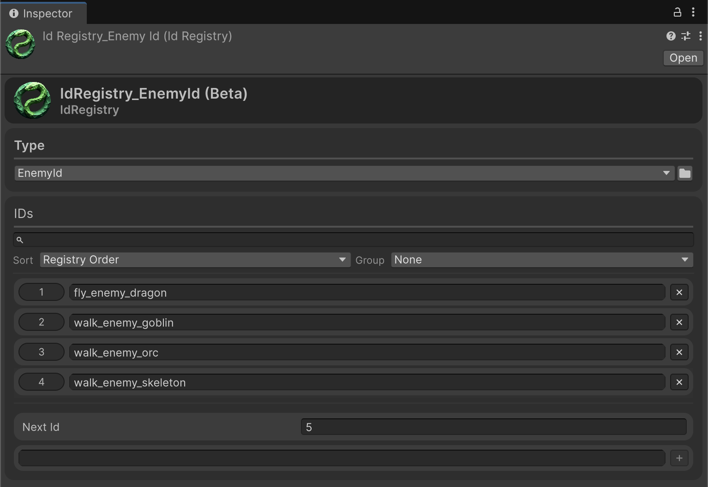

**Aspid.FastTools** — набор инструментов, предназначенных для минимизации рутинного написания кода в Unity: инструменты для `SerializeReference` (выбор типа в инспекторе и окно-обозреватель ссылок), генераторы кода на базе Roslyn и подборка runtime- и editor-утилит — от сериализуемого `System.Type` до fluent-расширений UI Toolkit.

### \[[Unity Asset Store](https://assetstore.unity.com/packages/slug/365584)\] \[[Donate](#donate)\]

## Source Code

[[Aspid.FastTools](https://github.com/VPDPersonal/Aspid.FastTools)]

## Содержание

- **Getting Started**
  - [Integration](#integration)
  - [Claude Code Plugin](#claude-code-plugin)
  - [Donate](#donate)
- **Features**
  - [ProfilerMarker](#profilermarker)
  - [Serializable Type System](#serializable-type-system)
  - [SerializeReference Selector](#serializereference-selector)
  - [Enum System](#enum-system)
  - [ID System (Beta)](#id-system-beta)
  - [VisualElement Extensions](#visualelement-extensions)
  - [SerializedProperty Extensions](#serializedproperty-extensions)
  - [IMGUI Layout Scopes](#imgui-layout-scopes)
  - [Editor Helper Extensions](#editor-helper-extensions)

---

## Integration

Установите Aspid.FastTools через UPM: в Package Manager нажмите **+ → Install package from git URL…** и вставьте один из URL ниже.

### Stable

Ветка `upm` всегда указывает на последний **стабильный** релиз:

```
https://github.com/VPDPersonal/Aspid.FastTools.git#upm
```

Чтобы установить конкретную версию, укажите неизменяемый per-release тег (список доступных версий — на странице [Releases](https://github.com/VPDPersonal/Aspid.FastTools/releases)):

```
https://github.com/VPDPersonal/Aspid.FastTools.git#upm/1.0.0
```

Предпочитаете установку вручную? Скачайте `.unitypackage` со страницы [Releases](https://github.com/VPDPersonal/Aspid.FastTools/releases) или возьмите пакет в [Unity Asset Store](https://assetstore.unity.com/packages/slug/365584).

<details>
<summary><strong>Preview</strong></summary>

<br>

Ветка `upm-preview` всегда указывает на последний **preview** релиз (rc, beta, alpha, …):

```
https://github.com/VPDPersonal/Aspid.FastTools.git#upm-preview
```

Чтобы установить конкретную preview-версию, укажите неизменяемый per-release тег (список доступных версий — на странице [Releases](https://github.com/VPDPersonal/Aspid.FastTools/releases)):

```
https://github.com/VPDPersonal/Aspid.FastTools.git#upm-preview/1.0.0-rc.2
```

</details>

---

## Claude Code Plugin

Если вы используете [Claude Code](https://docs.claude.com/en/docs/claude-code), сопутствующий маркетплейс [Aspid.Claude.Plugins](https://github.com/VPDPersonal/Aspid.Claude.Plugins) поставляет плагин `aspid-fasttools` — набор скиллов, которые обучают Claude Code конвенциям и API этого пакета.

Добавьте маркетплейс и установите плагин:

```sh
/plugin marketplace add VPDPersonal/Aspid.Claude.Plugins
```

```sh
/plugin install aspid-fasttools@aspid-claude-plugins
```

Включённые скиллы:

- **`aspid-id-struct`** — создаёт новую `IId`-структуру и `[UniqueId]`-поля для [ID System](#id-system-beta).
- **`aspid-profiler-marker`** — вставляет вызовы `this.Marker()` с правильной формой `using`/scope.
- **`aspid-visual-element-fluent`** — собирает editor- или runtime-UI через fluent-расширения `VisualElement`.

---

## Donate

Этот проект разрабатывается на добровольной основе. Если он оказался для вас полезным, вы можете поддержать его развитие финансово. Это поможет уделять больше времени улучшению и сопровождению **Aspid.FastTools**.

Поддержать проект можно через следующие платформы:
* \[[Unity Asset Store](https://assetstore.unity.com/packages/slug/365584)\]

---

## ProfilerMarker

Предоставляет регистрацию `ProfilerMarker` через source generation. Генератор создаёт статический маркер для каждого места вызова, идентифицируемый по вызывающему методу и номеру строки.

```csharp
using UnityEngine;

public class MyBehaviour : MonoBehaviour
{
    private void Update()
    {
        DoSomething1();
        DoSomething2();
    }

    private void DoSomething1()
    {
        using var _ = this.Marker();
        // Некоторый код
    }

    private void DoSomething2()
    {
        using (this.Marker())
        {
            // Некоторый код
            using var _ = this.Marker().WithName("Calculate");
            // Некоторый код
        }
    }
}
```

<details>
<summary><b>Сгенерированный код</b></summary>
<br/>

```csharp
using Unity.Profiling;
using System.Runtime.CompilerServices;

internal static class __MyBehaviourProfilerMarkerExtensions
{
    private static readonly ProfilerMarker DoSomething1_Marker_Line_13 = new("MyBehaviour.DoSomething1 (13)");
    private static readonly ProfilerMarker DoSomething2_Marker_Line_19 = new("MyBehaviour.DoSomething2 (19)");
    private static readonly ProfilerMarker DoSomething2_Marker_Line_22 = new("MyBehaviour.Calculate (22)");

    public static ProfilerMarker.AutoScope Marker(this MyBehaviour _, [CallerLineNumberAttribute] int line = -1)
    {
#if ENABLE_PROFILER
        if (line is 13) return DoSomething1_Marker_Line_13.Auto();
        if (line is 19) return DoSomething2_Marker_Line_19.Auto();
        if (line is 22) return DoSomething2_Marker_Line_22.Auto();
#endif
        return default;
    }
}
```

</details>

### Result



---

## Serializable Type System

Позволяет сериализовать ссылку на `System.Type` в Unity Inspector. Выбранный тип хранится как assembly-qualified name и разрешается лениво при первом обращении.

### SerializableType

Доступны два варианта:

- **`SerializableType`** — хранит любой тип (базовый тип — `object`)
- **`SerializableType<T>`** — хранит тип, ограниченный `T` или его подклассами

Оба поддерживают неявное преобразование в `System.Type`.

```csharp
using UnityEngine;
using Aspid.FastTools.Types;

public abstract class Ability : MonoBehaviour
{
    public abstract void Activate();
}

public sealed class AbilitySelector : MonoBehaviour
{
    [SerializeField] private SerializableType<Ability> _abilityType;

    private void Start()
    {
        var ability = (Ability)gameObject.AddComponent(_abilityType.Type);
        ability.Activate();
    }
}
```


### TypeSelectorAttribute

Атрибут `PropertyAttribute`, доступный только в редакторе, ограничивающий всплывающее окно выбора типа конкретными базовыми типами. Применяется к полям `string`, хранящим assembly-qualified имена типов.

```csharp
[Conditional("UNITY_EDITOR")]
public sealed class TypeSelectorAttribute : PropertyAttribute
{
    public TypeSelectorAttribute() // базовый тип: object
    public TypeSelectorAttribute(Type type)
    public TypeSelectorAttribute(params Type[] types)
    public TypeSelectorAttribute(string assemblyQualifiedName)
    public TypeSelectorAttribute(params string[] assemblyQualifiedNames)

    public TypeAllow Allow { get; set; }  // по умолчанию: TypeAllow.None
    public bool Required { get; set; }    // по умолчанию: false
}

[Flags]
public enum TypeAllow
{
    None      = 0,
    Abstract  = 1,
    Interface = 2,
    All       = Abstract | Interface
}
```

| Свойство | Описание |
|----------|----------|
| `Allow` | Какие специальные категории типов (абстрактные классы, интерфейсы) включаются в список выбора в дополнение к обычным конкретным классам. По умолчанию: `TypeAllow.None` |
| `Required` | Помечает незаполненное поле: managed reference `[SerializeReference]`, оставшийся `null`, или пустое `string`-поле показывает предупреждение «required» в инспекторе и считается нарушением для build/CI-гейта. По умолчанию: `false` |

```csharp
using UnityEngine;
using Aspid.FastTools.Types;

public abstract class AbilityModifier
{
    public abstract void Apply();
}

public sealed class AbilitySelector : MonoBehaviour
{
    // Каждый элемент массива — отдельный picker, ограниченный AbilityModifier.
    [TypeSelector(typeof(AbilityModifier))]
    [SerializeField] private string[] _modifierTypes;
}
```

> Полный сэмпл — `Ability` / `AbilitySelector` / `EnemyBase` и их наследники — поставляется в сэмпле `Types` (Package Manager → Aspid.FastTools → Samples).

Пометьте тип-кандидат атрибутом `[TypeSelectorDisplay]`, чтобы настроить, как он показывается в селекторе — это editor-only атрибут (`[Conditional("UNITY_EDITOR")]`) в `Aspid.FastTools.Types`, не несущий стоимости в рантайме:

```csharp
using Aspid.FastTools.Types;

// Переименовать тип в пикере, положить его в явную группу, задать tooltip и иконку:
[TypeSelectorDisplay(
    Name = "Damage ×",
    Group = "Combat/Modifiers",
    Tooltip = "Scales incoming damage",
    Icon = "d_ScriptableObject Icon")]
public sealed class DamageModifier { }
```

| Член | Описание |
|------|----------|
| `Name` | Отображаемое имя вместо короткого имени типа — в строках пикера и в подписи закрытого дропдауна. Поиск по-прежнему находит тип и по настоящему имени, а tooltip при наведении показывает полную идентичность `Namespace.Class, Assembly`. `null` или пробелы — без переопределения. |
| `Group` | Явный путь в пикере, уровни разделяются `/` (например `"Combat/Melee"`). **Заменяет** размещение по namespace — тип показывается только под этим путём, сегменты пути общие для разных типов. `null` или пробелы — размещение по namespace. |
| `Tooltip` | Tooltip, показываемый при наведении на строку типа. `null` — без переопределения tooltip. |
| `Icon` | Иконка редактора слева от лейбла — имя `EditorGUIUtility.IconContent`, путь к ассету в проекте с расширением (загружается через `AssetDatabase`) или путь к текстуре в `Resources` без расширения. `null` — без иконки. |

---

### Type Selector Window

В Inspector отображается кнопка, открывающая всплывающее окно с поиском, которое включает:

- Иерархическую организацию по пространствам имён
- Текстовый поиск с фильтрацией
- Навигацию с клавиатуры (стрелки, Enter, Escape; Space — в избранное)
- Хлебные крошки и возврат назад (стрелка ← или клик по крошке)
- Разрешение неоднозначности для типов с одинаковыми именами из разных сборок
- Секции **Favorites** (★ при наведении) и **Recent** (последние выборы) на корневой странице — хранятся локально для каждого проекта (`EditorPrefs`, не попадают в репозиторий), скрыты во время поиска
- Пункт `<None>` вверху списка и галочку ✓ у текущего значения — его строка выбирается при открытии
- Счётчики типов у групп и заголовков секций
- Поддержку generic-типов — выбор открытого generic ведёт через выбор его аргументов и возвращает сконструированный тип
- Настройку Favorites/Recent (вкл/выкл, ёмкость Recent) во вкладке Settings окна SerializeReference



Это же окно доступно как публичный API — открывайте его из любого editor-кода (кастомных инспекторов, `EditorWindow`, пунктов меню), когда нужно вывести выбор типа за пределами стандартного потока `SerializableType` / `[TypeSelector]`.

```csharp
namespace Aspid.FastTools.Types.Editors
{
    public sealed class TypeSelectorWindow : EditorWindow
    {
        public static void Show(
            Rect screenRect,
            TypeSelectorFilter filter = default,
            string currentAqn = "",
            Action<string> onSelected = null);
    }
}
```

| Параметр | Описание |
|----------|----------|
| `screenRect` | Прямоугольник в экранных координатах, к которому привязывается dropdown. |
| `filter` | Объединяет, какие типы предлагает селектор: базовые типы (`Types`, в списке остаются только типы, совместимые со **всеми** записями; по умолчанию — `typeof(object)`), включаемые категории (`Allow`), необязательный предикат `Predicate`, дополнительные записи `AdditionalTypes` и предикат аргументов открытых генериков `ArgumentFilter`. |
| `currentAqn` | Assembly-qualified имя текущего выбранного типа: окно сразу откроется на его уровне иерархии. Передайте `null` или пустую строку, чтобы стартовать с корня. |
| `onSelected` | Callback с assembly-qualified именем выбранного типа или `null`, если пользователь выбрал `<None>`. |

### ComponentTypeSelector

Сериализуемая структура, добавляющая в Inspector выпадающий список для смены типа объекта. Добавьте её как поле в базовый класс — при выборе подтипа редактор перезаписывает `m_Script` на `SerializedObject`, фактически превращая компонент или ScriptableObject в выбранный подтип.

Список автоматически ограничивается подтипами класса, в котором объявлено поле. Дополнительная настройка не требуется.

```csharp
using UnityEngine;
using Aspid.FastTools.Types;

public abstract class EnemyBase : MonoBehaviour
{
    [SerializeField] private ComponentTypeSelector _enemyType;
    [SerializeField] [Min(0)] private float _health = 100f;

    public abstract void Attack();
}

public sealed class FastEnemy : EnemyBase
{
    [SerializeField] [Min(0)] private float _speed = 25f;

    public override void Attack() =>
        Debug.Log($"Fast enemy strikes! (speed: {_speed})");
}

public sealed class TankEnemy : EnemyBase
{
    [SerializeField] [Min(0)] private float _armor = 50f;

    public override void Attack() =>
        Debug.Log($"Tank attacks! (armor: {_armor})");
}
```

<!-- TODO(media): re-record aspid_fasttools_component_type_selector.gif — FastEnemy ↔ TankEnemy switch with the current picker window -->


---

## SerializeReference Selector

Готовый выпадающий список выбора типа для полей `[SerializeReference]`. Добавьте `[TypeSelector]` рядом с `[SerializeReference]` — Inspector заменит стандартный UI managed-ссылки тем же иерархическим селектором с поиском, что и `SerializableType`. Вы прямо в инспекторе выбираете, какая конкретная реализация типа поля будет создана; `<None>` очищает ссылку.

```csharp
using System;
using UnityEngine;
using System.Collections.Generic;
using Aspid.FastTools.Types;

public interface IWeapon
{
    void Fire();
}

[Serializable]
public sealed class Pistol : IWeapon
{
    [SerializeField] [Min(0)] private int _damage = 10;

    public void Fire() => Debug.Log($"Pistol: {_damage} dmg");
}

[Serializable]
public sealed class Railgun : IWeapon
{
    [SerializeField] [Min(0)] private float _chargeTime = 1.5f;

    public void Fire() => Debug.Log($"Railgun charged for {_chargeTime}s");
}

public sealed class Loadout : MonoBehaviour
{
    [SerializeReference] [TypeSelector]
    private IWeapon _primary;

    [SerializeReference] [TypeSelector]
    private List<IWeapon> _sidearms;
}
```

Атрибут существует только в редакторе (`[Conditional("UNITY_EDITOR")]`) и не несёт стоимости в рантайме. Работает с одиночными полями, массивами и `List<T>`, в инспекторах IMGUI и UIToolkit.

### Возможности

| Возможность | Что делает |
|---|---|
| **Выбор реализации** | В списке — конкретные не-`UnityEngine.Object` классы, совместимые с типом поля. `[TypeSelector(typeof(IMelee))]` сужает его до реализаций `IMelee`. |
| **Вложенный inspector** | Сериализуемые поля выбранного экземпляра рисуются под foldout. |
| **Open generics** | `Modifier<T>` и подобные: аргументы выводятся из закрытого generic-поля либо выбираются на второй странице селектора. |
| **Сохранение данных** | При смене типа поля, совпадающие по имени и сериализуемой форме, переносятся, а не сбрасываются в значения по умолчанию. |
| **Copy / Paste** | Правый клик по заголовку копирует значение и вставляет его независимым экземпляром в любое совместимое поле. |
| **Мультивыделение** | Смешанное выделение показывает смешанное состояние dropdown; выбор или вставка применяется к каждому объекту в одной группе Undo. |
| **Проверка компилятором** | Анализатор Roslyn: `AFT0004` (ошибка) — тип наследует `UnityEngine.Object`; `AFT0005` (предупреждение) — селектор оказался бы пустым. |

### Починка сломанных ссылок

| Случай | Решение |
|---|---|
| **Потерянный тип** (переименован или удалён) | Жёлтое предупреждение вместо молчаливой очистки. Подчёркнутое **Fix** открывает селектор и переназначает тип с сохранением данных — на любой глубине, в сохранённых ассетах и прямо в Prefab Mode. |
| **Smart Fix** | Рядом с **Fix** предлагает наиболее вероятную замену (`[MovedFrom]`, другой namespace/сборка, регистр, близкое имя) и применяет в один клик — никогда не автоматически. |
| **Общая ссылка** (два поля делят экземпляр) | Помечается лейблом; **Make unique** расщепляет её в независимую копию. Дублирование элемента списка (Ctrl+D, `+`) больше не создаёт алиас. |

<!-- TODO(media): optional gif aspid_fasttools_serialize_reference_repair.gif — BrokenWeaponPreset → missing-type notice → Smart Fix, data preserved -->

Массовая починка вынесена в отдельные вкладки:

| Вкладка | Назначение |
|---|---|
| **Asset References** (`Tools → Aspid 🐍 → FastTools → Asset References`) | Строит весь граф managed-ссылок ассета прямо из YAML — дерево по компонентам с путями полей, общими и осиротевшими ссылками, значками `MISSING` / `SHARED` и инлайн-выбором типа на каждой карточке. Достаёт потерянные ссылки, которые инспектор не показывает. |
| **Project References** (`Tools → Aspid 🐍 → FastTools → Project References`) | `Scan Project` обходит каждый `.prefab` / `.asset` / `.unity` под `Assets/`, группирует сломанные ссылки по сохранённому типу и чинит всю группу одним `Fix all` (плюс Smart Fix). Группа, чей сохранённый тип совпадает с объявленным переименованием `[MovedFrom]`, читается как ожидающая миграция, а не поломка — один клик **Migrate all** запекает переименование в файлы, после чего атрибут можно удалить из кода. |

### Настройки проекта и build/CI gate

**`Project Settings → Aspid FastTools → SerializeReference`** содержит:

| Настройка | Scope | Что делает |
|---|---|---|
| **Breakage detection** | per-user | Проактивный тост + предупреждение в Console, когда ссылки заново становятся потерянными после рекомпиляции / импорта. |
| **Auto de-alias duplicated list elements** | коммитимая | Дублированный элемент списка получает собственный экземпляр вместо совместного использования id оригинала. |
| **Build / CI gate** | коммитимая | `Off` / `Warn` / `Fail`: при сборке плеера логировать или прерывать сборку на потерянных (а для CI — и на незаданных обязательных) managed-ссылках. |
| **Excluded scan folders** | коммитимая | Пути, пропускаемые при всех проектных сканах. |

- Коммитимые значения хранятся в `ProjectSettings/SerializeReferenceSharedSettings.asset` — закоммитьте его, чтобы команда и CI вели себя одинаково; breakage detection остаётся per-machine (`EditorPrefs`).
- Rid colours — не настройка: общая ссылка всегда раскрашивается по id — совпадающий цвет и показывает, какие поля делят один экземпляр.

Те же опции продублированы во вкладке **Settings** окна (`Tools → Aspid 🐍 → FastTools → Settings`) и на странице **`Preferences → Aspid FastTools`**, рядом с индивидуальными настройками пикера:

- **Favorites** — переключатель секции.
- **Recent items** — слайдер ёмкости (0–20; 0 скрывает секцию и приостанавливает запись, не стирая историю).
- **Saved lists** — очищает сохранённые Favorites / Recent.
- **Appearance** — override-`StyleSheet` темы редактора с действием **Create template…**.
- **Welcome** — переключатель автопоказа.

Каждая строка помечена полоской scope (зелёная — коммитимые, синяя — индивидуальные); закреплённый футер предлагает **Reset to defaults** отдельно для каждого scope (сохранённые списки Favorites / Recent сброс переживают). Все поверхности зеркалят друг друга живьём.

Для headless-CI метод `SerializeReferenceCiGate.RunCheck` (через `-batchmode -executeMethod`) пишет отчёт и учитывает коммитимую строгость гейта:

- `Off` пропускает проверку, `Warn` логирует, но завершается с кодом 0, `Fail` завершается с ненулевым кодом при нарушениях.
- `-srGateRequired` дополнительно проверяет незаданные поля `[TypeSelector(Required = true)]` в префабах, ScriptableObject и сценах (required-поля верхнего уровня, чистый YAML-проход).
- Per-run флаги `-srGateWarnOnly` / `-srGateFail` переопределяют коммитимую строгость.

> Полный сэмпл — `Loadout` / `IWeapon` / `Modifier<T>` и сценарии починки потерянных ссылок — поставляется в сэмпле `SerializeReferences` (Package Manager → Aspid.FastTools → Samples). Пошаговый разбор — в `TUTORIAL.md` этого сэмпла.

---

## Enum System

Предоставляет сериализуемые отображения enum → значение, настраиваемые через Inspector.

### EnumValues\<TValue\>

Сериализуемая коллекция записей `EnumValue<TValue>` с настраиваемым значением по умолчанию. Реализует `IEnumerable<KeyValuePair<Enum, TValue>>`.

| Член | Описание |
|------|----------|
| `TValue GetValue(Enum enumValue)` | Возвращает сопоставленное значение или `_defaultValue`, если не найдено |
| `bool Equals(Enum, Enum)` | Проверка равенства с поддержкой `[Flags]` |

Поддерживает `[Flags]`-перечисления: `Equals` использует `HasFlag` и корректно обрабатывает члены со значением `0`.

```csharp
using System;
using UnityEngine;
using Aspid.FastTools.Enums;

public enum DamageType { Physical, Fire, Ice, Poison }

[Flags]
public enum StatusEffect
{
    None    = 0,
    Burning = 1,
    Frozen  = 2,
    Slowed  = 4,
    Stunned = 8,
}

public sealed class DamageDealer : MonoBehaviour
{
    [SerializeField] private EnumValues<float> _damageMultipliers;
    [SerializeField] private EnumValues<Color> _damageColors;

    // Flag combinations (e.g. Burning | Slowed) match via HasFlag and first-hit wins,
    // so list composite entries BEFORE their constituent flags.
    [SerializeField] private EnumValues<float> _speedMultipliersByStatus;

    [SerializeField] private DamageType _currentType;
    [SerializeField] private StatusEffect _activeEffects;

    private void DealDamage()
    {
        var multiplier = _damageMultipliers.GetValue(_currentType);
        var color      = _damageColors.GetValue(_currentType);
        var speedMod   = _speedMultipliersByStatus.GetValue(_activeEffects);
        // ...
    }
}
```


В Inspector выберите тип перечисления в заголовке `EnumValues`, затем назначьте значение для каждого члена перечисления. Нажмите правой кнопкой мыши по свойству, чтобы открыть контекстное меню с пунктом **Populate Missing Enum Members** — он добавит записи для всех отсутствующих членов перечисления, используя текущее Default Value как начальное значение.

> Полный сэмпл — `DamageDealer` / `DamageType` / `StatusEffect` — поставляется в сэмпле `EnumValues` (Package Manager → Aspid.FastTools → Samples).

### EnumValues\<TEnum, TValue\>

Типизированный вариант `EnumValues<TValue>` для частого случая, когда тип перечисления уже известен в коде. Тип фиксируется generic-аргументом, поэтому в Inspector нет выбора типа, а обращения проверяются на этапе компиляции. Поиск при этом не использует boxing — ключи сравниваются как закэшированные числовые значения, — а `foreach` по обоим вариантам использует struct-энумератор и не аллоцирует. Реализует `IEnumerable<KeyValuePair<TEnum, TValue>>`.

| Член | Описание |
|------|----------|
| `TValue GetValue(TEnum enumValue)` | Возвращает сопоставленное значение или `_defaultValue`, если не найдено |
| `bool Equals(TEnum, TEnum)` | Проверка равенства с корректной поддержкой `[Flags]` |

```csharp
public sealed class HitEffect : MonoBehaviour
{
    // В Inspector нет выбора типа — перечисление зафиксировано как DamageType.
    [SerializeField] private EnumValues<DamageType, Color> _damageColors;

    public Color GetColor(DamageType type) => _damageColors.GetValue(type);
}
```

Семантика поиска (включая обработку `[Flags]`) идентична `EnumValues<TValue>`, а сериализованный формат совместим — смена типа поля между двумя вариантами сохраняет существующие данные, пока тип перечисления совпадает.

---

## ID System (Beta)

> **Бета:** Система ID находится в бета-версии. Публичный API, структура генерируемого кода и редакторский UX могут измениться в будущих релизах.

Сопоставляет имя, назначаемое в активе, со стабильным целочисленным ID. Получившийся `int` подходит для `switch` и ключей `Dictionary` без затрат на строковые поиски в рантайме.

Единственный ScriptableObject `IdRegistry` сопоставляет строковые имена стабильным целочисленным ID и предоставляет полные `int ↔ string` поиски в рантайме.

### Setup

**1.** Объявите `partial struct`, реализующий `IId`. Генератор исходников автоматически добавит необходимые поля и свойство:

```csharp
using Aspid.FastTools.Ids;

public partial struct EnemyId : IId { }
```

Сгенерированный код:

```csharp
public partial struct EnemyId
{
    [SerializeField] private string __stringId; // editor-only поле, вырезается из player-сборок
    [SerializeField] private int _id;

    public int Id => _id;
}
```

Генератор сообщает `AFID001`, если у структуры отсутствует `partial`, и `AFID002`, если вы сами объявили `_id`, `Id` или `__stringId` (генерация пропускается — вы получаете явную ошибку с указанием на структуру вместо CS-ошибки внутри сгенерированного кода). Поддерживаются generic-структуры (`EnemyId<T>`) и generic-контейнеры.

**2.** Создайте ассет реестра и привяжите его к вашему типу структуры в Inspector:
- `Assets → Create → Aspid → Id Registry`

**3.** Используйте структуру как сериализуемое поле. В Inspector отображается выпадающий список зарегистрированных имён; окно селектора также позволяет создавать новые записи на лету:

```csharp
using UnityEngine;
using Aspid.FastTools.Ids;

[CreateAssetMenu]
public class EnemyDefinition : ScriptableObject
{
    [UniqueId] [SerializeField] private EnemyId _id;
}
```

```csharp
using UnityEngine;
using Aspid.FastTools.Ids;

public class EnemySpawner : MonoBehaviour
{
    [SerializeField] private EnemyId _targetEnemy;

    private void Spawn()
    {
        int id = _targetEnemy.Id; // стабильный integer, безопасен для switch / Dictionary
    }
}
```



### UniqueIdAttribute

Помечает поле как требующее уникального значения среди всех ассетов объявляющего типа. Inspector показывает предупреждение, если два ассета используют одинаковый ID.

```csharp
[Conditional("UNITY_EDITOR")]
public sealed class UniqueIdAttribute : PropertyAttribute { }
```


### IdRegistry

`ScriptableObject` из `Aspid.FastTools.Ids`, хранящий записи `(int, string)` и поддерживающий таблицы поиска доступными во рантайме. Каждому имени назначается стабильный, автоинкрементный ID, который не изменяется даже при добавлении или удалении других записей.

| Член | Описание |
|------|----------|
| `bool TryGetId(string name, out int id)` | Возвращает `true` и найденный ID; иначе `false` |
| `bool TryGetName(int id, out string name)` | Возвращает `true` и найденное имя; иначе `false` и `string.Empty` |
| `bool Contains(int id)` | Зарегистрирован ли ID |
| `bool Contains(string name)` | Зарегистрировано ли имя |
| `int Count` | Количество записей |
| `IReadOnlyList<int> Ids` · `IReadOnlyList<string> IdNames` | Зарегистрированные ID / имена в порядке регистрации |
| `IEnumerator<KeyValuePair<int, string>> GetEnumerator()` | Итерация по парам `(id, name)` |

Реестр наследуется напрямую от `ScriptableObject` и предоставляет генерик-аналог `IdRegistry<T>` (с `T : struct, IId`), добавляющий типизированные перегрузки `Contains(T)` и `TryGetName(T, out string)`. Редактирование — добавление, переименование, удаление записей — выполняется через инспектор реестра и `RegistryEditorCore`, а не через публичный runtime API.



---

## VisualElement Extensions

Fluent-методы расширения для построения UIToolkit-деревьев в коде. Все методы возвращают `T` (сам элемент) для цепочки вызовов.

> Полный справочник по методам: [VisualElementExtensions.md](VisualElementExtensions.md)

### Example

Реактивный редактор для `ScriptableObject` `AbilityConfig` — заголовок и статус-пилла в шапке, тело из `PropertyField`, и Warning `HelpBox`, который переключается в зависимости от `ManaCost`.

```csharp
[CustomEditor(typeof(AbilityConfig))]
internal sealed class AbilityConfigEditor : Editor
{
    public override VisualElement CreateInspectorGUI()
    {
        var config = (AbilityConfig)target;

        var badge = new Label()
            .SetFontSize(10).SetUnityFontStyleAndWeight(FontStyle.Bold)
            .SetPaddingX(10).SetPaddingY(3)
            .SetBorderRadius(10).SetBorderWidth(1);

        var helpBox = new HelpBox(
                "This ability costs no mana — is that intentional?",
                HelpBoxMessageType.Warning)
            .SetMarginTop(8).SetBorderRadius(6);

        var manaField = new PropertyField(serializedObject.FindProperty("_manaCost"))
            .AddValueChanged(_ => Refresh());

        Refresh();
        return new VisualElement()
            .SetBorderRadius(10).SetBorderWidth(1)
            .AddChild(new VisualElement()
                .SetFlexDirection(FlexDirection.Row).SetAlignItems(Align.Center)
                .SetPaddingX(14).SetPaddingY(12)
                .AddChild(new Label(target.GetScriptName())
                    .SetFlexGrow(1).SetFontSize(15)
                    .SetUnityFontStyleAndWeight(FontStyle.Bold))
                .AddChild(badge))
            .AddChild(new VisualElement()
                .SetPaddingX(14).SetPaddingY(12)
                .AddChild(new PropertyField(serializedObject.FindProperty("_abilityName")))
                .AddChild(new PropertyField(serializedObject.FindProperty("_description")))
                .AddChild(new PropertyField(serializedObject.FindProperty("_cooldown")))
                .AddChild(manaField)
                .AddChild(helpBox));

        void Refresh()
        {
            var isFree = config.ManaCost is 0;
            badge.SetText(isFree ? "FREE" : $"{config.ManaCost} MP");
            helpBox.SetDisplay(isFree ? DisplayStyle.Flex : DisplayStyle.None);
        }
    }
}
```

> Полный сэмпл — `AbilityConfig.cs`, полированный `AbilityConfigEditor.cs` (свои цвета, подзаголовок и divider — то, что на скриншоте ниже) и два `.asset`-примера — поставляется в сэмпле `VisualElements` (Package Manager → Aspid.FastTools → Samples).

### Result


---

## SerializedProperty Extensions

Цепочные расширения над `SerializedProperty` для синхронизации владеющего `SerializedObject`, записи типизированных значений и рефлексии над полем-источником.

```csharp
property
    .Update()
    .SetVector3(Vector3.up)
    .SetBool(true)
    .ApplyModifiedProperties();
```

Пакет покрывает:

- **Update / Apply** — `Update`, `UpdateIfRequiredOrScript`, `ApplyModifiedProperties`.
- **Типизированные сеттеры** — `SetValue` (обобщённый диспетчер) и `SetXxx` для `int`/`uint`/`long`/`ulong`/`float`/`double`/`bool`/`string`/`Color`/`Gradient`/`Hash128`/`Rect`/`RectInt`/`Bounds`/`BoundsInt`/`Vector2..4` (и `Vector2/3Int`)/`Quaternion`/`AnimationCurve`/`EntityId` (Unity 6.2+). К каждому идёт парный вариант `SetXxxAndApply`.
- **Enum-сеттеры** — `SetEnumFlag` и `SetEnumIndex` (каждый + `AndApply`).
- **Массивы** — `SetArraySize`, `AddArraySize`, `RemoveArraySize` (каждый + `AndApply`).
- **Ссылки** — `SetManagedReference`, `SetObjectReference`, `SetExposedReference`, а также `SetBoxed` (Unity 6+).
- **Рефлексионные хелперы** — `GetPropertyType`, `GetMemberInfo`, `GetClassInstance` для разрешения C#-члена и runtime-экземпляра, стоящих за property.

> Полный справочник по методам: [SerializedPropertyExtensions.md](SerializedPropertyExtensions.md)

---

## IMGUI Layout Scopes

Три `ref struct`-области — `VerticalScope`, `HorizontalScope`, `ScrollViewScope` — оборачивают `EditorGUILayout.Begin*` / `End*`. Каждая предоставляет свойство `Rect` и вызывает соответствующий метод `End*` в `Dispose`:

```csharp
using (VerticalScope.Begin())
{
    EditorGUILayout.LabelField("Item 1");
    EditorGUILayout.LabelField("Item 2");
}

using (HorizontalScope.Begin())
{
    EditorGUILayout.LabelField("Left");
    EditorGUILayout.LabelField("Right");
}

var scrollPos = Vector2.zero;
using (ScrollViewScope.Begin(ref scrollPos))
{
    EditorGUILayout.LabelField("Scrollable content");
}
```

Получить rect области через перегрузку с `out`-параметром:

```csharp
using (VerticalScope.Begin(out var rect, GUI.skin.box))
{
    EditorGUI.DrawRect(rect, new Color(0, 0, 0, 0.1f));
    EditorGUILayout.LabelField("Boxed content");
}
```

Все перегрузки `Begin` соответствуют сигнатурам `EditorGUILayout.Begin*` (опциональные `GUIStyle`, `GUILayoutOption[]`, параметры scroll view и т.д.).

---

## Editor Helper Extensions

Утилитарные методы для получения отображаемых имён объектов Unity в пользовательских редакторах.

```csharp
public static string GetScriptName(this Object obj)
```

Возвращает отображаемое имя объекта Unity:
- Если тип имеет `[AddComponentMenu]`, возвращает `ObjectNames.GetInspectorTitle(obj)`
- В противном случае возвращает `ObjectNames.NicifyVariableName(typeName)`

```csharp
public static string GetScriptNameWithIndex(this Component targetComponent)
```

Возвращает отображаемое имя с числовым суффиксом, если на одном GameObject присутствует несколько компонентов одного типа. Например, если прикреплены два компонента `AudioSource`, второй вернёт `"Audio Source (2)"`.

```csharp
[CustomEditor(typeof(MyBehaviour))]
public class MyBehaviourEditor : Editor
{
    public override VisualElement CreateInspectorGUI()
    {
        // "My Behaviour" — или "Custom Name", если присутствует [AddComponentMenu("Custom Name")]
        var name = target.GetScriptName();

        // "My Behaviour (2)" при наличии второго компонента того же типа
        var nameWithIndex = ((Component)target).GetScriptNameWithIndex();

        return new Label(name);
    }
}
```
