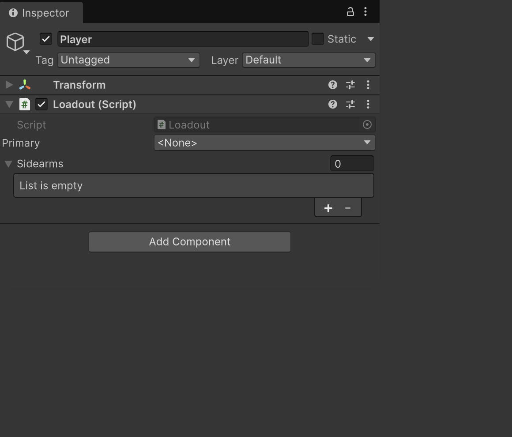
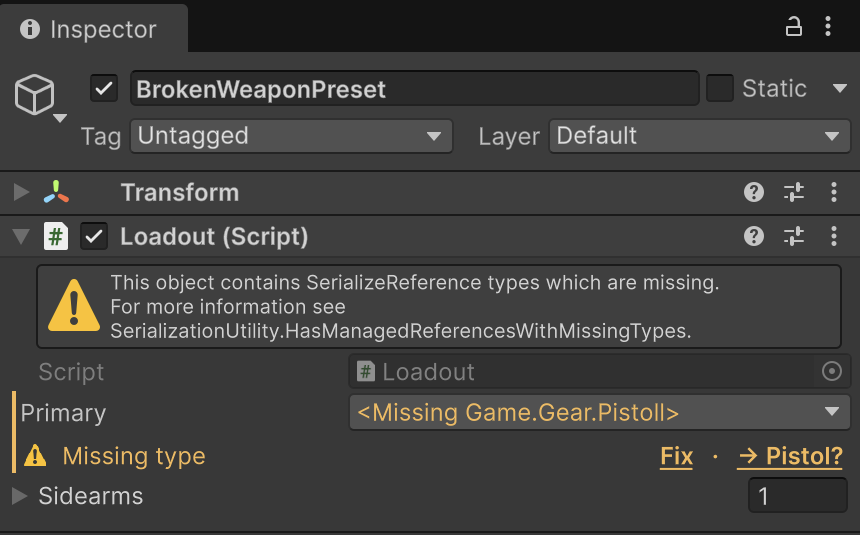
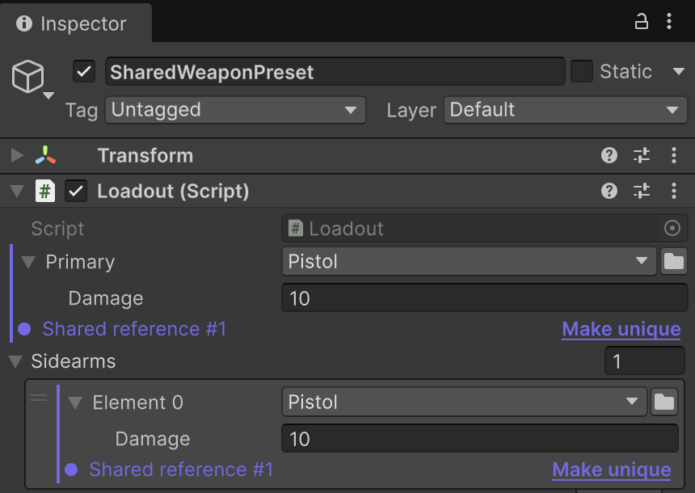

# SerializeReference Selector

Стандартный Inspector не умеет заполнять поля `[SerializeReference]`: managed-ссылку нельзя
создать из UI, а при переименовании или удалении типа Unity молча очищает данные.
SerializeReference Selector закрывает оба пробела: выпадающий выбор реализации прямо
в Инспекторе плюс точечная починка сломанных ссылок у самого поля. Аудит по всему проекту,
массовая починка и build/CI-гейт — в [SerializeReference Tooling](SerializeReferenceTooling.md).

**Разделы справочника:**

* [`Inspector type dropdown`](#inspector-type-dropdown) — дропдаун `[TypeSelector]`
  на полях `[SerializeReference]`: выбор реализации, вложенный inspector, generics,
  copy/paste;
* [`Repairing broken references`](#repairing-broken-references) — жёлтое предупреждение
  вместо молчаливой очистки, **Fix** / **Smart Fix** / **Make unique**.

**Краткая версия с теми же примерами — в** [README](README.md#serializereference-selector).

## Inspector type dropdown

Добавьте `[TypeSelector]` рядом с `[SerializeReference]` — Inspector заменит стандартный
UI managed-ссылки иерархическим [окном выбора типа](Types.md#typeselectorwindow) с поиском.
Вы прямо в инспекторе выбираете, какая конкретная реализация типа поля будет создана;
`<None>` очищает ссылку.

```csharp
using System;
using UnityEngine;
using System.Collections.Generic;
using Aspid.FastTools.Types;

public interface IWeapon
{
    void Fire();
}

[Serializable]
public sealed class Pistol : IWeapon
{
    [SerializeField] [Min(0)] private int _damage = 10;

    public void Fire() => Debug.Log($"Pistol: {_damage} dmg");
}

public sealed class Loadout : MonoBehaviour
{
    [TypeSelector]
    [SerializeReference] private IWeapon _primary;

    [TypeSelector]
    [SerializeReference] private List<IWeapon> _sidearms;
}
```

Атрибут существует только в редакторе (`[Conditional("UNITY_EDITOR")]`) и не несёт
стоимости в рантайме. Работает с одиночными полями, массивами и `List<T>`, в инспекторах
IMGUI и UIToolkit. Тот же атрибут работает и с полями `string` и `SerializableType` —
см. [TypeSelectorAttribute](Types.md#typeselectorattribute).



| Возможность | Что делает |
|---|---|
| **Выбор реализации** | В списке — конкретные не-`UnityEngine.Object` классы, совместимые с типом поля. `[TypeSelector(typeof(IMelee))]` сужает его до реализаций `IMelee`. |
| **Open generics** | `Modifier<T>` и подобные: аргументы выводятся из закрытого generic-поля либо выбираются на второй странице селектора. |
| **Сохранение данных** | При смене типа поля, совпадающие по имени и сериализуемой форме, переносятся, а не сбрасываются в значения по умолчанию. |
| **Copy / Paste** | Правый клик по заголовку копирует значение и вставляет его независимым экземпляром в любое совместимое поле. |
| **Мультивыделение** | Смешанное выделение показывает смешанное состояние dropdown; выбор или вставка применяется к каждому объекту в одной группе Undo. |
| **Проверка компилятором** | Анализатор Roslyn: `AFT0004` (ошибка) — тип наследует `UnityEngine.Object`; `AFT0005` (предупреждение) — селектор оказался бы пустым. |

Пустое поле с `[TypeSelector(Required = true)]` показывает предупреждение «required»
в инспекторе и считается нарушением для
[build/CI-гейта](SerializeReferenceTooling.md#project-settings--the-buildci-gate) —
см. свойство `Required` в [TypeSelectorAttribute](Types.md#typeselectorattribute).

## Repairing broken references

Когда сохранённый в ассете тип перестаёт резолвиться или два поля незаметно делят
один экземпляр, селектор не молчит — каждая проблема получает заметку в инспекторе
и кнопку починки рядом:

| Случай | Решение |
|---|---|
| **Потерянный тип** (переименован или удалён) | Жёлтое предупреждение вместо молчаливой очистки. Подчёркнутое **Fix** открывает селектор и переназначает тип с сохранением данных — на любой глубине, в сохранённых ассетах и прямо в Prefab Mode. |
| **Smart Fix** | Рядом с **Fix** предлагает наиболее вероятную замену (`[MovedFrom]`, другой namespace/сборка, регистр, близкое имя) и применяет в один клик — никогда не автоматически. |
| **Общая ссылка** (два поля делят экземпляр) | Помечается лейблом; **Make unique** расщепляет её в независимую копию. Дублирование элемента списка (Ctrl+D, `+`) больше не создаёт алиас. |





Про аудит и массовую починку по всему проекту — см.
[Bulk repair tabs](SerializeReferenceTooling.md#bulk-repair-tabs).

