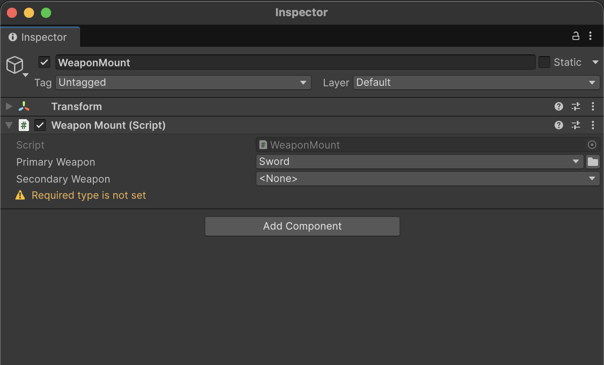
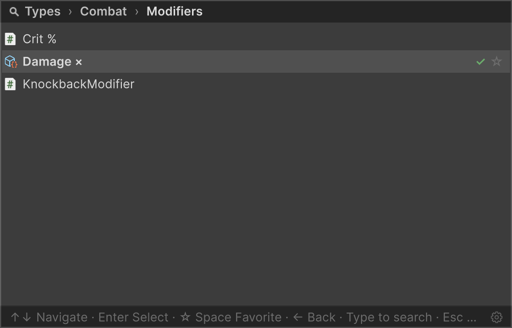

# Serializable Type System

В Unity нельзя сериализовать `System.Type` из коробки — Serializable Type System закрывает
этот пробел: тип выбирается в Инспекторе через иерархическое окно с поиском, хранится как
assembly-qualified name и лениво разрешается в `System.Type` при первом обращении.

**Разделы справочника:**

* [`SerializableType`](#serializabletype) — сериализуемое поле-обёртка над `System.Type`;
* [`TypeSelectorAttribute`](#typeselectorattribute) — кнопка выбора типа у `string`,
  `SerializableType` и `[SerializeReference]` полей, включая
  [динамические базовые типы через ссылки на члены](#dynamic-base-types-via-member-references);
* [`TypeSelectorDisplay`](#typeselectordisplay) — имя, группа, tooltip и иконка типа-кандидата
  в пикере;
* [`TypeSelectorWindow`](#typeselectorwindow) — то же окно выбора как публичный API для
  собственного editor-кода;
* [`ComponentTypeSelector`](#componenttypeselector) — выпадающий список в Инспекторе,
  меняющий тип компонента или ScriptableObject на подтип.

**Краткая версия с теми же примерами — в** [README](README.md#serializable-type-system).

## SerializableType

Сериализуемая обёртка над `System.Type`: хранит выбранный тип как assembly-qualified name и лениво разрешает его в `System.Type` при первом обращении. Доступны два варианта:

- **`SerializableType`** — хранит любой тип;
- **`SerializableType<T>`** — хранит тип, ограниченный `T` и его подклассами.

Оба поддерживают неявное преобразование в `System.Type`.

```csharp
using UnityEngine;
using Aspid.FastTools.Types;

public abstract class Ability : MonoBehaviour
{
    public abstract void Activate();
}

public sealed class AbilitySelector : MonoBehaviour
{
    [SerializeField] private SerializableType<Ability> _abilityType;

    private void Start()
    {
        var ability = (Ability)gameObject.AddComponent(_abilityType.Type);
        ability.Activate();
    }
}
```


## TypeSelectorAttribute

Добавляет к полю в Инспекторе кнопку выбора типа: она открывает иерархическое окно с поиском, в котором перечислены только типы, совместимые с указанными базовыми (при нескольких — со всеми сразу; без аргументов подходит любой тип). Что происходит при выборе, зависит от формы поля:

- `string` — в поле записывается assembly-qualified имя выбранного типа;
- `SerializableType` / `SerializableType<T>` — сужает встроенный селектор; базовые типы атрибута пересекаются с generic-аргументом `T`;
- managed-ссылка `[SerializeReference]` — выбранный тип сразу инстанцируется в поле (см. [SerializeReference Selector](SerializeReferences.md)).

Атрибут editor-only (`[Conditional("UNITY_EDITOR")]`) и не несёт стоимости в рантайме.

```csharp
using UnityEngine;
using Aspid.FastTools.Types;

public abstract class AbilityModifier
{
    public abstract void Apply();
}

public sealed class AbilitySelector : MonoBehaviour
{
    // string — сохраняется assembly-qualified имя выбранного типа.
    // Каждый элемент массива — отдельный picker, ограниченный AbilityModifier.
    [TypeSelector(typeof(AbilityModifier))]
    [SerializeField] private string[] _modifierTypes;

    // SerializableType — сужает picker, который у поля уже есть.
    [TypeSelector(typeof(AbilityModifier))]
    [SerializeField] private SerializableType _modifierType;

    // [SerializeReference] — выбранный тип сразу инстанцируется в поле;
    // без аргументов кандидаты по умолчанию — объявленный тип поля.
    [TypeSelector(Required = true)]
    [SerializeReference] private AbilityModifier _modifier;
}
```

### Конструкторы и свойства

```csharp
[Conditional("UNITY_EDITOR")]
public sealed class TypeSelectorAttribute : PropertyAttribute
{
    public TypeSelectorAttribute() // базовый тип: object
    public TypeSelectorAttribute(Type type)
    public TypeSelectorAttribute(params Type[] types)
    public TypeSelectorAttribute(string assemblyQualifiedName)
    public TypeSelectorAttribute(params string[] assemblyQualifiedNames)

    public TypeAllow Allow { get; set; }  // по умолчанию: TypeAllow.All
    public bool Required { get; set; }    // по умолчанию: false
}

[Flags]
public enum TypeAllow
{
    None      = 0,
    Abstract  = 1,
    Interface = 2,
    All       = Abstract | Interface
}
```

| Свойство | Описание |
|----------|----------|
| `Allow` | Какие специальные категории типов (абстрактные классы, интерфейсы) включаются в список выбора в дополнение к обычным конкретным классам. По умолчанию: `TypeAllow.All` (поле-имя типа показывает и абстрактные классы, и интерфейсы; укажите `TypeAllow.None`, чтобы ограничить только конкретными типами). Игнорируется на managed-ссылке `[SerializeReference]` |
| `Required` | Помечает незаполненное поле: managed reference `[SerializeReference]`, оставшийся `null`, или пустое `string`-поле показывает предупреждение «required» в инспекторе и считается нарушением для build/CI-гейта. Также покрывает поле `SerializableType` (когда сохранённое имя типа пустое). По умолчанию: `false` |



## Dynamic base types via member references

Строковые конструкторы резолвят строку **member-first**: если строка — корректный C#-идентификатор и совпадает с instance-полем или свойством того же объекта, *текущее значение* этого члена задаёт базовый тип(ы) — так одно поле ограничивает пикер другого прямо в Инспекторе, вживую. Любая другая строка трактуется как assembly-qualified имя типа (`Type.GetType`) — то, что нужно для типа, на который в месте вызова нельзя сослаться через `typeof` (за границей editor-сборки или asmdef).

```csharp
public sealed class Loadout : MonoBehaviour
{
    // Выбранная здесь категория управляет пикером _weaponType ниже.
    [SerializeField] private SerializableType<Weapon> _category;

    // Ограничен вживую тем, что сейчас лежит в _category.
    [TypeSelector(nameof(_category))]
    [SerializeField] private string _weaponType;
}
```

Член должен быть instance-полем или свойством типа `Type`, `string`, `SerializableType` / `SerializableType<T>` — либо массивом любого из них. Предпочитайте `nameof(...)`, чтобы переименование не рвало ссылку. Неизвестное имя или член неподходящего вида — это **ошибка компиляции** (правила анализатора `AFT0006`–`AFT0008`); в случаях, которые анализатор не видит (precompiled-сборки, переименование без перекомпиляции), drawer вместо этого показывает inline-предупреждение под полем.

## TypeSelectorDisplay

Пометьте тип-кандидат атрибутом `[TypeSelectorDisplay]`, чтобы настроить, как он показывается в селекторе — это editor-only атрибут (`[Conditional("UNITY_EDITOR")]`) в `Aspid.FastTools.Types`, не несущий стоимости в рантайме:

```csharp
using Aspid.FastTools.Types;

// Переименовать тип в пикере, положить его в явную группу, задать tooltip и иконку:
[TypeSelectorDisplay(
    Name = "Damage ×",
    Group = "Combat/Modifiers",
    Tooltip = "Scales incoming damage",
    Icon = "d_ScriptableObject Icon")]
public sealed class DamageModifier { }
```

| Член | Описание |
|------|----------|
| `Name` | Отображаемое имя вместо короткого имени типа — в строках пикера и в подписи закрытого дропдауна. Поиск по-прежнему находит тип и по настоящему имени, а tooltip при наведении показывает полную идентичность `Namespace.Class, Assembly`. `null` или пробелы — без переопределения. |
| `Group` | Явный путь в пикере, уровни разделяются `/` (например `"Combat/Melee"`). **Заменяет** размещение по namespace — тип показывается только под этим путём, сегменты пути общие для разных типов. `null` или пробелы — размещение по namespace. |
| `Tooltip` | Tooltip, показываемый при наведении на строку типа. `null` — без переопределения tooltip. |
| `Icon` | Иконка редактора слева от лейбла — имя `EditorGUIUtility.IconContent`, путь к ассету в проекте с расширением (загружается через `AssetDatabase`) или путь к текстуре в `Resources` без расширения. `null` — без иконки. |

В пикере `DamageModifier` из примера выше показывается в группе `Combat/Modifiers` как «Damage ×» со своей иконкой — рядом с типами, сохранившими вид по умолчанию:



## TypeSelectorWindow

Всплывающее окно выбора типа с поиском и иерархией по пространствам имён — тот же пикер, что открывают `[TypeSelector]` и `SerializableType`, доступный и как публичный API. Окно включает:

- Иерархическую организацию по пространствам имён
- Текстовый поиск с фильтрацией
- Навигацию с клавиатуры (стрелки, Enter, Escape; Space — в избранное)
- Хлебные крошки и возврат назад (стрелка ← или клик по крошке)
- Разрешение неоднозначности для типов с одинаковыми именами из разных сборок
- Секции **Favorites** (★ при наведении) и **Recent** (последние выборы) на корневой странице — хранятся локально для каждого проекта (`EditorPrefs`, не попадают в репозиторий), скрыты во время поиска
- Пункт `<None>` вверху списка и галочку ✓ у текущего значения — его строка выбирается при открытии
- Счётчики типов у групп и заголовков секций
- Поддержку generic-типов — выбор открытого generic ведёт через выбор его аргументов и возвращает сконструированный тип
- Настройку Favorites/Recent (вкл/выкл, ёмкость Recent) во вкладке Settings окна SerializeReference


Выбор открытого generic проходит через страницу его аргументов и возвращает сконструированный тип:


> Страница аргументов показывает только типы, которые Unity умеет сериализовать как значение поля: примитивы, `enum`, `string`, ссылки на наследников `UnityEngine.Object` и классы/структуры с `[Serializable]`. Абстрактные типы, интерфейсы, открытые generic и делегаты никогда не попадают в список кандидатов. Чтобы тип стал доступен для выбора, пометьте его атрибутом `[Serializable]`.

Окно доступно как публичный API — открывайте его из любого editor-кода (кастомных инспекторов, `EditorWindow`, пунктов меню), когда нужно вывести выбор типа за пределы стандартного потока `SerializableType` / `[TypeSelector]`.

```csharp
namespace Aspid.FastTools.Types.Editors
{
    public sealed class TypeSelectorWindow : EditorWindow
    {
        public static void Show(
            Rect screenRect,
            TypeSelectorFilter filter = default,
            string currentAqn = "",
            Action<string> onSelected = null);
    }
}
```

| Параметр | Описание |
|----------|----------|
| `screenRect` | Прямоугольник в экранных координатах, к которому привязывается dropdown. |
| `filter` | Объединяет, какие типы предлагает селектор: базовые типы (`Types`, в списке остаются только типы, совместимые со **всеми** записями; по умолчанию — `typeof(object)`), включаемые категории (`Allow`), необязательный предикат `Predicate`, дополнительные записи `AdditionalTypes` и предикат аргументов открытых генериков `ArgumentFilter`. |
| `currentAqn` | Assembly-qualified имя текущего выбранного типа: окно сразу откроется на его уровне иерархии. Передайте `null` или пустую строку, чтобы стартовать с корня. |
| `onSelected` | Callback с assembly-qualified именем выбранного типа или `null`, если пользователь выбрал `<None>`. |

## ComponentTypeSelector

Сериализуемая структура, добавляющая в Inspector выпадающий список для смены типа объекта. Добавьте её как поле в базовый класс — при выборе подтипа редактор перезаписывает `m_Script` на `SerializedObject`, фактически превращая компонент или ScriptableObject в выбранный подтип.

Список автоматически ограничивается подтипами класса, в котором объявлено поле. Дополнительная настройка не требуется.

```csharp
using UnityEngine;
using Aspid.FastTools.Types;

public abstract class EnemyBase : MonoBehaviour
{
    [SerializeField] private ComponentTypeSelector _enemyType;
    [SerializeField] [Min(0)] private float _health = 100f;

    public abstract void Attack();
}

public sealed class FastEnemy : EnemyBase
{
    [SerializeField] [Min(0)] private float _speed = 25f;

    public override void Attack() =>
        Debug.Log($"Fast enemy strikes! (speed: {_speed})");
}
```


Заметки о поведении дропдауна смены типа:

- Так как сменой типа управляет сам список, встроенная строка **Script** в Inspector скрывается, пока присутствует селектор — тип меняется только через выпадающий список (только UIToolkit-инспекторы; устаревший IMGUI-инспектор рисует эту строку сам).
