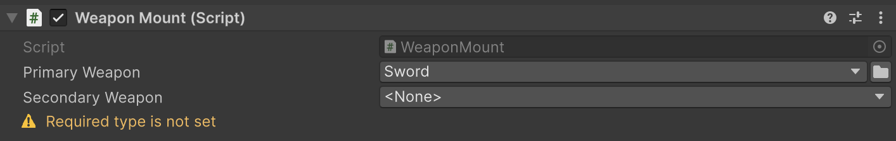
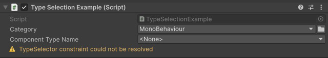
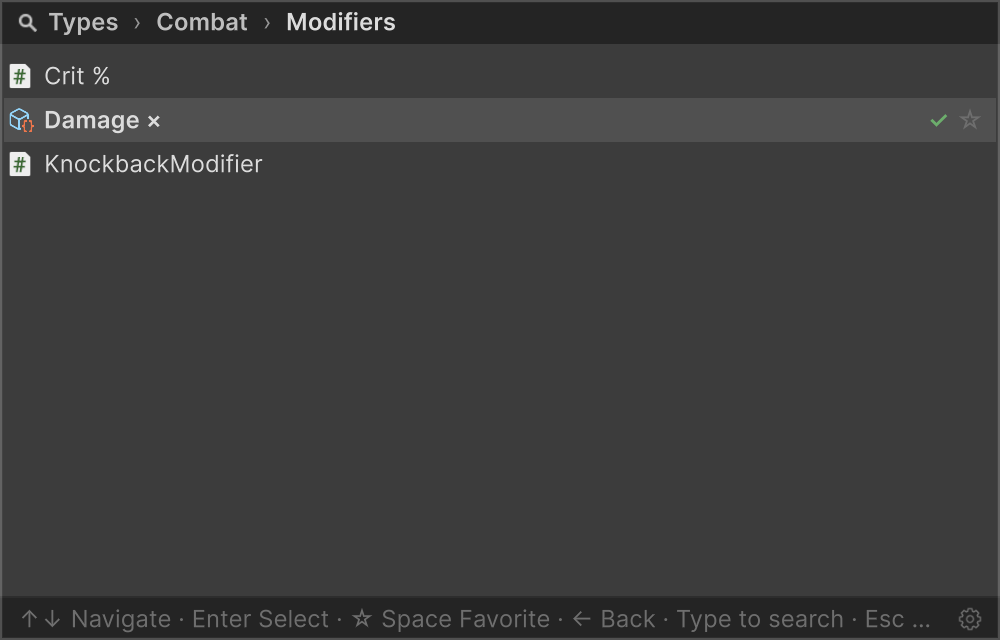
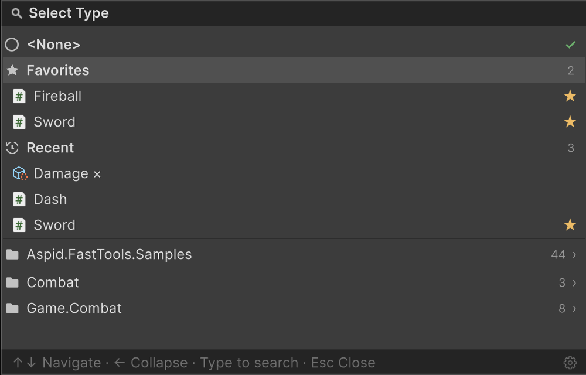

# Serializable Type System

Поле `SerializableType<T>` показывает в инспекторе типы, совместимые с `T`, сохраняет выбранный тип вместе с компонентом или ассетом и возвращает его в коде как `System.Type`. Экземпляр по этому типу создаёт ваш код.

## Быстрый старт

Примеры на этой странице добавляют поля в компонент `WeaponMount` и используют иерархию оружия:

```csharp
public interface ITwoHanded { }

public abstract class Weapon { }
public abstract class MeleeWeapon : Weapon { }
public abstract class RangedWeapon : Weapon { }

public sealed class Sword : MeleeWeapon { }
public sealed class Axe : MeleeWeapon, ITwoHanded { }
public sealed class Bow : RangedWeapon, ITwoHanded { }

public sealed class WeaponMount : MonoBehaviour { }
```

| До — строка с именем типа | После — SerializableType |
|---|---|
| <pre lang="csharp"><code>[SerializeField]&#10;private string _primaryWeaponName;&#10;&#10;public System.Type PrimaryWeapon =&gt;&#10;    string.IsNullOrEmpty(&#10;        _primaryWeaponName)&#10;        ? null&#10;        : System.Type.GetType(&#10;            _primaryWeaponName, false);</code></pre> | <pre lang="csharp"><code>[TypeSelector(Allow = TypeAllow.None)]&#10;[SerializeField]&#10;private SerializableType&lt;Weapon&gt;&#10;    _primaryWeapon;&#10;&#10;public System.Type PrimaryWeapon =&gt;&#10;    _primaryWeapon?.Type;</code></pre> |

Обёртка показывает селектор и без атрибута; `Allow = TypeAllow.None` убирает из списка абстрактные `Weapon`, `MeleeWeapon` и `RangedWeapon`.


Выбор сериализуемого типа в инспекторе

## Какой инструмент выбрать

| Задача | Инструмент |
|---|---|
| Хранить тип, включая generic-типы и типы, объявленные внутри другого класса | [`SerializableType`](#serializabletype) |
| Сохранять выбор при переименовании класса и его файла | [`SerializableMonoScript`](#serializablemonoscript) |
| Добавить выбор типа к строке или ограничить поле | [`TypeSelector`](#typeselectorattribute) |
| Хранить экземпляр в `[SerializeReference]` | [SerializeReference Selector](03-serialize-reference-selector.md) |
| Настроить имя, группу, иконку или видимость кандидата | [`TypeSelectorDisplay`](#typeselectordisplay) |
| Открыть окно из редакторского кода | [`TypeSelectorWindow`](#typeselectorwindow) |

## SerializableType

`SerializableType` хранит assembly-qualified name — имя типа вместе со сборкой.

| Вариант | Ограничение выбора |
|---|---|
| `SerializableType` | Без базового ограничения |
| `SerializableType<T>` | Типы, совместимые с `T`, включая реализации интерфейса |

Оба варианта неявно преобразуются в `System.Type` и имеют публичный конструктор с аргументом `Type`:

```csharp
var primary = new SerializableType<Weapon>(typeof(Sword));
System.Type type = primary;

var empty = new SerializableType<Weapon>(null);
```

Тип должен быть совместим с `T`, иначе конструктор выбросит `ArgumentException`. Для пустой обёртки передайте `null`; публичного конструктора без аргументов нет.

| Свойство или вызов | `primary` | `empty` | Потерянный тип |
|---|---|---|---|
| `Type` | `typeof(Sword)` | `null` | `null` |
| `AssemblyQualifiedName` | Имя `Sword` со сборкой | `""` | Сохранённое имя |
| `BaseType` | `typeof(Weapon)` | `typeof(Weapon)` | `typeof(Weapon)` |
| `ToString()` | `"Sword"` | `""` | Сохранённое имя |

Потерянный тип — сохранённое имя, которое перестало разрешаться после переименования класса, namespace или сборки; инспектор показывает его как `<Missing …>` с этим именем. У `SerializableType` без `T` свойство `BaseType` равно `typeof(object)`. Для найденного типа `ToString()` возвращает `Type.Name`, поэтому у generic-типа это ``Amplify`1``, а не подпись из окна выбора.

> [!NOTE]
> Unity сериализует обёртку по объявленному типу поля. Если присвоить `SerializableType<T>` в поле `SerializableType`, выбранный тип переживёт загрузку, а ограничение `T` — нет. Объявляйте generic-вариант непосредственно у поля. Это же правило относится к `SerializableMonoScript<T>`.

## SerializableMonoScript

`SerializableMonoScript` связывает выбранный тип с ассетом скрипта и сохраняет выбор при согласованном переименовании или переносе класса и файла. Выберите тип в инспекторе или перетащите `.cs` из **Project**.

| Хранение имени | Связь с ассетом скрипта |
|---|---|
| <pre lang="csharp"><code>[TypeSelector(Allow = TypeAllow.None)]&#10;[SerializeField]&#10;private SerializableType&lt;Weapon&gt;&#10;    _primaryWeapon;</code></pre> | <pre lang="csharp"><code>[TypeSelector(Allow = TypeAllow.None)]&#10;[SerializeField]&#10;private SerializableMonoScript&lt;Weapon&gt;&#10;    _primaryWeapon;</code></pre> |

| Возможность | SerializableType | SerializableMonoScript |
|---|---|---|
| Выбор через окно поиска | Да | Да, только типы с подходящим скриптом |
| Generic-типы и типы, объявленные внутри другого класса | Да | Нет |
| Типы без своего `.cs` в проекте: из DLL и модулей Unity | Да | Нет |
| Обновление имени после переименования скрипта | Вручную | Из сохранённого MonoScript при сериализации |
| Создание из кода с `Type` | Публичный конструктор | Публичного конструктора нет |

Подходящий скрипт — файл runtime-сборки с классом верхнего уровня, не generic, чьё имя совпадает с именем файла: для `Sword` это `Sword.cs`. При переименовании сохраняйте ассет и его `.meta`. Если Unity перестаёт распознавать класс, обёртка оставляет последнее известное имя.

Выбранный тип читается через `.Type` или неявное преобразование в `System.Type`, как у `SerializableType`. В плеере обёртка тоже хранит только имя типа.

## TypeSelectorAttribute

Атрибут настраивает выбор у поля и добавляет селектор обычной строке.

| Поле | Результат выбора |
|---|---|
| `string` | Записывается assembly-qualified name |
| `SerializableType` / `SerializableMonoScript` | Настраивается выбор обёртки |
| `[SerializeReference]` | Создаётся экземпляр выбранной реализации |

### Ограничения и коллекции

```csharp
[TypeSelector(typeof(Weapon), Allow = TypeAllow.None)]
[SerializeField] private string _backupWeaponName;

[TypeSelector(typeof(ITwoHanded), Allow = TypeAllow.None)]
[SerializeField] private SerializableType<MeleeWeapon> _heavyWeapon;

[TypeSelector(Allow = TypeAllow.None)]
[SerializeField] private SerializableType<Weapon>[] _loadout;
```

`_heavyWeapon` предлагает только `Axe`: `Sword` не реализует `ITwoHanded`, а `Bow` не наследует `MeleeWeapon`. Ограничения действуют одновременно (**И**) на полях любого вида. Массивы и списки получают выбор для каждого элемента.

У `[SerializeReference]` первым ограничением служит тип поля, поэтому и здесь доступен только `Axe`:

```csharp
[TypeSelector(typeof(ITwoHanded))]
[SerializeReference] private MeleeWeapon _heldWeapon;
```

Чтобы разрешить определённый набор классов, дайте им общий интерфейс или базовый класс и укажите его: перечисление самих классов (`typeof(Sword), typeof(Axe)`) оставит список пустым, и анализатор `AFT0009` об этом предупредит. Подробнее — [настройка селектора экземпляров](03-serialize-reference-selector.md#настройка-выбора).

### Конструкторы и свойства

| Свойство | По умолчанию | Поведение |
|---|---|---|
| `Allow` | `TypeAllow.All` | `Abstract` добавляет абстрактные классы, `Interface` — интерфейсы; `All` включает обе категории, `None` исключает их. На `[SerializeReference]` игнорируется |
| `Required` | `false` | Предупреждает о пустом имени типа или `null` в managed-ссылке |

Статические классы в списке не отображаются. Для строки или обёртки `Allow` фильтрует категории типов, но не проверяет наличие конструктора без параметров.

В инспекторе runtime-объекта селектор также не предлагает типы из editor-only сборок (`UnityEditor`, asmdef только для Editor и папки `Editor`): в билде плеера они не найдутся. Поля editor-only объектов, например окон и настроек редактора, по-прежнему предлагают любые типы.

<details>
<summary>Формы аргументов TypeSelector</summary>

```csharp
[TypeSelector]
[TypeSelector(typeof(Weapon))]
[TypeSelector(typeof(MeleeWeapon), typeof(ITwoHanded))]
[TypeSelector("Namespace.TypeName, AssemblyName")]
[TypeSelector(nameof(_weaponClass))]
```

На поле можно поставить один `[TypeSelector]`. Он принимает аргументы `Type` или `string`: один, несколько через запятую (`params`) либо массив; `Type` и `string` в одном атрибуте не смешиваются. Без аргументов атрибут не добавляет ограничений. Строка сначала ищется как член класса, где объявлено поле; если такого члена нет — как имя типа.

</details>

### Обязательное поле

```csharp
[TypeSelector(typeof(Weapon), Required = true)]
[SerializeField] private string _secondaryWeapon;
```



Пустое обязательное поле показывает предупреждение под селектором

С `Required = true` пункт `<None>` остаётся доступным. У строки или обёртки проверяется пустое сохранённое имя; потерянный тип с непустым именем эту проверку проходит.

Настройка проверки по всему проекту и в CI описана в разделе [проверки обязательных полей](04-serialize-reference-tooling.md#где-проверяются-обязательные-поля).

<a id="dynamic-base-types-via-member-references"></a>

## Ограничение из другого поля

Передайте `nameof(...)`, чтобы текущее значение поля или свойства управляло списком кандидатов:

```csharp
[SerializeField] private SerializableType<Weapon> _weaponClass;

[TypeSelector(nameof(_weaponClass), Allow = TypeAllow.None)]
[SerializeField] private string _weaponName;
```

Выберите `MeleeWeapon` в **Weapon Class** — **Weapon Name** предложит `Sword` и `Axe`. Смена ограничения не очищает ранее выбранное имя: проверьте зависимое поле и при необходимости выберите тип заново.

| Источник ограничения | Поддержка |
|---|---|
| `System.Type` | Один тип |
| `string` | Имя типа, разрешаемое через `Type.GetType` |
| `SerializableType`, `SerializableMonoScript` и их generic-варианты | Разрешённое значение `.Type` |
| Массив этих значений | Несколько ограничений одновременно; `List<T>` не поддерживается |

Источник — нестатическое поле или читаемое свойство класса, где объявлено поле с атрибутом, включая унаследованные; индексаторы не поддерживаются. У поля внутри `[Serializable]`-класса или элемента списка источник читается из того же экземпляра. Пустой или неразрешённый источник не добавляет ограничения. У generic-обёртки её собственный `T` продолжает ограничивать выбор.

Ошибки в строковых аргументах находят анализаторы: `AFT0006` — строка не указывает ни на член, ни на тип; `AFT0007` — член не может задать базовые типы; `AFT0008` — строка не похожа на имя типа. Если имя типа записано верно, но такой тип не загружен, предупреждение показывает инспектор.



Ограничение не разрешилось — инспектор показывает предупреждение под полем

## TypeSelectorDisplay

`TypeSelectorDisplay` задаёт подпись, группу, иконку и подсказку типа в окне выбора. Добавим в `WeaponMount` поле `SerializableType<CombatModifier> _modifier` и настроим, как в нём выглядит `DamageModifier`:

```csharp
using Aspid.FastTools.Types;

public abstract class CombatModifier { }

[TypeSelectorDisplay(
    Name = "Damage ×",
    Group = "Combat/Modifiers",
    Tooltip = "Scales incoming damage",
    Icon = "d_ScriptableObject Icon")]
public sealed class DamageModifier : CombatModifier { }
```



Имя Damage ×, иконка и группа Combat/Modifiers в окне выбора

| Свойство | Результат |
|---|---|
| `Name` | Подпись в списке и закрытом поле. Поиск продолжает находить настоящее имя типа |
| `Group` | Группировка вместо namespace; `/` разделяет уровни |
| `Tooltip` | Текст подсказки при наведении |
| `Icon` | Имя `EditorGUIUtility.IconContent`, путь к ассету от `Assets/` или `Packages/` с расширением либо путь в `Resources` без расширения |
| `Hidden` | При `true` скрывает тип из обычного выбора. Не наследуется и не мешает присваиванию из кода или отображению сохранённого значения |

> [!NOTE]
> `[TypeSelector]` и `[TypeSelectorDisplay]` помечены `[Conditional("UNITY_EDITOR")]`. В классах из внешней DLL, собранной без этого символа, их настроек нет, включая `Hidden`.

## TypeSelectorWindow

Окно группирует типы по namespace или `Group` и различает одинаковые имена по сборкам. Через `TypeSelectorWindow` его можно открыть из своего инспектора или окна редактора.



Избранные и недавние типы на корневой странице селектора

| Действие | Управление |
|---|---|
| Перемещение / выбор | Стрелки вверх и вниз / Enter |
| Вход в группу / возврат | Стрелка вправо / стрелка влево или хлебные крошки |
| Поиск | Начните печатать |
| Переключение избранного | Space или звёздочка при наведении |
| Очистка значения | `<None>` |
| Закрытие | Escape; при открытом поиске первые нажатия очищают и сворачивают его |

Раздел **Favorites** и длина истории **Recent** (0 скрывает её) настраиваются во вкладке **Settings** окна FastTools, там же оба списка очищаются. Шестерёнка в окне выбора открывает эту вкладку.

### Generic-типы

При выборе открытого generic-типа окно предлагает выбрать аргументы, а затем возвращает сконструированный закрытый тип. Например, для `Amplify<T> : CombatModifier` с ограничением `where T : StatusEffect` окно предложит наследников `StatusEffect`, и после выбора `Burning` в `_modifier` запишется `Amplify<Burning>`. Generic-аргумент тоже может быть generic-типом: сначала окно попросит задать его собственные аргументы. Если все аргументы выводятся из типа поля, закрытый тип возвращается сразу.


Выбор аргумента generic-типа в селекторе

Аргумент должен удовлетворять ограничениям generic-параметра; интерфейсы, абстрактные классы и скрытые типы в аргументах не предлагаются, `[Serializable]` не требуется. Для `[SerializeReference]` действуют дополнительные [правила сериализуемости и вывода аргументов](03-serialize-reference-selector.md#generic-типы).

### Открытие из кода

`screenRect` — прямоугольник кнопки в **экранных координатах**, `selectedTypeName` — строка текущего выбора:

```csharp
using Aspid.FastTools.Types;
using Aspid.FastTools.Types.Editors;

TypeSelectorWindow.Show(
    screenRect,
    new TypeSelectorFilter
    {
        Types = new[] { typeof(Weapon) },
        Allow = TypeAllow.None
    },
    currentAqn: selectedTypeName,
    onSelected: aqn => selectedTypeName = aqn);
```

Обработчик получает assembly-qualified name или `null` при выборе `<None>`. Закрытие окна без выбора обработчик не вызывает.

`currentAqn` задаёт текущую отметку: пустая строка (значение по умолчанию) отмечает `<None>`, а `null` оставляет выбор без отметки. Без отметки остаётся и имя, которого нет в списке, поэтому Enter сразу после открытия не сотрёт сохранённое имя потерянного типа.

### Фильтры окна

`TypeSelectorFilter` — структура. У `default` пустой `Types` пропускает любые типы, а `Allow` равен `None` — в отличие от атрибута `[TypeSelector]`, где по умолчанию `All`. Задавайте `Allow` явно, когда нужны абстрактные классы или интерфейсы.

<details>
<summary>Свойства фильтра окна</summary>

| Свойство | Назначение |
|---|---|
| `Types` | Все базовые типы, которым должен соответствовать кандидат |
| `Allow` | Разрешённые категории: абстрактные классы и интерфейсы |
| `Predicate` | Дополнительное условие после проверки типа и категории |
| `AdditionalTypes` | Кандидаты, обходящие `Types`, `Allow` и `Predicate`; фильтр `Hidden` сохраняется |
| `ArgumentFilter` | Дополнительный фильтр аргументов, выбираемых вручную |
| `InferredArgumentFilter` | Фильтр аргументов, выведенных из типа поля |
| `IncludeHidden` | Показывать типы с `Hidden = true` |
| `HideNoneOption` | Скрыть `<None>` на корневой странице |

</details>

## Пример в пакете

Выбор типов врагов и паттерна расстановки в инспекторе показан в примере [Types](../../Samples~/Types/Documentation/README.ru.md), а окно выбора, открытое из редакторского кода, — в [EditorTools](../../Samples~/EditorTools/Documentation/README.ru.md).


Волна обычных и элитных врагов движется к центру.
