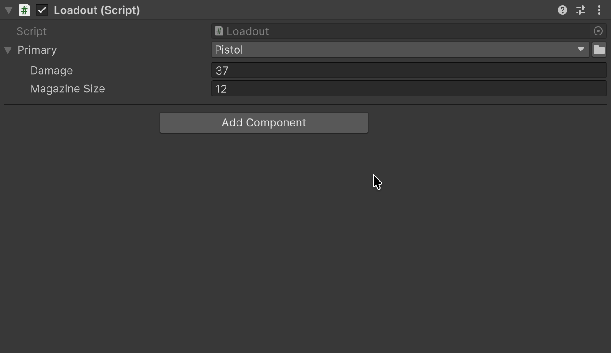
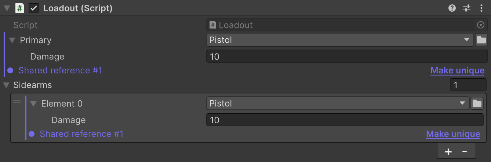

# SerializeReference Selector

Реализацию интерфейса выбирают прямо в инспекторе — из списка с поиском, без своего редактора.

<a id="inspector-type-dropdown"></a>

## Быстрый старт

| До — Unity API | После — FastTools |
|---|---|
| <pre lang="csharp"><code>[SerializeReference]&#10;private IWeapon _primary =&#10;    new Pistol();</code></pre> | <pre lang="csharp"><code>[TypeSelector]&#10;[SerializeReference]&#10;private IWeapon _primary;</code></pre> |

## Какие классы в списке

Список строится по типу поля; атрибут может сузить его дополнительными типами. Для полей <code lang="class-name">Loadout</code>:

| Поле с <code lang="csharp">[TypeSelector]</code> | Классы в списке |
|---|---|
| <code lang="csharp">IWeapon _primary</code> | Crossbow, Pistol, Railgun, Shotgun, Sword |
| <code lang="csharp">IWeapon _meleeBackup</code> и <code lang="csharp">typeof(IMelee)</code> | Sword |
| <code lang="csharp">StatusEffect _onHit</code>, абстрактный класс | BurnEffect, FreezeEffect |
| <code lang="csharp">Modifier&lt;float&gt; _damageModifier</code> | DamageModifier, Modifier&lt;Single&gt; |
| <code lang="csharp">List&lt;IModifier&gt; _perks</code> | AmmoModifier, DamageModifier, NameModifier, Modifier&lt;T&gt; с выбором <code lang="class-name">T</code> |

В списке только конкретные классы, не наследующие <code lang="class-name">UnityEngine.Object</code>. В инспекторе runtime-объекта классы из editor-only сборок (`UnityEditor`, asmdef только для Editor, папки `Editor`) не предлагаются: билд плеера не сможет их создать. Аргументы generic-класса выводятся из типа поля; если вывести их нельзя, окно спрашивает каждый. Ограничение можно взять и [из другого поля](02-serializable-types.md#ограничение-из-другого-поля): <code lang="csharp">[TypeSelector(nameof(_category))]</code>.

## Как класс выглядит в списке

<code lang="csharp">[TypeSelectorDisplay]</code> на классе меняет только его строку в списке:

| Параметр на <code lang="class-name">Shotgun</code> | В списке |
|---|---|
| <code lang="csharp">Group = "Weapons/Ranged"</code> | Weapons → Ranged → Shotgun |
| <code lang="csharp">Name = "Дробовик"</code> | Дробовик; поиск находит и по Shotgun |
| <code lang="csharp">Tooltip = "Несколько дробин"</code> | Подсказка при наведении |
| <code lang="csharp">Icon = "Icons/Shotgun"</code> | Иконка из `Resources`, по пути ассета или встроенная |
| <code lang="csharp">Hidden = true</code> | Нет в списке; уже назначенный Shotgun остаётся в поле |

Подклассы настроек не наследуют.

## Обязательное поле

```csharp
[TypeSelector(Required = true)]
[SerializeReference] private IWeapon _primary;
```

У пустого поля появляется **Required reference is not set**, выбрать `<None>` по-прежнему можно. В CI такие поля проверяет флаг [`-srGateRequired`](04-serialize-reference-tooling.md#запуск-в-ci).

## Списки и вложенные поля

В списке с <code lang="csharp">[TypeSelector]</code> кнопка **+** открывает выбор класса и добавляет новый экземпляр; `<None>` добавляет пустой элемент; при нескольких выбранных объектах каждый получает свой экземпляр в одной группе Undo. Поле <code lang="csharp">[SerializeReference]</code> внутри выбранного класса — например, <code lang="csharp">_chargeEffect</code> у <code lang="class-name">Railgun</code> — получает селектор и без атрибута.

Вложенное поле сохраняет собственный drawer вместо автоматического селектора, если у него есть <code lang="csharp">[TypeSelector]</code>, атрибут с `[CustomPropertyDrawer]` или `[CustomPropertyDrawer]` для его объявленного типа, базового класса, интерфейса или открытого generic-типа. В списке такой drawer рисует каждый элемент, а **+** по-прежнему открывает выбор класса. Drawer только для выбранного класса, например <code lang="class-name">Pistol</code>, селектор не заменяет.

## Смена класса

Новый экземпляр получает значения полей с теми же именами:

| Поле | <code lang="class-name">Pistol</code> | → <code lang="class-name">Shotgun</code> |
|---|---|---|
| <code lang="csharp">_damage</code> | <code lang="csharp">37</code> | <code lang="csharp">37</code> |
| <code lang="csharp">_magazineSize</code> | <code lang="csharp">12</code> | — |
| <code lang="csharp">_pellets</code> | — | <code lang="csharp">8</code>, начальное значение |



Смена Pistol на Shotgun сохраняет Damage = 37

Вложенная ссылка с тем же именем переходит в новый класс тем же экземпляром, а не копией.

## Меню заголовка

Правый клик по заголовку поля:

| Пункт | Что делает |
|---|---|
| **Copy / Paste Serialize Reference** | Переносит класс и данные в другое подходящее поле; копия пустого поля очищает поле при вставке |
| **Save as Template…**, **Paste Template** | Сохраняет значение под именем и создаёт из него экземпляр; шаблоны хранятся только на этом компьютере |
| **Paste Template → Remove Missing (N)…** | После подтверждения удаляет шаблоны, класс которых не загружается; виден только когда такие есть |
| **Link to Existing** | Указывает поле на экземпляр из другого поля того же объекта |
| **Find Usages of Pistol** | Ищет класс в проекте через Unity Search |
| **Create New Script…** | Создаёт класс <code lang="csharp">[Serializable]</code> под тип поля и назначает его после компиляции |

Скрипт `.cs`, перетащенный из Project на заголовок, назначает свой класс с переносом данных, как при выборе из списка.

> [!WARNING]
> Copy/Paste и шаблоны не переносят вложенные поля <code lang="csharp">[SerializeReference]</code>: скопированный <code lang="class-name">Railgun</code> вставится без <code lang="csharp">_chargeEffect</code>.

## Общие ссылки

Два поля объекта могут указывать на один экземпляр: правка через одно видна в другом. Такие поля помечены **Shared reference #N**, а **Make unique** даёт полю собственную копию вместе с вложенными ссылками.



Make unique создаёт независимую копию общей ссылки

Дублированный элемент списка получает свою копию сам — это настройка **Auto de-alias duplicated list elements** в [общих настройках](04-serialize-reference-tooling.md#общие-и-личные-настройки).

<a id="repairing-broken-references"></a>

## Восстановление потерянного типа

После переименования, переноса или удаления класса у поля появляется **Missing type**, а данные остаются в ассете.


Потерянная ссылка с Fix и подсказкой → Pistol? в инспекторе

| Действие | Что делает |
|---|---|
| **Fix** | Открывает выбор класса, включая скрытые через <code lang="csharp">Hidden</code> |
| **→ Pistol?** | Назначает предложенный класс; причина в подсказке: [`[MovedFrom]`](04-serialize-reference-tooling.md#миграции-с-movedfrom), то же или похожее имя, общие поля |

Для ассета на диске исправление переписывает файл, и Undo его не отменит. В сцене и Prefab Mode оно применяется в памяти и восстанавливает только поля верхнего уровня. Пока вы не сохранили, Undo возвращает отсутствующую ссылку вместе с данными; сохранение (в том числе Auto Save в Prefab Mode) делает исправление окончательным и очищает историю Undo этого объекта. Если у ассета есть несохранённые изменения, Fix сначала предложит сохранить его: реимпорт их отбросил бы.

Fix недоступен при нескольких выбранных объектах, в несохранённой сцене и на компоненте, унаследованном от префаба. Если класс отсутствует в исходном префабе, исправляйте его там (имя указано в подсказке); если экземпляр задаёт класс через override, выберите новый класс на экземпляре или отмените override. Пока префаб открыт в Prefab Mode, Fix на его ассете в окне Project отклоняется: исправляйте поле в Prefab Mode. Для остального используйте [SerializeReference Tooling](04-serialize-reference-tooling.md).

## Собственный IMGUI-инспектор

В своём IMGUI-редакторе список получает **+** с выбором класса через <code lang="csharp">SerializeReferenceIMGUIList.Draw</code>; остальные поля рисует обычный <code lang="csharp">PropertyField</code>.

| До — Unity API | После — FastTools |
|---|---|
| <pre lang="csharp"><code>EditorGUILayout.PropertyField(&#10;    serializedObject&#10;        .FindProperty("_sidearms"));</code></pre> | <pre lang="csharp"><code>SerializeReferenceIMGUIList.Draw(&#10;    serializedObject&#10;        .FindProperty("_sidearms"),&#10;    new GUIContent("Sidearms"),&#10;    typeof(IWeapon));</code></pre> |

Дополнительные ограничения <code lang="csharp">[TypeSelector]</code> передаются следующими аргументами: <code lang="csharp">Draw</code> их с поля не читает.

## Ограничения

- **Глубина.** Вложенные ссылки получают селектор до восьмого уровня, глубже поле рисует Unity.
- **Конструктор.** Экземпляр создаётся конструктором без параметров, в том числе непубличным; если его нет — без инициализаторов полей.
- **<code lang="csharp">Allow</code> на <code lang="csharp">[SerializeReference]</code>** не действует — анализатор `AFT0002` предупредит об этом.
- **Пустой список.** Если ограничениям не отвечает ни один класс, анализаторы `AFT0003`, `AFT0005` и `AFT0009` предупредят об этом, а на поле с типом из <code lang="class-name">UnityEngine.Object</code> — ошибка `AFT0004`.

## Пример в пакете

Поля <code lang="class-name">Loadout</code> с этой страницы и ассеты с потерянными типами для **Fix** есть в примере [SerializeReferences](../../Samples~/SerializeReferences/Documentation/README.ru.md).
