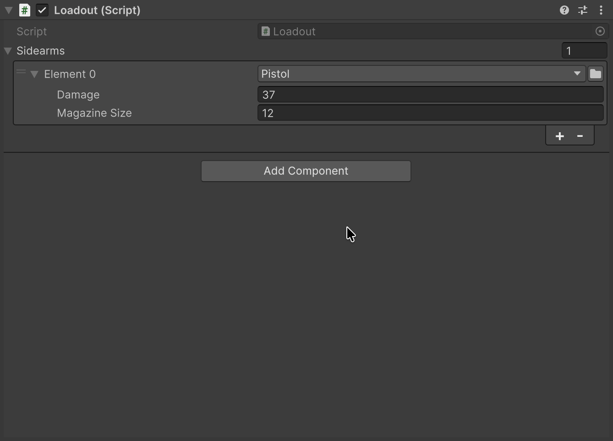

# SerializeReference Selector

Реализацию выбирают прямо в инспекторе — из списка с поиском, без своего редактора.

## Быстрый старт

| До — Unity API | После — FastTools |
|---|---|
| <pre lang="csharp"><code>[SerializeReference]&#10;private IWeapon _primary =&#10;    new Pistol();</code></pre> | <pre lang="csharp"><code>[TypeSelector]&#10;[SerializeReference]&#10;private IWeapon _primary;</code></pre> |

## Какие классы в списке

Поле <code lang="class-name">IWeapon</code> предлагает конкретные реализации этого интерфейса, например <code lang="class-name">Pistol</code> и <code lang="class-name">Shotgun</code>. Выбор создаёт экземпляр класса; `<None>` очищает поле.

Дополнительные ограничения, обязательные поля и оформление списка — на странице [TypeSelector](03-type-selector.md).

- <code lang="csharp">Allow</code> здесь не действует: нужны типы, экземпляры которых можно создать. Анализатор `AFT0002` сообщает о лишней настройке.
- Аргументы generic-класса выводятся из типа поля; если вывести их нельзя, окно предлагает выбрать типы, которые Unity умеет сериализовать.
- Несовместимые ограничения оставляют список пустым; анализаторы `AFT0003`, `AFT0005` и `AFT0009` сообщают о них при компиляции.

## Списки

В списке с <code lang="csharp">[TypeSelector]</code> кнопка «+» открывает выбор класса и добавляет новый экземпляр, а `<None>` — пустой элемент. При нескольких выбранных объектах каждый получает свой экземпляр, всё в одной группе Undo.

## Смена класса

При смене класса FastTools пытается перенести совместимые значения полей с теми же именами. Поля, которые перенести не удалось, остаются со значениями нового экземпляра:

| Поле | <code lang="class-name">Pistol</code> | → <code lang="class-name">Shotgun</code> |
|---|---|---|
| **Damage** | 37 | 37 |
| **Magazine Size** | 12 | — |
| **Pellets** | — | 8, начальное значение |

Вложенная ссылка переносится тем же экземпляром, если имя и тип поля совместимы.

Перетащить `.cs` из **Project** на заголовок поля — ещё один способ выбрать класс.

## Меню заголовка

Правый клик по заголовку поля:

| Пункт | Что делает |
|---|---|
| **Copy Serialize Reference** | Копирует класс и данные поля; копия живёт до перезагрузки домена |
| **Paste Serialize Reference** | Вставляет копию в поле подходящего типа; копия пустого поля очищает его |
| **Find Usages of Pistol** | Ищет класс в проекте через Unity Search |
| **Create New Script…** | Создаёт <code lang="csharp">[Serializable]</code> класс под тип поля и назначает его после компиляции |
| **Save as Template…** | Сохраняет значение под именем; шаблоны хранятся в настройках редактора на этом компьютере, не в проекте |
| **Paste Template → …** | Создаёт экземпляр из шаблона; в списке только подходящие полю |

> [!WARNING]
> Copy/Paste и шаблоны не переносят вложенные поля <code lang="csharp">[SerializeReference]</code>: вставленный объект потеряет такие ссылки.

**Paste Template → Remove Missing (N)…** удаляет шаблоны, класс которых больше не загружается. Пункт появляется, если такие шаблоны есть.

## Общие ссылки

**Link to Existing → …** в меню заголовка связывает поле с экземпляром из другого поля того же объекта.

Два поля объекта могут указывать на один экземпляр: правка через одно видна в другом. Такие поля помечены **Shared reference #N**, а **Make unique** даёт полю собственную копию вместе с вложенными ссылками.

Продублированный элемент списка получает собственный экземпляр, а не ссылку на тот же. За это отвечает настройка **Auto de-alias duplicated list elements** в **Tools → Aspid 🐍 → FastTools → Settings**, по умолчанию она включена.

## Потерянный тип

Если поле показывает **Missing type**, перейдите к [восстановлению SerializeReference](06-serialize-reference-tooling.md). Там описаны **Fix**, групповой ремонт и различия в сохранении данных и Undo.

## Собственный инспектор

Поле с <code lang="csharp">[TypeSelector]</code> в своём редакторе рисует обычный <code lang="class-name">PropertyField</code>: выбор класса и «+» списка появляются сами, вызывать пакет не нужно.

| UI Toolkit — CreateInspectorGUI | IMGUI — OnInspectorGUI |
|---|---|
| <pre lang="csharp"><code>new PropertyField(&#10;    serializedObject&#10;        .FindProperty("_sidearms"))</code></pre> | <pre lang="csharp"><code>EditorGUILayout.PropertyField(&#10;    serializedObject&#10;        .FindProperty("_sidearms"));</code></pre> |

Если атрибута нет или элемент списка рисуется отдельно, используйте [SerializeReferenceEditorGUI](https://vpdpersonal.github.io/Aspid.FastTools/ru/api/Aspid.FastTools.SerializeReferences.Editors.SerializeReferenceEditorGUI) или [SerializeReferenceIMGUIList](https://vpdpersonal.github.io/Aspid.FastTools/ru/api/Aspid.FastTools.SerializeReferences.Editors.SerializeReferenceIMGUIList).

## Пример в пакете

Выбор оружия, списки и общие ссылки показаны в примере [SerializeReferences](../../Samples~/SerializeReferences/Documentation/README.ru.md).
