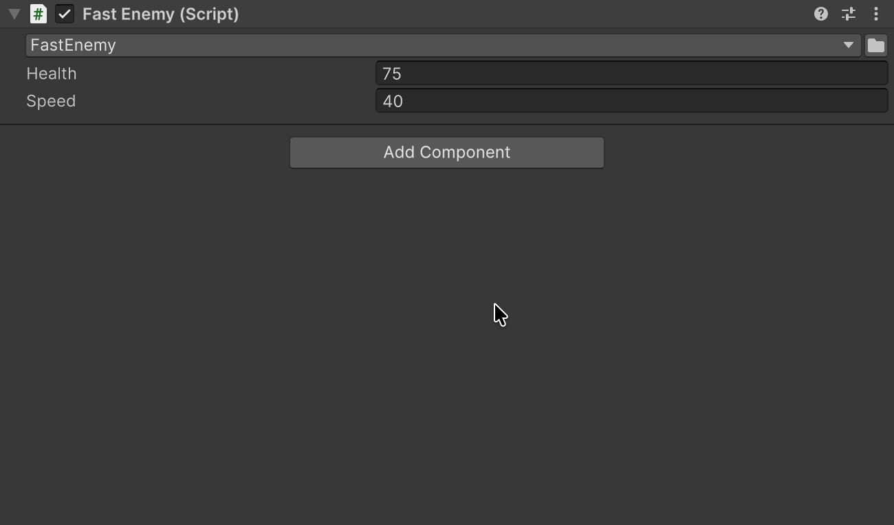

# ComponentTypeSelector

Класс компонента меняется прямо в инспекторе, а общие поля сохраняют значения.

## Быстрый старт

```csharp
public abstract class EnemyBase : MonoBehaviour
{
    [SerializeField] private ComponentTypeSelector _enemyType;
    [SerializeField] private float _health = 100f;
}
```

| FastEnemy.cs | ArmoredEnemy.cs |
|---|---|
| <pre lang="csharp"><code>public sealed class FastEnemy : EnemyBase&#10;&#123;&#10;    [SerializeField]&#10;    private float _speed = 25f;&#10;&#125;</code></pre> | <pre lang="csharp"><code>public sealed class ArmoredEnemy : EnemyBase&#10;&#123;&#10;    [SerializeField]&#10;    private int _armor = 10;&#10;&#125;</code></pre> |

Список предлагает конкретных наследников класса, где объявлено поле; пункта `<None>` нет.



| Поле | FastEnemy | Выбран ArmoredEnemy | Снова FastEnemy |
|---|---|---|---|
| **Health** | 75 | 75 | 75 |
| **Speed** | 40 | — | 25 |
| **Armor** | — | 10 | — |

## Когда тип не меняется

Смена следует правилам **Add Component**: сначала добавляет компоненты из <code lang="csharp">[RequireComponent]</code> нового класса, и один Undo откатывает её вместе с ними. Класс остаётся прежним, а Console показывает предупреждение, если:

- у класса нет своего файла скрипта с тем же именем — например, вложенный класс или второй класс в файле;
- новый класс помечен <code lang="csharp">[DisallowMultipleComponent]</code>, а такой компонент на GameObject уже есть;
- смена убрала бы класс, который нужен другому компоненту;
- новому классу нужен компонент, который нельзя добавить, например абстрактный <code lang="class-name">Collider</code>.

## Связанные возможности

Оформление классов, поиск и избранное описаны на странице [TypeSelector](03-type-selector.md#typeselectordisplay). Здесь список определяется классом, в котором объявлено поле; атрибут <code lang="csharp">[TypeSelector]</code> его не настраивает.

## Пример в пакете

Переключение типа компонента показано в примере [Types](../../Samples~/Types/Documentation/README.ru.md).
