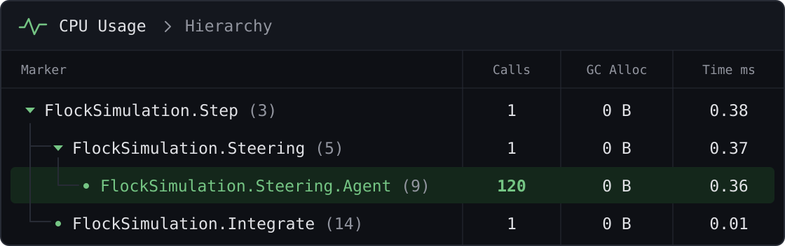
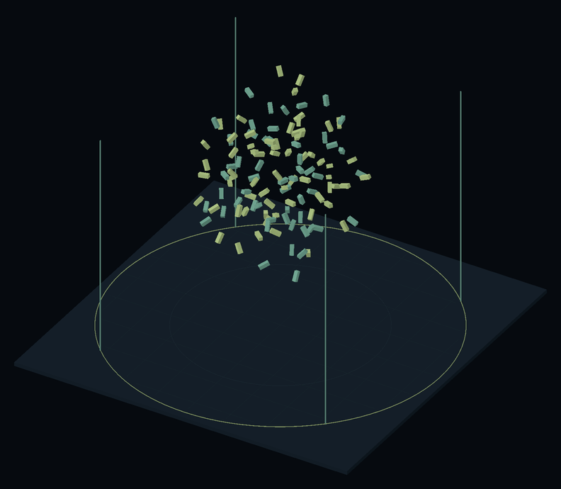

# ProfilerMarkers

Ручной `ProfilerMarker` требует поля и строки с именем на каждый замеряемый участок — и это имя устаревает при первом переименовании. `this.Marker()` размечает участок одной строкой `using`, а имя маркера генератор берёт из кода.

## Быстрый старт

Примеры на этой странице работают с классом `FlockSimulation` из [примера ProfilerMarkers](../../Samples~/ProfilerMarkers/Documentation/README.ru.md):

| До — Unity API | После — FastTools |
|---|---|
| <pre lang="csharp"><code>private static readonly&#10;    ProfilerMarker _marker =&#10;    new("FlockSimulation.Step");&#10;&#10;public void Step()&#10;&#123;&#10;    using var _ = _marker.Auto();&#10;    Integrate();&#10;&#125;</code></pre> | <pre lang="csharp"><code>public void Step()&#10;&#123;&#10;    using var _ = this.Marker();&#10;    Integrate();&#10;&#125;</code></pre> |

Атрибуты и `partial` не нужны: вызов работает в `MonoBehaviour` и обычных C#-классах.

> [!NOTE]
> Если ваши скрипты лежат под своим Assembly Definition, добавьте в его **Assembly Definition References** сборку `Aspid.FastTools` — иначе `this.Marker()` не найдётся.

## Marker()

Возвращает `ProfilerMarker.AutoScope` маркера `Тип.Метод (строка)` для текущей точки вызова: замер идёт до конца блока `using`. Части `Тип` и `Метод` зависят от того, где стоит вызов:

| Где вызван `this.Marker()` | Имя маркера |
|---|---|
| Метод `Step()` | `FlockSimulation.Step (строка)` |
| Конструктор | `FlockSimulation.Ctor (строка)` |
| Аксессор свойства `Speed` | `FlockSimulation.Speed (строка)` |
| Лямбда или локальная функция внутри `Step()` | `FlockSimulation.Step (строка)` |
| Явная реализация `IUpdatable.Tick()` | `FlockSimulation.Tick (строка)` |
| Метод `Move()` вложенного типа `FlockSimulation.Agent` | `Agent.Move (строка)` |
| Метод `Run()` в `Worker<int>`, свой маркер на каждый закрытый тип | `Worker<Int32>.Run (строка)` |

## WithName()

`.WithName("Steering")` меняет в имени маркера метод на свой текст: `FlockSimulation.Step (5)` → `FlockSimulation.Steering (5)`. Тип и строка остаются.

Имя берётся из текста исходника, поэтому подходит только строковый литерал: `"Steering"`, `@"Steering"` или `$"Steering"` без подстановок. С переменной, `const`, `nameof`, конкатенацией или `$"Agent {index}"` маркер сохраняет имя метода, а аргумент всё равно вычисляется при каждом вызове.

```csharp
public void Step()
{
    using var _ = this.Marker();

    using (this.Marker().WithName("Steering"))
        foreach (var agent in _agents)
            using (this.Marker().WithName("Steering.Agent"))
                ComputeSteering(agent);

    using (this.Marker().WithName("Integrate"))
        Integrate();
}
```

## В Profiler

Дерево в **CPU Usage → Hierarchy** повторяет вложенность `using`. Маркер внутри цикла остаётся одной строкой со счётчиком `Calls`: у каждой точки вызова одно статическое поле — его видно в сгенерированном коде ниже. Время на схеме условное.



<details>
<summary>Сгенерированный код</summary>

Сокращённо: без `global::` и повторов атрибута. Номера строк считаются от начала примера `Step()` из раздела `WithName()`; в реальном файле это строки исходника.

```csharp
// <auto-generated>
[GeneratedCode("Aspid.FastTools.Generators.ProfilerMarkersGenerator", "1.0.0")]
internal static class __FlockSimulationProfilerMarkerExtensions
{
    private static readonly ProfilerMarker Step_Marker_Line_3 =
        new("FlockSimulation.Step (3)");
    private static readonly ProfilerMarker Step_Marker_Line_5 =
        new("FlockSimulation.Steering (5)");
    private static readonly ProfilerMarker Step_Marker_Line_7 =
        new("FlockSimulation.Steering.Agent (7)");
    private static readonly ProfilerMarker Step_Marker_Line_10 =
        new("FlockSimulation.Integrate (10)");

    public static ProfilerMarker.AutoScope Marker(
        this FlockSimulation _, [CallerLineNumber] int line = -1)
    {
#if ENABLE_PROFILER
        if (line is 3) return Step_Marker_Line_3.Auto();
        if (line is 5) return Step_Marker_Line_5.Auto();
        if (line is 7) return Step_Marker_Line_7.Auto();
        if (line is 10) return Step_Marker_Line_10.Auto();
#endif
        return default;
    }
}
```

</details>

## Ограничения

- **Только `this`.** Маркеры генерируются для типа, в котором написан вызов: `other.Marker()` на объекте другого типа ничего не измеряет. В статических методах `this` нет, поэтому маркер там не поставить.
- **Суффикс строки.** Номер в имени меняется, когда вызов переезжает на другую строку, поэтому захваты до и после правки сравнивайте по имени без суффикса.

> [!WARNING]
> Вызовы `this.Marker()` на одной и той же строке типа, в том числе в разных файлах `partial`, делят маркер первого из них — замеры второго попадут в чужую строку Profiler.

## Пример в пакете

Все маркеры с этой страницы работают в сцене примера: [ProfilerMarkers](../../Samples~/ProfilerMarkers/Documentation/README.ru.md).



Стая из 120 агентов — те самые 120 вызовов Steering.Agent.
