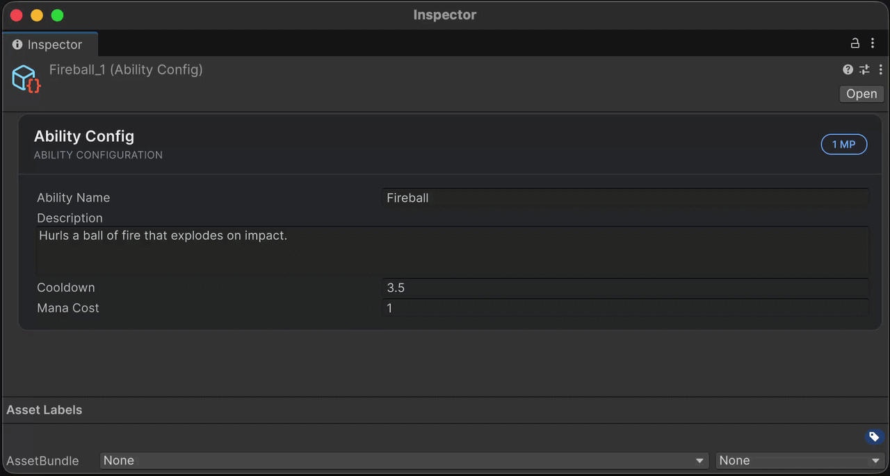

# VisualElement Extensions

Расширения UI Toolkit для построения деревьев элементов, настройки стилей, подписки на события и привязки полей в редакторе. Методы возвращают настраиваемый элемент, чтобы объединять вызовы в цепочки.

## Быстрый старт

Добавьте `using Aspid.FastTools.UIElements;` к скрипту с `using UnityEngine.UIElements;`. Так выглядит одна и та же панель с заголовком:

| До — Unity API | После — FastTools |
|---|---|
| <pre lang="csharp"><code>var title = new Label("Stats");<br />title.style.fontSize = 18;<br /><br />var panel = new VisualElement();<br />panel.style.paddingLeft = 12;<br />panel.style.paddingRight = 12;<br />panel.style.paddingTop = 8;<br />panel.style.paddingBottom = 8;<br />panel.Add(title);</code></pre> | <pre lang="csharp"><code>var panel = new VisualElement()<br />    .SetPaddingX(12)<br />    .SetPaddingY(8)<br />    .AddChild(new Label("Stats")<br />        .SetFontSize(18));</code></pre> |

Добавьте `panel` в `rootVisualElement` окна редактора или в `UIDocument.rootVisualElement` игрового интерфейса.

<details>
<summary>Полный пример: окно Stats с кнопкой</summary>

Создайте `StatsWindow.cs` в папке `Editor`:

```csharp
using UnityEditor;
using UnityEngine;
using UnityEngine.UIElements;
using Aspid.FastTools.UIElements;

public sealed class StatsWindow : EditorWindow
{
    [MenuItem("Tools/Stats")]
    private static void Open() => GetWindow<StatsWindow>("Stats");

    public void CreateGUI()
    {
        rootVisualElement
            .SetPadding(12)
            .AddChild(new Label("Stats").SetFontSize(18))
            .AddChild(new Button(() => Debug.Log("Refresh"))
                .SetText("Refresh")
                .SetMarginTop(8));
    }
}
```

Откройте **Tools → Stats**. Кнопка **Refresh** выведет сообщение в Console.

</details>

### Как читать цепочки

Сеттеры сохраняют тип: `new Button().SetText("Refresh")` возвращает `Button`. Операции с дочерними узлами возвращают **родителя** — следующий вызов продолжает настраивать его:

```csharp
var panel = new VisualElement()
    .AddChild(new Label("Health").SetFontSize(14))
    .SetMarginTop(12); // отступ у panel
```

Цепочки на `element.style`, `textField.textEdition` и `textField.textSelection` возвращают соответствующий интерфейс. Методы-запросы `IsFocused()`, `GetOwnerWindow()` и `TryGetByEnum(...)` возвращают результат запроса.

Основные расширения работают в редакторе и в игре. Для привязки к `SerializedObject` и редакторских команд дополнительно нужен `Aspid.FastTools.UIElements.Editors`; такой код размещайте в editor-сборке, например в папке `Editor`.

## Найти нужное расширение

| Задача | Раздел |
|---|---|
| Построить дерево, задать имя или доступность | [Элементы и дочерние узлы](#элементы-и-дочерние-узлы) |
| Управлять фокусом и клавиатурной навигацией | [Фокус](#фокус) |
| Подключить USS и переключить классы | [USS и классы](#uss-и-классы) |
| Задать размеры, отступы, цвет и рамку | [Стили](#стили) |
| Установить значение поля и подписаться на изменение | [Значения и события](#значения-и-события) |
| Настроить кнопку, поле или изображение | [Конкретные элементы](#конкретные-элементы) |
| Создать список с переиспользованием строк | [Списки и деревья](#списки-и-деревья) |
| Привязать SerializedObject или открыть скрипт | [Расширения редактора](#расширения-редактора) |
| Прочитать собственное свойство USS как enum | [Собственные свойства USS](#собственные-свойства-uss) |

## Элементы и дочерние узлы

Здесь `panel` — родитель, `title`, `content` и `warning` — уже созданные элементы, а `showWarning` — условие добавления предупреждения:

| До — Unity API | После — FastTools |
|---|---|
| <pre lang="csharp"><code>panel.name = "ability-panel";<br />panel.Add(title);<br />panel.Add(content);<br />if (showWarning)<br />    panel.Add(warning);</code></pre> | <pre lang="csharp"><code>panel<br />    .SetName("ability-panel")<br />    .AddChildren(title, content)<br />    .AddChildIf(showWarning, warning);</code></pre> |
| <pre lang="csharp"><code>panel.Insert(0, title);<br />panel.Remove(content);<br />panel.RemoveAt(0);<br />panel.Clear();</code></pre> | <pre lang="csharp"><code>panel<br />    .InsertChild(0, title)<br />    .RemoveChild(content)<br />    .RemoveChildAt(0)<br />    .ClearChildren();</code></pre> |

Эти методы возвращают родительский элемент, поэтому их можно объединять в цепочку. `AddChildren` и `InsertChildren` сохраняют порядок переданных элементов.

`*If` проверяет условие только в момент вызова. Аргументы вычисляются заранее: `AddChildIf(false, new Label("Warning"))` создаст `Label`, но не добавит его в дерево. Для дорогого создания используйте обычный `if`.

<details>
<summary>Все методы элемента и операции с дочерними узлами</summary>

| Метод | Описание |
|-------|----------|
| `SetName(string)` | Устанавливает `element.name` |
| `SetVisible(bool)` | Устанавливает `element.visible` |
| `SetTooltip(string)` | Устанавливает `element.tooltip` |
| `SetUserData(object)` | Устанавливает `element.userData` |
| `SetEnabledSelf(bool)` | Вызывает `element.SetEnabled`, управляя доступностью элемента |
| `SetPickingMode(PickingMode)` | Устанавливает `element.pickingMode` |
| `SetUsageHints(UsageHints)` | Устанавливает `element.usageHints`; задайте до подключения элемента к панели |
| `SetViewDataKey(string)` | Устанавливает `element.viewDataKey` |
| `SetLanguageDirection(LanguageDirection)` | Устанавливает `element.languageDirection` |
| `SetDisablePlayModeTint(bool)` | Устанавливает `element.disablePlayModeTint` |
| `SetDataSource(object)` | Устанавливает `element.dataSource` |
| `SetDataSourceType(Type)` | Устанавливает `element.dataSourceType` |
| `SetDataSourcePath(PropertyPath)` | Устанавливает `element.dataSourcePath` |
| `AddChild(VisualElement)` | Добавляет дочерний элемент, возвращает родителя |
| `AddChildren(params VisualElement[])` | Добавляет несколько дочерних элементов |
| `InsertChild(int, VisualElement)` | Вставляет дочерний элемент по указанному индексу |
| `InsertChildren(int, params VisualElement[])` | Вставляет несколько дочерних элементов начиная с индекса |
| `RemoveChild(VisualElement)` | Удаляет дочерний элемент, возвращает родителя |
| `RemoveChildAt(int)` | Удаляет дочерний элемент по указанному индексу |
| `ClearChildren()` | Удаляет все дочерние элементы |

`AddChildren` и `InsertChildren` принимают `params VisualElement[]`, `IEnumerable<VisualElement>`, `List<VisualElement>`, `Span<VisualElement>` и `ReadOnlySpan<VisualElement>`.

> У каждой операции с дочерними элементами есть `*If`-вариант (`AddChildIf`, `AddChildrenIf`, `InsertChildIf`, `InsertChildrenIf`, `RemoveChildIf`, `RemoveChildAtIf`, `ClearChildrenIf`) с ведущим параметром `bool condition` — операция выполняется только при `condition == true`.

</details>

### Видимость и доступность

Выберите поведение при скрытии или блокировке. Строки показывают отдельные варианты:

| До — Unity API | После — FastTools |
|---|---|
| <pre lang="csharp"><code>element.visible = false;<br />element.style.display =<br />    DisplayStyle.None;<br />element.SetEnabled(false);</code></pre> | <pre lang="csharp"><code>element.SetVisible(false);<br />element.SetDisplay(DisplayStyle.None);<br /><br />element.SetEnabledSelf(false);</code></pre> |

| Вызов | Результат |
|---|---|
| `SetVisible(false)` | Скрывает элемент, сохраняя его место в раскладке |
| `SetDisplay(DisplayStyle.None)` | Убирает элемент и его потомков из отображения и раскладки |
| `SetEnabledSelf(false)` | Отключает взаимодействие с элементом и его потомками |

Чтобы вернуть элемент, используйте `SetVisible(true)`, `SetDisplay(DisplayStyle.Flex)` или `SetEnabledSelf(true)` соответственно. Доступность дочернего элемента также зависит от доступности его родителей.

## Фокус

Для элемента `search`, уже подключённого к панели:

| До — Unity API | После — FastTools |
|---|---|
| <pre lang="csharp"><code>search.focusable = true;<br />search.tabIndex = 0;<br />search.Focus();</code></pre> | <pre lang="csharp"><code>search<br />    .SetFocusable(true)<br />    .SetTabIndex(0)<br />    .FocusSelf();</code></pre> |

`FocusSelf()` вызывает обычный `Focus()`: элемент должен поддерживать фокус. `IsFocused()` сравнивает элемент с `focusController.focusedElement`; для отсоединённого элемента возвращает `false`.

| Метод | Описание |
|-------|----------|
| `FocusSelf()` | Устанавливает фокус на элемент |
| `BlurSelf()` | Снимает фокус с элемента |
| `IsFocused()` | Возвращает, находится ли элемент в фокусе |
| `SetTabIndex(int)` | Устанавливает `element.tabIndex` |
| `SetFocusable(bool)` | Устанавливает `element.focusable` |
| `SetDelegatesFocus(bool)` | Устанавливает `element.delegatesFocus` |

## USS и классы

Здесь `sheet` — загруженный `StyleSheet`, а `isSelected` — текущее состояние панели:

| До — Unity API | После — FastTools |
|---|---|
| <pre lang="csharp"><code>panel.styleSheets.Add(sheet);<br />panel.AddToClassList("ability-card");<br />panel.EnableInClassList(<br />    "selected", isSelected);</code></pre> | <pre lang="csharp"><code>panel<br />    .AddStyleSheet(sheet)<br />    .AddClass("ability-card")<br />    .EnableClass("selected", isSelected);</code></pre> |

`EnableClass` приводит класс к заданному состоянию. `ToggleClass` каждый раз меняет наличие класса на противоположное.

<details>
<summary>Методы классов и таблиц стилей</summary>

| Метод | Описание |
|-------|----------|
| `AddClass(string)` | Добавляет USS-класс |
| `RemoveClass(string)` | Удаляет USS-класс |
| `ClearClasses()` | Удаляет все USS-классы |
| `ToggleClass(string)` | Переключает USS-класс вкл/выкл |
| `EnableClass(string, bool)` | Добавляет или удаляет USS-класс по условию |
| `AddStyleSheet(StyleSheet)` | Добавляет `StyleSheet` |
| `RemoveStyleSheet(StyleSheet)` | Удаляет `StyleSheet` |
| `AddStyleSheetFromResources(string)` | Добавляет таблицу стилей через `Resources.Load` |
| `RemoveStyleSheetFromResources(string)` | Удаляет таблицу стилей, загруженную через `Resources.Load` |

</details>

Для `AddStyleSheetFromResources("UI/AbilityCard")` файл должен лежать в папке `Resources`, например `Assets/Resources/UI/AbilityCard.uss`. Путь указывайте без расширения. Если ресурс не найден, метод выведет предупреждение и вернёт элемент без изменений.

## Стили

Сеттеры записывают inline-стили элемента. Общие значения оформления удобно хранить в USS, а через цепочки задавать размеры и состояния конкретного элемента.

| До — Unity API | После — FastTools |
|---|---|
| <pre lang="csharp"><code>panel.style.flexDirection =<br />    FlexDirection.Row;<br />panel.style.alignItems = Align.Center;<br />panel.style.width = 240;<br />panel.style.height = 48;<br />panel.style.marginTop = 8;</code></pre> | <pre lang="csharp"><code>panel<br />    .SetFlexDirection(FlexDirection.Row)<br />    .SetAlignItems(Align.Center)<br />    .SetSize(240, 48)<br />    .SetMarginTop(8);</code></pre> |

### Стороны, оси и единицы измерения

Общее значение задаёт все стороны; `X` — левую и правую, `Y` — верхнюю и нижнюю. В перегрузках с необязательными параметрами пропущенные стороны сохраняют прежнее значение:

```csharp
panel
    .SetPadding(8)               // все стороны
    .SetPaddingX(12)             // слева и справа
    .SetMargin(top: 4, bottom: 8)
    .SetSize(width: Length.Percent(100));
```

Числа для `StyleLength` задаются в пикселях; для процентов используйте `Length.Percent(...)`. `SetDistance` записывает `top`, `right`, `bottom`, `left` — например, `SetPosition(Position.Absolute).SetDistance(0)` растягивает элемент по границам родителя.

### Настройка через IStyle

Те же методы доступны на `element.style`. Такая цепочка возвращает `IStyle`, поэтому продолжать её методами элемента нужно отдельным вызовом:

| До — Unity API | После — FastTools |
|---|---|
| <pre lang="csharp"><code>panel.style.paddingLeft = 12;<br />panel.style.paddingRight = 12;<br />panel.style.height = 48;</code></pre> | <pre lang="csharp"><code>panel.style<br />    .SetPaddingX(12)<br />    .SetHeight(48);</code></pre> |

### Справочник стилей

Основные примеры рассчитаны на Unity 6.0. В раскрывающихся блоках отмечены методы для более новых версий Unity.

<details>
<summary>Раскладка</summary>

| Метод | Свойство стиля |
|-------|----------------|
| `SetFlexBasis(StyleLength)` | `flexBasis` |
| `SetFlexGrow(StyleFloat)` | `flexGrow` |
| `SetFlexShrink(StyleFloat)` | `flexShrink` |
| `SetFlexWrap(StyleEnum<Wrap>)` | `flexWrap` |
| `SetFlexDirection(FlexDirection)` | `flexDirection` |
| `SetAlignSelf(StyleEnum<Align>)` | `alignSelf` |
| `SetAlignItems(StyleEnum<Align>)` | `alignItems` |
| `SetAlignContent(StyleEnum<Align>)` | `alignContent` |
| `SetJustifyContent(StyleEnum<Justify>)` | `justifyContent` |
| `SetPosition(StyleEnum<Position>)` | `position` |

</details>

<details>
<summary>Размеры</summary>

| Метод | Описание |
|-------|----------|
| `SetSize(StyleLength)` | Устанавливает ширину и высоту одновременно |
| `SetSize(width?, height?)` | Устанавливает ширину и/или высоту независимо |
| `SetMinSize(StyleLength)` | Устанавливает minWidth и minHeight одновременно |
| `SetMinSize(minWidth?, minHeight?)` | Минимальная ширина и/или высота независимо |
| `SetMaxSize(StyleLength)` | Устанавливает maxWidth и maxHeight одновременно |
| `SetMaxSize(maxWidth?, maxHeight?)` | Максимальная ширина и/или высота независимо |
| `SetWidth(StyleLength)` | `width` |
| `SetMinWidth(StyleLength)` | `minWidth` |
| `SetMaxWidth(StyleLength)` | `maxWidth` |
| `SetHeight(StyleLength)` | `height` |
| `SetMinHeight(StyleLength)` | `minHeight` |
| `SetMaxHeight(StyleLength)` | `maxHeight` |

</details>

<details>
<summary>Отступы и позиционирование</summary>

Для `SetMargin`, `SetPadding` и `SetDistance` доступны общее значение, отдельные стороны (`top`, `right`, `bottom`, `left`) и пары осей X/Y.

| Метод | Свойства стиля |
|-------|----------------|
| `SetMargin(…)` / `SetPadding(…)` / `SetDistance(…)` | `Top/Right/Bottom/Left` (общее значение или по стороне) |
| `SetMarginX/Y` · `SetPaddingX/Y` · `SetDistanceX/Y` | Устанавливает горизонтальную (X = `Left`+`Right`) или вертикальную (Y = `Top`+`Bottom`) пару |
| `SetMarginTop/Right/Bottom/Left` | Margin одной стороны |
| `SetPaddingTop/Right/Bottom/Left` | Padding одной стороны |
| `SetTop` / `SetRight` / `SetBottom` / `SetLeft` | Смещение одной стороны (`top` / `right` / `bottom` / `left`) |

> `SetDistance` — обёртка для четырёх свойств `top`/`right`/`bottom`/`left`, используемых при абсолютном позиционировании. `SetTop`, `SetRight`, `SetBottom`, `SetLeft` — это прямые алиасы для одного свойства.

</details>

<details>
<summary>Шрифт</summary>

| Метод | Свойство стиля |
|-------|----------------|
| `SetUnityFont(StyleFont)` | `unityFont` |
| `SetFontSize(StyleLength)` | `fontSize` |
| `SetUnityFontDefinition(StyleFontDefinition)` | `unityFontDefinition` |
| `SetUnityFontStyleAndWeight(StyleEnum<FontStyle>)` | `unityFontStyleAndWeight` |

</details>

<details>
<summary>Начертание шрифта</summary>

Удобные методы для переключения bold / italic без перезаписи другого флага:

| Метод | Описание |
|-------|----------|
| `SetNormalUnityFontStyleAndWeight()` | Сбрасывает в `FontStyle.Normal` |
| `AddBoldUnityFontStyleAndWeight()` | Добавляет bold, сохраняя italic |
| `RemoveBoldUnityFontStyleAndWeight()` | Убирает bold, сохраняя italic |
| `AddItalicUnityFontStyleAndWeight()` | Добавляет italic, сохраняя bold |
| `RemoveItalicUnityFontStyleAndWeight()` | Убирает italic, сохраняя bold |

</details>

<details>
<summary>Текст</summary>

| Метод | Свойство стиля | Примечания |
|-------|---------------|------------|
| `SetWordSpacing(StyleLength)` | `wordSpacing` | |
| `SetLetterSpacing(StyleLength)` | `letterSpacing` | |
| `SetUnityTextAlign(TextAnchor)` | `unityTextAlign` | |
| `SetTextShadow(StyleTextShadow)` | `textShadow` | |
| `SetUnityTextOutlineColor(StyleColor)` | `unityTextOutlineColor` | |
| `SetUnityTextOutlineWidth(StyleFloat)` | `unityTextOutlineWidth` | |
| `SetUnityParagraphSpacing(StyleLength)` | `unityParagraphSpacing` | |
| `SetTextOverflow(StyleEnum<TextOverflow>)` | `textOverflow` | |
| `SetUnityTextOverflowPosition(TextOverflowPosition)` | `unityTextOverflowPosition` | |
| `SetUnityTextGenerator(TextGeneratorType)` | `unityTextGenerator` | Unity 6+ |
| `SetUnityEditorTextRenderingMode(EditorTextRenderingMode)` | `unityEditorTextRenderingMode` | Unity 6+ |
| `SetUnityTextAutoSize(StyleTextAutoSize)` | `unityTextAutoSize` | Unity 6.2+ |
| `SetWhiteSpace(StyleEnum<WhiteSpace>)` | `whiteSpace` | |

</details>

<details>
<summary>Цвет и прозрачность</summary>

| Метод | Свойство стиля |
|-------|----------------|
| `SetColor(StyleColor)` | `color` |
| `SetColor(string)` | `color`, разобранный из HTML-строки (`"#RRGGBB"` или именованный цвет) |
| `SetOpacity(StyleFloat)` | `opacity` |

</details>

<details>
<summary>Рамка</summary>

| Метод | Описание |
|-------|----------|
| `SetBorderColor(StyleColor)` | Все стороны |
| `SetBorderColor(top?, right?, bottom?, left?)` | По стороне |
| `SetBorderColorX(StyleColor)` · `SetBorderColorY(StyleColor)` | Горизонтальная (left + right) или вертикальная (top + bottom) пара |
| `SetBorderColorTop/Right/Bottom/Left(StyleColor)` | Одна сторона |
| `SetBorderRadius(StyleLength)` | Все углы |
| `SetBorderRadius(topLeft?, topRight?, bottomLeft?, bottomRight?)` | По углу |
| `SetBorderRadiusTop(StyleLength)` · `SetBorderRadiusBottom(StyleLength)` | Пара верхних или нижних углов |
| `SetBorderRadiusTopLeft/TopRight/BottomLeft/BottomRight(StyleLength)` | Один угол |
| `SetBorderWidth(StyleFloat)` | Все стороны |
| `SetBorderWidth(top?, right?, bottom?, left?)` | По стороне |
| `SetBorderWidthX(StyleFloat)` · `SetBorderWidthY(StyleFloat)` | Горизонтальная или вертикальная пара |
| `SetBorderWidthTop/Right/Bottom/Left(StyleFloat)` | Одна сторона |

</details>

<details>
<summary>Фон</summary>

| Метод | Свойство стиля |
|-------|----------------|
| `SetBackgroundColor(StyleColor)` | `backgroundColor` |
| `SetBackgroundColor(string)` | `backgroundColor`, разобранный из HTML-строки (`"#RRGGBB"` или именованный цвет) |
| `SetBackgroundImage(StyleBackground)` | `backgroundImage` |
| `SetBackgroundImageFromResources(string)` | Загружает `Texture2D` через `Resources.Load` и присваивает его в `backgroundImage` |
| `SetBackgroundSize(StyleBackgroundSize)` | `backgroundSize` |
| `SetBackgroundRepeat(StyleBackgroundRepeat)` | `backgroundRepeat` |
| `SetBackgroundPosition(StyleBackgroundPosition)` | X и Y одновременно |
| `SetBackgroundPosition(x?, y?)` | Независимо |
| `SetBackgroundPositionX(StyleBackgroundPosition)` | `backgroundPositionX` |
| `SetBackgroundPositionY(StyleBackgroundPosition)` | `backgroundPositionY` |
| `SetUnityBackgroundImageTintColor(StyleColor)` | `unityBackgroundImageTintColor` |

</details>

<details>
<summary>Трансформации</summary>

| Метод | Свойство стиля |
|-------|----------------|
| `SetScale(StyleScale)` | `scale` |
| `SetRotate(StyleRotate)` | `rotate` |
| `SetTranslate(StyleTranslate)` | `translate` |
| `SetTransformOrigin(StyleTransformOrigin)` | `transformOrigin` |

</details>

<details>
<summary>Пропорции, фильтры и материал</summary>

Доступно начиная с Unity 6000.3+.

| Метод | Свойство стиля |
|-------|----------------|
| `SetAspectRatio(StyleRatio)` | `aspectRatio` |
| `SetFilter(StyleList<FilterFunction>)` | `filter` |
| `SetUnityMaterial(StyleMaterialDefinition)` | `unityMaterial` |

</details>

<details>
<summary>Переходы</summary>

| Метод | Свойство стиля |
|-------|----------------|
| `SetTransitionDelay(StyleList<TimeValue>)` | `transitionDelay` |
| `SetTransitionDuration(StyleList<TimeValue>)` | `transitionDuration` |
| `SetTransitionProperty(StyleList<StylePropertyName>)` | `transitionProperty` |
| `SetTransitionTimingFunction(StyleList<EasingFunction>)` | `transitionTimingFunction` |

</details>

<details>
<summary>Переполнение и видимость</summary>

| Метод | Свойство стиля |
|-------|----------------|
| `SetOverflow(StyleEnum<Overflow>)` | `overflow` |
| `SetUnityOverflowClipBox(StyleEnum<OverflowClipBox>)` | `unityOverflowClipBox` |
| `SetVisibility(StyleEnum<Visibility>)` | `visibility` |
| `SetDisplay(DisplayStyle)` | `display` |

</details>

<details>
<summary>Нарезка изображения</summary>

| Метод | Описание |
|-------|----------|
| `SetUnitySlice(StyleInt)` | Все стороны |
| `SetUnitySlice(top?, right?, bottom?, left?)` | По стороне |
| `SetUnitySliceX(StyleInt)` · `SetUnitySliceY(StyleInt)` | Горизонтальная (left + right) или вертикальная (top + bottom) пара |
| `SetUnitySliceTop/Right/Bottom/Left(StyleInt)` | Одна сторона |
| `SetUnitySliceScale(StyleFloat)` | `unitySliceScale` |
| `SetUnitySliceType(StyleEnum<SliceType>)` | Unity 6+ |

</details>

<details>
<summary>Курсор</summary>

| Метод | Свойство стиля |
|-------|----------------|
| `SetCursor(StyleCursor)` | `cursor` |

</details>

## Значения и события

### Значение поля

Для `IntegerField` с именем `field`:

| До — Unity API | После — FastTools |
|---|---|
| <pre lang="csharp"><code>field.value = 42;<br />field.SetValueWithoutNotify(10);</code></pre> | <pre lang="csharp"><code>field.SetValue(42);<br />field.SetValue(10, notify: false);</code></pre> |

По умолчанию `SetValue` присваивает `value` и сохраняет поведение событий Unity. `notify: false` вызывает `SetValueWithoutNotify`: поле обновляется без отправки `ChangeEvent`. Это удобно при синхронизации интерфейса с данными.

### Подписка и отписка

Сохраните обработчик, если понадобится его удалить. Здесь он обновляет `Label` с именем `status`:

```csharp
EventCallback<ChangeEvent<int>> onChanged =
    evt => status.SetText($"Mana: {evt.newValue}");
```

| До — Unity API | После — FastTools |
|---|---|
| <pre lang="csharp"><code>field.RegisterValueChangedCallback(<br />    onChanged);<br /><br />// Когда обработчик больше не нужен<br />field.UnregisterValueChangedCallback(<br />    onChanged);</code></pre> | <pre lang="csharp"><code>field.AddValueChanged(onChanged);<br /><br /><br />// Когда обработчик больше не нужен<br />field.RemoveValueChanged(onChanged);</code></pre> |

При отписке передавайте тот же делегат. Новая лямбда с похожим кодом не удалит прежнюю подписку.

<details>
<summary>Типы значений и интеграция с Unity.Mathematics</summary>

Типизированные перегрузки доступны для `int`, `uint`, `nint`, `nuint`, `long`, `ulong`, `short`, `ushort`, `byte`, `sbyte`, `float`, `double`, `decimal`, `char`, `string`, `bool`, `Color`, `Vector2/3/4`, `Vector2Int/3Int`, `Rect/RectInt`, `Bounds/BoundsInt`, `Hash128`, `GUID` (Unity 6.4+), `Quaternion`, `Matrix4x4`, `Gradient`, `AnimationCurve`, `Delegate`, `Enum`, `Object`, `object`, а также обобщённый вариант `SetValue<T, TValue>` для остальных типов.

> При установленном пакете `com.unity.mathematics` автоматически выставляется define `ASPID_FASTTOOLS_UNITY_MATHEMATICS_INTEGRATION` и добавляются перегрузки `SetValue` / `AddValueChanged` / `RemoveValueChanged` для `int2/3/4` (и `intMxN`), `float2/3/4` (и `floatMxN`), `half`/`half2/3/4`, `bool2/3/4` (и `boolMxN`), а также `quaternion`.

</details>

### Кнопки и манипуляторы

Для `Button` с именем `button` и метода `Refresh()`:

| До — Unity API | После — FastTools |
|---|---|
| <pre lang="csharp"><code>button.text = "Refresh";<br />button.clicked += Refresh;<br /><br />// Отписка<br />button.clicked -= Refresh;</code></pre> | <pre lang="csharp"><code>button<br />    .SetText("Refresh")<br />    .AddClicked(Refresh);<br />// Отписка<br />button.RemoveClicked(Refresh);</code></pre> |

Обычный `VisualElement` тоже можно сделать кликабельным. Перегрузка с `out` позволяет сохранить манипулятор для удаления:

```csharp
panel.AddClickable(Refresh, out var clickable);

// Когда клик больше не нужен
panel.RemoveManipulatorSelf(clickable);
```

| Метод | Задача |
|---|---|
| `AddManipulatorSelf` / `RemoveManipulatorSelf` | Добавить или удалить готовый `IManipulator` |
| `AddClickable` | Обработать клик; доступны перегрузки с событием и повторением по `delay` / `interval` |
| `AddKeyboardNavigationManipulator` | Обработать клавиатурную навигацию |
| `AddContextualMenuManipulator` | Заполнить контекстное меню |

У методов создания манипулятора есть перегрузки с `out`. Для остальных событий используйте стандартные `RegisterCallback` и `UnregisterCallback` UI Toolkit.

## Конкретные элементы

Откройте нужный тип: внутри — пример настройки и доступные методы.

<details>
<summary>TextElement</summary>

```csharp
label
    .SetText("Hello World")
    .SetEnableRichText(true)
    .SetParseEscapeSequences(true);
```

| Метод | Описание |
|-------|----------|
| `SetText(string)` | Устанавливает отображаемый текст |
| `SetEnableRichText(bool)` | Включает разбор тегов rich-text |
| `SetEmojiFallbackSupport(bool)` | Включает emoji-fallback при рендеринге |
| `SetParseEscapeSequences(bool)` | Обрабатывать ли escape-последовательности (например, `\n`) |
| `SetDisplayTooltipWhenElided(bool)` | Показывать обрезанный текст в подсказке при наведении |

</details>

<details>
<summary>ITextEdition (TextField, IntegerField, …)</summary>

У текстового поля обращайтесь к `textEdition`. Цепочка возвращает этот интерфейс, а не само поле.

```csharp
textField.textEdition
    .SetPlaceholder("Поиск…")
    .SetMaxLength(64)
    .SetDelayed(true);
```

| Метод | Описание |
|-------|----------|
| `SetMaxLength(int)` | Максимальное число символов |
| `SetMaskChar(char)` | Символ для маскировки пароля |
| `SetDelayed(bool)` | Откладывает изменение значения до потери фокуса / Enter |
| `SetReadOnly(bool)` | Запрещает редактирование |
| `SetPassword(bool)` | Включает password-режим (использует mask char) |
| `SetPlaceholder(string)` | Текст-плейсхолдер для пустого поля |
| `SetAutoCorrection(bool)` | Включает автокоррекцию (mobile) |
| `SetHideMobileInput(bool)` | Скрывает нативное поле ввода на мобильном устройстве |
| `SetHideSoftKeyboard(bool)` | Скрывает экранную клавиатуру (Unity 6.4+) |
| `SetHidePlaceholderOnFocus(bool)` | Убирает плейсхолдер при фокусе |
| `SetKeyboardType(TouchScreenKeyboardType)` | Тип touch-screen клавиатуры |

</details>

<details>
<summary>ITextSelection</summary>

У текстового поля настройка выделения доступна через `textSelection`.

```csharp
textField.textSelection
    .SetSelectable(true)
    .SetSelectAllOnFocus(true);
```

| Метод | Описание |
|-------|----------|
| `AddOnCursorIndexChange(Action)` / `RemoveOnCursorIndexChange(Action)` | Подписка на изменение позиции курсора (Unity 6.3+) |
| `AddOnSelectIndexChange(Action)` / `RemoveOnSelectIndexChange(Action)` | Подписка на изменение якоря выделения (Unity 6.3+) |
| `SetCursorIndex(int)` | Текущая позиция курсора |
| `SetSelectIndex(int)` | Текущий якорь выделения |
| `SetSelectable(bool)` | Можно ли выделять текст |
| `SetSelectAllOnFocus(bool)` | Выделять весь текст при фокусе |
| `SetSelectAllOnMouseUp(bool)` | Выделять весь текст при отпускании мыши |
| `SetDoubleClickSelectsWord(bool)` | Двойной клик выделяет слово |
| `SetTripleClickSelectsLine(bool)` | Тройной клик выделяет строку |

</details>

<details>
<summary>BaseField&lt;TValueType&gt;</summary>

```csharp
var field = new IntegerField()
    .SetLabel("Mana cost")
    .SetValue(42, notify: false);
```

</details>

<details>
<summary>BaseBoolField (Toggle)</summary>

```csharp
toggle
    .SetLabel("Включено")
    .SetText("Показать расширенные настройки")
    .SetToggleOnLabelClick(true);
```

| Метод | Описание |
|-------|----------|
| `SetText(string)` | Устанавливает текст рядом с чекбоксом |
| `SetLabel(string)` | Устанавливает label поля |
| `SetToggleOnLabelClick(bool)` | Переключать ли значение по клику на label |

</details>

<details>
<summary>IMixedValueSupport</summary>

```csharp
field.SetShowMixedValue(true); // показывает индикатор смешанного значения
```

</details>

<details>
<summary>Button</summary>

```csharp
button
    .AddClicked(() => Debug.Log("Clicked"))
    .SetIconImage(myBackground);
```

| Метод | Описание |
|-------|----------|
| `AddClicked(Action)` | Подписка на `Button.clicked` |
| `RemoveClicked(Action)` | Отписка от `Button.clicked` |
| `SetClickable(Clickable)` | Заменяет манипулятор клика. Настраивайте его до подписок `AddClicked` |
| `SetIconImage(Background)` | Устанавливает `Button.iconImage` |

</details>

<details>
<summary>Slider / BaseSlider&lt;TValue&gt;</summary>

```csharp
slider
    .SetLowValue(0f)
    .SetHighValue(100f)
    .SetShowInputField(true);
```

| Метод | Описание |
|-------|----------|
| `SetLowValue(TValue)` | Устанавливает минимальное значение слайдера |
| `SetHighValue(TValue)` | Устанавливает максимальное значение слайдера |
| `SetFill(bool)` | Заполнение трека до текущего значения |
| `SetInverted(bool)` | Инвертирует направление слайдера |
| `SetPageSize(float)` | Шаг изменения значения при постраничной навигации |
| `SetShowInputField(bool)` | Показывает числовое поле ввода рядом со слайдером |
| `SetDirection(SliderDirection)` | Устанавливает ориентацию слайдера |

</details>

<details>
<summary>ProgressBar</summary>

```csharp
progressBar.SetTitle("Загрузка...").SetLowValue(0f).SetHighValue(100f);
```

| Метод | Описание |
|-------|----------|
| `SetTitle(string)` | Устанавливает заголовок, отображаемый в центре |
| `SetLowValue(float)` | Устанавливает минимальное значение |
| `SetHighValue(float)` | Устанавливает максимальное значение |

</details>

<details>
<summary>HelpBox</summary>

```csharp
helpBox
    .SetText("Что-то пошло не так")
    .SetMessageType(HelpBoxMessageType.Warning);
```

| Метод | Описание |
|-------|----------|
| `SetText(string)` | Текст сообщения help-box |
| `SetMessageType(HelpBoxMessageType)` | Иконка / уровень (`None` / `Info` / `Warning` / `Error`) |

</details>

<details>
<summary>Foldout</summary>

```csharp
foldout
    .SetText("Section Title")
    .SetToggleOnLabelClick(true)
    .SetValue(true);
```

| Метод | Описание |
|-------|----------|
| `SetText(string)` | Заголовок foldout |
| `SetToggleOnLabelClick(bool)` | Переключать ли раскрытие по клику на заголовок |

</details>

<details>
<summary>Image</summary>

```csharp
image
    .SetImage(myTexture)
    .SetTintColor(Color.white)
    .SetScaleMode(ScaleMode.ScaleToFit);
```

| Метод | Описание |
|-------|----------|
| `SetImage(Texture)` | Устанавливает `Image.image` |
| `SetImageFromResources(string)` | Загружает текстуру через `Resources.Load<Texture2D>` |
| `SetSprite(Sprite)` | Устанавливает `Image.sprite` |
| `SetSpriteFromResources(string)` | Загружает sprite через `Resources.Load<Sprite>` |
| `SetVectorImage(VectorImage)` | Устанавливает `Image.vectorImage` |
| `SetVectorImageFromResources(string)` | Загружает vector image через `Resources.Load<VectorImage>` |
| `SetUv(Rect)` | Устанавливает UV-rect |
| `SetSourceRect(Rect)` | Устанавливает source rect |
| `SetTintColor(Color)` | Цветовой tint изображения |
| `SetScaleMode(ScaleMode)` | Режим масштабирования |

</details>

<details>
<summary>IMGUIContainer</summary>

```csharp
container
    .SetOnGUIHandler(() => GUILayout.Label("IMGUI"))
    .SetCullingEnabled(true);
```

| Метод | Описание |
|-------|----------|
| `SetOnGUIHandler(Action)` | Заменяет коллбэк `onGUIHandler` |
| `AddOnGUIHandler(Action)` | Подписка на `onGUIHandler` |
| `RemoveOnGUIHandler(Action)` | Отписка от `onGUIHandler` |
| `SetCullingEnabled(bool)` | Пропускает `onGUIHandler`, когда элемент за пределами экрана |
| `SetContextType(ContextType)` | Устанавливает тип контекста IMGUI |
| `MarkDirtyLayout()` | Помечает IMGUI-layout как «грязный» для пересчёта |

</details>

## Списки и деревья

`ListView` создаёт строки через `makeItem` и переиспользует их через `bindItem`. Задайте высоту списка и источник данных:

```csharp
var items = new List<string> { "Fireball", "Heal", "Shield" };
var listView = new ListView();
```

Для `List<string>` нужен `using System.Collections.Generic;`.

| До — Unity API | После — FastTools |
|---|---|
| <pre lang="csharp"><code>listView.itemsSource = items;<br />listView.makeItem = () =&gt; new Label();<br />listView.bindItem = (row, index) =&gt;<br />    ((Label)row).text = items[index];<br />listView.selectionType =<br />    SelectionType.Single;<br />listView.fixedItemHeight = 24;<br />listView.style.height = 120;</code></pre> | <pre lang="csharp"><code>listView<br />    .SetItemsSource(items)<br />    .SetMakeItem(() =&gt; new Label())<br />    .SetBindItem((row, index) =&gt;<br />        ((Label)row).SetText(items[index]))<br />    .SetSelectionType(SelectionType.Single)<br />    .SetFixedItemHeight(24)<br />    .SetHeight(120);</code></pre> |

Добавьте `listView` в дерево интерфейса. После изменения содержимого `items` вызовите `listView.RefreshItems()`. Если строка содержит обработчики, которые зависят от текущего элемента данных, снимайте их при отвязке через `SetUnbindItem`, чтобы не накапливать подписки при переиспользовании.

<details>
<summary>Методы списков и деревьев</summary>

Общие настройки доступны на `ListView`, `TreeView` и их `MultiColumn`-вариантах. `SetMakeItem`, `SetBindItem`, `SetUnbindItem` и `SetDestroyItem` относятся к обычным `ListView` и `TreeView`.

#### Данные и поведение BaseVerticalCollectionView

| Метод | Описание |
|-------|----------|
| `SetItemsSource(IList)` | Источник данных |
| `SetReorderable(bool)` | Включает drag-reorder |
| `SetSelectedIndex(int)` | Выбирает элемент по индексу |
| `SetSelectionType(SelectionType)` | None / Single / Multiple |
| `SetFixedItemHeight(float)` | Фиксированная высота элемента (для виртуализации `FixedHeight`) |
| `SetVirtualizationMethod(CollectionVirtualizationMethod)` | `FixedHeight` или `DynamicHeight` |
| `SetHorizontalScrollingEnabled(bool)` | Включает горизонтальную прокрутку |
| `SetShowAlternatingRowBackgrounds(AlternatingRowBackground)` | Режим зебра-полос |

#### События BaseVerticalCollectionView

| Метод | Описание |
|-------|----------|
| `AddItemsChosen(Action<IEnumerable<object>>)` / `RemoveItemsChosen` | Подтверждение элементов (двойной клик / Enter) |
| `AddSelectionChanged(Action<IEnumerable<object>>)` / `RemoveSelectionChanged` | Изменение выделения (объекты) |
| `AddSelectedIndicesChanged(Action<IEnumerable<int>>)` / `RemoveSelectedIndicesChanged` | Изменение выделения (индексы) |
| `AddItemIndexChanged(Action<int, int>)` / `RemoveItemIndexChanged` | Перемещение элемента (drag-reorder) |
| `AddItemsSourceChanged(Action)` / `RemoveItemsSourceChanged` | Смена ссылки `itemsSource` |
| `AddCanStartDrag(Func<CanStartDragArgs, bool>)` / `RemoveCanStartDrag` | Условие начала перетаскивания |
| `AddSetupDragAndDrop(Func<SetupDragAndDropArgs, StartDragArgs>)` / `RemoveSetupDragAndDrop` | Подготовка drag-and-drop |
| `AddDragAndDropUpdate(Func<HandleDragAndDropArgs, DragVisualMode>)` / `RemoveDragAndDropUpdate` | Визуальный режим drag-and-drop |
| `AddHandleDrop(Func<HandleDragAndDropArgs, DragVisualMode>)` / `RemoveHandleDrop` | Обработка drop |

#### Настройка BaseListView

| Метод | Описание |
|-------|----------|
| `SetAllowAdd(bool)` · `SetAllowRemove(bool)` | Включают встроенные кнопки add/remove |
| `SetHeaderTitle(string)` | Заголовок при включённом foldout-header |
| `SetShowFoldoutHeader(bool)` | Оборачивает список в `Foldout` |
| `SetShowAddRemoveFooter(bool)` | Показывает footer с add/remove |
| `SetShowBoundCollectionSize(bool)` | Поле размера коллекции |
| `SetReorderMode(ListViewReorderMode)` | `Simple` или `Animated` |
| `SetBindingSourceSelectionMode(BindingSourceSelectionMode)` | Auto-assign / manual |
| `SetOnAdd(Action<BaseListView>)` · `AddOnAdd` · `RemoveOnAdd` | Собственный обработчик кнопки добавления |
| `SetOnRemove(Action<BaseListView>)` · `AddOnRemove` · `RemoveOnRemove` | Собственный обработчик кнопки удаления |
| `SetOverridingAddButtonBehavior(Action<BaseListView, Button>)` · `AddOverridingAddButtonBehavior` · `RemoveOverridingAddButtonBehavior` | Заменяет поведение кнопки добавления |
| `SetMakeFooter(Func<VisualElement>)` · `AddMakeFooter` · `RemoveMakeFooter` | Фабрика подвала (Unity 6+) |
| `SetMakeHeader(Func<VisualElement>)` · `AddMakeHeader` · `RemoveMakeHeader` | Фабрика заголовка (Unity 6+) |
| `SetMakeNoneElement(Func<VisualElement>)` · `AddMakeNoneElement` · `RemoveMakeNoneElement` | Фабрика элемента пустого списка (Unity 6+) |
| `AddItemsAdded(Action<IEnumerable<int>>)` / `RemoveItemsAdded` | Добавление элементов по индексам |
| `AddItemsRemoved(Action<IEnumerable<int>>)` / `RemoveItemsRemoved` | Удаление элементов по индексам |

#### Настройка BaseTreeView

| Метод | Описание |
|-------|----------|
| `SetAutoExpand(bool)` | Авто-разворачивание новых узлов |
| `AddItemExpandedChanged(Action<TreeViewExpansionChangedArgs>)` / `RemoveItemExpandedChanged` | Подписка на изменение раскрытия |

#### Создание элементов ListView и TreeView

Эти методы дублируются в `ListViewExtensions` и `TreeViewExtensions` (каждое работает со своим типом view).

| Метод | Описание |
|-------|----------|
| `SetMakeItem(Func<VisualElement>)` · `AddMakeItem` · `RemoveMakeItem` | Фабрика элементов |
| `SetBindItem(Action<VisualElement, int>)` · `AddBindItem` · `RemoveBindItem` | Привязка элемента |
| `SetUnbindItem(Action<VisualElement, int>)` · `AddUnbindItem` · `RemoveUnbindItem` | Отвязка элемента |
| `SetDestroyItem(Action<VisualElement>)` · `AddDestroyItem` · `RemoveDestroyItem` | Уничтожение элемента |
| `SetItemTemplate(VisualTreeAsset)` | UXML-шаблон, по которому строятся элементы |

#### `MultiColumnListView` / `MultiColumnTreeView`

| Метод | Описание |
|-------|----------|
| `SetSortingMode(ColumnSortingMode)` | Встроенный режим сортировки заголовка колонки |

</details>

<a id="editor-commands-editor-only"></a>

## Расширения редактора

Добавьте `using Aspid.FastTools.UIElements.Editors;` и `using UnityEditor.UIElements;` в editor-скрипт.

### Привязка к SerializedObject

Для уже созданного `IntegerField` с именем `field` и сериализованного поля `_manaCost` типа `int`:

| До — Unity API | После — FastTools |
|---|---|
| <pre lang="csharp"><code>field.bindingPath = "_manaCost";<br />field.Bind(serializedObject);</code></pre> | <pre lang="csharp"><code>field.BindTo(<br />    serializedObject, "_manaCost");</code></pre> |
| <pre lang="csharp"><code>var property = serializedObject<br />    .FindProperty("_manaCost");<br />field.BindProperty(property);</code></pre> | <pre lang="csharp"><code>var property = serializedObject<br />    .FindProperty("_manaCost");<br />field.BindPropertyTo(property);</code></pre> |
| <pre lang="csharp"><code>root.Bind(serializedObject);<br /><br />// Отключить привязку<br />root.Unbind();</code></pre> | <pre lang="csharp"><code>root.BindTo(serializedObject);<br /><br />// Отключить привязку<br />root.UnbindFrom();</code></pre> |

Строки показывают отдельные способы привязки. Для дерева `root` сначала задайте пути полям через `SetBindingPath`, затем вызовите `BindTo` у корня.

В `CreateInspectorGUI()` [Unity автоматически привязывает возвращённое дерево](https://docs.unity3d.com/6000.0/Documentation/Manual/UIE-Binding.html) к `serializedObject`. В таком инспекторе достаточно указать путь:

```csharp
public override VisualElement CreateInspectorGUI()
{
    return new IntegerField("Mana cost")
        .SetBindingPath("_manaCost");
}
```

`SetDataSource`, `SetDataSourceType` и `SetDataSourcePath` настраивают источник runtime data binding UI Toolkit. Они сами по себе не создают привязку к `SerializedObject`.

### PropertyField

`PropertyField.AddValueChanged` получает `SerializedPropertyChangeEvent`. У обычного `IntegerField.AddValueChanged` аргументом будет `ChangeEvent<int>`:

```csharp
var manaCost = serializedObject.FindProperty("_manaCost");
var field = new PropertyField(manaCost)
    .SetLabel("Mana cost")
    .AddValueChanged(evt =>
        Debug.Log(evt.changedProperty.intValue));
```

`RemoveValueChanged` снимает подписку с тем же делегатом. Для записи в свойство из собственного кода используйте [SerializedProperty Extensions](08-serialized-property-extensions.md).

### Открытие скрипта и окно-владелец

```csharp
image.AddOpenScriptCommand(target);
// Двойной клик открывает скрипт target в IDE

var window = image.GetOwnerWindow();
```

`target` — `MonoBehaviour` или `ScriptableObject`, чей скрипт нужно открыть. `GetOwnerWindow()` ищет окно по панели элемента. Если найти его не удалось, возвращает окно в фокусе, затем окно под курсором; результат может быть `null`. Это полезно при позиционировании попапа, когда клик уже пришёл, а фокус ещё не переключился.

`EnumField` и редакторский `EnumFlagsField` также поддерживают цепочку `Initialize(defaultValue, includeObsoleteValues: false)`.

## Собственные свойства USS

`TryGetByEnum` читает строковое свойство USS и разбирает его как enum без учёта регистра. Например, для такого правила в подключённом USS:

```css
.ability-panel {
    --ability-theme: dark;
}
```

Создайте элемент, который реагирует на разрешение собственных стилей:

```csharp
using UnityEngine;
using UnityEngine.UIElements;
using Aspid.FastTools.UIElements;

public sealed class AbilityPanel : VisualElement
{
    private enum PanelTheme { Dark, Light }

    private static readonly CustomStyleProperty<string> ThemeProperty =
        new("--ability-theme");

    public AbilityPanel()
    {
        this.AddClass("ability-panel");
        RegisterCallback<CustomStyleResolvedEvent>(evt =>
        {
            if (evt.customStyle.TryGetByEnum(ThemeProperty, out PanelTheme theme))
                this.SetBackgroundColor(theme == PanelTheme.Dark
                    ? new Color(0.15f, 0.15f, 0.15f)
                    : new Color(0.9f, 0.9f, 0.9f));
        });
    }
}
```

Добавьте `AbilityPanel` в дерево с подключённым USS. Значения `dark` и `Dark` будут разобраны как `PanelTheme.Dark`. Метод возвращает `false`, если свойство отсутствует или строку не удалось разобрать.

## Практический пример

В [EditorTools](../../Samples~/EditorTools/Documentation/README.ru.md) собраны каталог способностей и реактивный инспектор. Поле стоимости маны управляет подписью и видимостью предупреждения:



Изменение стоимости маны обновляет статус и предупреждение в инспекторе

<details>
<summary>Код инспектора с полем стоимости и предупреждением</summary>

Фрагмент для существующего `AbilityConfig` с сериализованным полем `_manaCost` типа `int`. Сохраните редактор в папке `Editor`: заголовок показывает стоимость, а `HelpBox` появляется при нулевом значении. Полный вариант с данными доступен в [EditorTools](../../Samples~/EditorTools/Documentation/README.ru.md).

```csharp
using UnityEditor;
using UnityEngine;
using UnityEngine.UIElements;
using UnityEditor.UIElements;
using Aspid.FastTools.Editors;
using Aspid.FastTools.UIElements;
using Aspid.FastTools.UIElements.Editors;

[CustomEditor(typeof(AbilityConfig))]
internal sealed class AbilityConfigEditor : Editor
{
    public override VisualElement CreateInspectorGUI()
    {
        var manaCost = serializedObject.FindProperty("_manaCost");

        var badge = new Label()
            .SetFontSize(10).SetUnityFontStyleAndWeight(FontStyle.Bold)
            .SetPaddingX(10).SetPaddingY(3).SetBorderRadius(10).SetBorderWidth(1);

        var helpBox = new HelpBox("This ability costs no mana — is that intentional?", HelpBoxMessageType.Warning)
            .SetMarginTop(8).SetBorderRadius(6);

        Refresh();
        return new VisualElement()
            .SetBorderRadius(10).SetBorderWidth(1).SetPaddingX(14).SetPaddingY(12)
            .AddChild(new VisualElement()
                .SetFlexDirection(FlexDirection.Row).SetAlignItems(Align.Center)
                .AddChild(new Label(target.GetDisplayName()).SetFlexGrow(1).SetFontSize(15))
                .AddChild(badge))
            .AddChild(new PropertyField(manaCost).AddValueChanged(_ => Refresh()))
            .AddChild(helpBox);

        void Refresh()
        {
            var isFree = manaCost.intValue == 0;
            badge.SetText(isFree ? "FREE" : $"{manaCost.intValue} MP");
            helpBox.SetDisplay(isFree ? DisplayStyle.Flex : DisplayStyle.None);
        }
    }
}
```

</details>

## Продолжить

- [EditorTools](../../Samples~/EditorTools/Documentation/README.ru.md) — готовое окно с поиском, списком и редактированием ассетов.
- [SerializedProperty Extensions](08-serialized-property-extensions.md) — изменение данных через сериализацию Unity.
- [Editor Helpers](09-editor-helpers.md) — подписи объектов и компонентов.
