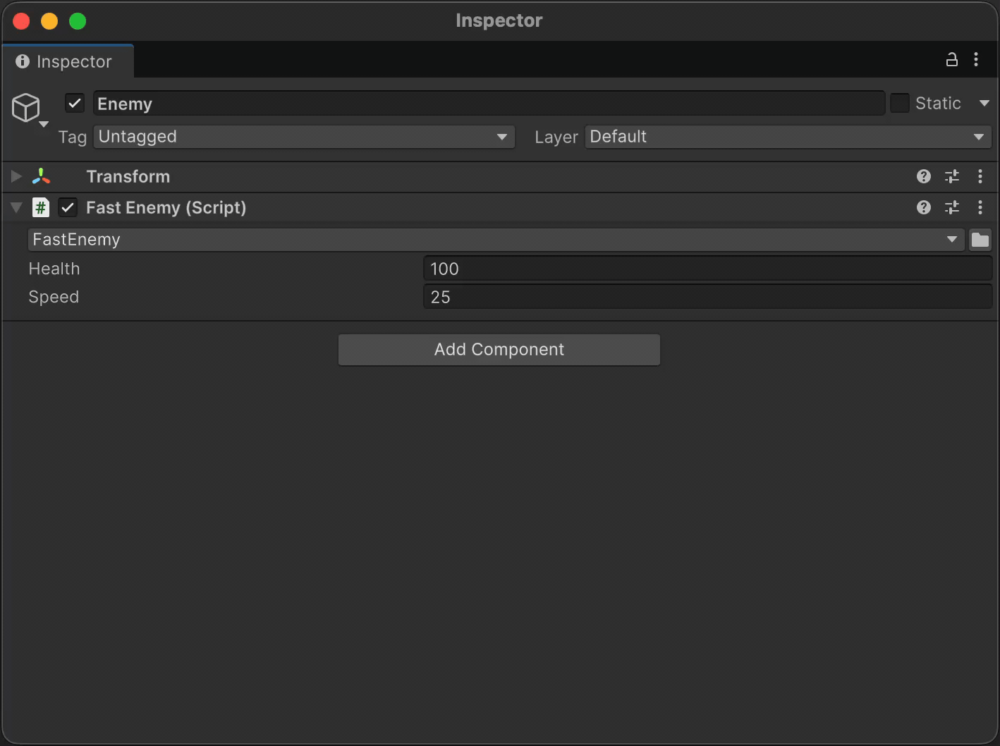
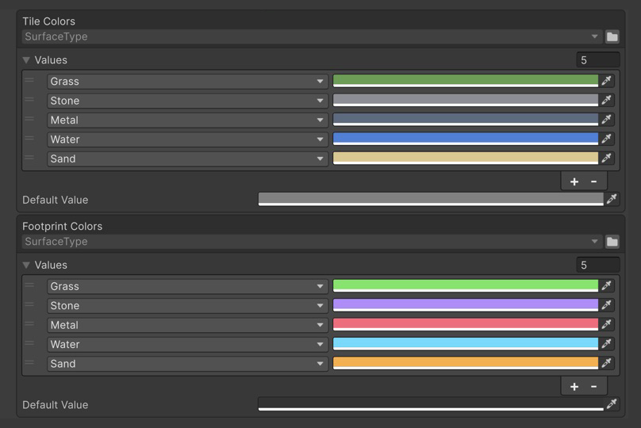

[](https://github.com/VPDPersonal/Aspid.FastTools/releases/tag/v1.0.0-rc.8)
[](https://github.com/VPDPersonal/Aspid.FastTools/blob/main/LICENSE)

Aspid.FastTools — пакет для Unity, который убирает рутину из сериализации, профилирования и редакторского кода.

[Документация](https://vpdpersonal.github.io/Aspid.FastTools/ru/docs) · [Исходный код](https://github.com/VPDPersonal/Aspid.FastTools) · [Релизы](https://github.com/VPDPersonal/Aspid.FastTools/releases)

## Установка

В **Window → Package Manager** выберите **+ → Install package from git URL…** и вставьте:

```text
https://github.com/VPDPersonal/Aspid.FastTools.git#upm-preview
```

URL указывает на последнюю preview-версию; кнопка **Update** в Package Manager подтянет следующую. Чтобы закрепить версию, добавьте её тег со страницы [релизов](https://github.com/VPDPersonal/Aspid.FastTools/releases): `https://github.com/VPDPersonal/Aspid.FastTools.git#upm-preview/<версия>`.

## Возможности

### Сериализация

#### [Serializable Type System](02-serializable-types.md)

Сохраняет `System.Type` в компоненте/ассете и даёт выбрать его в инспекторе из совместимых типов.


#### [ComponentTypeSelector](11-component-type-selector.md)

Меняет тип добавленного компонента/ScriptableObject на наследника, не теряя значения общих полей.



#### [SerializeReference Selector](03-serialize-reference-selector.md)

Даёт выбрать класс для поля `[SerializeReference]` в инспекторе и переносит совместимые данные при смене класса.


#### [SerializeReference Tooling](04-serialize-reference-tooling.md)

Находит потерянные `[SerializeReference]` по всему проекту (префабы, сцены, ассеты) и восстанавливает их группами — вручную, перед сборкой или в CI.


#### [EnumValues](06-enum-values.md)

Сопоставляет ключам enum значения (множители, цвета, ассеты) и редактируется в инспекторе, включая флаги.



### Редактор и инструменты

#### [ProfilerMarkers](05-profiler-markers.md)

Размечает участок одной строкой, а имя маркера генератор берёт из кода, своё для каждого места вызова.

```csharp
using (this.Marker())
{
    Simulate();
}
```

#### [VisualElement Extensions](07-visual-element-extensions.md)

Задаёт свойства, стили и события элемента цепочкой, так что дерево UI Toolkit собирается одним выражением.

```csharp
new VisualElement()
  .SetPaddingX(12)
  .AddChild(
    new Label("Ability Config"));
```

#### [SerializedProperty Extensions](08-serialized-property-extensions.md)

Записывает значение вместе с `Update` и `Apply` одной цепочкой, а ещё находит тип поля C# и объект, которому это поле принадлежит.

```csharp
manaCost
  .Update()
  .SetIntAndApply(42);
```

#### [Editor Helpers](09-editor-helpers.md)

Решает мелкие задачи редакторских инструментов, например подписывает объекты и компоненты читаемыми именами.

```csharp
config.GetDisplayName();
// "Ability Config"

config
  .GetDisplayNameWithIndex();
// "Ability Config (2)"
```

#### [Agent Skills](10-agent-skills.md)

Учит coding-агента API пакета; Claude Code, Codex, Cursor и другие получают скиллы одной командой.

```text
Добавь маркер на весь метод Simulate
и отдельный на поиск соседей.
```

## Ресурсы

- [Обзор примеров](../../Samples~/README.ru.md) — сцены и инструменты для сериализации, enum-таблиц, профилирования и интерфейсов редактора.
- [Справочник API](https://vpdpersonal.github.io/Aspid.FastTools/ru/api/Aspid.FastTools.Editors) — сигнатуры и описания всех публичных типов и членов.
- [Журнал изменений](https://vpdpersonal.github.io/Aspid.FastTools/ru/changelog) — что добавлено, изменено и исправлено в каждой версии.

## Помощь и поддержка

Сообщайте об ошибках и задавайте вопросы в [GitHub Issues](https://github.com/VPDPersonal/Aspid.FastTools/issues). Для ошибки укажите версию Unity, версию пакета и шаги воспроизведения.

Если пакет пригодился, поставьте ему звезду на [GitHub](https://github.com/VPDPersonal/Aspid.FastTools).

Распространяется по [лицензии MIT](https://github.com/VPDPersonal/Aspid.FastTools/blob/main/LICENSE).
