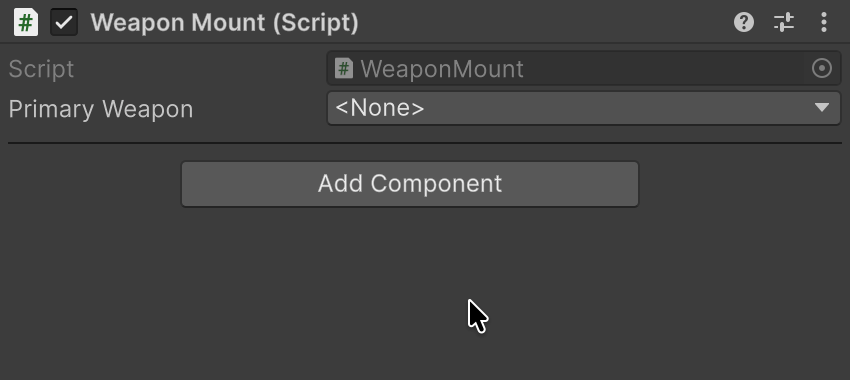
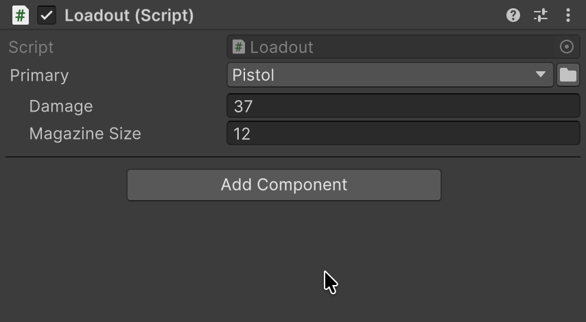
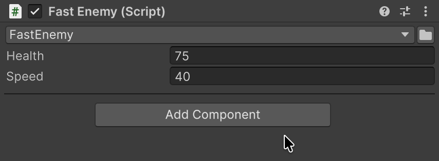

[](https://assetstore.unity.com/packages/slug/365584)
[](https://github.com/VPDPersonal/Aspid.FastTools/releases/tag/v1.0.0-rc.8)
[](https://github.com/VPDPersonal/Aspid.FastTools/blob/main/LICENSE)

Aspid.FastTools — пакет для Unity, который убирает рутину из сериализации, профилирования и редакторского кода.

[Документация](https://vpdpersonal.github.io/Aspid.FastTools/ru/docs) · [Исходный код](https://github.com/VPDPersonal/Aspid.FastTools) · [Релизы](https://github.com/VPDPersonal/Aspid.FastTools/releases)

## Установка

В **Window → Package Manager** выберите **+ → Install package from git URL…**, вставьте этот URL и нажмите **Install**:

```text
https://github.com/VPDPersonal/Aspid.FastTools.git#upm-preview
```

URL указывает на последнюю preview-версию; кнопка **Update** в Package Manager установит следующую. Чтобы закрепить версию со страницы [релизов](https://github.com/VPDPersonal/Aspid.FastTools/releases), добавьте её номер без `v`: `https://github.com/VPDPersonal/Aspid.FastTools.git#upm-preview/1.0.0-rc.8`.

## Возможности

### Сериализация

#### [Serializable Types](02-serializable-types.md)

Сохраняет <code lang="class-name">System.Type</code> в компоненте или ассете и даёт выбрать его в инспекторе из совместимых типов. [TypeSelector](03-type-selector.md) сужает этот список.



#### [SerializeReference Selector](04-serialize-reference-selector.md)

Даёт выбрать класс для поля <code lang="csharp">[SerializeReference]</code> в инспекторе и переносит совместимые данные при смене класса.



#### [ComponentTypeSelector](05-component-type-selector.md)

Меняет класс добавленного компонента на наследника, не теряя значения общих полей.



#### [Восстановление SerializeReference](06-serialize-reference-tooling.md)

Находит потерянные ссылки <code lang="csharp">[SerializeReference]</code> по всему проекту и восстанавливает их группами. [Проверка перед сборкой и CI](07-serialize-reference-validation.md) ловит новые до выпуска.


#### [EnumValues](08-enum-values.md)

Сопоставляет ключам enum значения — множители, цвета, ассеты — и даёт редактировать их в инспекторе, включая флаги.


### Редактор и инструменты

#### [ProfilerMarkers](09-profiler-markers.md)

Размечает участок одной строкой, а имя маркера генератор собирает из типа, метода и строки вызова.

```csharp
public void Step()
{
    using var _ = this.Marker();
    Integrate();
}
```

#### [VisualElement Extensions](10-visual-element-extensions.md)

Задаёт свойства, стили и события элемента цепочкой, так что дерево UI Toolkit собирается одним выражением.

```csharp
var header = new VisualElement()
    .SetPaddingX(12)
    .SetPaddingY(10)
    .AddChild(new Label("Ability Config")
        .SetFontSize(14));
```

#### [SerializedProperty Extensions](11-serialized-property-extensions.md)

Обновляет объект, записывает значение и применяет изменения одной цепочкой. Ещё находит C#-поле за свойством и объект, которому оно принадлежит.

```csharp
manaCost
  .Update()
  .SetIntAndApply(42);
```

#### [Editor Helpers](12-editor-helpers.md)

Подписывает объекты и компоненты читаемыми именами, а одинаковые компоненты — с номером.

```csharp
caster.GetDisplayName();
// "Ability Caster"

caster.GetDisplayNameWithIndex();
// "Ability Caster (2)": второй AbilityCaster на объекте
```

#### [Agent Skills](13-agent-skills.md)

Учит coding-агента писать код с FastTools: маркеры профилировщика, выбор типов, EnumValues и VisualElement Extensions.

```text
Замерь Simulate и отдельно поиск соседей
```

## Ресурсы

- [Обзор примеров](../../Samples~/README.ru.md) — сцены и редакторские инструменты для сериализации, enum-таблиц, профилирования и интерфейсов редактора.
- [Справочник API](https://vpdpersonal.github.io/Aspid.FastTools/ru/api/Aspid.FastTools.Editors) — типы, методы и свойства пакета, на английском.
- [Журнал изменений](https://vpdpersonal.github.io/Aspid.FastTools/ru/changelog) — изменения и исправления по версиям.

## Помощь и поддержка

Сообщайте об ошибках и задавайте вопросы в [GitHub Issues](https://github.com/VPDPersonal/Aspid.FastTools/issues). В отчёте об ошибке укажите версию Unity, версию пакета и шаги воспроизведения.

Если пакет пригодился, поставьте ему звезду на [GitHub](https://github.com/VPDPersonal/Aspid.FastTools).

Распространяется по [лицензии MIT](https://github.com/VPDPersonal/Aspid.FastTools/blob/main/LICENSE).
