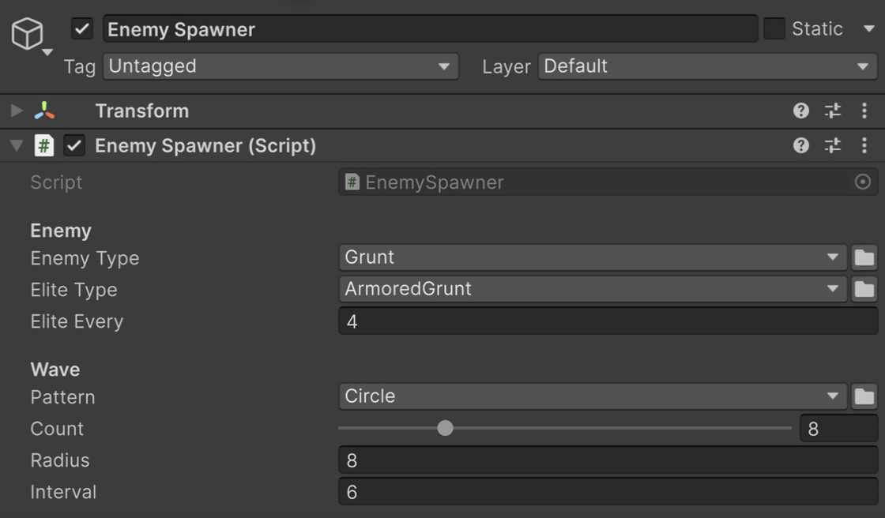

# Пример Types

Спавнер, в котором тип врага и схема волны выбираются в инспекторе, без правки кода.

Волна обычных и элитных врагов движется к центру.

## Как открыть

1. Импортируйте пример: **Tools → Aspid 🐍 → FastTools → Welcome** → **Samples** → **Import** у **Types**.
2. Откройте `Scenes/Types.unity` и войдите в Play Mode: каждые шесть секунд по кругу появляются восемь врагов, каждый четвёртый — <code lang="class-name">ArmoredGrunt</code>, и идут к центру.

## Попробуйте

Выйдите из Play Mode и выберите **Enemy Spawner**.

Типы врагов и паттерн расстановки в инспекторе.

1. **Тип компонента переживает переименование.** **Enemy Type** — <code lang="class-name">SerializableMonoScript&lt;Enemy&gt;</code>: вместе с именем класса поле хранит ссылку на ассет скрипта. Переименуйте класс в `Scripts/Enemies/Grunt.cs` в <code lang="class-name">Footman</code> вместе с файлом и его `.meta`, чтобы обновился и наследник <code lang="class-name">ArmoredGrunt</code>. После компиляции поле показывает <code lang="class-name">Footman</code>; <code lang="class-name">SerializableType</code> на его месте показал бы `<Missing …>`.
2. **Зависимое окно выбора.** **Elite Type** — строка с <code lang="csharp">[TypeSelector(nameof(_enemyType))]</code>: окно выбора предлагает только класс из **Enemy Type** и его наследников. Переключите **Enemy Type** на <code lang="class-name">Archer</code> и откройте **Elite Type**: в списке <code lang="class-name">Archer</code> и <code lang="class-name">Sniper</code>, а <code lang="class-name">ArmoredGrunt</code> нет. В самом поле <code lang="class-name">ArmoredGrunt</code> остаётся, пока вы не выберете другой тип, — выберите <code lang="class-name">Sniper</code>.
3. **Имена, группы и иконки.** Откройте **Pattern**: паттерны собраны в группу **Spawn Patterns**, у каждого своё имя, подсказка и иконка из <code lang="csharp">[TypeSelectorDisplay]</code>. <code lang="class-name">OriginPattern</code> скрыт через `Hidden`, а <code lang="csharp">Allow = TypeAllow.None</code> на поле убирает из списка сам интерфейс <code lang="class-name">ISpawnPattern</code>. Выберите **Grid** и войдите в Play Mode: волны встанут сеткой.
4. **Обязательное поле.** Поставьте **Enemy Type** в `<None>`: под полем появится предупреждение. Сохраните сцену — **Project References → Scan Project** и CI с `-srGateRequired` покажут поле как нарушение; сборка плеера его не проверяет ([что проверяет каждый запуск](../../../Documentation/ru/07-serialize-reference-validation.md#что-проверяет-каждый-запуск)).
5. **Замена компонента на месте.** Выберите **Placed Enemy (swap its type)** и поставьте **Health** = `250`. Выпадающий список вверху инспектора — поле <code lang="class-name">ComponentTypeSelector</code> в <code lang="class-name">Enemy</code>. Переключите <code lang="class-name">Archer</code> на <code lang="class-name">Brute</code>: **Health** и **Speed** объявлены в общей базе и сохранили значения, а **Keep Distance**, которое есть только у <code lang="class-name">Archer</code>, исчезло.

## Куда смотреть

| Файл | Что показывает |
|---|---|
| `Scripts/EnemySpawner.cs` | <code lang="class-name">SerializableMonoScript&lt;T&gt;</code> с `Required`, <code lang="csharp">[TypeSelector]</code> со ссылкой на другое поле, <code lang="class-name">SerializableType&lt;T&gt;</code> с <code lang="csharp">Allow = TypeAllow.None</code>, получение типа через <code lang="csharp">.Type</code> и <code lang="csharp">Type.GetType()</code> |
| `Scripts/Enemies/Enemy.cs` | Поле <code lang="class-name">ComponentTypeSelector</code> в базовом классе; наследники в той же папке |
| `Scripts/Spawning/` | Интерфейс <code lang="class-name">ISpawnPattern</code> и паттерны — обычные C#-классы с <code lang="csharp">[TypeSelectorDisplay]</code> |

Справочник — [Serializable Types](../../../Documentation/ru/02-serializable-types.md), [TypeSelector](../../../Documentation/ru/03-type-selector.md) и [ComponentTypeSelector](../../../Documentation/ru/05-component-type-selector.md). См. также пример [SerializeReferences](../../SerializeReferences/Documentation/README.ru.md) — <code lang="csharp">[TypeSelector]</code> на полях <code lang="csharp">[SerializeReference]</code> — и [EditorTools](../../EditorTools/Documentation/README.ru.md) — то же окно выбора, открытое из редакторского кода.
