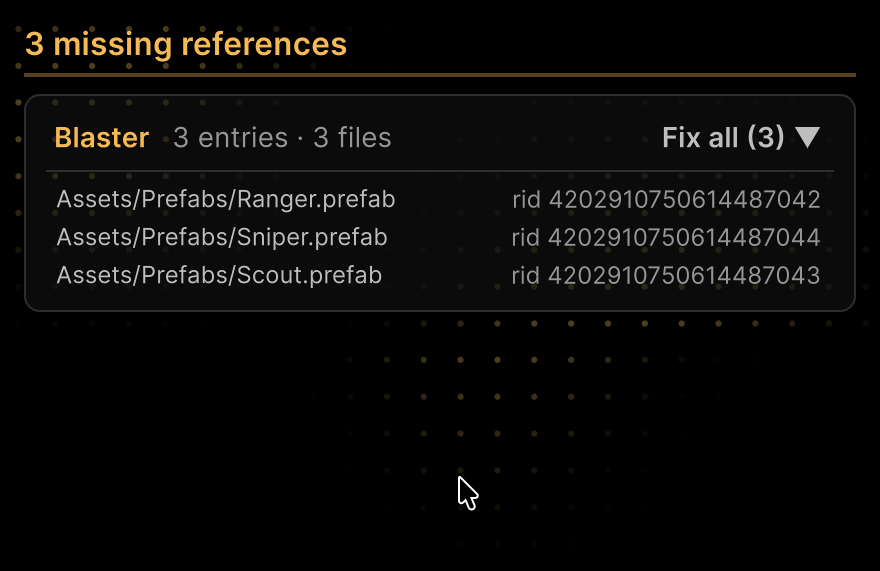
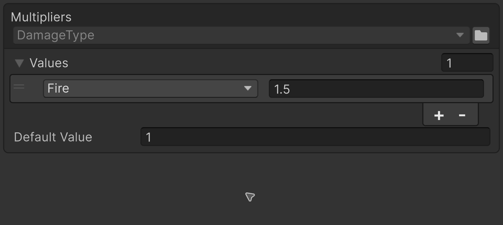

<!-- Generated from Website/docs/README.md. Edit that file, then run npm --prefix Website run sync-readme. -->


[](https://assetstore.unity.com/packages/slug/365584)
[](https://github.com/VPDPersonal/Aspid.FastTools/releases/tag/v1.0.0-rc.8)
[](https://github.com/VPDPersonal/Aspid.FastTools/blob/main/LICENSE)

Aspid.FastTools is a Unity package that takes the routine out of serialization, profiling and editor code.

[Documentation](https://vpdpersonal.github.io/Aspid.FastTools/docs) · [Source code](https://github.com/VPDPersonal/Aspid.FastTools) · [Releases](https://github.com/VPDPersonal/Aspid.FastTools/releases)

## Installation

In **Window → Package Manager**, choose **+ → Install package from git URL…**, paste this URL and click **Install**:

```text
https://github.com/VPDPersonal/Aspid.FastTools.git#upm-preview
```

The URL installs the latest preview; **Update** in the Package Manager installs the next one. To pin a version from [Releases](https://github.com/VPDPersonal/Aspid.FastTools/releases), add its number without the `v`: `https://github.com/VPDPersonal/Aspid.FastTools.git#upm-preview/1.0.0-rc.8`.

## Features

### Serialization

#### [Serializable Types](Website/docs/02-serializable-types.md)

Stores a <code lang="class-name">System.Type</code> in a component or an asset and lets you pick it in the Inspector from compatible types. [TypeSelector](Website/docs/03-type-selector.md) narrows the list.


#### [SerializeReference Selector](Website/docs/04-serialize-reference-selector.md)

Lets you pick the class for a <code lang="csharp">\[SerializeReference]</code> field in the Inspector and carries compatible data over when the class changes.


#### [ComponentTypeSelector](Website/docs/05-component-type-selector.md)

Changes an added component to a derived class without losing shared field values.


#### [SerializeReference repair](Website/docs/06-serialize-reference-tooling.md)

Finds missing <code lang="csharp">\[SerializeReference]</code> references and <code lang="class-name">SerializableType</code> names across the project and repairs them in groups. [Build and CI checks](Website/docs/07-serialize-reference-validation.md) catch new ones before release.



#### [EnumValues](Website/docs/08-enum-values.md)

Maps enum keys to values (multipliers, colors, assets) that you edit in the Inspector, flags included.



### Editor & tooling

#### [ProfilerMarkers](Website/docs/09-profiler-markers.md)

Marks a section with one line; the generator builds the marker name from the type, the method and the line of the call.

```csharp
public void Step()
{
    using var _ = this.Marker();
    Integrate();
}
```

#### [VisualElement Extensions](Website/docs/10-visual-element-extensions.md)

Sets element properties, styles and events in a chain, so you build a UI Toolkit tree in one expression.

```csharp
var header = new VisualElement()
    .SetPaddingX(12)
    .SetPaddingY(10)
    .AddChild(new Label("Ability Config")
        .SetFontSize(14));
```

#### [SerializedProperty Extensions](Website/docs/11-serialized-property-extensions.md)

Updates the object, writes a value and applies the change in one chain. It also finds the C# field behind the property and the object that owns it.

```csharp
manaCost
  .Update()
  .SetIntAndApply(42);
```

#### [Editor Helpers](Website/docs/12-editor-helpers.md)

Labels objects and components with readable names, and numbers components of the same type.

```csharp
caster.GetDisplayName();
// "Ability Caster"

caster.GetDisplayNameWithIndex();
// "Ability Caster (2)": the second AbilityCaster on the GameObject
```

#### [Agent Skills](Website/docs/13-agent-skills.md)

Teaches a coding agent to write code with FastTools: profiler markers, type selection, EnumValues and VisualElement Extensions.

```text
Profile Simulate and the neighbor search
```

## Resources

- [Samples overview](Aspid.FastTools/Packages/tech.aspid.fasttools/Samples~/README.md) — scenes and editor tools for serialization, enum tables, profiling and editor UI.
- [API reference](https://vpdpersonal.github.io/Aspid.FastTools/api/Aspid.FastTools.Editors) — package types, methods and properties.
- [Changelog](https://vpdpersonal.github.io/Aspid.FastTools/changelog) — changes and fixes by version.

## Help and support

Report bugs or ask questions in [GitHub Issues](https://github.com/VPDPersonal/Aspid.FastTools/issues). Include your Unity version, package version and steps to reproduce a problem.

If the package helps you, star it on [GitHub](https://github.com/VPDPersonal/Aspid.FastTools).

Distributed under the [MIT License](https://github.com/VPDPersonal/Aspid.FastTools/blob/main/LICENSE).
