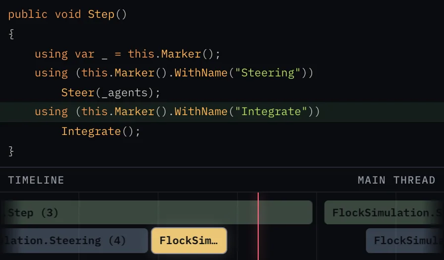
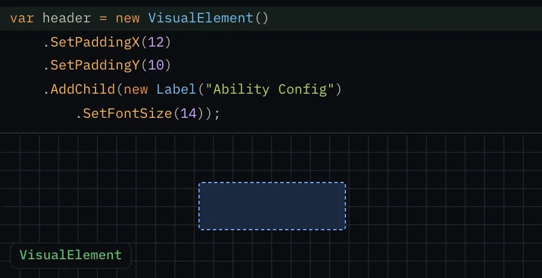
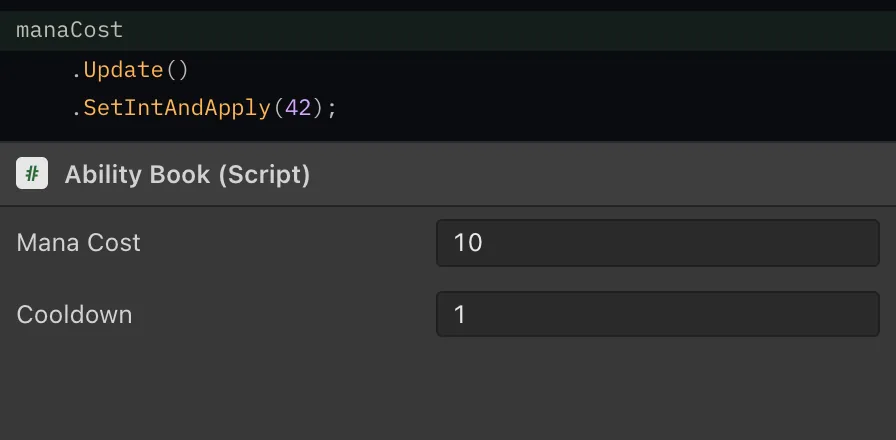
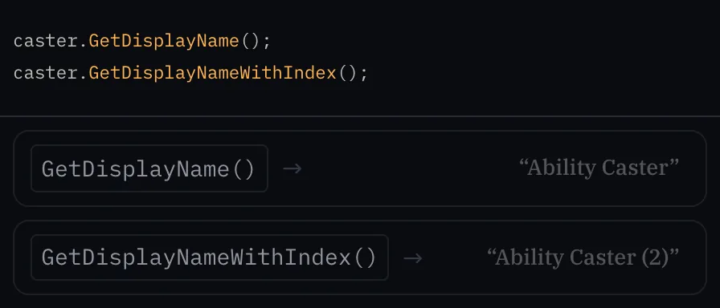
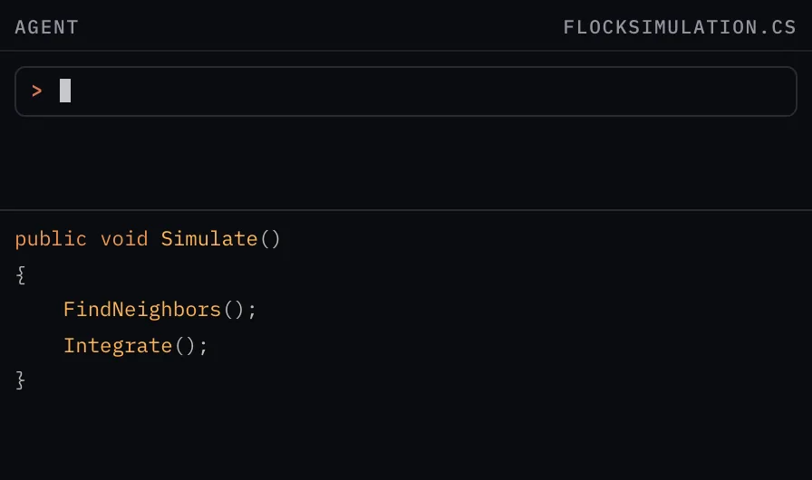

<!-- Generated from Website/docs/README.md. Edit that file, then run npm --prefix Website run sync-readme. -->

<picture>
  <source media="(prefers-color-scheme: dark)" srcset="docs/images/aspid_fasttools_readme_banner_dark.webp" />
  <source media="(prefers-color-scheme: light)" srcset="docs/images/aspid_fasttools_readme_banner_light.webp" />
  
</picture>

[](https://assetstore.unity.com/packages/slug/365584)
[](https://github.com/VPDPersonal/Aspid.FastTools/releases/tag/v1.0.0-rc.8)
[](https://github.com/VPDPersonal/Aspid.FastTools/blob/main/LICENSE)

Aspid.FastTools is a Unity package that takes the routine out of serialization, profiling and editor code.

[Documentation](https://vpdpersonal.github.io/Aspid.FastTools/docs) · [Source code](https://github.com/VPDPersonal/Aspid.FastTools) · [Releases](https://github.com/VPDPersonal/Aspid.FastTools/releases)

<p><b>English</b> · <a href="README.ru.md">Русский</a></p>

## Installation

In **Window → Package Manager**, choose **+ → Install package from git URL…**, paste this URL and click **Install**:

```text
https://github.com/VPDPersonal/Aspid.FastTools.git#upm-preview
```

The URL installs the latest preview; **Update** in the Package Manager installs the next one. To pin a version from [Releases](https://github.com/VPDPersonal/Aspid.FastTools/releases), add its number without the `v`: `https://github.com/VPDPersonal/Aspid.FastTools.git#upm-preview/1.0.0-rc.8`.

## Features

### Serialization

<div>
<picture><source media="(prefers-color-scheme: dark)" srcset="Website/docs/Images/serializable-type-card.gif"><source media="(prefers-color-scheme: light)" srcset="Website/docs/Images/serializable-type-card-light.gif"></picture>
<h4><a href="Website/docs/02-serializable-types.md">Serializable Types</a></h4>
<p>Stores a <code lang="class-name">System.Type</code> in a component or an asset and lets you pick it in the Inspector from compatible types. <a href="Website/docs/03-type-selector.md">TypeSelector</a> narrows the list.</p>
<p><a href="Website/docs/02-serializable-types.md">Read more →</a></p>
<br clear="all">
</div>

<div>
<picture><source media="(prefers-color-scheme: dark)" srcset="Website/docs/Images/aspid_fasttools_serialize_reference_selector_card.gif"><source media="(prefers-color-scheme: light)" srcset="Website/docs/Images/aspid_fasttools_serialize_reference_selector_card-light.gif"></picture>
<h4><a href="Website/docs/04-serialize-reference-selector.md">SerializeReference Selector</a></h4>
<p>Lets you pick the class for a <code lang="csharp">[SerializeReference]</code> field in the Inspector and carries compatible data over when the class changes.</p>
<p><a href="Website/docs/04-serialize-reference-selector.md">Read more →</a></p>
<br clear="all">
</div>

<div>
<picture><source media="(prefers-color-scheme: dark)" srcset="Website/docs/Images/component-type-selector-card.gif"><source media="(prefers-color-scheme: light)" srcset="Website/docs/Images/component-type-selector-card-light.gif"></picture>
<h4><a href="Website/docs/05-component-type-selector.md">ComponentTypeSelector</a></h4>
<p>Changes an added component to a derived class without losing shared field values.</p>
<p><a href="Website/docs/05-component-type-selector.md">Read more →</a></p>
<br clear="all">
</div>

<div>
<picture><source media="(prefers-color-scheme: dark)" srcset="Website/docs/Images/aspid_fasttools_serialize_reference_repair_card.gif"><source media="(prefers-color-scheme: light)" srcset="Website/docs/Images/aspid_fasttools_serialize_reference_repair_card-light.gif"></picture>
<h4><a href="Website/docs/06-serialize-reference-tooling.md">SerializeReference repair</a></h4>
<p>Finds missing <code lang="csharp">[SerializeReference]</code> references and <code lang="class-name">SerializableType</code> names across the project and repairs them in groups. <a href="Website/docs/07-serialize-reference-validation.md">Build and CI checks</a> catch new ones before release.</p>
<p><a href="Website/docs/06-serialize-reference-tooling.md">Read more →</a></p>
<br clear="all">
</div>

<div>
<picture><source media="(prefers-color-scheme: dark)" srcset="Website/docs/Images/enum-values-multipliers-populate.gif"><source media="(prefers-color-scheme: light)" srcset="Website/docs/Images/enum-values-multipliers-populate-light.gif"></picture>
<h4><a href="Website/docs/08-enum-values.md">EnumValues</a></h4>
<p>Maps enum keys to values (multipliers, colors, assets) that you edit in the Inspector, flags included.</p>
<p><a href="Website/docs/08-enum-values.md">Read more →</a></p>
<br clear="all">
</div>

### Editor & tooling

<div>
<picture><source media="(prefers-color-scheme: dark)" srcset="docs/images/readme-previews/profiler-markers.webp"><source media="(prefers-color-scheme: light)" srcset="docs/images/readme-previews/profiler-markers-light.webp"></picture>
<h4><a href="Website/docs/09-profiler-markers.md">ProfilerMarkers</a></h4>
<p>Marks a section with one line; the generator builds the marker name from the type, the method and the line of the call.</p>
<p><a href="Website/docs/09-profiler-markers.md">Read more →</a></p>
<br clear="all">
</div>

<div>
<picture><source media="(prefers-color-scheme: dark)" srcset="docs/images/readme-previews/visual-element-extensions.webp"><source media="(prefers-color-scheme: light)" srcset="docs/images/readme-previews/visual-element-extensions-light.webp"></picture>
<h4><a href="Website/docs/10-visual-element-extensions.md">VisualElement Extensions</a></h4>
<p>Sets element properties, styles and events in a chain, so you build a UI Toolkit tree in one expression.</p>
<p><a href="Website/docs/10-visual-element-extensions.md">Read more →</a></p>
<br clear="all">
</div>

<div>
<picture><source media="(prefers-color-scheme: dark)" srcset="docs/images/readme-previews/serialized-property-extensions.webp"><source media="(prefers-color-scheme: light)" srcset="docs/images/readme-previews/serialized-property-extensions-light.webp"></picture>
<h4><a href="Website/docs/11-serialized-property-extensions.md">SerializedProperty Extensions</a></h4>
<p>Updates the object, writes a value and applies the change in one chain. It also finds the C# field behind the property and the object that owns it.</p>
<p><a href="Website/docs/11-serialized-property-extensions.md">Read more →</a></p>
<br clear="all">
</div>

<div>
<picture><source media="(prefers-color-scheme: dark)" srcset="docs/images/readme-previews/editor-helpers.webp"><source media="(prefers-color-scheme: light)" srcset="docs/images/readme-previews/editor-helpers-light.webp"></picture>
<h4><a href="Website/docs/12-editor-helpers.md">Editor Helpers</a></h4>
<p>Labels objects and components with readable names, and numbers components of the same type.</p>
<p><a href="Website/docs/12-editor-helpers.md">Read more →</a></p>
<br clear="all">
</div>

<div>
<picture><source media="(prefers-color-scheme: dark)" srcset="docs/images/readme-previews/agent-skills.webp"><source media="(prefers-color-scheme: light)" srcset="docs/images/readme-previews/agent-skills-light.webp"></picture>
<h4><a href="Website/docs/13-agent-skills.md">Agent Skills</a></h4>
<p>Teaches a coding agent to write code with FastTools: profiler markers, type selection, EnumValues and VisualElement Extensions.</p>
<p><a href="Website/docs/13-agent-skills.md">Read more →</a></p>
<br clear="all">
</div>

## Resources

<table>
<tr>
<td width="33%" valign="top"><b><a href="Aspid.FastTools/Packages/tech.aspid.fasttools/Samples~/README.md">Samples overview</a></b><br>Scenes and editor tools for serialization, enum tables, profiling and editor UI.</td>
<td width="33%" valign="top"><b><a href="https://vpdpersonal.github.io/Aspid.FastTools/api/Aspid.FastTools.Editors">API reference</a></b><br>Package types, methods and properties.</td>
<td width="33%" valign="top"><b><a href="https://vpdpersonal.github.io/Aspid.FastTools/changelog">Changelog</a></b><br>Changes and fixes by version.</td>
</tr>
</table>

## Help and support

Report bugs or ask questions in [GitHub Issues](https://github.com/VPDPersonal/Aspid.FastTools/issues). Include your Unity version, package version and steps to reproduce a problem.

If the package helps you, star it on [GitHub](https://github.com/VPDPersonal/Aspid.FastTools).

Distributed under the [MIT License](https://github.com/VPDPersonal/Aspid.FastTools/blob/main/LICENSE).
