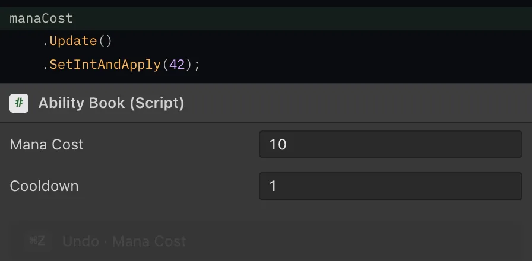
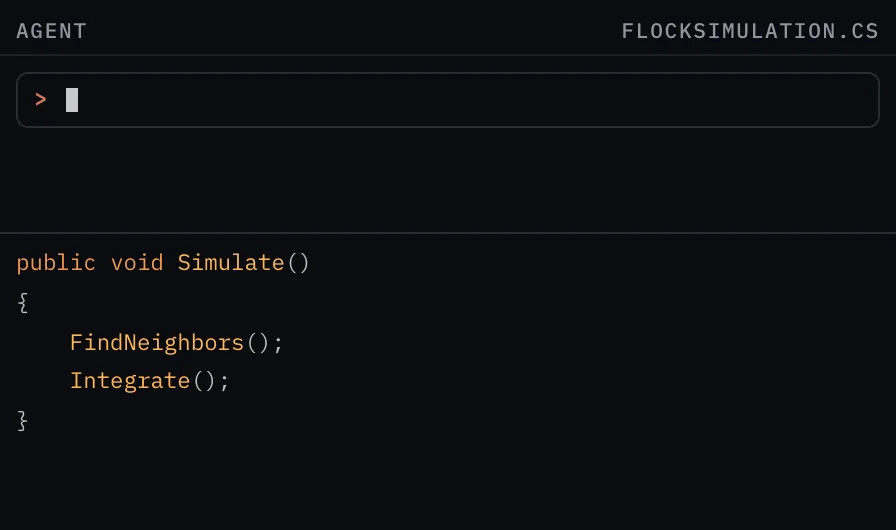

<!-- Generated from Website/i18n/ru/docusaurus-plugin-content-docs/current/README.md. Edit that file, then run npm --prefix Website run sync-readme. -->

<picture>
  <source media="(prefers-color-scheme: dark)" srcset="docs/images/aspid_fasttools_readme_banner_dark.webp" />
  <source media="(prefers-color-scheme: light)" srcset="docs/images/aspid_fasttools_readme_banner_light.webp" />
  
</picture>

[](https://assetstore.unity.com/packages/slug/365584)
[](https://github.com/VPDPersonal/Aspid.FastTools/releases/tag/v1.0.0-rc.8)
[](https://github.com/VPDPersonal/Aspid.FastTools/blob/main/LICENSE)

Aspid.FastTools — пакет для Unity, который убирает рутину из сериализации, профилирования и редакторского кода.

[Документация](https://vpdpersonal.github.io/Aspid.FastTools/ru/docs) · [Исходный код](https://github.com/VPDPersonal/Aspid.FastTools) · [Релизы](https://github.com/VPDPersonal/Aspid.FastTools/releases)

<p><a href="README.md">English</a> · <b>Русский</b></p>

## Установка

В **Window → Package Manager** выберите **+ → Install package from git URL…**, вставьте этот URL и нажмите **Install**:

```text
https://github.com/VPDPersonal/Aspid.FastTools.git#upm-preview
```

URL указывает на последнюю preview-версию; кнопка **Update** в Package Manager установит следующую. Чтобы закрепить версию со страницы [релизов](https://github.com/VPDPersonal/Aspid.FastTools/releases), добавьте её номер без `v`: `https://github.com/VPDPersonal/Aspid.FastTools.git#upm-preview/1.0.0-rc.8`.

## Возможности

### Сериализация

<table>
<tr>
<td width="56%"><picture><source media="(prefers-color-scheme: dark)" srcset="Website/docs/Images/serializable-type-card.gif"><source media="(prefers-color-scheme: light)" srcset="Website/docs/Images/serializable-type-card-light.gif"></picture></td>
<td width="44%">
<h4><a href="Website/i18n/ru/docusaurus-plugin-content-docs/current/02-serializable-types.md">Serializable Types</a></h4>
<p>Сохраняет <code lang="class-name">System.Type</code> в компоненте или ассете и даёт выбрать его в инспекторе из совместимых типов. <a href="Website/i18n/ru/docusaurus-plugin-content-docs/current/03-type-selector.md">TypeSelector</a> сужает этот список.</p>
<p><a href="Website/i18n/ru/docusaurus-plugin-content-docs/current/02-serializable-types.md">Подробнее →</a></p>
</td>
</tr>
</table>

<table>
<tr>
<td width="56%"><picture><source media="(prefers-color-scheme: dark)" srcset="Website/docs/Images/aspid_fasttools_serialize_reference_selector_card.gif"><source media="(prefers-color-scheme: light)" srcset="Website/docs/Images/aspid_fasttools_serialize_reference_selector_card-light.gif"></picture></td>
<td width="44%">
<h4><a href="Website/i18n/ru/docusaurus-plugin-content-docs/current/04-serialize-reference-selector.md">SerializeReference Selector</a></h4>
<p>Даёт выбрать класс для поля <code lang="csharp">[SerializeReference]</code> в инспекторе и переносит совместимые данные при смене класса.</p>
<p><a href="Website/i18n/ru/docusaurus-plugin-content-docs/current/04-serialize-reference-selector.md">Подробнее →</a></p>
</td>
</tr>
</table>

<table>
<tr>
<td width="56%"><picture><source media="(prefers-color-scheme: dark)" srcset="Website/docs/Images/component-type-selector-card.gif"><source media="(prefers-color-scheme: light)" srcset="Website/docs/Images/component-type-selector-card-light.gif"></picture></td>
<td width="44%">
<h4><a href="Website/i18n/ru/docusaurus-plugin-content-docs/current/05-component-type-selector.md">ComponentTypeSelector</a></h4>
<p>Меняет класс добавленного компонента на наследника, не теряя значения общих полей.</p>
<p><a href="Website/i18n/ru/docusaurus-plugin-content-docs/current/05-component-type-selector.md">Подробнее →</a></p>
</td>
</tr>
</table>

<table>
<tr>
<td width="56%"><picture><source media="(prefers-color-scheme: dark)" srcset="Website/docs/Images/aspid_fasttools_serialize_reference_repair_card.gif"><source media="(prefers-color-scheme: light)" srcset="Website/docs/Images/aspid_fasttools_serialize_reference_repair_card-light.gif"></picture></td>
<td width="44%">
<h4><a href="Website/i18n/ru/docusaurus-plugin-content-docs/current/06-serialize-reference-tooling.md">Восстановление SerializeReference</a></h4>
<p>Находит потерянные ссылки <code lang="csharp">[SerializeReference]</code> и имена <code lang="class-name">SerializableType</code> по всему проекту и восстанавливает их группами. <a href="Website/i18n/ru/docusaurus-plugin-content-docs/current/07-serialize-reference-validation.md">Проверка перед сборкой и CI</a> ловит новые до выпуска.</p>
<p><a href="Website/i18n/ru/docusaurus-plugin-content-docs/current/06-serialize-reference-tooling.md">Подробнее →</a></p>
</td>
</tr>
</table>

<table>
<tr>
<td width="56%"><picture><source media="(prefers-color-scheme: dark)" srcset="Website/docs/Images/enum-values-multipliers-populate.gif"><source media="(prefers-color-scheme: light)" srcset="Website/docs/Images/enum-values-multipliers-populate-light.gif"></picture></td>
<td width="44%">
<h4><a href="Website/i18n/ru/docusaurus-plugin-content-docs/current/08-enum-values.md">EnumValues</a></h4>
<p>Сопоставляет ключам enum значения — множители, цвета, ассеты — и даёт редактировать их в инспекторе, включая флаги.</p>
<p><a href="Website/i18n/ru/docusaurus-plugin-content-docs/current/08-enum-values.md">Подробнее →</a></p>
</td>
</tr>
</table>

### Редактор и инструменты

<table>
<tr>
<td width="56%"><picture><source media="(prefers-color-scheme: dark)" srcset="docs/images/readme-previews/profiler-markers.webp"><source media="(prefers-color-scheme: light)" srcset="docs/images/readme-previews/profiler-markers-light.webp"></picture></td>
<td width="44%">
<h4><a href="Website/i18n/ru/docusaurus-plugin-content-docs/current/09-profiler-markers.md">ProfilerMarkers</a></h4>
<p>Размечает участок одной строкой, а имя маркера генератор собирает из типа, метода и строки вызова.</p>
<p><a href="Website/i18n/ru/docusaurus-plugin-content-docs/current/09-profiler-markers.md">Подробнее →</a></p>
</td>
</tr>
</table>

<table>
<tr>
<td width="56%"><picture><source media="(prefers-color-scheme: dark)" srcset="docs/images/readme-previews/visual-element-extensions.webp"><source media="(prefers-color-scheme: light)" srcset="docs/images/readme-previews/visual-element-extensions-light.webp"></picture></td>
<td width="44%">
<h4><a href="Website/i18n/ru/docusaurus-plugin-content-docs/current/10-visual-element-extensions.md">VisualElement Extensions</a></h4>
<p>Задаёт свойства, стили и события элемента цепочкой, так что дерево UI Toolkit собирается одним выражением.</p>
<p><a href="Website/i18n/ru/docusaurus-plugin-content-docs/current/10-visual-element-extensions.md">Подробнее →</a></p>
</td>
</tr>
</table>

<table>
<tr>
<td width="56%"><picture><source media="(prefers-color-scheme: dark)" srcset="docs/images/readme-previews/serialized-property-extensions-ru.webp"><source media="(prefers-color-scheme: light)" srcset="docs/images/readme-previews/serialized-property-extensions-ru-light.webp"></picture></td>
<td width="44%">
<h4><a href="Website/i18n/ru/docusaurus-plugin-content-docs/current/11-serialized-property-extensions.md">SerializedProperty Extensions</a></h4>
<p>Обновляет объект, записывает значение и применяет изменения одной цепочкой. Ещё находит C#-поле за свойством и объект, которому оно принадлежит.</p>
<p><a href="Website/i18n/ru/docusaurus-plugin-content-docs/current/11-serialized-property-extensions.md">Подробнее →</a></p>
</td>
</tr>
</table>

<table>
<tr>
<td width="56%"><picture><source media="(prefers-color-scheme: dark)" srcset="docs/images/readme-previews/editor-helpers.webp"><source media="(prefers-color-scheme: light)" srcset="docs/images/readme-previews/editor-helpers-light.webp"></picture></td>
<td width="44%">
<h4><a href="Website/i18n/ru/docusaurus-plugin-content-docs/current/12-editor-helpers.md">Editor Helpers</a></h4>
<p>Подписывает объекты и компоненты читаемыми именами, а одинаковые компоненты — с номером.</p>
<p><a href="Website/i18n/ru/docusaurus-plugin-content-docs/current/12-editor-helpers.md">Подробнее →</a></p>
</td>
</tr>
</table>

<table>
<tr>
<td width="56%"><picture><source media="(prefers-color-scheme: dark)" srcset="docs/images/readme-previews/agent-skills-ru.webp"><source media="(prefers-color-scheme: light)" srcset="docs/images/readme-previews/agent-skills-ru-light.webp"></picture></td>
<td width="44%">
<h4><a href="Website/i18n/ru/docusaurus-plugin-content-docs/current/13-agent-skills.md">Agent Skills</a></h4>
<p>Учит coding-агента писать код с FastTools: маркеры профилировщика, выбор типов, EnumValues и VisualElement Extensions.</p>
<p><a href="Website/i18n/ru/docusaurus-plugin-content-docs/current/13-agent-skills.md">Подробнее →</a></p>
</td>
</tr>
</table>

## Ресурсы

<table>
<tr>
<td width="33%" valign="top"><b><a href="Aspid.FastTools/Packages/tech.aspid.fasttools/Samples~/README.ru.md">Обзор примеров</a></b><br>Сцены и редакторские инструменты для сериализации, enum-таблиц, профилирования и интерфейсов редактора.</td>
<td width="33%" valign="top"><b><a href="https://vpdpersonal.github.io/Aspid.FastTools/ru/api/Aspid.FastTools.Editors">Справочник API</a></b><br>Типы, методы и свойства пакета, на английском.</td>
<td width="33%" valign="top"><b><a href="https://vpdpersonal.github.io/Aspid.FastTools/ru/changelog">Журнал изменений</a></b><br>Изменения и исправления по версиям.</td>
</tr>
</table>

## Помощь и поддержка

Сообщайте об ошибках и задавайте вопросы в [GitHub Issues](https://github.com/VPDPersonal/Aspid.FastTools/issues). В отчёте об ошибке укажите версию Unity, версию пакета и шаги воспроизведения.

Если пакет пригодился, поставьте ему звезду на [GitHub](https://github.com/VPDPersonal/Aspid.FastTools).

Распространяется по [лицензии MIT](https://github.com/VPDPersonal/Aspid.FastTools/blob/main/LICENSE).
