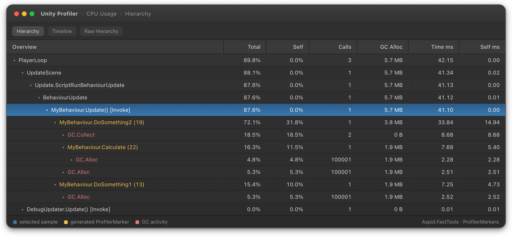
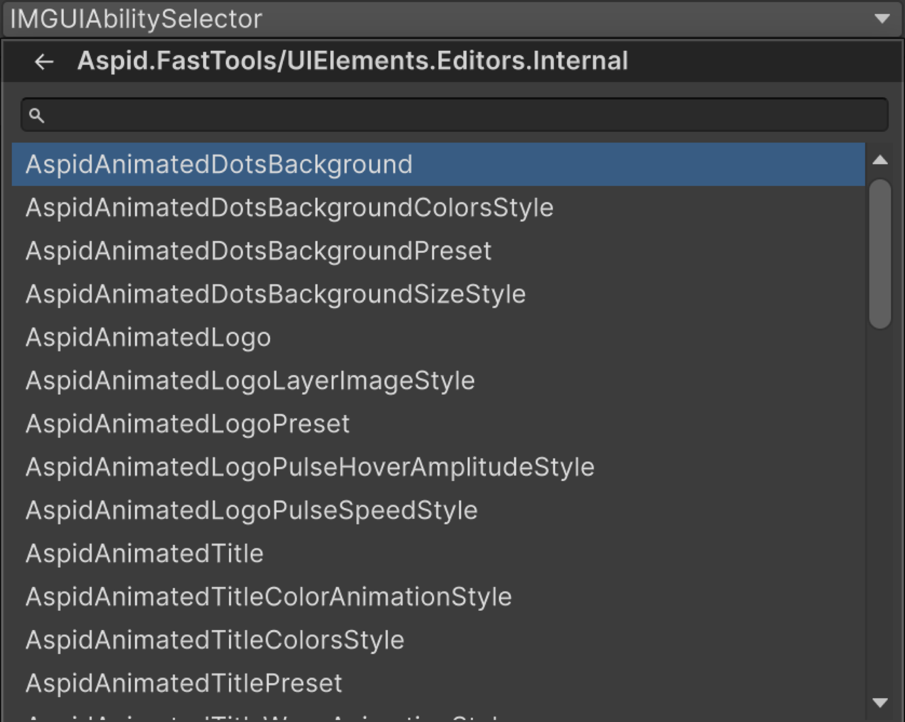

# Aspid.FastTools

[](https://unity.com/)
[](https://github.com/VPDPersonal/Aspid.FastTools/releases)
[](LICENSE)

**Aspid.FastTools** — набор инструментов, предназначенных для минимизации рутинного написания кода в Unity.

---

## Integration

Установите Aspid.FastTools одним из следующих способов:

- **Скачать .unitypackage** — Перейдите на [страницу релизов GitHub](https://github.com/VPDPersonal/Aspid.FastTools/releases) и скачайте последнюю версию `Aspid.FastTools.X.X.X.unitypackage`. Импортируйте его в проект.
- **Через UPM** (Unity Package Manager) подключите следующий пакет:
  - `https://github.com/VPDPersonal/Aspid.FastTools.git?path=Aspid.FastTools/Assets/Plugins/Aspid/FastTools`

---

## Donate

Этот проект разрабатывается на добровольной основе. Если он оказался для вас полезным, вы можете поддержать его развитие финансово. Это поможет уделять больше времени улучшению и сопровождению **Aspid.FastTools**.

Поддержать проект можно через следующие платформы:
* \[[Unity Asset Store](https://assetstore.unity.com/packages/slug/365584)\]

---

## ProfilerMarker

Предоставляет регистрацию `ProfilerMarker` через source generation. Генератор создаёт статический маркер для каждого места вызова, идентифицируемый по вызывающему методу и номеру строки.

```csharp
using UnityEngine;

public class MyBehaviour : MonoBehaviour
{
    private void Update()
    {
        DoSomething1();
        DoSomething2();
    }

    private void DoSomething1()
    {
        using var _ = this.Marker();
        // Некоторый код
    }

    private void DoSomething2()
    {
        using (this.Marker())
        {
            // Некоторый код
            using var _ = this.Marker().WithName("Calculate");
            // Некоторый код
        }
    }
}
```

<details>
<summary><b>Сгенерированный код</b></summary>

```csharp
using Unity.Profiling;
using System.Runtime.CompilerServices;

internal static class __MyBehaviourProfilerMarkerExtensions
{
    private static readonly ProfilerMarker DoSomething1_Marker_Line_13 = new("MyBehaviour.DoSomething1 (13)");
    private static readonly ProfilerMarker DoSomething2_Marker_Line_19 = new("MyBehaviour.DoSomething2 (19)");
    private static readonly ProfilerMarker DoSomething2_Marker_Line_22 = new("MyBehaviour.Calculate (22)");

    public static ProfilerMarker.AutoScope Marker(this MyBehaviour _, [CallerLineNumberAttribute] int line = -1)
    {
#if ENABLE_PROFILER
        if (line is 13) return DoSomething1_Marker_Line_13.Auto();
        if (line is 19) return DoSomething2_Marker_Line_19.Auto();
        if (line is 22) return DoSomething2_Marker_Line_22.Auto();
#endif
        return default;
    }
}
```

</details>

### Result



---

## Serializable Type System

Позволяет сериализовать ссылку на `System.Type` в Unity Inspector. Выбранный тип хранится как assembly-qualified name и разрешается лениво при первом обращении.

### SerializableType

Доступны два варианта:

- **`SerializableType`** — хранит любой тип (базовый тип — `object`)
- **`SerializableType<T>`** — хранит тип, ограниченный `T` или его подклассами

Оба поддерживают неявное преобразование в `System.Type`.

```csharp
using UnityEngine;
using Aspid.FastTools.Types;

public abstract class Ability : MonoBehaviour
{
    public abstract void Activate();
}

public sealed class AbilitySelector : MonoBehaviour
{
    [SerializeField] private SerializableType<Ability> _abilityType;

    private void Start()
    {
        var ability = (Ability)gameObject.AddComponent(_abilityType.Type);
        ability.Activate();
    }
}
```

### ComponentTypeSelector

Сериализуемая структура, добавляющая в Inspector выпадающий список для смены типа объекта. Добавьте её как поле в базовый класс — при выборе подтипа редактор перезаписывает `m_Script` на `SerializedObject`, фактически превращая компонент или ScriptableObject в выбранный подтип.

Список автоматически ограничивается подтипами класса, в котором объявлено поле. Дополнительная настройка не требуется.

```csharp
using UnityEngine;
using Aspid.FastTools.Types;

public abstract class EnemyBase : MonoBehaviour
{
    [SerializeField] private ComponentTypeSelector _enemyType;
    [SerializeField] [Min(0)] private float _health = 100f;

    public abstract void Attack();
}

public sealed class FastEnemy : EnemyBase
{
    [SerializeField] [Min(0)] private float _speed = 25f;

    public override void Attack() =>
        Debug.Log($"Fast enemy strikes! (speed: {_speed})");
}

public sealed class TankEnemy : EnemyBase
{
    [SerializeField] [Min(0)] private float _armor = 50f;

    public override void Attack() =>
        Debug.Log($"Tank attacks! (armor: {_armor})");
}
```

---

### TypeSelectorAttribute

Атрибут `PropertyAttribute`, доступный только в редакторе, ограничивающий всплывающее окно выбора типа конкретными базовыми типами. Применяется к полям `string`, хранящим assembly-qualified имена типов.

```csharp
[Conditional("UNITY_EDITOR")]
public sealed class TypeSelectorAttribute : PropertyAttribute
{
    public TypeSelectorAttribute() // базовый тип: object
    public TypeSelectorAttribute(Type type)
    public TypeSelectorAttribute(params Type[] types)
    public TypeSelectorAttribute(string assemblyQualifiedName)
    public TypeSelectorAttribute(params string[] assemblyQualifiedNames)

    public TypeAllow Allow { get; set; } // по умолчанию: TypeAllow.None
}

[Flags]
public enum TypeAllow
{
    None      = 0,
    Abstract  = 1,
    Interface = 2,
    All       = Abstract | Interface
}
```

| Свойство | Описание |
|----------|----------|
| `Allow` | Какие специальные категории типов (абстрактные классы, интерфейсы) включаются в список выбора в дополнение к обычным конкретным классам. По умолчанию: `TypeAllow.None` |

```csharp
using UnityEngine;
using Aspid.FastTools.Types;

public abstract class AbilityModifier
{
    public abstract void Apply();
}

public sealed class AbilitySelector : MonoBehaviour
{
    // Каждый элемент массива — отдельный picker, ограниченный AbilityModifier.
    [TypeSelector(typeof(AbilityModifier))]
    [SerializeField] private string[] _modifierTypes;
}
```

### Type Selector Window

В Inspector отображается кнопка, открывающая всплывающее окно с поиском, которое включает:

- Иерархическую организацию по пространствам имён
- Текстовый поиск с фильтрацией
- Навигацию с клавиатуры (стрелки, Enter, Escape)
- Историю навигации (кнопка «назад»)
- Разрешение неоднозначности для типов с одинаковыми именами из разных сборок



> Полный сэмпл — `Ability` / `AbilitySelector` / `EnemyBase` и их наследники — поставляется в сэмпле `Types` (Package Manager → Aspid.FastTools → Samples).

---

## Enum System

Предоставляет сериализуемые отображения enum → значение, настраиваемые через Inspector.

### EnumValues\<TValue\>

Сериализуемая коллекция записей `EnumValue<TValue>` с настраиваемым значением по умолчанию. Реализует `IEnumerable<KeyValuePair<Enum, TValue>>`.

```csharp
[Serializable]
public sealed class EnumValues<TValue> : IEnumerable<KeyValuePair<Enum, TValue>>
```

| Член | Описание |
|------|----------|
| `TValue GetValue(Enum enumValue)` | Возвращает сопоставленное значение или `_defaultValue`, если не найдено |
| `bool Equals(Enum, Enum)` | Проверка равенства с поддержкой `[Flags]` |

Поддерживает `[Flags]`-перечисления: `Equals` использует `HasFlag` и корректно обрабатывает члены со значением `0`.

```csharp
using UnityEngine;
using Aspid.FastTools.Enums;

public enum Direction { Left, Right, Up, Down }

public class MyBehaviour : MonoBehaviour
{
    [SerializeField] private EnumValues<Sprite> _directionSprites;

    private void SetIcon(Direction dir)
    {
        var sprite = _directionSprites.GetValue(dir);
        _image.sprite = sprite;
    }
}
```

В Inspector выберите тип перечисления в заголовке `EnumValues`, затем назначьте значение для каждого члена перечисления. Нажмите правой кнопкой мыши по свойству, чтобы открыть контекстное меню с пунктом **Populate Missing Enum Members** — он добавит записи для всех отсутствующих членов перечисления, используя текущее Default Value как начальное значение.

---

## ID System

> **Бета:** Система ID находится в бета-версии. Публичный API, структура генерируемого кода и редакторский UX могут измениться в будущих релизах.

Сопоставляет имя, назначаемое в активе, со стабильным целочисленным ID. Получившийся `int` подходит для `switch` и ключей `Dictionary` без затрат на строковые поиски в рантайме.

Единственный ScriptableObject `IdRegistry` сопоставляет строковые имена стабильным целочисленным ID и предоставляет полные `int ↔ string` поиски в рантайме.

### Setup

**1.** Объявите `partial struct`, реализующий `IId`. Генератор исходников автоматически добавит необходимые поля и свойство:

```csharp
using Aspid.FastTools.Ids;

public partial struct EnemyId : IId { }
```

Сгенерированный код:

```csharp
public partial struct EnemyId
{
    [SerializeField] private string __stringId; // editor-only поле, вырезается из player-сборок
    [SerializeField] private int _id;

    public int Id => _id;
}
```

Генератор сообщает `AFID001`, если у структуры отсутствует `partial`, и `AFID002`, если вы сами объявили `_id`, `Id` или `__stringId` (генерация пропускается — вы получаете явную ошибку с указанием на структуру вместо CS-ошибки внутри сгенерированного кода). Поддерживаются generic-структуры (`EnemyId<T>`) и generic-контейнеры.

**2.** Создайте ассет реестра и привяжите его к вашему типу структуры в Inspector:
- `Assets → Create → Aspid → Id Registry`

**3.** Используйте структуру как сериализуемое поле. В Inspector отображается выпадающий список зарегистрированных имён; окно селектора также позволяет создавать новые записи на лету:

```csharp
using UnityEngine;
using Aspid.FastTools.Ids;

[CreateAssetMenu]
public class EnemyDefinition : ScriptableObject
{
    [UniqueId] [SerializeField] private EnemyId _id;
}
```

```csharp
using UnityEngine;
using Aspid.FastTools.Ids;

public class EnemySpawner : MonoBehaviour
{
    [SerializeField] private EnemyId _targetEnemy;

    private void Spawn()
    {
        int id = _targetEnemy.Id; // стабильный integer, безопасен для switch / Dictionary
    }
}
```

### UniqueIdAttribute

Помечает поле как требующее уникального значения среди всех ассетов объявляющего типа. Inspector показывает предупреждение, если два ассета используют одинаковый ID.

```csharp
[Conditional("UNITY_EDITOR")]
public sealed class UniqueIdAttribute : PropertyAttribute { }
```

### IdRegistry

`ScriptableObject` из `Aspid.FastTools.Ids`, хранящий записи `(int, string)` и поддерживающий таблицы поиска доступными во рантайме. Каждому имени назначается стабильный, автоинкрементный ID, который не изменяется даже при добавлении или удалении других записей.

| Член | Описание |
|------|----------|
| `bool TryGetId(string name, out int id)` | Возвращает `true` и найденный ID; иначе `false` |
| `bool TryGetName(int id, out string name)` | Возвращает `true` и найденное имя; иначе `false` и `string.Empty` |
| `bool Contains(int id)` | Зарегистрирован ли ID |
| `bool Contains(string name)` | Зарегистрировано ли имя |
| `int Count` | Количество записей |
| `IReadOnlyList<int> Ids` · `IReadOnlyList<string> IdNames` | Зарегистрированные ID / имена в порядке регистрации |
| `IEnumerator<KeyValuePair<int, string>> GetEnumerator()` | Итерация по парам `(id, name)` |

Реестр наследуется напрямую от `ScriptableObject` и предоставляет генерик-аналог `IdRegistry<T>` (с `T : struct, IId`), добавляющий типизированные перегрузки `Contains(T)` и `TryGetName(T, out string)`. Редактирование — добавление, переименование, удаление записей — выполняется через инспектор реестра и `RegistryEditorCore`, а не через публичный runtime API.

---

## SerializedProperty Extensions

Цепочные расширения над `SerializedProperty` для синхронизации владеющего `SerializedObject`, записи типизированных значений и рефлексии над полем-источником.

```csharp
using Aspid.FastTools.Editors;
```

```csharp
property
    .Update()
    .SetVector3(Vector3.up)
    .SetBool(true)
    .ApplyModifiedProperties();
```

Пакет покрывает:

- **Update / Apply** — `Update`, `UpdateIfRequiredOrScript`, `ApplyModifiedProperties`.
- **Типизированные сеттеры** — `SetValue` (обобщённый диспетчер) и `SetXxx` для `int`/`uint`/`long`/`ulong`/`float`/`double`/`bool`/`string`/`Color`/`Gradient`/`Hash128`/`Rect`/`RectInt`/`Bounds`/`BoundsInt`/`Vector2..4` (и `Vector2/3Int`)/`Quaternion`/`AnimationCurve`/`EntityId` (Unity 6.2+). К каждому идёт парный вариант `SetXxxAndApply`.
- **Enum-сеттеры** — `SetEnumFlag` и `SetEnumIndex` (каждый + `AndApply`).
- **Массивы** — `SetArraySize`, `AddArraySize`, `RemoveArraySize` (каждый + `AndApply`).
- **Ссылки** — `SetManagedReference`, `SetObjectReference`, `SetExposedReference`, а также `SetBoxed` (Unity 6+).
- **Рефлексионные хелперы** — `GetPropertyType`, `GetMemberInfo`, `GetClassInstance` для разрешения C#-члена и runtime-экземпляра, стоящих за property.

> Полный справочник по методам: [SerializedPropertyExtensions.md](Aspid.FastTools/Assets/Plugins/Aspid/FastTools/Documentation/RU/SerializedPropertyExtensions.md)

---

## IMGUI Layout Scopes

```csharp
using Aspid.FastTools.Editors;
```

Три `ref struct`-области — `VerticalScope`, `HorizontalScope`, `ScrollViewScope` — оборачивают `EditorGUILayout.Begin*` / `End*`. Каждая предоставляет свойство `Rect` и вызывает соответствующий метод `End*` в `Dispose`:

```csharp
using (VerticalScope.Begin())
{
    EditorGUILayout.LabelField("Item 1");
    EditorGUILayout.LabelField("Item 2");
}

using (HorizontalScope.Begin())
{
    EditorGUILayout.LabelField("Left");
    EditorGUILayout.LabelField("Right");
}

var scrollPos = Vector2.zero;
using (ScrollViewScope.Begin(ref scrollPos))
{
    EditorGUILayout.LabelField("Scrollable content");
}
```

Получить rect области через перегрузку с `out`-параметром:

```csharp
using (VerticalScope.Begin(out var rect, GUI.skin.box))
{
    EditorGUI.DrawRect(rect, new Color(0, 0, 0, 0.1f));
    EditorGUILayout.LabelField("Boxed content");
}
```

Все перегрузки `Begin` соответствуют сигнатурам `EditorGUILayout.Begin*` (опциональные `GUIStyle`, `GUILayoutOption[]`, параметры scroll view и т.д.).

---

## VisualElement Extensions

Fluent-методы расширения для построения UIToolkit-деревьев в коде. Все методы возвращают `T` (сам элемент) для цепочки вызовов.

```csharp
using Aspid.FastTools.UIElements;         // runtime-расширения
using Aspid.FastTools.UIElements.Editors; // editor-only расширения (например, AddOpenScriptCommand)
```

### Quick reference

Пакет покрывает:

- **Основные операции с элементом** — имя, видимость, tooltip, user data, picking mode, data source, а также хелперы `AddChild`/`InsertChild`.
- **Фокус** — `SetFocus`, `SetBlur`, `SetTabIndex`, `SetFocusable`.
- **USS** — `AddClass`/`RemoveClass`/`ToggleInClass`/`EnableInClass`, `AddStyleSheets[FromResource]`.
- **Стили** — все свойства `IStyle`: разметка, размер, отступы, шрифт, текст, цвет, рамка, фон, трансформации (вкл. aspect/filter/material с Unity 6.3+), переходы, overflow, slice, cursor.
- **Специализированные элементы** — `TextElement`, `ITextEdition`, `ITextSelection`, `BaseField`, `BaseBoolField` (Toggle), `INotifyValueChanged` (с опциональными типами `Unity.Mathematics`), `IMixedValueSupport`, `Button`, `Slider`/`BaseSlider`, `ProgressBar`, `HelpBox`, `Foldout`, `Image`, `IMGUIContainer`, а также полная поверхность `ListView`/`TreeView`/`MultiColumn*`.
- **Editor-only команды** — `AddOpenScriptCommand`, `BindTo`/`BindPropertyTo`, `Initialize` для `EnumField`/`EnumFlagsField`, подписка на изменения у `PropertyField`.
- **USS custom-style helpers** — `ICustomStyle.TryGetByEnum` для парсинга строковых USS-свойств в enum.

> Полный справочник по методам: [VisualElementExtensions.md](Aspid.FastTools/Assets/Plugins/Aspid/FastTools/Documentation/RU/VisualElementExtensions.md)

### Full example

Реактивный редактор для `ScriptableObject` `AbilityConfig` — заголовок и статус-пилла в шапке, тело из `PropertyField`, и Warning `HelpBox`, который переключается в зависимости от `ManaCost`.

```csharp
[CustomEditor(typeof(AbilityConfig))]
internal sealed class AbilityConfigEditor : Editor
{
    public override VisualElement CreateInspectorGUI()
    {
        var config = (AbilityConfig)target;

        var badge = new Label()
            .SetFontSize(10).SetUnityFontStyleAndWeight(FontStyle.Bold)
            .SetPaddingX(10).SetPaddingY(3)
            .SetBorderRadius(10).SetBorderWidth(1);

        var helpBox = new HelpBox(
                "This ability costs no mana — is that intentional?",
                HelpBoxMessageType.Warning)
            .SetMarginTop(8).SetBorderRadius(6);

        var manaField = new PropertyField(serializedObject.FindProperty("_manaCost"))
            .AddValueChanged(_ => Refresh());

        Refresh();
        return new VisualElement()
            .SetBorderRadius(10).SetBorderWidth(1)
            .AddChild(new VisualElement()
                .SetFlexDirection(FlexDirection.Row).SetAlignItems(Align.Center)
                .SetPaddingX(14).SetPaddingY(12)
                .AddChild(new Label(target.GetScriptName())
                    .SetFlexGrow(1).SetFontSize(15)
                    .SetUnityFontStyleAndWeight(FontStyle.Bold))
                .AddChild(badge))
            .AddChild(new VisualElement()
                .SetPaddingX(14).SetPaddingY(12)
                .AddChild(new PropertyField(serializedObject.FindProperty("_abilityName")))
                .AddChild(new PropertyField(serializedObject.FindProperty("_description")))
                .AddChild(new PropertyField(serializedObject.FindProperty("_cooldown")))
                .AddChild(manaField)
                .AddChild(helpBox));

        void Refresh()
        {
            var isFree = config.ManaCost is 0;
            badge.SetText(isFree ? "FREE" : $"{config.ManaCost} MP");
            helpBox.SetDisplay(isFree ? DisplayStyle.Flex : DisplayStyle.None);
        }
    }
}
```

> Полный сэмпл — `AbilityConfig.cs`, полированный `AbilityConfigEditor.cs` (свои цвета, подзаголовок и divider — то, что на скриншоте ниже) и два `.asset`-примера — поставляется в сэмпле `VisualElements` (Package Manager → Aspid.FastTools → Samples).

### Result


---

## Editor Helper Extensions

Утилитарные методы для получения отображаемых имён объектов Unity в пользовательских редакторах.

```csharp
using Aspid.FastTools.Editors;
```

```csharp
public static string GetScriptName(this Object obj)
```

Возвращает отображаемое имя объекта Unity:
- Если тип имеет `[AddComponentMenu]`, возвращает `ObjectNames.GetInspectorTitle(obj)`
- В противном случае возвращает `ObjectNames.NicifyVariableName(typeName)`

```csharp
public static string GetScriptNameWithIndex(this Component targetComponent)
```

Возвращает отображаемое имя с числовым суффиксом, если на одном GameObject присутствует несколько компонентов одного типа. Например, если прикреплены два компонента `AudioSource`, второй вернёт `"Audio Source (2)"`.

```csharp
[CustomEditor(typeof(MyBehaviour))]
public class MyBehaviourEditor : Editor
{
    public override VisualElement CreateInspectorGUI()
    {
        // "My Behaviour" — или "Custom Name", если присутствует [AddComponentMenu("Custom Name")]
        var name = target.GetScriptName();

        // "My Behaviour (2)" при наличии второго компонента того же типа
        var nameWithIndex = ((Component)target).GetScriptNameWithIndex();

        return new Label(name);
    }
}
```
