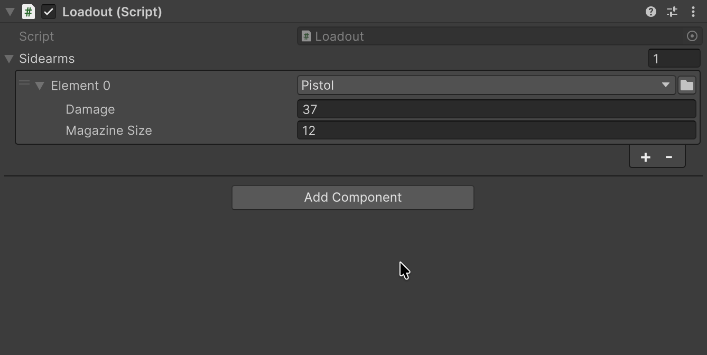
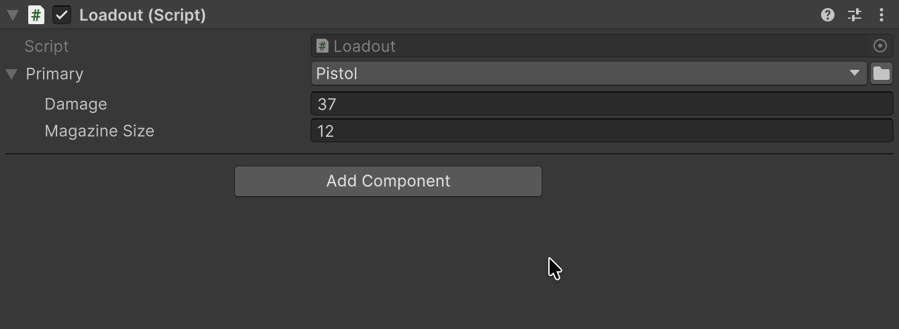
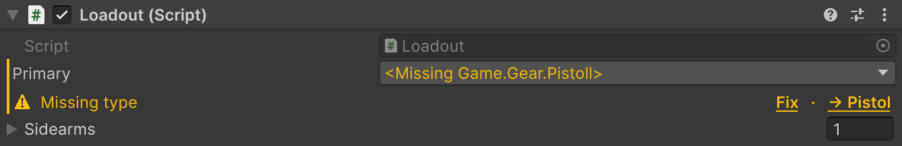
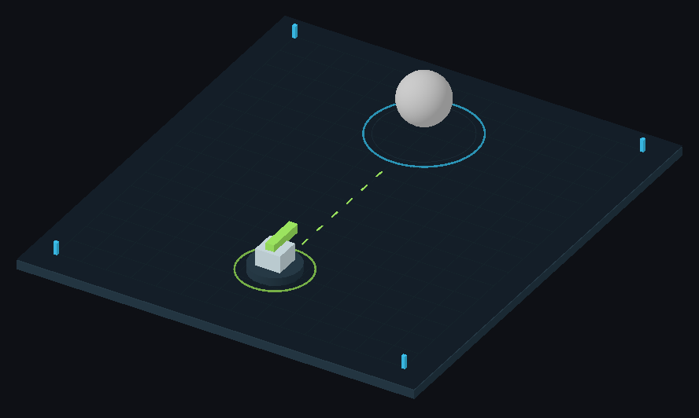

# SerializeReference Selector

Pick the field's class in the Inspector, and keep its data when the class changes.

## Quick start

| Before — Unity API | After — FastTools |
|---|---|
| <pre lang="csharp"><code>[SerializeReference]&#10;private IWeapon _primary =&#10;    new Pistol();</code></pre> | <pre lang="csharp"><code>[TypeSelector]&#10;[SerializeReference]&#10;private IWeapon _primary;</code></pre> |

## Which classes are offered

An <code lang="class-name">IWeapon</code> field offers concrete implementations of that interface, such as <code lang="class-name">Pistol</code> and <code lang="class-name">Shotgun</code>. Selecting one creates an instance; `<None>` clears the field.

For extra constraints, required fields and list appearance, see [TypeSelector](03-type-selector.md).

- <code lang="csharp">Allow</code> has no effect here: the types must be instantiable.
- Generic arguments are inferred from the field type and the <code lang="csharp">[TypeSelector]</code> types; when they cannot be, the picker asks for types Unity can serialize.

## Lists

In a list with <code lang="csharp">[TypeSelector]</code>, “+” opens the class picker and adds a new instance, and `<None>` adds an empty element. With several objects selected, each gets its own instance.

## Switching the class

When switching classes, FastTools tries to carry compatible values of fields with the same names. Fields that cannot be transferred keep the new instance's values:

| Field | <code lang="class-name">Pistol</code> | → <code lang="class-name">Shotgun</code> |
|---|---|---|
| **Damage** | 37 | 37 |
| **Magazine Size** | 12 | — |
| **Pellets** | — | 8, the initial value |

A nested reference carries over as the same instance when the field name and type are compatible.

> [!TIP]
> You can also pick the class by dragging a `.cs` file from **Project** onto the field header.

## Header menu

Right-click the field header:

| Item | What it does |
|---|---|
| **Copy Serialize Reference** | Copies the field's class and data; the copy lasts until the next domain reload |
| **Paste Serialize Reference** | Pastes the copy into a field of a compatible type; a copied empty field clears it |
| **Find Usages of Pistol** | Searches the project for the class through Unity Search |
| **Create New Script…** | Creates a <code lang="csharp">[Serializable]</code> class for the field type and assigns it after compilation |
| **Save as Template…** | Saves the value under a name; templates live in the editor settings on this machine, not in the project |
| **Paste Template → …** | Creates an instance from a template; only templates that fit the field are listed |
| **Paste Template → Remove Missing (N)…** | Deletes templates whose class no longer loads; shown only when such templates exist |

> [!WARNING]
> Copy/Paste and templates do not carry nested <code lang="csharp">[SerializeReference]</code> fields: the pasted object loses those references.

## Shared references

**Link to Existing → …** in the header menu links the field to an instance from another field on the same object.

Fields that point at one instance are marked **Shared reference #N**; **Make unique** under the field or **Make Unique Reference** in the header menu gives the field its own copy, nested references included.

A duplicated list element gets its own instance instead of a reference to the same one. The **Auto de-alias duplicated list elements** setting under **Tools → Aspid 🐍 → FastTools → Settings** controls this and is on by default; it is [shared by the team](07-serialize-reference-validation.md#scan-scope).

## Missing type

After a class is renamed, moved or deleted, the field shows `<Missing …>` with a **Missing type** notice under it. The field's data stays in the asset.

**Fix** opens the class picker, and the class you pick replaces the missing one. The notice may also offer a matching class, for example **→ Pistol**; the tooltip gives the reason. What Fix keeps on an asset and in a scene is described in [Fix in the Inspector](06-serialize-reference-tooling.md#fix-in-the-inspector).

[Project References](06-serialize-reference-tooling.md#project-references-repair-a-group) finds every missing reference in the project and repairs them in groups. The [build check](07-serialize-reference-validation.md) and [breakage detection](07-serialize-reference-validation.md#detecting-new-breakages) report new ones.

## Custom inspector

In your own editor, a regular <code lang="class-name">PropertyField</code> draws a <code lang="csharp">[TypeSelector]</code> field, in UI Toolkit and in IMGUI: the class picker and the list's “+” come by themselves. For list elements drawn separately, use [SerializeReferenceEditorGUI](https://vpdpersonal.github.io/Aspid.FastTools/api/Aspid.FastTools.SerializeReferences.Editors.SerializeReferenceEditorGUI) or [SerializeReferenceIMGUIList](https://vpdpersonal.github.io/Aspid.FastTools/api/Aspid.FastTools.SerializeReferences.Editors.SerializeReferenceIMGUIList).

## Package sample

For weapon selection, lists and shared references, see the [SerializeReferences](../tutorials/SerializeReferences/README.md) sample.

