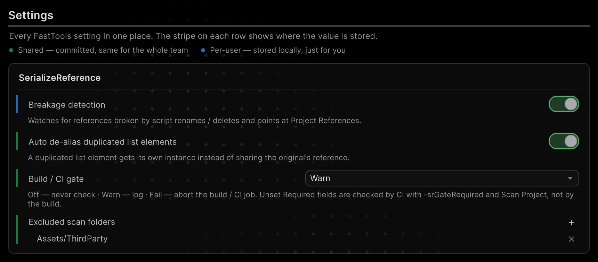

# Build and CI checks

Find missing references and unset required fields before shipping the project.

## Quick start

Open **Tools → Aspid 🐍 → FastTools → Settings** and set **Build / CI gate → Fail**. Missing types now stop a player build. The default is **Warn**.

The check reports violations; for repair, see [SerializeReference repair](06-serialize-reference-tooling.md).

## Pre-build checks

The **Build / CI gate** setting picks how strict the check is:

| Mode | Player build | Standalone CI run |
|---|---|---|
| `Off` | Skips the check | No scan and no report, an older report stays; exit code `0` |
| `Warn` | Warns and keeps building | Report and violations in the log; exit code `0` |
| `Fail` | Missing types stop the build | Report; exit code `1` on violations |

The build checks every asset under `Assets/`, not only what goes into it: in `Fail` mode an unused prefab stops it too — exclude such folders with [**Excluded scan folders**](#scan-scope).

## What each run checks

| Run | Missing types | Empty fields with <code lang="csharp">Required = true</code> |
|---|---|---|
| **Project References → Scan Project** | Yes, with pending migrations | Unless the mode is `Off`, as a **Required violations** group |
| **Asset References** | Yes | Yes, in any mode |
| Player build | Unless the mode is `Off` | No |
| CI without `-srGateRequired` | Unless the mode is `Off` | No |
| CI with `-srGateRequired` | Unless the mode is `Off` | Unless the mode is `Off` |


A field is made required with <code lang="csharp">[TypeSelector(Required = true)]</code>; see [Required field](03-type-selector.md#required-field). In scenes, required fields inside managed references, collections and prefab overrides are not checked.

## Detecting new breakages

**Breakage detection** reports newly missing references and type names right after script or asset changes, with a notification as well as in the Console. It is on by default, under **Tools → Aspid 🐍 → FastTools → Settings** and **Preferences → Aspid.FastTools → SerializeReference**. It is a per-user setting: every team member has their own.

## Scan scope

- saved `.prefab`, `.asset`, `.unity`, `.controller` (Animator Controller) and `.playable` (Timeline) files under `Assets/`, apart from **Excluded scan folders**;
- <code lang="csharp">[SerializeReference]</code> and the names in <code lang="class-name">SerializableType</code> and <code lang="class-name">SerializableMonoScript</code> fields; <code lang="csharp">[TypeSelector]</code> strings are not checked;
- pending [MovedFrom migrations](06-serialize-reference-tooling.md#migrations-with-movedfrom) do not count as missing;
- binary assets and unfetched Git LFS files are not scanned, and CI lists them in its report; for a full scan, use **Asset Serialization → Mode → Force Text** and fetch LFS files;
- a file last saved before Unity 2021.2 stores managed references in an older format: the build and CI warn about it instead of checking it, until it is saved again, for example with <code lang="csharp">AssetDatabase.ForceReserializeAssets()</code>.

**Excluded scan folders** excludes folders from Project References, player-build checks, CI and breakage detection.

**Build / CI gate**, **Excluded scan folders** and **Auto de-alias duplicated list elements** are shared settings with a green stripe. They live in `ProjectSettings/SerializeReferenceSharedSettings.asset`, shared by the team and CI, and also open in **Project Settings → Aspid.FastTools → SerializeReference**.



## Running in CI

```bash
Unity -batchmode -projectPath . \
  -executeMethod \
  Aspid.FastTools.SerializeReferences.Editors.SerializeReferenceCiGate.RunCheck \
  -srGateReport SerializeReferenceGateReport.txt \
  -srGateRequired -srGateFail
```

Exit code `2` means the check itself failed.

### Command-line flags

| Flag | Behaviour |
|---|---|
| `-srGateReport <path>` | Report path from the project root, `SerializeReferenceGateReport.txt` by default; the folder must exist, the file is overwritten |
| `-srGateRequired` | Also checks unset fields with <code lang="csharp">Required = true</code> |
| `-srGateFail` | Uses `Fail` instead of the project's mode, even `Off` |
| `-srGateWarnOnly` | Uses `Warn` instead of the project's mode, even `Off`; takes precedence over `-srGateFail` if both are passed |

## Report

The report lists missing types, unset required fields and skipped files. Skipped files do not change the exit code.

<details>
<summary>Report format</summary>

The report starts with a header:

```text
# SerializeReference Gate Report
# Violations: 2
# Not scanned: 3
#   Binary	Assets/Legacy/OldLoadout.prefab
#   LfsPointer	Assets/Levels/Arena.unity
#   UnsupportedReferencesVersion	Assets/Legacy/OldWave.asset
```

Each skipped file comes with its reason: a binary file, an unfetched Git LFS file, or managed references in a format older than Unity 2021.2.

Then one line per violation, tab-separated:

```text
KIND    assetPath    fileId    rid    className    fieldPath    origin
```

| Field | Contents |
|---|---|
| `KIND` | `MissingType`, `MissingTypeName` or `RequiredUnset` |
| `assetPath` | File path |
| `fileId` | Host object ID within the file; for a prefab instance override, the ID of the prefab instance |
| `rid` | Managed-reference ID; in `RequiredUnset` rows, `-2` for an empty <code lang="csharp">[SerializeReference]</code> and `0` for a <code lang="csharp">string</code> or <code lang="class-name">SerializableType</code>; in `MissingTypeName` rows, the managed reference that holds the field, or `0` |
| `className` | Stored class name for `MissingType`; the whole stored type name for `MissingTypeName` |
| `fieldPath` | Required field path; the wrapper field for `MissingTypeName`; for a `MissingType` override, the overridden field; otherwise empty |
| `origin` | `override` for a type set by a prefab instance override; otherwise empty |

In Asset References, find an entry by its `rid`, and a `RequiredUnset` row with `rid` `0` by its `fieldPath`; an `override` row is in the **Prefab instance overrides** card of Project References instead. A `MissingTypeName` row is in its **type name** group of Project References.

</details>

## Package sample

The [SerializeReferences](../tutorials/SerializeReferences/README.md) sample has a required field and missing types to check.


