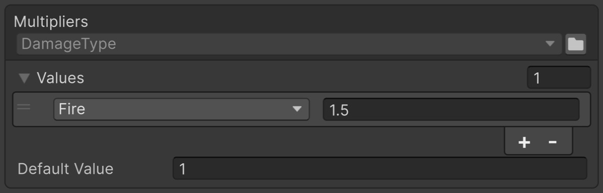
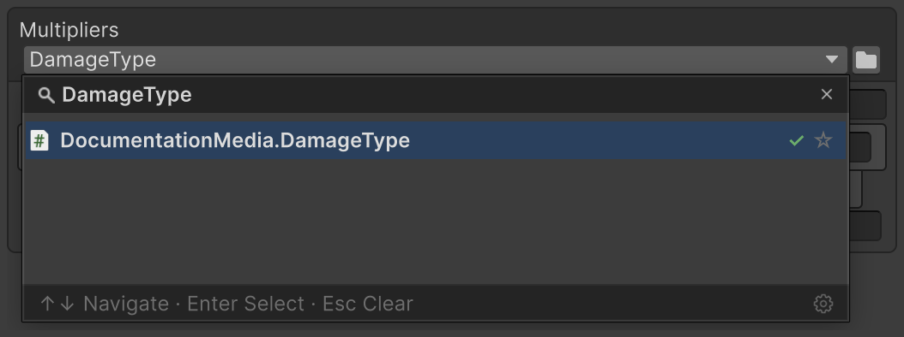

# EnumValues

A table of values per enum member, filled in the Inspector instead of code.

## Quick start

| Before — fields and switch | After — FastTools |
|---|---|
| <pre lang="csharp"><code>[SerializeField]&#10;private float _default = 1f;&#10;[SerializeField]&#10;private float _fire = 1.5f;&#10;&#10;public float GetMultiplier(&#10;    DamageType type) =&gt; type switch&#10;&#123;&#10;    DamageType.Fire =&gt; _fire,&#10;    _ =&gt; _default&#10;&#125;;</code></pre> | <pre lang="csharp"><code>[SerializeField]&#10;private EnumValues&lt;DamageType, float&gt;&#10;    _multipliers;&#10;&#10;public float GetMultiplier(&#10;    DamageType type) =&gt;&#10;    _multipliers.GetValue(type);</code></pre> |

<code lang="function">GetValue</code> returns the value from a matching table row, or **Default Value** if no row matches.



## Filling in the Inspector

For an enum without <code lang="csharp">[Flags]</code>, set the shared value in **Default Value** and add rows for members that need a different value.

**Populate Missing Enum Members** in the table header's context menu appends rows for missing enum members and copies **Default Value** into them. Members with the same numeric value (aliases) share one row. The menu item is greyed out when every member already has a row.

For <code lang="csharp">[Flags]</code>, only declared enum members are added automatically. For example, if the enum declares <code lang="csharp">FireAndIce = Fire | Ice</code>, the command adds a separate row with the key <code lang="csharp">FireAndIce</code>. Combinations without a name can be added manually.


> [!NOTE]
> A row added to an empty table shows `<None>`: until you pick a member, lookup skips it, and accessing the table logs an error to the Console.

## Choosing a variant

| Difference | <code lang="class-name">EnumValues&lt;TEnum, TValue&gt;</code> | <code lang="class-name">EnumValues&lt;TValue&gt;</code> |
|---|---|---|
| Where the enum is picked | The <code lang="class-name">TEnum</code> argument | The table header in the Inspector |
| Key in <code lang="function">GetValue</code> and <code lang="csharp">foreach</code> | <code lang="class-name">TEnum</code> | <code lang="class-name">System.Enum</code> |
| A key of another enum | Does not compile | Returns **Default Value** |

Table values are configured in the Inspector and are read-only from code.

A field can switch between the variants without losing rows if the enum selected in <code lang="class-name">EnumValues&lt;TValue&gt;</code> is the same as <code lang="class-name">TEnum</code>.

With <code lang="class-name">EnumValues&lt;TValue&gt;</code>, the multiplier field is declared as <code lang="class-name">EnumValues&lt;float&gt;</code>, and <code lang="class-name">DamageType</code> is selected in the table header:

```csharp
[SerializeField]
private EnumValues<float>
    _multipliers;
```



- Selecting an enum is required: if the field is empty, the Inspector shows **Required type is not set**. The [required field check](07-serialize-reference-validation.md#what-each-run-checks) also checks this field.
- The first access to a table with an empty enum field logs a warning to the Console, and <code lang="function">GetValue</code> returns **Default Value**.

> [!WARNING]
> In a player, <code lang="class-name">EnumValues&lt;TValue&gt;</code> finds the enum by its stored name, like [Serializable Types](02-serializable-types.md#types-in-a-player-build): an enum used only through this selection may be stripped at **Managed Stripping Level** Low or higher. The table then logs an error, and <code lang="function">GetValue</code> returns **Default Value**.

## Lookup rules

A row's key is its selected enum member. If several rows have the same key, the topmost row is used. Enum members with the same numeric value also count as one key: for example, declaring <code lang="csharp">Frost = Ice</code> gives both names the same value.

| Inspector rows, top to bottom | <code lang="function">GetValue</code> argument | Returned value |
|---|---|---|
| <code lang="csharp">Fire</code> → <code lang="csharp">0.9</code><br/><code lang="csharp">Fire</code> → <code lang="csharp">0.5</code> | <code lang="csharp">DamageType.Fire</code> | <code lang="csharp">0.9</code> |
| <code lang="csharp">Ice</code> → <code lang="csharp">0.5</code> | <code lang="csharp">DamageType.Frost</code> | <code lang="csharp">0.5</code> |

### Flags

```csharp
[Flags]
public enum DamageType
{
    None = 0,
    Fire = 1,
    Ice = 2,
    Frost = Ice,
    FireAndIce = Fire | Ice,
    Poison = 4
}

[SerializeField]
private EnumValues<DamageType, float>
    _multipliers;
```

For <code lang="csharp">[Flags]</code>, lookup has two stages:

1. First, look for an **exact match**: a row whose key contains exactly the same flags as the argument.
2. If there is no exact match, use the **topmost** row whose flags are all present in the supplied value.

Suppose **Default Value** is <code lang="csharp">0</code> and the Inspector table is filled as follows:

| Order | Key | Value |
|---|---|---|
| 1 | <code lang="csharp">Fire</code> | <code lang="csharp">0.9</code> |
| 2 | <code lang="csharp">Ice</code> | <code lang="csharp">0.5</code> |
| 3 | <code lang="csharp">FireAndIce</code> | <code lang="csharp">0.3</code> |
| 4 | <code lang="csharp">None</code> | <code lang="csharp">1</code> |

For this table, <code lang="function">GetValue</code> returns these results:

| Argument | Value | Why |
|---|---|---|
| <code lang="csharp">Fire &#124; Ice</code> | <code lang="csharp">0.3</code> | Exact match with <code lang="csharp">FireAndIce</code> (row 3): both flags match |
| <code lang="csharp">Fire &#124; Ice &#124; Poison</code> | <code lang="csharp">0.9</code> | The argument contains all the flags of rows 1, 2 and 3. With no exact match, row 1 is used |
| <code lang="csharp">Ice &#124; Poison</code> | <code lang="csharp">0.5</code> | <code lang="csharp">Ice</code> (row 2) matches. Rows 1 and 3 also need <code lang="csharp">Fire</code>, which is absent from the argument |
| <code lang="csharp">Poison</code> | <code lang="csharp">0</code> | No matching row — **Default Value** |
| <code lang="csharp">None</code> | <code lang="csharp">1</code> | A zero key matches only a zero argument |

> [!NOTE]
> Moving the <code lang="csharp">FireAndIce</code> row above <code lang="csharp">Fire</code> makes a call for <code lang="csharp">Fire | Ice | Poison</code> return <code lang="csharp">0.3</code>. Row order determines priority when there is no exact match.
>
> A row whose value equals **Default Value** still participates in lookup. Adding a <code lang="csharp">Fire | Poison</code> row with value <code lang="csharp">0</code> makes a call for that combination return <code lang="csharp">0</code> by exact match, instead of <code lang="csharp">0.9</code> from the <code lang="csharp">Fire</code> row.

## TryGetValue()

<code lang="function">GetValue</code> returns the same value for a missing row and for a row that holds **Default Value**. <code lang="function">TryGetValue</code> reports which of the two it is:

```csharp
if (_multipliers.TryGetValue(
        type, out var multiplier))
    total *= multiplier;
```

When no row matches, <code lang="csharp">multiplier</code> is **Default Value**, as with <code lang="function">GetValue</code>.

## Equals()

The table method checks whether a key matches a request without reading values:

```csharp
var request =
    DamageType.Fire | DamageType.Ice;
var key = DamageType.Fire;
_multipliers.Equals(request, key);
```

| Request | Key | Result |
|---|---|---|
| <code lang="csharp">DamageType.Fire &#124; DamageType.Ice</code> | <code lang="csharp">DamageType.Fire</code> | <code lang="csharp">true</code> |
| <code lang="csharp">DamageType.Fire</code> | <code lang="csharp">DamageType.Fire &#124; DamageType.Ice</code> | <code lang="csharp">false</code> |
| <code lang="csharp">DamageType.Fire &#124; DamageType.Ice</code> | <code lang="csharp">DamageType.None</code> | <code lang="csharp">false</code> |
| <code lang="csharp">DamageType.None</code> | <code lang="csharp">DamageType.None</code> | <code lang="csharp">true</code> |

## Enumerating rows

```csharp
var total = 0f;
foreach (var entry in _multipliers)
    total += entry.Value;
```

**Default Value** and rows with unresolved keys are not yielded. After the first access initializes the keys, a direct <code lang="csharp">foreach</code> over the table does not allocate. <code lang="csharp">Count</code> is the number of rows the loop yields.

## When the enum changes

Keys are stored by member name:

| Change | Result |
|---|---|
| Members reordered or their numeric values changed | Rows remain bound to names. Changing aliases or flag bit patterns can change lookup results |
| A member renamed or deleted | Its row shows `<Missing Ice>` and is skipped with a Console error; restore the name and the row works again |
| The enum renamed or moved to another namespace or assembly | <code lang="class-name">EnumValues&lt;TEnum, TValue&gt;</code> works as before; <code lang="class-name">EnumValues&lt;TValue&gt;</code> returns **Default Value** and logs an error until the enum is picked again |
| Another enum picked in <code lang="class-name">EnumValues&lt;TValue&gt;</code> | The keys are kept: pick the previous enum back and the rows work again |

## Package sample

In the [EnumValues](../tutorials/EnumValues/README.md) sample, tiles and footprints take their colour from <code lang="class-name">EnumValues&lt;SurfaceType, Color&gt;</code>, and the speed multiplier from an <code lang="class-name">EnumValues&lt;float&gt;</code> with a <code lang="csharp">[Flags]</code> enum picked in the Inspector.


