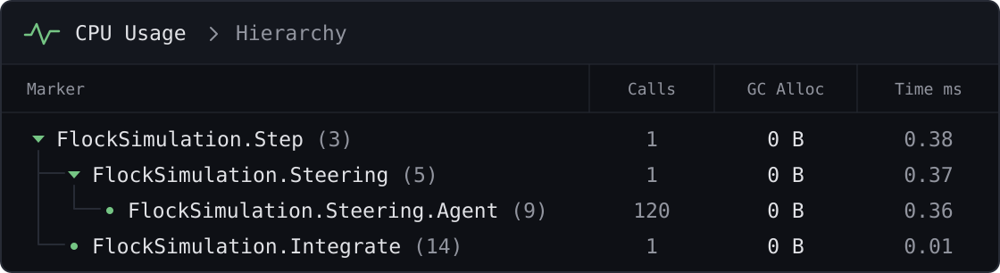
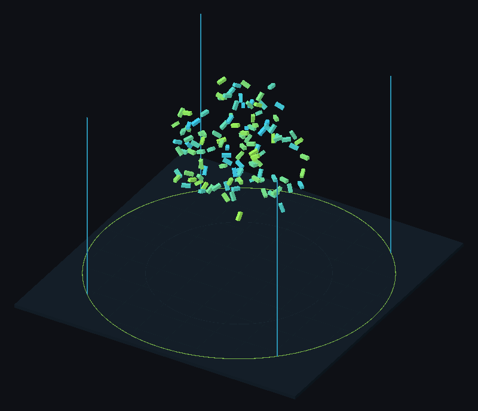

# ProfilerMarkers

Profiler markers in one line, with no fields or names to keep up by hand.

## Quick start

| Before — Unity API | After — FastTools |
|---|---|
| <pre lang="csharp"><code>private static readonly&#10;    ProfilerMarker _marker =&#10;    new("FlockSimulation.Step");&#10;&#10;public void Step()&#10;&#123;&#10;    using var _ = _marker.Auto();&#10;    Integrate();&#10;&#125;</code></pre> | <pre lang="csharp"><code>public void Step()&#10;&#123;&#10;    using var _ = this.Marker();&#10;    Integrate();&#10;&#125;</code></pre> |

## Marker()

The marker name includes the type, the member name and the call’s line number:

| Where <code lang="csharp">this.Marker()</code> is called | Marker name |
|---|---|
| <code lang="csharp">void Step()</code> | <code lang="string">FlockSimulation.Step (line)</code> |
| <code lang="csharp">FlockSimulation()</code> | <code lang="string">FlockSimulation.Ctor (line)</code> |
| <code lang="csharp">float Speed &#123; get; &#125;</code> | <code lang="string">FlockSimulation.Speed (line)</code> |
| <code lang="csharp">Agent this[int i] &#123; get; &#125;</code> | <code lang="string">FlockSimulation.Indexer (line)</code> |
| <code lang="csharp">event Action Changed</code> | <code lang="string">FlockSimulation.Changed (line)</code> |
| Explicit implementation <code lang="csharp">void ISimulation.Step()</code> | <code lang="string">FlockSimulation.Step (line)</code> |

The line number changes when the call moves in the source.

<details>
<summary>Nested and generic types</summary>

| Call location | Marker name |
|---|---|
| Method <code lang="csharp">Move()</code> in nested <code lang="class-name">FlockSimulation.Agent</code> | <code lang="string">Agent.Move (line)</code> |
| <code lang="csharp">Step()</code> in class <code lang="class-name">FlockSimulation&lt;Int32&gt;</code> | <code lang="string">FlockSimulation&lt;Int32&gt;.Step (line)</code> |
| <code lang="csharp">Step()</code> in struct <code lang="class-name">FlockSimulation&lt;T&gt;</code> | <code lang="string">FlockSimulation&lt;T&gt;.Step (line)</code> for any <code lang="class-name">T</code> |
| Generic method <code lang="csharp">Step&lt;T&gt;()</code> | <code lang="string">FlockSimulation.Step (line)</code> for any <code lang="class-name">T</code> |

</details>

## WithName()

<code lang="csharp">WithName("Steering")</code> replaces the member name, keeping the type and line number.

```csharp
public void Step()
{
    using var _ = this.Marker();

    using (this.Marker().WithName("Steering"))
    {
        foreach (var agent in _agents)
        {
            using (this.Marker().WithName("Steering.Agent"))
                ComputeSteering(agent);
        }
    }

    using (this.Marker().WithName("Integrate"))
        Integrate();
}
```

The name must be a constant: a string literal, a <code lang="csharp">const</code>, <code lang="csharp">nameof</code> or a string built from them. A name known only at run time leaves the member name.

## In the Profiler

Markers are created once. After initialization, repeated measurements allocate no memory. In a player build without **Development Build**, <code lang="csharp">this.Marker()</code> measures nothing: `ENABLE_PROFILER` is not defined.



## Package markers

The package marks its own hot paths too, such as <code lang="class-name">EnumValues</code> lookups and <code lang="class-name">SerializableType</code> resolution. Add the symbol `ASPID_FASTTOOLS_UNITY_PROFILER_DISABLED` to **Scripting Define Symbols** to compile these markers out. Markers from your own <code lang="csharp">this.Marker()</code> calls stay.

## Limitations

- Call <code lang="csharp">this.Marker()</code> inside its own type. Calls on another type’s instance, in a static class or in a <code lang="csharp">private</code>/<code lang="csharp">protected</code> nested type are unreliable: the measurement may be missing or use another call’s marker.
- <code lang="csharp">Marker()</code> is declared without a namespace, so it needs no <code lang="csharp">using</code> and code completion offers it on any expression, even when the call gets no marker.
- Use <code lang="csharp">using</code>. A standalone <code lang="csharp">this.Marker();</code> starts a measurement without ending it.
- End the <code lang="csharp">using</code> before <code lang="csharp">yield return</code> or <code lang="csharp">await</code>. A coroutine or an <code lang="csharp">async</code> method resumes in a later frame or on another thread, so a measurement left open across them leaves the Profiler samples unbalanced.

> [!WARNING]
> Calls within one type that share a line number share a marker, even across different <code lang="csharp">partial</code> files. Give each call site a distinct line number, or measurements will be combined under the first call’s name.

## Package sample

The markers from [WithName()](#withname) run in the [ProfilerMarkers](../tutorials/ProfilerMarkers/README.md) scene.


