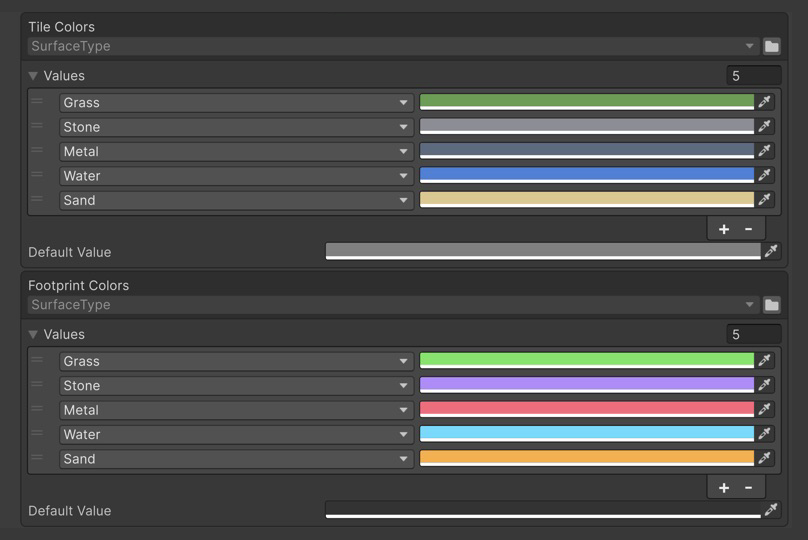

# Пример EnumValues

Персонаж идёт по плиткам, а цвет, след и скорость на каждой поверхности берутся из таблиц в инспекторе.


Персонаж проходит по разным поверхностям и оставляет непрерывную цветную линию.

## Как открыть

1. Импортируйте пример: **Tools → Aspid 🐍 → FastTools → Welcome** → **Samples** → **Import** у **EnumValues**.
2. Откройте `Scenes/EnumValues.unity` и войдите в Play Mode: на горячем металле персонаж ускоряется, на мокрых и мягких плитках замедляется, а след окрашивается в цвет поверхности.

Нужен встроенный модуль Unity **Physics**: без него скрипты примера пропускаются, а сцена показывает Missing Script.

## Попробуйте

### 1. Enum задан в коде

Выберите `Data/SurfacePalette.asset` и поменяйте цвет `Grass` в **Tile Colors** — плитки перекрасятся сразу, без Play Mode. Тип enum в шапке таблицы только для чтения: его задаёт поле.



Tile Colors и Footprint Colors, у каждой таблицы своё Default Value.

```csharp
[SerializeField] private EnumValues<SurfaceType, Color> _tileColors;

public Color GetTileColor(SurfaceType surface) =>
    _tileColors.GetValue(surface);
```

### 2. Значение по умолчанию

Удалите строку `Stone` из **Footprint Colors** и войдите в Play Mode: след на камне примет **Default Value** таблицы. Код не меняется и ключ не проверяет:

```csharp
public Color GetFootprintColor(SurfaceType surface) =>
    _footprintColors.GetValue(surface);
```

Правый клик по таблице → **Populate Missing Enum Members** вернёт строку `Stone` в конец списка со значением по умолчанию; Undo восстановит исходную палитру.

### 3. Enum выбран в инспекторе

Выберите **Walker**. В нём две таблицы. У **Color Sample Interval** enum <code lang="class-name">SurfaceType</code> задан в коде, как в шаге 1: строки задают интервал в секундах между замерами цвета следа на каждой поверхности. У **Speed By Terrain** в коде задан только тип значения, а enum <code lang="class-name">TerrainFlags</code> выбран в шапке таблицы. Строка может хранить несколько флагов: строка `Wet` + `Slippery` даёт `0.5`.

```csharp
[SerializeField, InspectorName("Color Sample Interval")]
private EnumValues<SurfaceType, float> _stepInterval;

[SerializeField] private EnumValues<float> _speedByTerrain;

var speed = _speed * (_tile == null ? 1f : _speedByTerrain.GetValue(_tile.Flags));
```

### 4. Поиск по `[Flags]`

<code lang="function">GetValue</code> выбирает одну строку; **Speed By Terrain** настроена как в сцене:

| Ключ | Строка | Множитель |
|---|---|---|
| `Wet, Slippery` (плитка Water и мокрая плитка Stone) | точная строка `Wet` + `Slippery`, хотя есть строки `Wet` и `Slippery` | `0.5` |
| `Wet, Hot` | первая строка, все флаги которой есть в ключе: `Wet`, она выше `Hot` | `0.8` |
| `None` | нет, **Default Value** таблицы | `1` |

Множители нескольких подходящих строк не складываются и не перемножаются.

### 5. Перебор

Правый клик **Walker → Log Tables**: выводятся обе таблицы, сначала **Color Sample Interval**. <code lang="csharp">foreach</code> выдаёт настроенные строки в порядке списка, без значения по умолчанию.

```csharp
foreach (var (surface, interval) in _stepInterval)
    Debug.Log($"Color sample interval {surface}: {interval:0.00}s", this);

foreach (var (flags, multiplier) in _speedByTerrain)
    Debug.Log($"Speed x{multiplier:0.00} on [{flags}]", this);
```

### 6. Новый член enum

Добавьте `Ice` в конец <code lang="class-name">SurfaceType</code> и поставьте одной плитке **Surface** = `Ice`: плитка и её след берут значения по умолчанию, пока вы не добавите строки `Ice`.

## Куда смотреть

| Файл | Что показывает |
|---|---|
| `Scripts/SurfacePalette.cs` | <code lang="class-name">EnumValues&lt;TEnum, TValue&gt;</code> на ScriptableObject |
| `Scripts/Walker.cs` | Оба варианта в компоненте, <code lang="function">GetValue</code> по обычному и <code lang="csharp">[Flags]</code>-ключу, <code lang="csharp">foreach</code> |
| `Scripts/TerrainFlags.cs` | <code lang="csharp">[Flags]</code>-enum с комбинируемыми членами |

Справочник — [EnumValues](../../../docusaurus-plugin-content-docs/current/08-enum-values.md).
