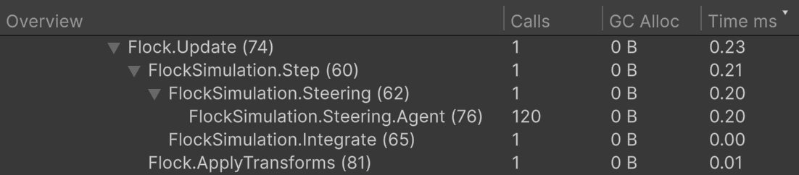

# Пример ProfilerMarkers

Стая кубов, у которой каждая фаза кадра видна в Profiler под своим именем.


Симуляция стаи, фазы которой измеряют маркеры.

## Как открыть

1. Импортируйте пример: **Tools → Aspid 🐍 → FastTools → Welcome** → **Samples** → **Import** у **ProfilerMarkers**.
2. Откройте `Scenes/ProfilerMarkers.unity` и **Window → Analysis → Profiler**, войдите в Play Mode и выберите кадр в модуле CPU.
3. В режиме **Hierarchy** разверните `PlayerLoop` до строки <code lang="string">Flock.Update (74)</code> — она лежит под строкой Unity <code lang="string">Flock.Update() [Invoke]</code>.

Нужен встроенный модуль Unity **Physics**: без него скрипты примера пропускаются, а сцена показывает Missing Script.

## Попробуйте



Маркеры под Flock.Update вложены как в коде; у FlockSimulation.Steering.Agent — 120 вызовов на 120 агентов.

1. **Дерево повторяет области <code lang="csharp">using</code>.** Под <code lang="string">Flock.Update</code> лежат <code lang="string">FlockSimulation.Step</code> и рядом с ним <code lang="string">Flock.ApplyTransforms</code>, а под <code lang="string">Step</code> — <code lang="string">FlockSimulation.Steering</code> и <code lang="string">FlockSimulation.Integrate</code>. Вложенность ничем не настраивается, её задают области в коде:

   ```csharp
   public void Step(float deltaTime, float neighborRadius, float maxSpeed)
   {
       using var _ = this.Marker();

       using (this.Marker().WithName("Steering"))
           ComputeSteering(neighborRadius);

       using (this.Marker().WithName("Integrate"))
           Integrate(deltaTime, maxSpeed);
   }
   ```

2. **Один маркер на цикл.** <code lang="string">FlockSimulation.Steering.Agent</code> стоит внутри цикла по агентам: Profiler показывает одну строку с `Calls`, равным числу агентов, а не строку на каждого агента.
3. **Больше агентов.** В Play Mode поднимите **Count** у **Flock** до `400`: на следующем кадре стая пересоздаётся, `Calls` у <code lang="string">FlockSimulation.Steering.Agent</code> становится `400`, а <code lang="string">FlockSimulation.Steering</code> занимает больше времени.
4. **Не только MonoBehaviour.** <code lang="class-name">FlockSimulation</code> — обычный C#-класс, и его маркеры работают так же. Маркер в локальной функции <code lang="function">CreateAgent</code> называется по объемлющему методу — <code lang="string">Flock.InitializeAgents (53)</code>: он есть в первом кадре и в кадре, где меняется **Count**, с `Calls` по числу созданных агентов.
5. **Номер строки в имени.** Каждое имя заканчивается номером строки вызова — <code lang="string">FlockSimulation.Steering (62)</code>, — поэтому маркеры на разных строках одного метода не совпадают по имени, а переехавший вызов меняет номер. Поиск <code lang="string">Flock</code> в Profiler находит все маркеры примера.
6. **Релизная сборка.** Сгенерированный код маркеров обёрнут в <code lang="csharp">#if ENABLE_PROFILER</code>: в сборке плеера без **Development Build** вызовы ничего не замеряют и возвращают <code lang="csharp">default</code>.

## Куда смотреть

| Файл | Что показывает |
|---|---|
| `Scripts/FlockSimulation.cs` | Маркеры на весь метод, на блок и на итерацию в обычном классе |
| `Scripts/Flock.cs` | Точка входа кадра, маркер внутри локальной функции |

Справочник — [ProfilerMarkers](../../../docusaurus-plugin-content-docs/current/09-profiler-markers.md).
