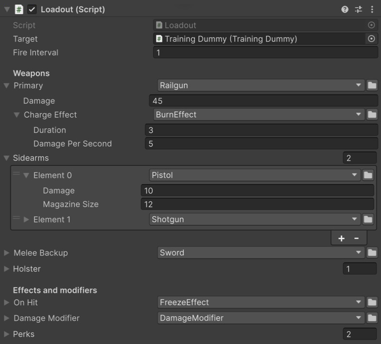

# Пример SerializeReferences

Турель, у которой оружие и его эффекты выбираются в инспекторе, и нарочно сломанные ассеты, чтобы их починить.

Манекен меняет цвет и уменьшается от урона настроенного оружия и эффектов.

## Как открыть

1. Импортируйте пример: **Tools → Aspid 🐍 → FastTools → Welcome** → **Samples** → **Import** у **SerializeReferences**.
2. Откройте `Scenes/SerializeReferences.unity` и войдите в Play Mode: основное и запасное оружие по очереди бьют манекен, а каждый удар виден в Console.

Коллайдеры сцены требуют встроенного модуля Unity **Physics**; скрипты примера компилируются и без него.

## Попробуйте

Выйдите из Play Mode и выберите **Loadout**.

Оружие, вложенный эффект горения и модификаторы в инспекторе Loadout.

1. **Выбор класса.** Откройте список **Primary**: окно выбора с поиском перечисляет все конкретные <code lang="class-name">IWeapon</code> в группах **Weapons/Melee** и **Weapons/Ranged** из <code lang="csharp">[TypeSelectorDisplay]</code>. <code lang="class-name">DebugWeapon</code> скрыт через `Hidden`. Выберите <code lang="class-name">Shotgun</code> — его поля появятся под списком.
2. **Общие данные сохраняются.** В **Sidearms** поставьте у <code lang="class-name">Pistol</code> **Damage** = `37`, переключите его на <code lang="class-name">Shotgun</code> и обратно: **Damage** по-прежнему `37`, потому что `_damage` объявлено в обоих классах.
3. **Списки.** Нажмите **+** у **Sidearms**: вместо копии последнего элемента открывается окно выбора, и новый элемент получает собственный экземпляр. В Play Mode он встанет в очередь выстрелов.
4. **Сужение.** **Melee Backup** объявлено как <code lang="class-name">IWeapon</code>, но <code lang="csharp">[TypeSelector(typeof(IMelee))]</code> предлагает только <code lang="class-name">Sword</code>. Поле **Weapon** в слотах **Holster** сужено так же, уровнем глубже, внутри обычного <code lang="csharp">[Serializable]</code>-класса: <code lang="csharp">[TypeSelector(typeof(IRanged))]</code> предлагает только дальнобойное оружие. В очередь выстрелов оба поля не входят.
5. **Вложенные ссылки.** У <code lang="class-name">Railgun</code> в **Primary** есть **Charge Effect** — собственный <code lang="csharp">[SerializeReference]</code> со своим списком. В нём <code lang="class-name">BurnEffect</code>, поэтому от попадания рейлгана манекен загорается.
6. **Абстрактная база.** **On Hit** — <code lang="class-name">StatusEffect</code>: окно выбора предлагает <code lang="class-name">BurnEffect</code> и <code lang="class-name">FreezeEffect</code>, но не абстрактный класс.
7. **Generics.**
   - **Damage Modifier** — <code lang="class-name">Modifier&lt;float&gt;</code>: предлагаются <code lang="class-name">DamageModifier</code> и <code lang="class-name">Modifier&lt;Single&gt;</code>, оба создаются сразу.
   - **Perks** — <code lang="class-name">List&lt;IModifier&gt;</code>: кроме закрытых наследников предлагается открытый <code lang="class-name">Modifier&lt;T&gt;</code>, тип <code lang="class-name">T</code> выбирается на второй странице.
   - Урон меняет только <code lang="class-name">DamageModifier</code>; значения остальных выводит **Loadout → Log Loadout** в контекстном меню компонента.
8. **Обязательное поле.** Поставьте **Primary** в `<None>`: под полем появится предупреждение. Сохраните сцену — **Project References → Scan Project** и CI с `-srGateRequired` покажут поле как нарушение; сборка плеера его не проверяет ([что проверяет каждый запуск](../../../docusaurus-plugin-content-docs/current/07-serialize-reference-validation.md#что-проверяет-каждый-запуск)).
9. **Меню заголовка.** Правый клик по заголовку поля — копирование и вставка, шаблоны, поиск использований и новый скрипт: [все пункты](../../../docusaurus-plugin-content-docs/current/04-serialize-reference-selector.md#меню-заголовка).

## Ремонт

Ассеты в `Presets/` и `Prefabs/` хранят потерянные или устаревшие типы.

1. **Fix на одном ассете.** Выберите `Presets/BrokenWeaponPreset.asset`: **Weapon** хранит несуществующий <code lang="class-name">GhostWeapon</code>, а уведомление **Missing type** под полем предлагает **Fix**. Нажмите его и выберите <code lang="class-name">Pistol</code> — **Damage** `25` и **Magazine Size** `8` сохранятся.
2. **Fix для группы.** Откройте **Tools → Aspid 🐍 → FastTools → Project References** и нажмите **Scan Project**: три записи <code lang="class-name">GhostWeapon</code> из `BrokenArsenalPreset.asset` собраны в одну группу, и **Fix all** исправляет их разом.
3. **Подсказка класса.** `Presets/MovedWeaponPreset.asset` хранит <code lang="class-name">Pistol</code> под старым пространством имён. Уведомление предлагает **→ Pistol**, а группа в Project References — **Smart Fix → Pistol**; сами они не применяются.
4. **Миграция.** `Presets/RenamedWeaponPreset.asset` хранит <code lang="class-name">CrossbowLauncher</code>, а класс теперь называется <code lang="class-name">Crossbow</code> и помечен <code lang="csharp">[MovedFrom]</code>: инспектор уже показывает <code lang="class-name">Crossbow</code>, устарел только файл. **Migrate all → Crossbow** в Project References записывает новое имя в файл.
5. **Префаб.** Выберите `Prefabs/BrokenLoadout.prefab` в окне Project. `Sidearms[2]` — потерянный <code lang="class-name">GhostCrossbow</code> с **Fix**; `Sidearms[0]` и `[1]` указывают на один <code lang="class-name">Pistol</code> и помечены **Shared reference #N**, а **Make unique** даёт элементу собственную копию. Вкладка **Asset References** показывает все ссылки префаба.

Чтобы пройти ремонт заново, импортируйте пример повторно с перезаписью файлов.

## IMGUI-инспектор

У <code lang="class-name">WeaponPreset</code> инспектор на IMGUI — `Scripts/Editor/WeaponPresetEditor.cs`: поле и список рисуют обычные вызовы <code lang="csharp">EditorGUILayout.PropertyField()</code>, а окно выбора, **Fix** и **+** списка работают как в UI Toolkit. Поля без <code lang="csharp">[TypeSelector]</code> — в разделе [Собственный инспектор](../../../docusaurus-plugin-content-docs/current/04-serialize-reference-selector.md#собственный-инспектор).

## Куда смотреть

| Файл | Что показывает |
|---|---|
| `Scripts/Loadout.cs` | Все формы поля: одиночное, список, суженное, контейнер, абстрактная база, закрытый и открытый generic, `Required` |
| `Scripts/Weapons/` | Иерархия <code lang="class-name">IWeapon</code>, группы <code lang="csharp">[TypeSelectorDisplay]</code>, скрытый через `Hidden` класс, <code lang="csharp">[MovedFrom]</code> на <code lang="class-name">Crossbow</code>, вложенная ссылка в <code lang="class-name">Railgun</code> |
| `Scripts/Effects/`, `Scripts/Modifiers/` | Абстрактная база и открытый generic-класс |
| `Scripts/WeaponPreset.cs`, `Presets/`, `Prefabs/` | Сценарии ремонта |
| `Scripts/Editor/WeaponPresetEditor.cs` | IMGUI-инспектор на обычных вызовах <code lang="class-name">PropertyField</code> |

Справочник — [SerializeReference Selector](../../../docusaurus-plugin-content-docs/current/04-serialize-reference-selector.md) и [восстановление SerializeReference](../../../docusaurus-plugin-content-docs/current/06-serialize-reference-tooling.md).
