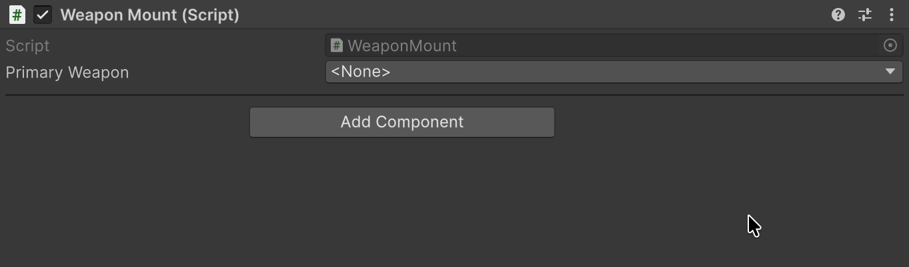

# Serializable Types

Тип как обычное поле: Unity его сохраняет, а инспектор даёт выбрать из списка.

## Быстрый старт

| До — Unity API | После — FastTools |
|---|---|
| <pre lang="csharp"><code>[SerializeField]&#10;private string _primaryWeaponName;&#10;&#10;public System.Type PrimaryWeapon =&gt;&#10;    string.IsNullOrEmpty(&#10;        _primaryWeaponName)&#10;        ? null&#10;        : System.Type.GetType(&#10;            _primaryWeaponName);</code></pre> | <pre lang="csharp"><code>[TypeSelector(Allow = TypeAllow.None)]&#10;[SerializeField]&#10;private SerializableType&lt;Weapon&gt;&#10;    _primaryWeapon;&#10;&#10;public System.Type PrimaryWeapon =&gt;&#10;    _primaryWeapon;</code></pre> |

<code lang="csharp">[TypeSelector]</code> задаёт [настройки выбора](03-type-selector.md): <code lang="csharp">Allow = TypeAllow.None</code> оставляет в списке только конкретные типы.



## Что выбрать

| Задача | Поле |
|---|---|
| Хранить тип, в том числе из DLL, вложенный или generic | <code lang="class-name">SerializableType</code>, <code lang="class-name">SerializableType&lt;T&gt;</code> |
| Сохранить выбор при переименовании собственного скрипта | <code lang="class-name">SerializableMonoScript</code>, <code lang="class-name">SerializableMonoScript&lt;T&gt;</code> |

Вариант с <code lang="class-name">T</code> предлагает в окне выбора только типы, совместимые с <code lang="class-name">T</code>.

## SerializableType

<code lang="class-name">SerializableType</code> хранит assembly-qualified name — имя типа вместе со сборкой. Значение по умолчанию задают в коде:

```csharp
[SerializeField]
private SerializableType<Weapon> _primaryWeapon = new(typeof(Sword));
```

### Потерянный тип

После переименования класса, namespace или сборки сохранённое имя больше не находится: поле показывает `<Missing …>`, а под ним появляется **Missing type**. В подписи указано имя типа без сборки, во всплывающей подсказке — сохранённое имя целиком.

- <code lang="csharp">.Type</code> возвращает <code lang="csharp">null</code>.
- <code lang="csharp">AssemblyQualifiedName</code> и <code lang="csharp">ToString()</code> сохраняют прежнее имя.


**Fix** открывает окно выбора, и выбранный тип заменяет сохранённое имя. Если класс только перенесли в другой namespace или сборку и подходящий тип с таким именем один, уведомление предлагает его сразу, например **→ Spear**. Уведомление сравнивает только имена классов, а <code lang="csharp">[MovedFrom]</code> не читает, поэтому для класса, переименованного с этим атрибутом, подсказки нет: выберите новый класс через **Fix**.

Все потерянные имена в проекте находит [Project References](06-serialize-reference-tooling.md#имена-типов) и восстанавливает их группами. О новых потерях сообщают [проверка перед сборкой](07-serialize-reference-validation.md) и [обнаружение новых поломок](07-serialize-reference-validation.md#обнаружение-новых-поломок).

## SerializableMonoScript

<code lang="class-name">SerializableMonoScript</code> помнит сам ассет скрипта, поэтому выбор переживает его переименование. Тип выбирают в инспекторе или перетаскивают файл `.cs` из **Project** на поле.

| После переименования `Sword.cs` → `Blade.cs` | <code lang="class-name">SerializableType</code> | <code lang="class-name">SerializableMonoScript</code> |
|---|---|---|
| <code lang="csharp">.Type</code> | <code lang="csharp">null</code> — [потерянный тип](#потерянный-тип) | <code lang="class-name">Blade</code>, в Play Mode тоже |
| Сохранённое имя | <code lang="string">Sword</code> | <code lang="string">Blade</code>, как только ассет пересохранят |

Ограничения:

- выбрать можно только класс верхнего уровня, не generic, объявленный в `.cs` с тем же именем;
- публичного конструктора нет, из кода поле не создать.

Связь с классом теряется, а поле показывает [потерянный тип](#потерянный-тип) с тем же уведомлением, если:

- класс переименовали без файла;
- файл переименовали вне Unity без `.meta`.

## Типы в плеере

> [!WARNING]
> В плеере обе обёртки находят тип по сохранённому имени. Если класс используется только через такой выбор, при **Managed Stripping Level** Low и выше Unity может вырезать его из билда: <code lang="csharp">.Type</code> вернёт <code lang="csharp">null</code>, хотя в редакторе тип находится. Сохраните класс через <code lang="csharp">[Preserve]</code> (<code lang="csharp">UnityEngine.Scripting</code>) или `link.xml`.

## Пример в пакете

Выбор типов врагов и паттерна расстановки показан в примере [Types](../../docusaurus-plugin-content-docs-tutorials/current/Types/README.md).


