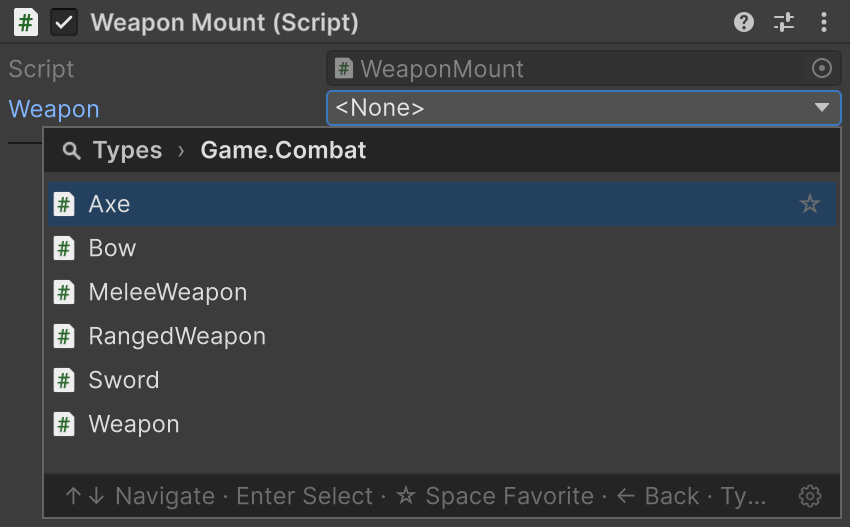
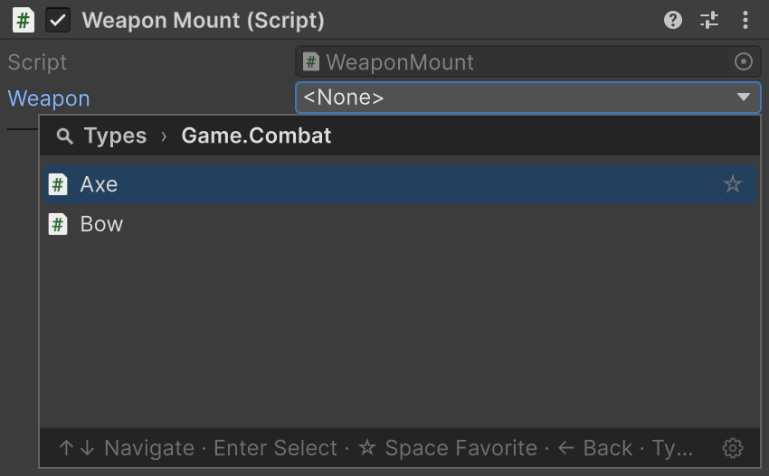
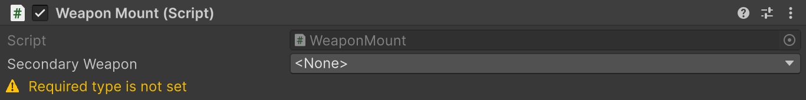
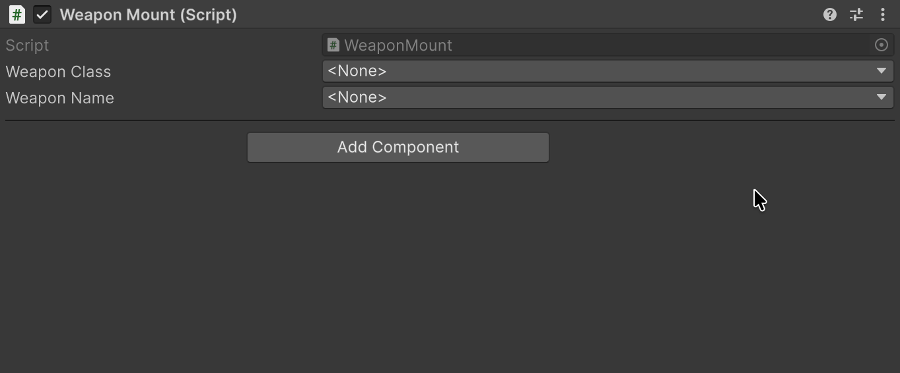
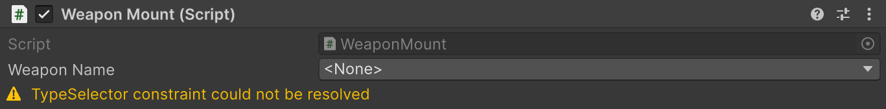
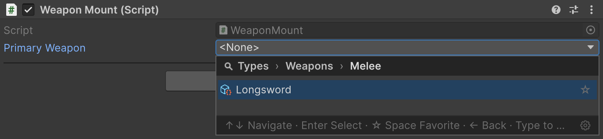
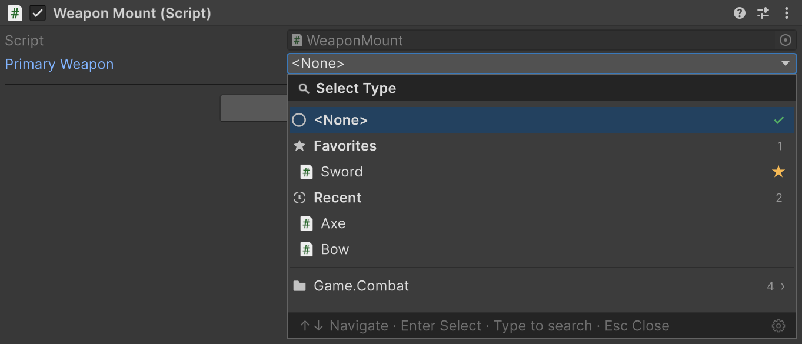
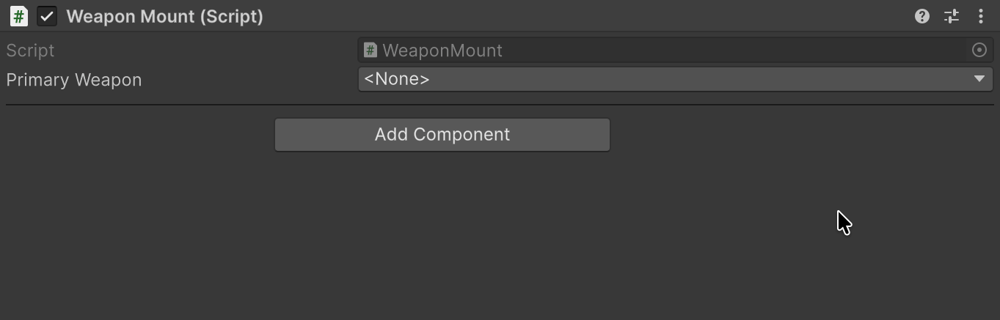

# TypeSelector

Окно выбора типа, которое вы настраиваете под каждое поле.

## Быстрый старт

```csharp
[TypeSelector(typeof(ITwoHanded), Allow = TypeAllow.None)]
[SerializeField] private SerializableType<Weapon> _weapon;
```

Поле предлагает только конкретное двуручное оружие: наследников <code lang="class-name">Weapon</code>, реализующих <code lang="class-name">ITwoHanded</code>.

| Без атрибута | С <code lang="csharp">[TypeSelector]</code> |
|---|---|
|  |  |

## Где применяется

| Поле | Результат выбора |
|---|---|
| <code lang="csharp">string</code> | Записывается assembly-qualified name |
| [Serializable Types](02-serializable-types.md) | Настраивается выбор обёртки |
| <code lang="csharp">[SerializeReference]</code> | Создаётся экземпляр выбранной реализации — см. [SerializeReference Selector](04-serialize-reference-selector.md) |

> [!WARNING]
> В плеере строковое поле находит тип по имени, как [Serializable Types](02-serializable-types.md#типы-в-плеере): класс, который используется только через такой выбор, может быть вырезан при **Managed Stripping Level** Low и выше.

## Какие типы в списке

```csharp
public interface ITwoHanded { }

public abstract class Weapon { }
public abstract class MeleeWeapon : Weapon { }
public abstract class RangedWeapon : Weapon { }

public sealed class Sword : MeleeWeapon { }
public sealed class Axe : MeleeWeapon, ITwoHanded { }
public sealed class Bow : RangedWeapon, ITwoHanded { }
```

Типы в атрибуте сужают список: остаются только классы, совместимые со всеми сразу.

| Аргументы <code lang="csharp">[TypeSelector]</code> на поле <code lang="csharp">string</code> | В списке |
|---|---|
| <code lang="csharp">typeof(Weapon)</code> | <code lang="class-name">Weapon</code>, <code lang="class-name">MeleeWeapon</code>, <code lang="class-name">RangedWeapon</code>, <code lang="class-name">Sword</code>, <code lang="class-name">Axe</code>, <code lang="class-name">Bow</code> |
| <code lang="csharp">typeof(Weapon), typeof(ITwoHanded)</code> | <code lang="class-name">Axe</code>, <code lang="class-name">Bow</code> |
| <code lang="csharp">typeof(Sword), typeof(Axe)</code> | Пусто |
| <code lang="csharp">typeof(MeleeWeapon), Allow = TypeAllow.None</code> | <code lang="class-name">Sword</code>, <code lang="class-name">Axe</code> |

<code lang="class-name">T</code> обёртки и тип поля <code lang="csharp">[SerializeReference]</code> работают как ещё один тип в атрибуте:

```csharp
// Axe, Bow
[TypeSelector(typeof(ITwoHanded))]
[SerializeField] private SerializableType<Weapon> _twoHandedType;

// Axe, Bow
[TypeSelector(typeof(ITwoHanded))]
[SerializeReference] private Weapon _twoHandedWeapon;
```

> [!NOTE]
> В инспекторе runtime-объекта селектор не предлагает типы из editor-only сборок (`UnityEditor`, asmdef только для Editor и папки `Editor`): в билде плеера они не найдутся.

## Свойства

| Свойство | По умолчанию | Поведение |
|---|---|---|
| <code lang="csharp">Allow</code> | <code lang="csharp">TypeAllow.All</code> | Пускает в список абстрактные классы (<code lang="csharp">Abstract</code>), интерфейсы (<code lang="csharp">Interface</code>), оба вида или ни один. На <code lang="csharp">[SerializeReference]</code> игнорируется |
| <code lang="csharp">Required</code> | <code lang="csharp">false</code> | Предупреждает о пустом имени типа или <code lang="csharp">null</code> в managed-ссылке |

## Обязательное поле

```csharp
[TypeSelector(typeof(Weapon), Required = true)]
[SerializeField] private string _secondaryWeapon;
```



С <code lang="csharp">Required = true</code> пункт `<None>` остаётся доступным. Потерянный тип с сохранённым именем проверку проходит.

Настройка проверки по всему проекту и в CI описана в разделе [проверки обязательных полей](07-serialize-reference-validation.md#что-проверяет-каждый-запуск).

## Ограничение из другого поля

Передайте <code lang="csharp">nameof(...)</code>, чтобы текущее значение поля или свойства управляло списком кандидатов:

```csharp
[SerializeField] private SerializableType<Weapon> _weaponClass;

[TypeSelector(nameof(_weaponClass), Allow = TypeAllow.None)]
[SerializeField] private string _weaponName;
```

Выберите <code lang="class-name">MeleeWeapon</code> в **Weapon Class** — **Weapon Name** предложит его конкретных наследников. Смена ограничения не очищает ранее выбранное имя.



| Источник ограничения | Базовый тип |
|---|---|
| <code lang="class-name">System.Type</code> | Значение поля |
| <code lang="csharp">string</code> | Тип по имени через <code lang="csharp">Type.GetType()</code> |
| <code lang="class-name">SerializableType</code> / <code lang="class-name">SerializableMonoScript</code> | Значение <code lang="csharp">.Type</code> |
| Массив этих значений | Каждый элемент; <code lang="class-name">List&lt;T&gt;</code> не поддерживается |

- У поля внутри <code lang="csharp">[Serializable]</code>-класса или элемента списка источник читается из того же экземпляра.
- Пока источник пуст или не разрешился, ограничения от него нет: строковый **Weapon Name** предложит все конкретные типы. У обёртки остаётся её собственный <code lang="class-name">T</code>.

## Ошибки в строковых аргументах

Если имя типа записано верно, но такой тип не загружен, инспектор показывает предупреждение:

```csharp
[TypeSelector("Spear, Assembly-CSharp")]
[SerializeField] private string _weaponName;
```



## TypeSelectorDisplay

<code lang="csharp">[TypeSelectorDisplay]</code> на классе меняет только его строку в окне выбора:

| Параметр на <code lang="class-name">Sword</code> | В окне выбора |
|---|---|
| <code lang="csharp">Name = "Longsword"</code> | Longsword в списке и в закрытом поле; поиск находит и по Sword |
| <code lang="csharp">Group = "Weapons/Melee"</code> | Weapons → Melee → Longsword вместо namespace |
| <code lang="csharp">Tooltip = "A balanced blade"</code> | Подсказка при наведении |
| <code lang="csharp">Icon = "d_ScriptableObject Icon"</code> | Иконка: встроенная по имени, ассет по пути с расширением или из `Resources` без расширения |
| <code lang="csharp">Hidden = true</code> | Нет в списке; присваивание из кода и уже сохранённое значение работают |

Подклассы настроек не наследуют.



> [!NOTE]
> <code lang="csharp">[TypeSelector]</code> и <code lang="csharp">[TypeSelectorDisplay]</code> помечены <code lang="csharp">[Conditional("UNITY_EDITOR")]</code>. В классах из внешней DLL, собранной без этого символа, их настроек нет, включая <code lang="csharp">Hidden</code>.

## Окно выбора

Окно группирует типы по namespace или <code lang="csharp">Group</code> и различает одинаковые имена по сборкам.



На корневой странице окно держит типы, которые нужны чаще других:

- **Favorites** — избранное. Чтобы добавить тип, нажмите звёздочку справа от его строки или Space, когда строка выделена.
- **Recent** — последние выбранные типы.

Показ Favorites и длина Recent (0 скрывает раздел) настраиваются во вкладке **Settings** окна FastTools. Её открывает шестерёнка в правом нижнем углу окна выбора, там же оба списка очищаются.

### Generic-типы

При выборе открытого generic-типа окно предлагает выбрать аргументы и возвращает сконструированный закрытый тип:

```csharp
public abstract class Enchantment { }
public sealed class Fire : Enchantment { }
public sealed class Frost : Enchantment { }

public sealed class Enchanted<T> : Weapon
    where T : Enchantment { }
```

Выберите <code lang="class-name">Enchanted&lt;T&gt;</code> в поле <code lang="class-name">SerializableType&lt;Weapon&gt;</code> — окно предложит наследников <code lang="class-name">Enchantment</code>, а после выбора <code lang="class-name">Fire</code> запишет <code lang="class-name">Enchanted&lt;Fire&gt;</code>.



- Generic-аргумент может сам быть generic-типом: окно сначала спросит его аргументы.
- Если все аргументы выводятся из типа поля, закрытый тип возвращается сразу.
- Интерфейсы, абстрактные классы и скрытые типы в аргументах не предлагаются.

## TypeSelectorWindow

<code lang="class-name">TypeSelectorWindow</code> открывает то же окно из кастомного инспектора или окна редактора, например по кнопке UI Toolkit:

```csharp
using Aspid.FastTools.Types.Editors;

var button = new Button { text = "Select weapon" };
button.clicked += () => TypeSelectorWindow.Show(
    screenRect: GUIUtility.GUIToScreenRect(button.worldBound),
    filter: new TypeSelectorFilter
    {
        Types = new[] { typeof(Weapon) }
    },
    assemblyQualifiedName: selectedTypeName,
    onSelected: aqn => selectedTypeName = aqn);
```

Обработчик получает assembly-qualified name или <code lang="csharp">null</code> при выборе `<None>`.

> [!NOTE]
> У <code lang="class-name">TypeSelectorFilter</code> <code lang="csharp">Allow</code> по умолчанию <code lang="csharp">TypeAllow.None</code>, а у <code lang="csharp">[TypeSelector]</code> — <code lang="csharp">TypeAllow.All</code>: окно выше предлагает только конкретное оружие.

Свойства фильтра и параметры окна — в справочнике API: [TypeSelectorFilter](https://vpdpersonal.github.io/Aspid.FastTools/ru/api/Aspid.FastTools.Types.Editors.TypeSelectorFilter), [TypeSelectorWindow](https://vpdpersonal.github.io/Aspid.FastTools/ru/api/Aspid.FastTools.Types.Editors.TypeSelectorWindow).

## Пример в пакете

Зависимый список, имена из <code lang="csharp">[TypeSelectorDisplay]</code> и обязательное поле показаны в примере [Types](../../docusaurus-plugin-content-docs-tutorials/current/Types/README.md), а окно выбора из редакторского кода — в [EditorTools](../../docusaurus-plugin-content-docs-tutorials/current/EditorTools/README.md).


