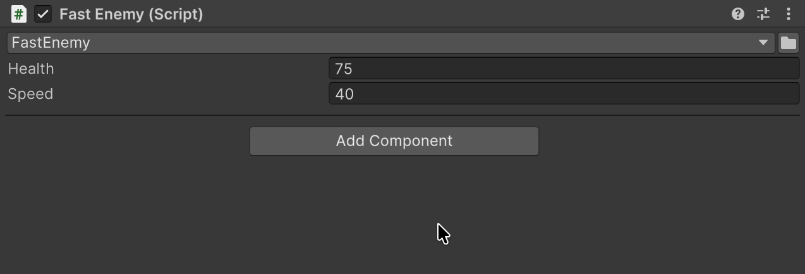

# ComponentTypeSelector

Класс компонента меняется прямо в инспекторе, а общие поля сохраняют значения.

## Быстрый старт

```csharp
public abstract class EnemyBase : MonoBehaviour
{
    [SerializeField] private ComponentTypeSelector _enemyType;
    [SerializeField] private float _health = 100f;
}
```

| FastEnemy.cs | ArmoredEnemy.cs |
|---|---|
| <pre lang="csharp"><code>public sealed class FastEnemy : EnemyBase&#10;&#123;&#10;    [SerializeField]&#10;    private float _speed = 25f;&#10;&#125;</code></pre> | <pre lang="csharp"><code>public sealed class ArmoredEnemy : EnemyBase&#10;&#123;&#10;    [SerializeField]&#10;    private int _armor = 10;&#10;&#125;</code></pre> |

Список предлагает сам класс, где объявлено поле, если он не абстрактный, и его конкретных наследников; пункта `<None>` нет. Оформление из [<code lang="csharp">[TypeSelectorDisplay]</code>](03-type-selector.md#typeselectordisplay) здесь действует, а <code lang="csharp">[TypeSelector]</code> список не настраивает.



| Поле | <code lang="class-name">FastEnemy</code> | Выбран <code lang="class-name">ArmoredEnemy</code> | Снова <code lang="class-name">FastEnemy</code> |
|---|---|---|---|
| **Health** | 75 | 75 | 75 |
| **Speed** | 40 | — | 25 |
| **Armor** | — | 10 | — |

## Когда тип не меняется

Смена следует правилам **Add Component**: компоненты из <code lang="csharp">[RequireComponent]</code> нового класса добавляются вместе с ней. Класс остаётся прежним, а Console показывает причину, если:

- Unity не дала бы добавить новый класс или убрать старый;
- у класса нет своего файла скрипта с тем же именем, например у вложенного класса;
- компонент унаследован от префаба (экземпляр в сцене или вариант): меняйте его класс в исходном префабе.

Если выделено несколько компонентов, отказ для одного оставляет прежний класс у всех.

## Пример в пакете

Переключение типа компонента показано в примере [Types](../../docusaurus-plugin-content-docs-tutorials/current/Types/README.md).


