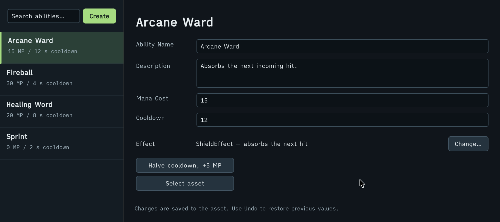

# VisualElement Extensions

Интерфейс UI Toolkit одной цепочкой вызовов — без отдельной строки на каждое свойство и стиль.

## Быстрый старт

| До — Unity API | После — FastTools |
|---|---|
| <pre lang="csharp"><code>var title = new Label("Ability Config");&#10;title.style.fontSize = 14;&#10;&#10;var header = new VisualElement();&#10;header.style.paddingLeft = 12;&#10;header.style.paddingRight = 12;&#10;header.style.paddingTop = 10;&#10;header.style.paddingBottom = 10;&#10;header.Add(title);</code></pre> | <pre lang="csharp"><code>var header = new VisualElement()&#10;    .SetPaddingX(12)&#10;    .SetPaddingY(10)&#10;    .AddChild(new Label("Ability Config")&#10;        .SetFontSize(14));</code></pre> |

Методы настройки возвращают исходный элемент, сохраняя его тип.

## Свойства элемента

| Unity | FastTools |
|---|---|
| <code lang="csharp">tooltip = "Mana cost"</code> | <code lang="csharp">SetTooltip("Mana cost")</code> |
| <code lang="csharp">isDelayed = true</code> | <code lang="csharp">SetDelayed(true)</code> |
| <code lang="csharp">bindItem = BindRow</code> | <code lang="csharp">SetBindItem(BindRow)</code> |

Полный список расширений — в [справочнике API](https://vpdpersonal.github.io/Aspid.FastTools/ru/api/Aspid.FastTools.UIElements).

## Дочерние элементы

| Unity | FastTools |
|---|---|
| <code lang="csharp">Add(title)</code> | <code lang="csharp">AddChild(title)</code> |
| <code lang="csharp">Insert(0, title)</code> | <code lang="csharp">InsertChild(0, title)</code> |
| <code lang="csharp">Remove(title)</code> | <code lang="csharp">RemoveChild(title)</code> |
| <code lang="csharp">RemoveAt(0)</code> | <code lang="csharp">RemoveChildAt(0)</code> |
| <code lang="csharp">Clear()</code> | <code lang="csharp">ClearChildren()</code> |

Методы возвращают родителя. Для нескольких элементов есть <code lang="function">AddChildren</code>, <code lang="function">InsertChildren</code>, <code lang="function">RemoveChildren</code>.

| До — Unity API | После — FastTools |
|---|---|
| <pre lang="csharp"><code>if (isFree)&#10;    body.Add(helpBox);</code></pre> | <pre lang="csharp"><code>body.AddChildIf(isFree, helpBox);</code></pre> |

У всех этих методов есть вариант с суффиксом <code lang="csharp">If</code>.

## Стили

| Вызов | Задаёт |
|---|---|
| <code lang="csharp">SetPadding(8)</code> | все стороны |
| <code lang="csharp">SetPaddingX(8)</code> | левую и правую |
| <code lang="csharp">SetPaddingY(8)</code> | верхнюю и нижнюю |
| <code lang="csharp">SetPadding(8, 4)</code> | верхнюю и правую (порядок: top, right, bottom, left) |
| <code lang="csharp">SetPadding(top: 8, left: 4)</code> | верхнюю и левую, остальные не меняет |
| <code lang="csharp">SetBorderRadiusTop(6)</code> | оба верхних угла |
| <code lang="csharp">SetSize(24, 16)</code> | <code lang="csharp">width</code> и <code lang="csharp">height</code> |
| <code lang="csharp">SetTop(8)</code> | <code lang="csharp">top</code>, как <code lang="csharp">SetDistance(top: 8)</code> |

Остальные методы стилей работают по схожему принципу. Полный список — в [справочнике API](https://vpdpersonal.github.io/Aspid.FastTools/ru/api/Aspid.FastTools.UIElements.VisualElementExtensions).

### Цвет из строки и ассеты из Resources

| До — Unity API | После — FastTools |
|---|---|
| <pre lang="csharp"><code>if (ColorUtility.TryParseHtmlString(&#10;        "#FFC24D", out var color))&#10;    badge.style.color = color;</code></pre> | <pre lang="csharp"><code>badge.SetColor("#FFC24D");</code></pre> |
| <pre lang="csharp"><code>var texture = Resources&#10;    .Load&lt;Texture2D&gt;("UI/Card");&#10;if (texture != null)&#10;    root.style.backgroundImage = texture;</code></pre> | <pre lang="csharp"><code>root.SetBackgroundImageFromResources(&#10;    "UI/Card");</code></pre> |

Вариант <code lang="csharp">…FromResources</code> есть также у <code lang="function">SetImage</code>, <code lang="function">SetSprite</code>, <code lang="function">SetVectorImage</code> и у методов таблиц стилей.

### Жирный и курсив

Добавление и удаление одного начертания сохраняет второе.

| Вызов | Действие |
|---|---|
| <code lang="csharp">AddBoldUnityFontStyleAndWeight()</code> | Добавляет жирный |
| <code lang="csharp">RemoveBoldUnityFontStyleAndWeight()</code> | Убирает жирный |
| <code lang="csharp">AddItalicUnityFontStyleAndWeight()</code> | Добавляет курсив |
| <code lang="csharp">RemoveItalicUnityFontStyleAndWeight()</code> | Убирает курсив |
| <code lang="csharp">SetNormalUnityFontStyleAndWeight()</code> | Убирает оба начертания |

> [!NOTE]
> Пресеты читают текущее значение из <code lang="csharp">style</code> элемента, а не итоговый стиль: начертание, заданное в USS, считается <code lang="csharp">Normal</code>.

### Собственные свойства USS

| До — Unity API | После — FastTools |
|---|---|
| <pre lang="csharp"><code>if (evt.customStyle.TryGetValue(&#10;        ThemeProperty, out var raw)&#10;    &amp;&amp; Enum.TryParse(raw,&#10;        ignoreCase: true,&#10;        out PreviewTheme theme))&#10;    ApplyTheme(theme);</code></pre> | <pre lang="csharp"><code>if (evt.customStyle.TryGetByEnum(&#10;        ThemeProperty,&#10;        out PreviewTheme theme))&#10;    ApplyTheme(theme);</code></pre> |

## USS-классы и таблицы стилей

| Unity | FastTools |
|---|---|
| <code lang="csharp">AddToClassList("selected")</code> | <code lang="csharp">AddClass("selected")</code> |
| <code lang="csharp">RemoveFromClassList("selected")</code> | <code lang="csharp">RemoveClass("selected")</code> |
| <code lang="csharp">ToggleInClassList("selected")</code> | <code lang="csharp">ToggleClass("selected")</code> |
| <code lang="csharp">EnableInClassList("selected", isFree)</code> | <code lang="csharp">EnableClass("selected", isFree)</code> |
| <code lang="csharp">ClearClassList()</code> | <code lang="csharp">ClearClasses()</code> |
| <code lang="csharp">styleSheets.Add(sheet)</code> | <code lang="csharp">AddStyleSheet(sheet)</code> |
| <code lang="csharp">styleSheets.Insert(0, sheet)</code> | <code lang="csharp">InsertStyleSheet(0, sheet)</code> |
| <code lang="csharp">styleSheets.Remove(sheet)</code> | <code lang="csharp">RemoveStyleSheet(sheet)</code> |
| <code lang="csharp">styleSheets.Clear()</code> | <code lang="csharp">ClearStyleSheets()</code> |

- Методы для нескольких классов или таблиц стилей называются во множественном числе: <code lang="csharp">AddClasses("selected", "free")</code>, <code lang="csharp">AddStyleSheets(baseSheet, themeSheet)</code>.
- <code lang="function">EnableClasses</code> принимает флаг первым: <code lang="csharp">EnableClasses(isFree, "selected", "free")</code>.
- <code lang="csharp">EnableStyleSheet(darkSheet, isDark)</code> добавляет или убирает таблицу стилей, как <code lang="function">EnableClass</code> — класс.

У всех этих методов есть вариант с суффиксом <code lang="csharp">If</code>. Когда у метода два флага, называйте аргументы: <code lang="csharp">EnableClassIf(condition: isEditable, "selected", enable: isFree)</code>.

## Значения и события

| Unity | FastTools |
|---|---|
| <code lang="csharp">value = 10</code> | <code lang="csharp">SetValue(10)</code> |
| <code lang="csharp">SetValueWithoutNotify(10)</code> | <code lang="csharp">SetValue(10, notify: false)</code> |
| <code lang="csharp">RegisterValueChangedCallback(OnChanged)</code> | <code lang="csharp">AddValueChanged(OnChanged)</code> |
| <code lang="csharp">UnregisterValueChangedCallback(OnChanged)</code> | <code lang="csharp">RemoveValueChanged(OnChanged)</code> |
| <code lang="csharp">clicked += Refresh</code> | <code lang="csharp">AddClicked(Refresh)</code> |

Для собственных типов значений доступны обобщённые <code lang="csharp">SetValue&lt;T, TValue&gt;(…)</code> и <code lang="csharp">AddValueChanged&lt;TField, TValue&gt;(…)</code>.

## Фокус

| Unity | FastTools |
|---|---|
| <code lang="csharp">Focus()</code> | <code lang="csharp">FocusSelf()</code> |
| <code lang="csharp">Blur()</code> | <code lang="csharp">BlurSelf()</code> |

| До — Unity API | После — FastTools |
|---|---|
| <pre lang="csharp"><code>if (manaCost.focusController?&#10;        .focusedElement == manaCost)&#10;    Refresh();</code></pre> | <pre lang="csharp"><code>if (manaCost.IsFocused())&#10;    Refresh();</code></pre> |

## Манипуляторы

| До — Unity API | После — FastTools |
|---|---|
| <pre lang="csharp"><code>title.AddManipulator(&#10;    new Clickable(Refresh));</code></pre> | <pre lang="csharp"><code>title.AddClickable(Refresh);</code></pre> |

Для клавиатурной навигации и контекстного меню:

```csharp
title.AddKeyboardNavigationManipulator(OnNavigate);
title.AddContextualMenuManipulator(BuildMenu);
```

Перегрузка с <code lang="csharp">out</code> позволяет сохранить манипулятор для удаления:

```csharp
title.AddClickable(Refresh, out var clickable);

// Позже
title.RemoveManipulatorSelf(clickable);
```

## Расширения редактора

| До — Unity API | После — FastTools |
|---|---|
| <pre lang="csharp"><code>manaCost.bindingPath = "_manaCost";&#10;manaCost.Bind(serializedObject);</code></pre> | <pre lang="csharp"><code>manaCost.BindTo(&#10;    serializedObject, "_manaCost");</code></pre> |

| Unity | FastTools |
|---|---|
| <code lang="csharp">bindingPath = "_manaCost"</code> | <code lang="csharp">SetBindingPath("_manaCost")</code> |
| <code lang="csharp">BindProperty(property)</code> | <code lang="csharp">BindPropertyTo(property)</code> |
| <code lang="csharp">Unbind()</code> | <code lang="csharp">UnbindFrom()</code> |

У <code lang="class-name">PropertyField</code> есть <code lang="function">SetLabel</code> и <code lang="function">AddValueChanged</code> / <code lang="function">RemoveValueChanged</code> с <code lang="class-name">SerializedPropertyChangeEvent</code>:

```csharp
var manaCost = new PropertyField(
        serializedObject.FindProperty("_manaCost"))
    .SetLabel("Mana cost")
    .AddValueChanged(_ => Refresh());
```

### Открыть скрипт по двойному клику

<code lang="function">AddOpenScriptCommand</code> открывает в IDE скрипт <code lang="class-name">MonoBehaviour</code> или <code lang="class-name">ScriptableObject</code> по двойному клику левой кнопкой; для других объектов ничего не добавляет:

```csharp
title.AddOpenScriptCommand(target);
```

### Окно элемента

```csharp
var window = title.GetOwnerWindow();
```

Возвращает окно элемента. Если оно не найдено — активное окно, затем окно под курсором; если нет ни одного — <code lang="csharp">null</code>.

## Пример в пакете

Окно каталога и инспектор <code lang="class-name">AbilityConfig</code> в примере [EditorTools](../../docusaurus-plugin-content-docs-tutorials/current/EditorTools/README.md) собраны на этих расширениях.


