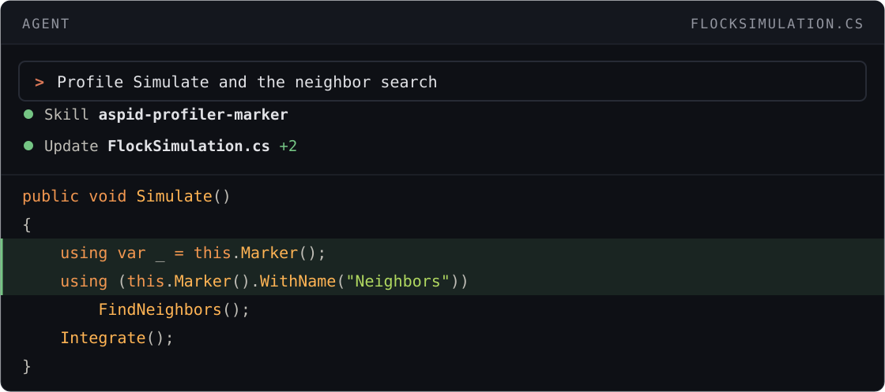
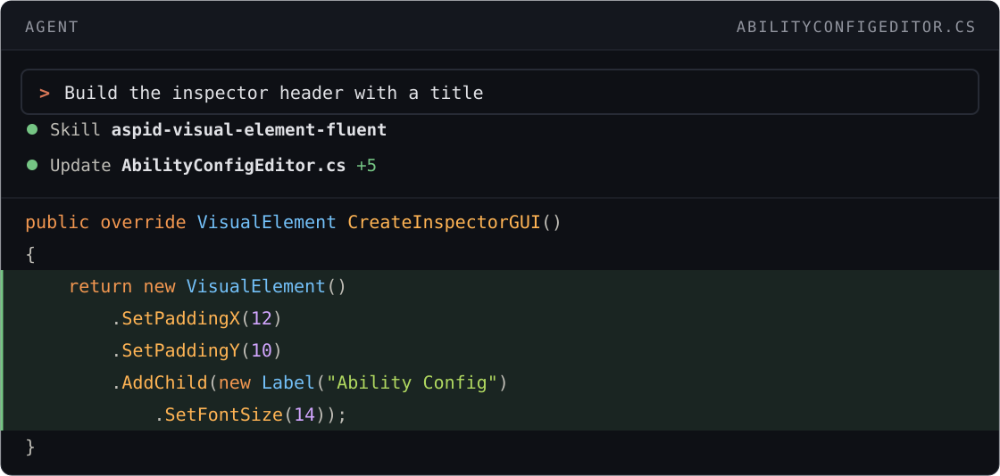

# Agent Skills

Скиллы, с которыми coding-агент пишет код на Aspid.FastTools, а не на голом Unity API.

## Быстрый старт

[Установите Aspid.FastTools](README.md#установка) в Unity-проект. Установщику скиллов нужен Node.js 22.20 или новее. Затем попросите агента:

```text prompt
Установи скиллы из репозитория VPDPersonal/Aspid.FastTools в текущий проект, не глобально. Выполни npx skills add VPDPersonal/Aspid.FastTools#v<version>, где <version> — версия установленного пакета Aspid.FastTools.
```

Или выполните в корне проекта:

```bash
npx skills add VPDPersonal/Aspid.FastTools#v<version>
```

Замените `<version>` версией установленного пакета: `1.0.0` даёт `#v1.0.0`. В установщике выберите область **Project**: глобальная установка действует во всех Unity-проектах, какая бы версия пакета в них ни стояла.

Для `1.0.0-rc.8` и старше см. [Версии и обновление](#версии-и-обновление).

```text prompt
Замерь Simulate и отдельно поиск соседей
```

| Без скиллов | Со скиллами |
|---|---|
| <pre lang="csharp"><code>private static readonly&#10;    ProfilerMarker _simulate =&#10;    new("Flock.Simulate");&#10;private static readonly&#10;    ProfilerMarker _neighbors =&#10;    new("Flock.FindNeighbors");&#10;&#10;public void Simulate()&#10;&#123;&#10;    using var _ = _simulate.Auto();&#10;    using (_neighbors.Auto())&#10;        FindNeighbors();&#10;    Integrate();&#10;&#125;</code></pre> | <pre lang="csharp"><code>public void Simulate()&#10;&#123;&#10;    using var _ = this.Marker();&#10;    using (this.Marker()&#10;        .WithName("Neighbors"))&#10;        FindNeighbors();&#10;    Integrate();&#10;&#125;</code></pre> |

## Версии и обновление

Скиллы из ветки `main` могут описывать API, которого нет в вашей версии пакета, и тогда агент пишет код, который не собирается. Тег релиза хранит скиллы, подходящие этому релизу. После обновления пакета повторите установку с новым тегом.

`npx skills update` не двигает скиллы, установленные с тега: он снова забирает тот же тег и ничего не меняет. Он обновляет только скиллы, установленные без тега, из `main`, и затрагивает все скиллы проекта, не только эти.

Релизы до `1.0.0-rc.8` включительно не содержат скиллов. С ними обновите пакет до релиза со скиллами или поставьте пакет из `main` вместе со скиллами, чтобы они совпадали. В **Window → Package Manager** выберите **+ → Install package from git URL…** и вставьте этот URL:

```text
https://github.com/VPDPersonal/Aspid.FastTools.git?path=/Aspid.FastTools/Packages/tech.aspid.fasttools#main
```

Затем установите скиллы без тега:

```bash
npx skills add VPDPersonal/Aspid.FastTools
```

Раньше скиллы поставлялись плагином `aspid-fasttools` для Claude Code. Если он у вас стоит, удалите его командой `/plugin marketplace remove aspid-claude-plugins`: он учит агента API, которого больше нет.

## Скиллы

Скиллы активируются автоматически при подходящих запросах.

### aspid-profiler-marker

Замер метода или участка через <code lang="csharp">this.Marker()</code>. Руководство: [ProfilerMarkers](09-profiler-markers.md).



### aspid-visual-element-fluent

Построение и оформление элементов UI Toolkit в C#. Руководство: [VisualElement Extensions](10-visual-element-extensions.md).



### aspid-serializable-type

Хранение <code lang="class-name">System.Type</code> и выбор типов в инспекторе. Руководства: [Serializable Types](02-serializable-types.md), [TypeSelector](03-type-selector.md), [SerializeReference Selector](04-serialize-reference-selector.md), [ComponentTypeSelector](05-component-type-selector.md).


### aspid-enum-values

Сопоставление значений членам enum. Руководство: [EnumValues](08-enum-values.md).


